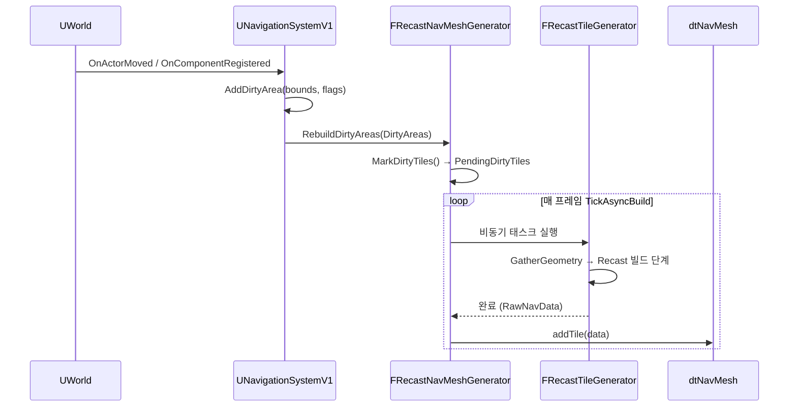
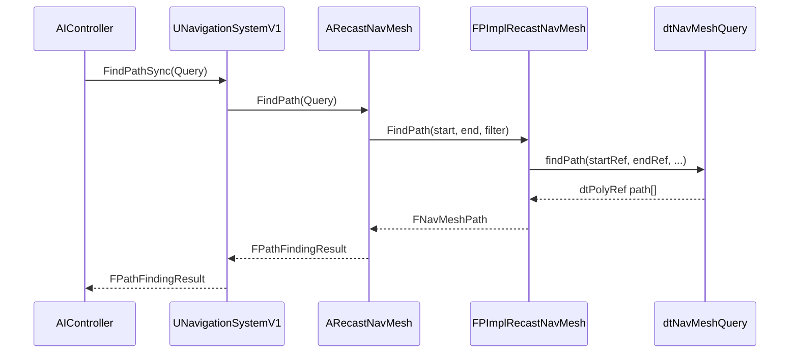

# 02. RecastNavMesh 아키텍처

> **작성일**: 2026-03-23
> **엔진 버전**: UE 5.7

## 1. 클래스 계층 구조

### 1-1. 전체 구조

```
AActor
└── ANavigationData                           (Abstract)
    ├── ARecastNavMesh                        (Recast/Detour 기반 구현)
    │    ├── FPImplRecastNavMesh*             (Detour 래퍼, PIMPL 패턴)
    │    │    ├── dtNavMesh*                  (타일 그래프 데이터)
    │    │    ├── dtNavMeshQuery              (Shared — 게임 스레드용)
    │    │    └── CompressedTileCacheLayers   (복셀 레이어 캐시)
    │    ├── TUniquePtr<FNavDataGenerator>
    │    │    └── FRecastNavMeshGenerator
    │    │         ├── FRecastBuildConfig     (rcConfig 확장)
    │    │         └── TArray<FRunningTileElement>
    │    │              └── FRecastTileGenerator  (타일 단위 비동기 빌드)
    │    └── FRecastNavMeshCachedData         (Area/Filter 캐시)
    ├── AAbstractNavData                      (테스트/더미 구현)
    └── ANavigationGraph                      (그래프 기반 내비)

UNavigationSystemV1                           (UWorld당 하나, 전체 관리)
├── TArray<ANavigationData*> NavDataSet       (에이전트별 NavData들)
├── TArray<FNavDataConfig> SupportedAgents    (지원 에이전트 목록)
├── FNavigationOctree                         (지오메트리/모디파이어 공간 분할)
├── FNavigationDirtyAreasController           (더티 영역 추적 + WP 필터링)
└── TArray<FNavigationDirtyArea>              (재빌드 대기 영역)
```

### 1-2. ANavigationData가 추상 베이스인 이유

`ANavigationData`는 `abstract`로 선언되어 있고, 내비게이션 구현체의 **공통 인터페이스** 역할을 합니다. Recast 이외의 구현을 플러그인 방식으로 교체하거나 혼용할 수 있도록 분리되어 있습니다.

**파일**: `Engine/Source/Runtime/NavigationSystem/Public/NavigationData.h:545`

```cpp
UCLASS(config=Engine, defaultconfig, NotBlueprintable, abstract, MinimalAPI)
class ANavigationData : public AActor, public INavigationDataInterface
{
    // ... 공통 가상 메서드들
    virtual bool NeedsRebuild() const;
    virtual bool SupportsRuntimeGeneration() const;
    virtual bool SupportsStreaming() const;
    virtual void RebuildAll();
    virtual void RebuildDirtyAreas(const TArray<FNavigationDirtyArea>& DirtyAreas);
    virtual FPathFindingResult FindPath(...);
    virtual FNavLocation GetRandomPoint(...) const;
    virtual bool ProjectPoint(...) const;
    // ...
};
```

**현재 존재하는 서브클래스:**
| 클래스 | 파일 | 용도 |
|--------|------|------|
| `ARecastNavMesh` | `NavMesh/RecastNavMesh.h:573` | Recast/Detour 기반 메인 구현 |
| `AAbstractNavData` | `AbstractNavData.h:60` | 테스트/더미용, NavData 없이 쿼리 API만 흉내 |
| `ANavigationGraph` | `NavGraph/NavigationGraph.h:61` | 그래프 기반 실험적 구현 |

**분리의 실익:**
- `UNavigationSystemV1`이 구체 타입을 몰라도 쿼리/빌드 라이프사이클을 관리할 수 있음
- 새 구현체(예: 2D 그리드, 하이브리드 내비)를 추가할 때 베이스 인터페이스만 만족하면 시스템이 그대로 동작
- 테스트나 무네비 환경에서 `AAbstractNavData`로 교체 가능

> **소스 확인 위치**
> - `Engine/Source/Runtime/NavigationSystem/Public/NavigationData.h:545` — `ANavigationData` 클래스 선언 (`abstract` 지정)
> - `Engine/Source/Runtime/NavigationSystem/Public/NavigationData.h:635-728` — 가상 메서드 인터페이스
> - `Engine/Source/Runtime/NavigationSystem/Public/NavMesh/RecastNavMesh.h:573` — `ARecastNavMesh : public ANavigationData`
> - `Engine/Source/Runtime/NavigationSystem/Public/AbstractNavData.h:60` — `AAbstractNavData` (대체 구현 예시)

## 2. 핵심 클래스 역할

### 2-1. UNavigationSystemV1 — UWorld당 하나

**파일**: `Engine/Source/Runtime/NavigationSystem/Public/NavigationSystem.h:316`

`UWorld`에 **하나만** 존재하는 서브시스템입니다. 단, 관리 대상인 `ANavigationData` 인스턴스는 **에이전트별로 여러 개**가 있을 수 있습니다.

```cpp
class UNavigationSystemV1 : public UNavigationSystemBase
{
    /** 현재 월드에 등록된 모든 NavData (에이전트별로 여러 개) */
    UPROPERTY(Transient)
    TArray<TObjectPtr<ANavigationData>> NavDataSet;  // NavigationSystem.h:427

    /** 프로젝트 설정에 정의된 지원 에이전트 프로퍼티 목록 */
    UPROPERTY(config, EditAnywhere, Category=Agents)
    TArray<FNavDataConfig> SupportedAgents;           // NavigationSystem.h:413

    /** 에이전트 프로퍼티로 적합한 NavData 조회 */
    virtual ANavigationData* GetNavDataForProps(const FNavAgentProperties& AgentProperties);

    /** WP 동적 모드 플래그 */
    uint32 bUseWorldPartitionedDynamicMode : 1;
};
```

**에이전트별 NavData 스폰 흐름:**
1. `PostInitProperties()`가 `SupportedAgents` 배열을 순회
2. 각 에이전트마다 `CreateNavigationDataInstanceInLevel()`로 `ARecastNavMesh` 스폰
3. 스폰된 인스턴스를 `RegisterNavData()`로 `NavDataSet`에 등록

**책임 범위:**
- NavRelevant 오브젝트를 `FNavigationOctree`에 등록/관리
- Dirty Area 수집 및 `ANavigationData::RebuildDirtyAreas()` 호출
- 경로 쿼리 요청을 적절한 `ANavigationData`로 라우팅 (에이전트 매칭)
- World Partition 모드 (`bUseWorldPartitionedDynamicMode`) 처리 및 Invoker 기반 타일 로딩 요청
- 스트리밍 자체는 **수행하지 않음**: 실제 타일 Attach/Detach는 `URecastNavMeshDataChunk`가 담당 (아래 2-7 참조)

> **소스 확인 위치**
> - `Engine/Source/Runtime/NavigationSystem/Public/NavigationSystem.h:316` — `UNavigationSystemV1` 클래스 선언
> - `Engine/Source/Runtime/NavigationSystem/Public/NavigationSystem.h:413,427` — `SupportedAgents`, `NavDataSet` 선언
> - `Engine/Source/Runtime/NavigationSystem/Public/NavigationSystem.h:709,726` — `GetNavDataForProps()` 선언
> - `Engine/Source/Runtime/NavigationSystem/Public/NavigationSystem.h:753` — `CreateNavigationDataInstanceInLevel()`
> - `Engine/Source/Runtime/NavigationSystem/Public/NavigationSystem.h:1339` — `RegisterNavData()`

### 2-2. ARecastNavMesh — 에이전트별 NavMesh 액터

**파일**: `Engine/Source/Runtime/NavigationSystem/Public/NavMesh/RecastNavMesh.h:573`

월드에 배치되는 NavMesh 액터. **에이전트 속성(AgentRadius, AgentHeight 등)별로 하나씩** 존재할 수 있습니다. 에디터와 게임 월드 모두에 존재합니다.

```cpp
UCLASS(config=Engine, defaultconfig)
class ARecastNavMesh : public ANavigationData
{
    // 빌드 설정 (프로젝트 INI 파일로부터 로드)
    UPROPERTY(EditAnywhere, Category=Generation, config)
    float TileSizeUU;

    UPROPERTY(EditAnywhere, Category=Generation, config)
    float AgentRadius;

    UPROPERTY(EditAnywhere, Category=Runtime, config)
    ERuntimeGenerationType RuntimeGeneration;

    // PIMPL 래퍼 — 헤더에 Detour 타입 노출 방지
    FPImplRecastNavMesh* RecastNavMeshImpl;  // RecastNavMesh.h:1572

    // 게임 월드에서 타일 업데이트 중 경로 쿼리 동시 접근 방지용 카운터
    mutable int32 BatchQueryCounter;
};
```

**주요 책임:**
- 빌드 설정 보유 (`TileSizeUU`, `CellSize`, `AgentRadius` 등)
- `FPImplRecastNavMesh`를 통해 `dtNavMesh` 접근
- `FRecastNavMeshGenerator`로 빌드 파이프라인 실행
- 경로 쿼리 API 제공 (`ProjectPoint`, `FindPath`, `BatchRaycast` 등)
- 스트리밍 청크 적용 (`AttachNavMeshDataChunk`, `DetachNavMeshDataChunk`)
- 쿼리 동기화 (`BeginBatchQuery` / `FinishBatchQuery`)

**에디터/런타임 동작:**
- **에디터**: `RuntimeGeneration` 무관하게 전체 빌드 가능
- **런타임**: `RuntimeGeneration` 값에 따라 업데이트 허용 범위 결정 (아래 2-8 참조)

### 2-3. FPImplRecastNavMesh — PIMPL 래퍼

**파일**: `Engine/Source/Runtime/NavigationSystem/Private/NavMesh/PImplRecastNavMesh.h`

Detour의 `dtNavMesh`, `dtNavMeshQuery`를 감싸는 **PIMPL(Pointer to IMPLementation) 래퍼**입니다. 헤더에 Detour 타입이 노출되지 않도록 격리합니다.

**엔진 내 주석 (`RecastNavMesh.h:1570`):**
> @TODO since it's no secret we're using recast there's no point in having separate implementation class. FPImplRecastNavMesh should be merged into ARecastNavMesh

즉 엔진 개발자들도 현재 구조가 과잉 분리라고 보고 있으며, **실질적으로 핵심 메시/쿼리 로직은 Detour의 `dtNavMesh`/`dtNavMeshQuery`에 있습니다**. `FPImplRecastNavMesh`는 UE 타입 ↔ Detour 타입 변환과 쿼리 풀 관리 정도가 주 역할입니다.

```cpp
// PImplRecastNavMesh.h:271-284
class FPImplRecastNavMesh
{
    dtNavMesh* DetourNavMesh;                                         // 타일 그래프 데이터
    mutable dtNavMeshQuery SharedNavQuery;                            // 게임 스레드용 쿼리
    TMap<FIntPoint, TArray<FNavMeshTileData>> CompressedTileCacheLayers; // 복셀 레이어 캐시
    ARecastNavMesh* NavMeshOwner;                                     // 소유 액터 역참조
};
```

### 2-4. dtNavMesh — 타일 그래프 데이터 (Detour)

**파일**: `Engine/Source/Runtime/Navmesh/Public/Detour/DetourNavMesh.h:502`

Detour 라이브러리의 **데이터 저장 클래스**입니다. 알고리즘은 포함하지 않고, 타일 추가/제거, 폴리곤 조회, 공간 → 타일 변환만 수행합니다.

주요 역할:
- `(x, y, layer)` 좌표로 타일 인덱싱
- `dtTileRef` / `dtPolyRef` 핸들 발급 및 디코딩
- 타일 경계 간 `dtLink` 구성 (`connectExtLinks`)
- `addTile()` / `removeTile()` — 타일 메모리 블록 등록/해제

### 2-5. dtNavMeshQuery — 쿼리 엔진 (Detour)

**파일**: `Engine/Source/Runtime/Navmesh/Public/Detour/DetourNavMeshQuery.h:348`

실제 경로 탐색 알고리즘이 있는 곳입니다. **A\* 알고리즘**으로 폴리곤 그래프를 탐색합니다.

- `findPath()` (`DetourNavMeshQuery.cpp:1578`): 바이너리 힙 우선순위 큐 기반 A\*, 폴리곤 간 링크를 엣지로 사용
- 시간 복잡도: `O((V+E) log V)` (V=폴리곤 수, E=링크 수)
- **스레드 안전 아님**: 인스턴스마다 독립적으로 사용해야 함. 게임 스레드는 `SharedNavQuery` 재사용, 비동기 쿼리는 별도 인스턴스 생성.

### 2-6. FRecastNavMeshGenerator — 빌드 오케스트레이터

**파일**: `Engine/Source/Runtime/NavigationSystem/Public/NavMesh/RecastNavMeshGenerator.h:784`

빌드 파이프라인을 총괄합니다.

- `InclusionBounds` / `ExclusionBounds` 관리
- Dirty Area → 빌드할 타일 목록(`PendingDirtyTiles`) 계산 (`MarkDirtyTiles()`)
- 비동기 타일 빌드 작업 큐 관리 (`RunningDirtyTiles`)
- 완료된 타일을 `dtNavMesh`에 등록 (`AddGeneratedTilesAndGetUpdatedTiles()`)
- `TickAsyncBuild()`에서 매 프레임 진행 상황 처리

### 2-7. FRecastTileGenerator — 타일 단위 빌드 작업

**파일**: `Engine/Source/Runtime/NavigationSystem/Public/NavMesh/RecastNavMeshGenerator.h:361`

**타일 하나의 빌드 작업**을 표현하는 클래스입니다. "타일"이라는 개념에는 세 가지 다른 레벨이 있으니 혼동 주의:

| 클래스 | 레벨 | 역할 |
|--------|------|------|
| `FRecastTileGenerator` | 빌드 타임 | 빌드 진행 상태, 중간 복셀/힐드필드 데이터 보관 |
| `dtTileCacheLayer` | 영속 | 압축된 복셀 레이어 (지오메트리 캐시, `CompressedTileCacheLayers`에 보관) |
| `dtMeshTile` | 런타임 | 실제 쿼리에 사용되는 폴리곤 메시 타일 |

`FRecastTileGenerator`가 빌드를 완료하면 결과물이 `FNavMeshTileData`로 패킹되어 `dtNavMesh::addTile()`에 전달되고, 내부에서 `dtMeshTile`로 등록됩니다. `DynamicModifiersOnly` 모드에서는 동시에 `dtTileCacheLayer`도 보관됩니다.

1. `FNavigationOctree`에서 지오메트리/모디파이어 수집
2. `rcContext`를 사용해 Recast 빌드 단계 실행
3. 완료된 타일 데이터를 압축하여 반환

### 2-8. URecastNavMeshDataChunk — 스트리밍 담당

**파일**: `Engine/Source/Runtime/NavigationSystem/Public/NavMesh/RecastNavMeshDataChunk.h:65`

월드 파티션/레벨 스트리밍 시 **실제 타일 Attach/Detach를 수행하는 데이터 컨테이너**입니다.

```cpp
UCLASS()
class URecastNavMeshDataChunk : public UNavigationDataChunk
{
    TArray<FNavTileRef> AttachTiles(ARecastNavMesh& NavMesh);
    TArray<FNavTileRef> DetachTiles(ARecastNavMesh& NavMesh);
};
```

스트리밍 시스템(레벨 스트리밍, DataLayer)이 청크 로드 시점에 `AttachTiles()`를 호출합니다. `UNavigationSystemV1`은 이 과정을 감독하지만 실제 Attach/Detach는 청크가 수행합니다.

> **소스 확인 위치**
> - `Engine/Source/Runtime/NavigationSystem/Public/NavMesh/RecastNavMesh.h:573,1570-1572` — `ARecastNavMesh` 선언, TODO 주석, PIMPL 포인터
> - `Engine/Source/Runtime/NavigationSystem/Private/NavMesh/PImplRecastNavMesh.h:271-284` — `FPImplRecastNavMesh` 멤버 변수
> - `Engine/Source/Runtime/Navmesh/Public/Detour/DetourNavMesh.h:502` — `dtNavMesh` 선언
> - `Engine/Source/Runtime/Navmesh/Public/Detour/DetourNavMeshQuery.h:348` — `dtNavMeshQuery` 선언
> - `Engine/Source/Runtime/Navmesh/Private/Detour/DetourNavMeshQuery.cpp:1578` — `findPath()` A\* 구현
> - `Engine/Source/Runtime/NavigationSystem/Public/NavMesh/RecastNavMeshGenerator.h:361` — `FRecastTileGenerator`
> - `Engine/Source/Runtime/NavigationSystem/Public/NavMesh/RecastNavMeshGenerator.h:784` — `FRecastNavMeshGenerator`
> - `Engine/Source/Runtime/NavigationSystem/Public/NavMesh/RecastNavMeshDataChunk.h:75-84` — `AttachTiles()` / `DetachTiles()`

### 2-9. RuntimeGeneration 모드 — 에디터/런타임 동작

**파일**: `Engine/Source/Runtime/NavigationSystem/Public/NavigationData.h:529-539`

```cpp
enum class ERuntimeGenerationType : uint8
{
    Static,                  // 런타임 빌드 없음 — 완전 정적
    DynamicModifiersOnly,    // Nav Modifier만 런타임 업데이트 허용
    Dynamic,                 // 지오메트리 변경도 런타임 처리
    LegacyGeneration UMETA(Hidden)
};
```

| 모드 | 에디터 빌드 | 런타임 빌드 | 런타임 Modifier 반영 |
|------|:-----------:|:-----------:|:--------------------:|
| `Static` | 가능 | X | X |
| `DynamicModifiersOnly` | 가능 | 부분 (압축 레이어 → 타일 재생성) | O |
| `Dynamic` | 가능 | 전체 (지오메트리 포함) | O |

`IsGameStaticNavMesh()` (`RecastNavMeshGenerator.cpp:5105`)는 게임 월드 + `Dynamic`이 아닌 경우에 `true`를 반환하며, 이 값이 `MarkDirtyTiles`에서 "지오메트리 Dirty Area는 건너뛰기" 분기의 스위치입니다.

## 3. 데이터 흐름 다이어그램

### 빌드 흐름



### 경로 쿼리 흐름



> **소스 확인 위치**
> - `Engine/Source/Runtime/NavigationSystem/Private/NavigationSystem.cpp` — `UNavigationSystemV1::Tick()`: `AddDirtyArea()` 호출, `RebuildDirtyAreas()` 디스패치
> - `Engine/Source/Runtime/NavigationSystem/Private/NavMesh/RecastNavMeshGenerator.cpp` — `FRecastNavMeshGenerator::MarkDirtyTiles()`, `TickAsyncBuild()`, `AddGeneratedTilesAndGetUpdatedTiles()`
> - `Engine/Source/Runtime/NavigationSystem/Private/NavMesh/RecastNavMeshGenerator.cpp:2061` — `GatherGeometryFromSources()` 내 `FindElementsWithBoundsTest`
> - `Engine/Source/Runtime/NavigationSystem/Private/NavMesh/PImplRecastNavMesh.cpp` — `FPImplRecastNavMesh::FindPath()`: `dtNavMeshQuery::findPath()` 래핑
> - `Engine/Source/Runtime/Navmesh/Private/Detour/DetourNavMeshQuery.cpp:1578` — `dtNavMeshQuery::findPath()` A\* 구현

## 4. 메모리 구조

### 4-1. dtNavMesh 타일 메모리 레이아웃

하나의 타일(`dtMeshTile`)은 `addTile()` 호출 시 **연속된 메모리 블록**으로 구성되며, `dtNavMesh`가 블록 내부 포인터를 파싱하여 각 필드에 할당합니다. 소유권은 `dtMeshTile::data`가 가집니다.

```
[dtMeshHeader]                           ← 타일 메타 (polyCount, vertCount, bounds 등)
[dtPoly * polyCount]                     ← 볼록 다각형 배열
[float3 * vertCount]                     ← 폴리곤 버텍스 (월드 좌표)
[dtLink * maxLinkCount]                  ← 폴리곤 간/타일 간 연결
[dtPolyDetail * detailMeshCount]         ← 세부 메시 메타 (폴리곤당 인덱스 범위)
[float3 * detailVertCount]               ← 세부 버텍스 (높이 재현용)
[uint8 * detailTriCount*4]               ← 세부 삼각형 (인덱스 3 + flag 1)
[dtBVNode * bvNodeCount]                 ← 가속 BV 트리 (폴리곤 공간 검색용)
[dtOffMeshConnection * offMeshConCount]  ← 오프메시 연결 (점프, 텔레포트 등)
```

**각 필드의 역할:**
- `dtMeshHeader`: 타일 그리드 위치, 폴리곤/버텍스/링크 개수, 타일 바운딩. `dtNavMesh::getTileAt()` 등에서 참조.
- `dtPoly`: 네비메시의 기본 단위. 이웃 폴리곤 인덱스(`neis[]`)와 Area ID(`areaAndtype`)를 가짐.
- `verts`: 폴리곤이 참조하는 버텍스 풀. 폴리곤은 인덱스로만 버텍스를 참조해서 중복을 줄임.
- `dtLink`: A\* 시 이웃 폴리곤으로의 엣지. 타일 경계를 넘는 링크도 여기에 포함 (`side` 필드로 구분).
- `dtPolyDetail` + `detailVerts` + `detailTris`: 수직 높이 근사치. 경로 위에서 실제 Z값을 얻을 때 사용.
- `dtBVNode`: AABB 트리. `findNearestPoly()`에서 폴리곤을 빠르게 찾기 위한 가속 구조.
- `dtOffMeshConnection`: 점프 링크 등 단절된 폴리곤 간 이동 경로.

### 4-2. CompressedTileCacheLayers — 캐싱 메커니즘

**저장 위치**: `FPImplRecastNavMesh::CompressedTileCacheLayers` (`PImplRecastNavMesh.h:277`)

```cpp
TMap<FIntPoint, TArray<FNavMeshTileData>> CompressedTileCacheLayers;
// Key   : (TileX, TileY) 그리드 좌표
// Value : 타일당 압축된 복셀 레이어 목록 (다중 층 지형 지원)
```

#### 캐시에 저장되는 것

| 데이터 | 캐시 보관 | 비고 |
|--------|:---------:|------|
| 복셀화된 힐드필드(voxel heightfield) | O (압축) | `dtTileCacheLayer` 형식 |
| 지오메트리 래스터화 결과 | O | Recast 빌드 1~2단계 결과 |
| 폴리곤 메시(`dtMeshTile`) | X | `dtNavMesh`가 직접 소유 |
| Nav Modifier 정보 | X | `FNavigationOctree`에서 수집 |
| Area 할당 | X | 타일 재생성 시 매번 적용 |

#### 캐시 생성/사용 타이밍

**생성** (`RecastNavMeshGenerator.cpp:6920`):
```cpp
if (TileGenerator.GetCompressedLayers().Num()) {
    DestNavMesh->AddTileCacheLayers(TileX, TileY, TileGenerator.GetCompressedLayers());
} else {
    DestNavMesh->MarkEmptyTileCacheLayers(TileX, TileY);
}
```

- 에디터 빌드 시 (`Static`, `DynamicModifiersOnly` 모두): **생성**
- 게임 월드 첫 빌드 (`Dynamic` 모드): **생성**
- 쿠킹된 빌드: `DynamicModifiersOnly` 모드라면 레벨 저장 시 `URecastNavMeshDataChunk`에 **포함되어 런타임에 로드**됨

**사용** (`RecastNavMeshGenerator.cpp` 약 1800-1815):
- `DynamicModifier` 플래그만 있는 Dirty Area가 들어오면, 캐시된 복셀 레이어에서 **지오메트리 재래스터화 없이** 타일을 빠르게 재생성
- 재생성 과정에서 Nav Modifier의 Area ID만 반영되므로, 압축 레이어 → 폴리곤 변환 + `MarkDynamicAreas()` 정도의 비용으로 끝남

#### 이득

- **지오메트리 래스터화 생략**: 복셀화는 Recast 파이프라인에서 가장 무거운 단계 중 하나. 캐시를 활용하면 타일 재생성 비용이 수 배 이상 감소
- **모디파이어 단독 업데이트**: `DynamicModifiersOnly` 모드의 존재 이유 — 정적 지오메트리 + 런타임 Modifier 변경만 지원하는 절충점

**주의**: 쿠킹 빌드에서 `CompressedTileCacheLayers`가 비어 있으면 지오메트리 재빌드를 시도하다가 실패 — 이것이 이슈 #9의 핵심 원인.

### 4-3. TileCache (DynamicModifiersOnly) — 업데이트 흐름

```
[CompressedTileCacheLayers]              ← 압축된 복셀 레이어 (영속)
         ↓ (Modifier 업데이트 시)
FRecastTileGenerator가 압축 레이어 가져옴
         ↓
dtTileCache::buildNavMeshTilesAt() 상당 로직
         ↓
MarkDynamicAreas() 적용 → 새 dtMeshTile 생성
         ↓
dtNavMesh::addTile() / removeTile()
```

> **소스 확인 위치**
> - `Engine/Source/Runtime/Navmesh/Public/Detour/DetourNavMesh.h:421` — `dtMeshTile` 구조체 멤버
> - `Engine/Source/Runtime/Navmesh/Public/Detour/DetourNavMesh.h` — `dtMeshHeader` 필드
> - `Engine/Source/Runtime/NavigationSystem/Private/NavMesh/PImplRecastNavMesh.h:277` — `CompressedTileCacheLayers` 선언
> - `Engine/Source/Runtime/NavigationSystem/Private/NavMesh/RecastNavMeshGenerator.cpp:6920` — 캐시 레이어 저장 로직
> - `Engine/Source/Runtime/NavigationSystem/Private/NavMesh/RecastNavMesh.cpp` — `AddTileCacheLayer()`, `GetTileCacheLayers()`
> - `Engine/Source/Runtime/Navmesh/Public/DetourTileCache/DetourTileCache.h` — `dtTileCacheLayer` 구조

## 5. 스레딩 모델 및 동기화

### 5-1. 작업별 스레드

| 작업 | 스레드 |
|------|--------|
| `MarkDirtyTiles()` | Game Thread |
| `FRecastTileGenerator` 실행 | Worker Thread (TaskGraph) |
| `AddGeneratedTilesAndGetUpdatedTiles()` | Game Thread (완료 후 통합) |
| `dtNavMesh::addTile()` / `removeTile()` | Game Thread 전용 |
| `dtNavMeshQuery` 경로 쿼리 | 각 스레드마다 독립 인스턴스 |
| 배치 쿼리 (`BeginBatchQuery`) | 주로 Game Thread |

### 5-2. 쿼리 중 타일 수정 동기화

타일 Add/Remove는 **반드시 게임 스레드**에서만 일어납니다 (`AddGeneratedTilesAndGetUpdatedTiles()`). 이 제약 덕분에 `dtNavMesh` 자체를 감싸는 명시적 락(FRWLock 등)은 사용되지 않습니다. 대신 두 가지 메커니즘으로 동기화합니다:

**1. 게임 스레드 단독 수정:**
비동기 빌드는 Worker에서 복셀화/폴리곤 생성까지만 수행하고, 결과를 게임 스레드로 복귀시킨 뒤 `dtNavMesh`에 반영. 쿼리 호출도 통상 게임 스레드이므로 경합이 없음.

**2. `BatchQueryCounter` — 비동기 쿼리 보호:**

**파일**: `RecastNavMesh.cpp:1312-1329`

```cpp
void ARecastNavMesh::BeginBatchQuery() const
{
#if RECAST_ASYNC_REBUILDING
    if (BatchQueryCounter <= 0) { BatchQueryCounter = 0; }
    BatchQueryCounter++;
#endif
}

void ARecastNavMesh::FinishBatchQuery() const
{
#if RECAST_ASYNC_REBUILDING
    BatchQueryCounter--;
#endif
}
```

비동기 경로 쿼리나 여러 개의 쿼리를 묶어 수행할 때 `BeginBatchQuery()`로 카운터를 올려, 타일 통합 로직이 해당 구간 동안 수정을 보류합니다. 카운터가 0이 되면 대기 중인 타일 Add가 처리됩니다.

**주의사항:**
- `dtNavMeshQuery` 인스턴스는 **스레드마다 독립**이어야 함. 게임 스레드는 `FPImplRecastNavMesh::SharedNavQuery` 재사용, 비동기 쿼리는 별도 인스턴스 생성
- 쿼리 중 `removeTile()`이 호출되면 `dtPolyRef`의 salt가 무효화되어 `isValidPolyRef()`가 false 반환 — 호출 측에서 체크 필요

> **소스 확인 위치**
> - `Engine/Source/Runtime/NavigationSystem/Public/NavMesh/RecastNavMesh.h:1285-1289` — `BeginBatchQuery()` / `FinishBatchQuery()` 선언
> - `Engine/Source/Runtime/NavigationSystem/Private/NavMesh/RecastNavMesh.cpp:1312-1329` — 배치 쿼리 구현
> - `Engine/Source/Runtime/NavigationSystem/Private/NavMesh/RecastNavMeshGenerator.cpp:6366` — `AddGeneratedTilesAndGetUpdatedTiles()` (게임 스레드)
> - `Engine/Source/Runtime/NavigationSystem/Private/NavMesh/PImplRecastNavMesh.cpp:40` — `SharedNavQuery` 게임 스레드 제약
