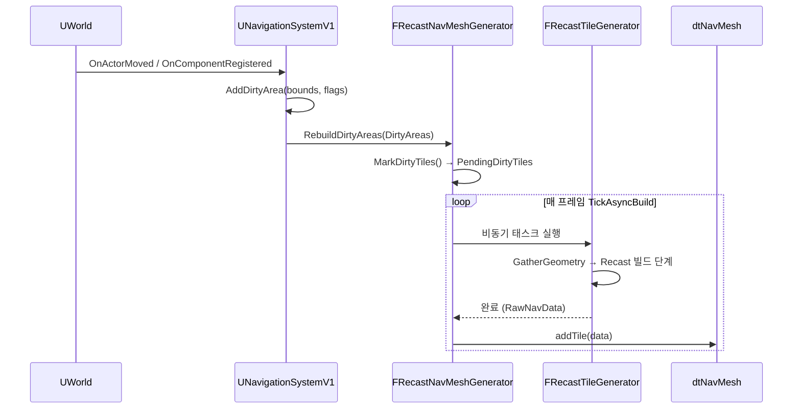
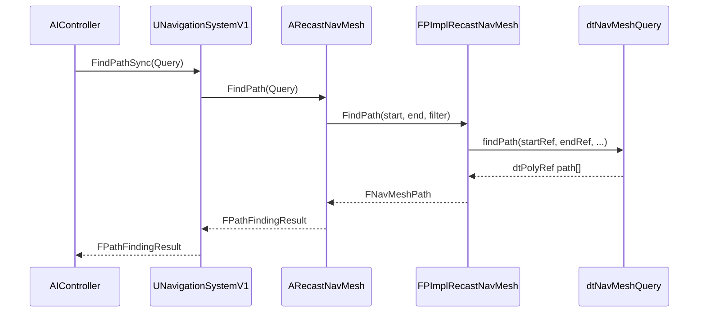

# 02. RecastNavMesh 아키텍처

> **작성일**: 2026-03-23
> **엔진 버전**: UE 5.7

## 1. 클래스 계층 구조

```
AActor
└── ANavigationData                           (Abstract)
    └── ARecastNavMesh
         ├── TUniquePtr<FPImplRecastNavMesh>  (Detour 래퍼, PIMPL 패턴)
         ├── TUniquePtr<FNavDataGenerator>
         │    └── FRecastNavMeshGenerator
         │         ├── FRecastBuildConfig      (rcConfig 확장)
         │         └── TArray<FRunningTileElement>
         │              └── FRecastTileGenerator  (타일 단위 비동기 빌드)
         └── FRecastNavMeshCachedData          (Area/Filter 캐시)

UNavigationSystemV1                           (전체 시스템 관리)
├── TArray<ANavigationData*>                  (등록된 NavData들)
├── FNavigationOctree                         (지오메트리/모디파이어 공간 분할)
├── FNavigationDirtyAreasController           (더티 영역 추적)
└── TArray<FNavigationDirtyArea>              (재빌드 대기 영역)
```

## 2. 핵심 클래스 역할

### UNavigationSystemV1
**파일**: `Engine/Source/Runtime/NavigationSystem/Public/NavigationSystem.h`

네비게이션 전체를 관장하는 컴포넌트입니다. `UWorld`에 하나씩 존재합니다.

- 씬의 NavRelevant 오브젝트를 `FNavigationOctree`에 등록/관리
- Dirty Area 수집 및 `ANavigationData::RebuildDirtyAreas()` 호출
- 경로 쿼리 요청을 적절한 `ANavigationData`로 라우팅
- World Partition 모드 (`bUseWorldPartitionedDynamicMode`) 처리

### ARecastNavMesh
**파일**: `Engine/Source/Runtime/NavigationSystem/Public/NavMesh/RecastNavMesh.h:572`

월드에 배치되는 NavMesh 액터. 에이전트 속성(`AgentRadius`, `AgentHeight` 등)별로 하나씩 존재할 수 있습니다.

- 빌드 설정 보유 (TileSize, CellSize, AgentRadius 등)
- `FPImplRecastNavMesh`를 통해 `dtNavMesh` 접근
- `FRecastNavMeshGenerator`로 빌드 파이프라인 실행
- 경로 쿼리 API 제공 (`ProjectPoint`, `FindPath`, `BatchRaycast` 등)
- 스트리밍 청크 관리 (`AttachNavMeshDataChunk`, `DetachNavMeshDataChunk`)

### FPImplRecastNavMesh (PIMPL)
**파일**: `Engine/Source/Runtime/NavigationSystem/Private/NavMesh/PImplRecastNavMesh.h`

Detour `dtNavMesh`와 `dtNavMeshQuery`를 감싸는 PIMPL 래퍼입니다. 헤더에 Detour 타입이 노출되지 않도록 격리합니다.

- `dtNavMesh` 인스턴스 소유
- `dtNavMeshQuery` 풀(Pool) 관리 (스레드 안전)
- 타일 추가/제거 (`AddTiles`, `RemoveTiles`)
- TileCache (`dtTileCache`) 관리

### FRecastNavMeshGenerator
**파일**: `Engine/Source/Runtime/NavigationSystem/Public/NavMesh/RecastNavMeshGenerator.h:784`

빌드 파이프라인을 총괄합니다.

- `InclusionBounds` / `ExclusionBounds` 관리
- Dirty Area → 빌드할 타일 목록(`PendingDirtyTiles`) 계산
- 비동기 타일 빌드 작업 큐 관리 (`RunningDirtyTiles`)
- 완료된 타일을 `dtNavMesh`에 등록
- `TickAsyncBuild()`에서 매 프레임 진행 상황 처리

### FRecastTileGenerator
**파일**: `Engine/Source/Runtime/NavigationSystem/Public/NavMesh/RecastNavMeshGenerator.h`

타일 하나를 빌드하는 실제 작업 단위입니다.

1. `FNavigationOctree`에서 지오메트리/모디파이어 수집
2. `rcContext`를 사용해 Recast 빌드 단계 실행
3. 완료된 타일 데이터를 압축하여 반환

## 3. 데이터 흐름 다이어그램

### 빌드 흐름



### 경로 쿼리 흐름



## 4. 메모리 구조

### dtNavMesh 타일 메모리 레이아웃

하나의 타일(`dtMeshTile`)은 연속된 메모리 블록으로 구성됩니다:

```
[dtMeshHeader]
[dtPoly * polyCount]           ← 폴리곤 배열
[float3 * vertCount]           ← 버텍스 배열
[dtLink * maxLinkCount]        ← 폴리곤 간 링크
[dtPolyDetail * detailMeshCount] ← 세부 메시 메타
[float3 * detailVertCount]     ← 세부 버텍스
[uint8 * detailTriCount*4]     ← 세부 삼각형
[dtBVNode * bvNodeCount]       ← 가속 BV 트리
[dtOffMeshConnection * offMeshConCount] ← 오프메시 연결
```

### TileCache (DynamicModifiersOnly)

`DynamicModifiersOnly` 모드에서는 지오메트리 레이어가 `CompressedTileCacheLayers`에 별도 보관됩니다:

```
[CompressedTileCacheLayers]    ← 압축된 지오메트리 (원본 voxel 레이어)
         ↓ (Modifier 업데이트 시)
dtTileCache::buildNavMeshTilesAt()
         ↓
dtObstacleAvoidance 적용 → 새 dtMeshTile 생성
         ↓
dtNavMesh::addTile() / removeTile()
```

## 5. 스레딩 모델

| 작업 | 스레드 |
|------|--------|
| `MarkDirtyTiles()` | Game Thread |
| `FRecastTileGenerator` 실행 | Worker Thread (TaskGraph) |
| `AddGeneratedTiles()` | Game Thread (완료 후 통합) |
| `dtNavMeshQuery` 경로 쿼리 | 각 쿼리마다 독립 인스턴스 (Thread-safe) |
| 배치 쿼리 (`BeginBatchQuery`) | Game Thread 전용 |

`dtNavMeshQuery`는 스레드당 하나씩 사용해야 합니다. `FPImplRecastNavMesh`는 쿼리 풀(Pool)을 통해 스레드 안전하게 쿼리 인스턴스를 제공합니다.
