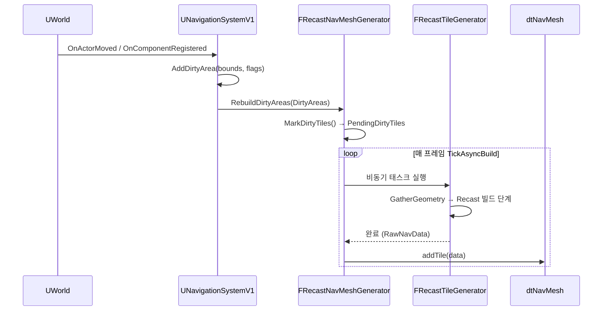
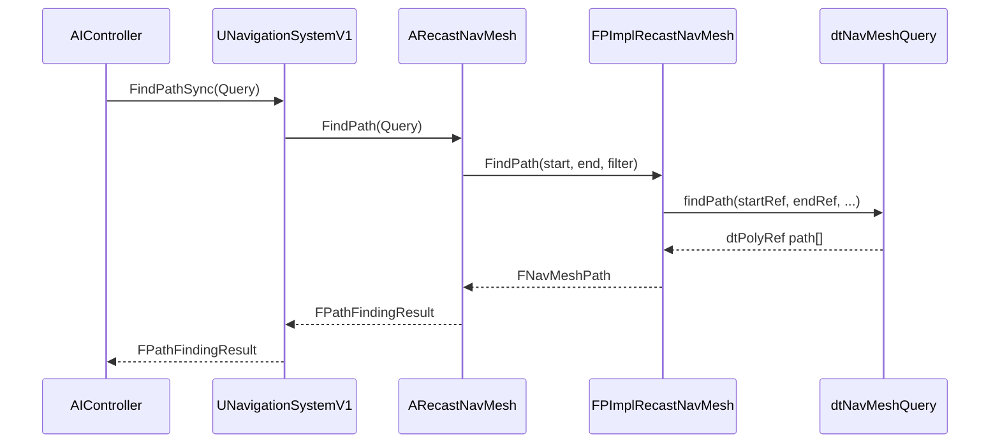

# 02. RecastNavMesh 아키텍처

> **작성일**: 2026-03-23
> **엔진 버전**: UE 5.7

## 1. 클래스 계층 구조

### 1-1. 전체 구조

```
AActor
└── ANavigationData                           (Abstract)
    ├── ARecastNavMesh                        (Recast/Detour 기반 구현)
    │    ├── FPImplRecastNavMesh*             (Detour 래퍼, PIMPL 패턴)
    │    │    ├── dtNavMesh*                  (타일 그래프 데이터)
    │    │    ├── dtNavMeshQuery              (Shared — 게임 스레드용)
    │    │    └── CompressedTileCacheLayers   (복셀 레이어 캐시)
    │    ├── TUniquePtr<FNavDataGenerator>
    │    │    └── FRecastNavMeshGenerator
    │    │         ├── FRecastBuildConfig     (rcConfig 확장)
    │    │         └── TArray<FRunningTileElement>
    │    │              └── FRecastTileGenerator  (타일 단위 비동기 빌드)
    │    └── FRecastNavMeshCachedData         (Area/Filter 캐시)
    ├── AAbstractNavData                      (테스트/더미 구현)
    └── ANavigationGraph                      (그래프 기반 내비)

UNavigationSystemV1                           (UWorld당 하나, 전체 관리)
├── TArray<ANavigationData*> NavDataSet       (에이전트별 NavData들)
├── TArray<FNavDataConfig> SupportedAgents    (지원 에이전트 목록)
├── FNavigationOctree                         (지오메트리/모디파이어 공간 분할)
├── FNavigationDirtyAreasController           (더티 영역 추적 + WP 필터링)
└── TArray<FNavigationDirtyArea>              (재빌드 대기 영역)
```

### 1-2. ANavigationData가 추상 베이스인 이유

`ANavigationData`는 `abstract`로 선언되어 있고, 내비게이션 구현체의 **공통 인터페이스 + 공통 인프라** 역할을 합니다.

**파일**: `Engine/Source/Runtime/NavigationSystem/Public/NavigationData.h:545`

```cpp
UCLASS(config=Engine, defaultconfig, NotBlueprintable, abstract, MinimalAPI)
class ANavigationData : public AActor, public INavigationDataInterface
```

#### ANavigationData가 직접 구현하는 핵심 로직

"순수 인터페이스"가 아니라 **상당한 양의 공통 로직을 직접 구현**하고 있어 서브클래스는 실제 쿼리 알고리즘만 얹으면 됩니다.

**1) 경로 추적 및 재요청 (Path tracking & invalidation)**

**파일**: `NavigationData.cpp:285-405, 459-768`

```cpp
TArray<FNavPathWeakPtr> ActivePaths;                  // 활성 경로 목록
TArray<FNavPathRecalculationRequest> RepathRequests;  // Repath 큐
TArray<FNavigationPath::FObserver> ObservedPaths;     // 관찰 경로 (목표 이동 추적)

void RegisterActivePath(FNavPathSharedPtr Path);      // 경로 수명 추적
void PurgeUnusedPaths();                              // 만료 경로 정리
void RequestRePath(FNavPathSharedRef Path, ENavPathUpdateType Reason);  // Repath 요청
void TickActor(float DeltaTime, ELevelTick TickType, FActorTickFunction& ThisTickFunction);
// 매 틱 ObservedPaths 순회 + RepathRequests 처리
```

**2) NavArea 레지스트리 (Supported Areas management)**

**파일**: `NavigationData.cpp:757-897`

```cpp
TArray<FSupportedAreaData> SupportedAreas;            // 이 NavData가 지원하는 Area 목록
TMap<const UClass*, int32> AreaClassToIdMap;          // UNavArea 서브클래스 → 내부 ID

void ProcessNavAreas(const TSet<const UClass*>& AreaClasses, int32 AgentIndex);
void OnNavAreaAdded(const UClass* NavAreaClass, int32 AgentIndex);
int32 GetAreaID(const UClass* AreaClass) const;       // 클래스 → ID 조회
const UClass* GetAreaClass(int32 AreaID) const;       // ID → 클래스 역조회
```

`ARecastNavMesh`의 `RECAST_MAX_AREAS=64` 비트 레이아웃은 이 ID 공간을 따라갑니다.

**3) 쿼리 필터 레지스트리 (Query filter registry)**

**파일**: `NavigationData.cpp:913-921`, `NavigationData.h:809`

```cpp
FSharedNavQueryFilter DefaultQueryFilter;                                 // 기본 필터
TMap<UClass*, FSharedConstNavQueryFilter> QueryFilters;                   // 필터 캐시

FSharedConstNavQueryFilter GetQueryFilter(TSubclassOf<UNavigationQueryFilter> FilterClass) const;
void StoreQueryFilter(TSubclassOf<UNavigationQueryFilter> FilterClass, FSharedConstNavQueryFilter Filter);
```

**4) 제너레이터 라이프사이클**

**파일**: `NavigationData.cpp:585-715`, `.h:1062`

```cpp
TSharedPtr<FNavDataGenerator> NavDataGenerator;
TArray<FNavigationDirtyArea> SuspendedDirtyAreas;  // 일시중단 시 누적

virtual void ConditionalConstructGenerator();      // 서브클래스가 override
void RebuildDirtyAreas(const TArray<FNavigationDirtyArea>& DirtyAreas);
// 서스펜드 상태면 SuspendedDirtyAreas에 쌓고, 풀리면 제너레이터에 디스패치
void SetRebuildingSuspended(bool bNewSuspended);
```

**5) 등록 상태 / 버저닝**

```cpp
uint8 bRegistered : 1;                            // NavigationSystem 등록 여부
int32 DataVersion = NAVDATAVER_LATEST;  // 13    // 데이터 포맷 버전

virtual void OnRegistered();
virtual void OnUnregistered();
void RequestRegistration();                        // NavigationSystem에 등록 요청
```

**6) 에이전트 설정 및 디버그 렌더링**

```cpp
FNavDataConfig NavDataConfig;                     // AgentRadius, AgentHeight 등
UPROPERTY() TObjectPtr<UPrimitiveComponent> RenderingComp;  // 디버그 표시 컴포넌트

virtual UPrimitiveComponent* ConstructRenderingComponent();  // 서브클래스가 커스텀 가능
// ARecastNavMesh → UNavMeshRenderingComponent
// AAbstractNavData → nullptr (렌더링 없음)
```

#### 서브클래스가 구현해야 할 인터페이스

**a) 함수 포인터 기반 (hot-path 성능 최적화)**

가상 함수(vtable) 오버헤드를 피하기 위한 특이한 패턴입니다.

**파일**: `NavigationData.h:1046-1059`

```cpp
typedef FPathFindingResult (*FFindPathPtr)(const FNavAgentProperties&,
                                            const FPathFindingQuery&);
FFindPathPtr FindPathImplementation;              // FindPath 본체 포인터
FFindPathPtr FindHierarchicalPathImplementation;
FTestPathPtr TestPathImplementation;
FNavRaycastWithAdditionalResultsPtr RaycastImplementationWithAdditionalResults;

// 베이스 클래스의 FindPath는 단순히 포인터를 호출할 뿐
FPathFindingResult FindPath(const FNavAgentProperties& Agent, const FPathFindingQuery& Q) const
{
    check(FindPathImplementation);
    return (*FindPathImplementation)(Agent, Q);
}
```

서브클래스는 생성자에서 static 함수를 포인터에 할당 (`RecastNavMesh.cpp:529-535`):
```cpp
ARecastNavMesh::ARecastNavMesh()
{
    FindPathImplementation = FindPath;          // ARecastNavMesh::FindPath (static)
    TestPathImplementation = TestPath;
    RaycastImplementationWithAdditionalResults = NavMeshRaycast;
}
```

**b) PURE_VIRTUAL 메서드 (서브클래스 필수 override)**

**파일**: `NavigationData.h:778-967`

| 메서드 | 역할 |
|--------|------|
| `GetBounds()` | 이 NavData가 커버하는 공간 |
| `ProjectPoint()` / `BatchProjectPoints()` | 월드 좌표 → 네비 위 투사 |
| `GetRandomPoint()` / `GetRandomReachablePointInRadius()` | 랜덤 포인트 샘플링 |
| `BatchRaycast()` | 다중 레이캐스트 |
| `FindMoveAlongSurface()` | 표면 이동 (미끄러짐) |
| `FindOverlappingEdges()` | 경계 에지 탐색 |
| `GetPathSegmentBoundaryEdges()` | 경로 세그먼트 경계 |
| `CalcPathCost()` / `CalcPathLength()` | 경로 비용/길이 |
| `DoesNodeContainLocation()` | 노드 포함 여부 |

서브클래스가 이 전부를 구현하면 NavigationSystem / AIController / PathFollowingComponent 등 상위 레이어와 자동으로 연동됩니다.

#### 실제로 분리해두어서 얻는 구체적 이득

1. **UNavigationSystemV1의 쿼리 라우팅**: `GetNavDataForProps(AgentProps)`가 에이전트 프로퍼티에 맞는 NavData를 찾아 반환 — Recast든 커스텀이든 동일하게 동작.
2. **AIController / PathFollowingComponent**: `ANavigationData*` 타입만 알고 쿼리 — Recast 내부에 직접 의존하지 않음. 내비 구현을 바꿔도 AI 코드 수정 불필요.
3. **Navigation Invoker 시스템**: invoker 기반 타일 로딩이 `ANavigationData` 인터페이스로 구현되어 모든 구현체에 적용 가능.
4. **디버그 렌더링 다형성**: 각 구현체가 `ConstructRenderingComponent()`로 전용 렌더링 컴포넌트 제공.
5. **경로 관찰/재요청 공통화**: `ActivePaths`/`ObservedPaths` 처리 로직을 베이스에서 단일 구현 → 모든 NavData가 공짜로 재요청 시스템 획득.
6. **테스트성**: `AAbstractNavData`로 네비 시스템 빈 상태 시뮬레이션 가능.

#### 현재 존재하는 서브클래스

| 클래스 | 파일 | 용도 |
|--------|------|------|
| `ARecastNavMesh` | `NavMesh/RecastNavMesh.h:573` | Recast/Detour 기반 메인 구현 (사실상 유일한 프로덕션 구현) |
| `AAbstractNavData` | `AbstractNavData.h:59-100` | 스텁 구현 — 모든 쿼리가 no-op 또는 고정값. 테스트/무네비 환경용 |
| `ANavigationGraph` | `NavGraph/NavigationGraph.h:60-66` | 그래프 기반 실험적 베이스, 미완성 |

#### 플러그인/커스텀 구현 후보 예시

`ANavigationData`를 상속해서 만들 수 있는 실제 사례들:

1. **2D 그리드 내비** — 2D 탑다운/플랫포머 게임용. 그리드 셀을 노드로, 인접 셀을 엣지로 삼아 A\* 적용. Recast보다 훨씬 가볍고 예측 가능.
2. **웨이포인트 그래프 내비** — 디자이너가 수동 배치한 웨이포인트 네트워크. MMO나 레이싱 AI 등에서 쓰임. `ANavigationGraph`가 이 방향의 미완성 베이스.
3. **볼류메트릭/3D 내비** — 날아다니는 AI, 우주 전투, 수중 AI 용 3D 네비 (공식 마켓플레이스의 "Flying AI Extension" 류).
4. **하이브리드 (Recast + 볼륨)** — 지상 AI는 Recast, 공중 AI는 별도 볼륨. 두 구현체가 같은 월드에 공존.
5. **Jump Point Search (JPS)** — 그리드 기반 최적화 A\* 변형. 오픈 필드에서 Recast보다 빠른 경로 탐색.
6. **Flow Field 기반 군중 내비** — 다수 유닛이 같은 목적지로 이동할 때 경로 대신 방향장 사용 (RTS/MOBA류).
7. **계층적 네비 (HPN, Hierarchical Pathfinding Network)** — 대형 맵을 클러스터로 분할하여 상위 그래프에서 대략적 경로를 구하고 클러스터 내부에서 세부 경로를 구하는 방식.

**플러그인 구현 절차:**
1. `ANavigationData` 상속 (`UCLASS()`로 마킹, `abstract` 해제)
2. PURE_VIRTUAL 메서드 전체 구현 (ProjectPoint, GetRandomPoint, BatchRaycast, ...)
3. 생성자에서 `FindPathImplementation` / `TestPathImplementation` / `RaycastImplementationWithAdditionalResults`에 static 함수 할당
4. 필요 시 `ConditionalConstructGenerator()` override하여 전용 `FNavDataGenerator` 부착
5. `UClass*`를 프로젝트 설정 `SupportedAgents[i].NavigationDataClass`에 지정하면 해당 에이전트에는 새 구현체가 스폰됨

> **소스 확인 위치**
> - `Engine/Source/Runtime/NavigationSystem/Public/NavigationData.h:545` — `ANavigationData` 선언 (`abstract`)
> - `Engine/Source/Runtime/NavigationSystem/Public/NavigationData.h:1046-1059` — 함수 포인터 기반 다형성 typedef
> - `Engine/Source/Runtime/NavigationSystem/Public/NavigationData.h:778-967` — PURE_VIRTUAL 메서드 모음
> - `Engine/Source/Runtime/NavigationSystem/Private/NavigationData.cpp:285-405` — `TickActor()` 경로 관찰/재요청 처리
> - `Engine/Source/Runtime/NavigationSystem/Private/NavigationData.cpp:459-768` — `ActivePaths`, `ObservedPaths`, `RepathRequests` 관리
> - `Engine/Source/Runtime/NavigationSystem/Private/NavigationData.cpp:585-715` — Generator 라이프사이클, `RebuildDirtyAreas` 디스패치
> - `Engine/Source/Runtime/NavigationSystem/Private/NavigationData.cpp:757-897` — NavArea 레지스트리
> - `Engine/Source/Runtime/NavigationSystem/Private/NavMesh/RecastNavMesh.cpp:529-535` — 함수 포인터 할당 예시
> - `Engine/Source/Runtime/NavigationSystem/Public/AbstractNavData.h:59-100` — `AAbstractNavData` 스텁 구현 예시

## 2. 핵심 클래스 역할

### 2-1. UNavigationSystemV1 — UWorld당 하나

**파일**: `Engine/Source/Runtime/NavigationSystem/Public/NavigationSystem.h:316`

`UWorld`에 **하나만** 존재하는 서브시스템입니다. 단, 관리 대상인 `ANavigationData` 인스턴스는 **에이전트별로 여러 개**가 있을 수 있습니다.

```cpp
class UNavigationSystemV1 : public UNavigationSystemBase
{
    /** 현재 월드에 등록된 모든 NavData (에이전트별로 여러 개) */
    UPROPERTY(Transient)
    TArray<TObjectPtr<ANavigationData>> NavDataSet;  // NavigationSystem.h:427

    /** 프로젝트 설정에 정의된 지원 에이전트 프로퍼티 목록 */
    UPROPERTY(config, EditAnywhere, Category=Agents)
    TArray<FNavDataConfig> SupportedAgents;           // NavigationSystem.h:413

    /** 에이전트 프로퍼티로 적합한 NavData 조회 */
    virtual ANavigationData* GetNavDataForProps(const FNavAgentProperties& AgentProperties);

    /** WP 동적 모드 플래그 */
    uint32 bUseWorldPartitionedDynamicMode : 1;
};
```

**에이전트별 NavData 스폰 흐름:**
1. `PostInitProperties()`가 `SupportedAgents` 배열을 순회
2. `SpawnMissingNavigationDataInLevel()`에서 각 에이전트에 대해 매칭되는 NavData가 없으면 `CreateNavigationDataInstanceInLevel()`로 신규 스폰
3. 스폰된 인스턴스를 `RegisterNavData()`로 `NavDataSet`에 등록

**에이전트 ↔ NavData 매핑의 카디널리티:**

1:1이 설계 의도이지만, **실제로는 N:1(여러 에이전트 → 하나의 NavData)이 허용**됩니다. 반대 방향(한 에이전트 → 여러 NavData)은 금지됩니다.

| 시나리오 | 허용? | 근거 |
|----------|:-----:|------|
| `SupportedAgents[i]` → NavData 1개 | O | 기본 설계 |
| `SupportedAgents[i]` → NavData 0개 | O | `SupportedAgentsMask`로 비활성화 또는 레벨에 매칭 NavData 없음 |
| `SupportedAgents[i]` → NavData 여러 개 | **X** | `RegisterNavData()`가 `RegistrationFailed_AgentAlreadySupported` 반환 |
| Agent[i] + Agent[j] (유사 radius/height) → 같은 NavData | **O** | Tolerance 매칭 (아래 참조) |
| 한 에이전트 쿼리 → 여러 NavData 동시 사용 | X | `GetNavDataForProps()`는 단일 인스턴스만 반환 |

**매핑 매커니즘:**

1. **Tolerance 기반 매칭** (`NavigationSystem.cpp:2287-2358`, `NavigationTypes.h:490`)
   - `FNavAgentProperties::IsNavDataMatching()`이 **5.0 unit 이내 오차**까지 같은 NavData로 간주
   - `GetNavDataForProps()`: 정확 매칭이 없으면 best-fit(ExcessRadius/ExcessHeight 최소)을 선택
   - 두 에이전트의 radius/height가 비슷하면 **자동으로 같은 NavData를 공유**

2. **자동 스폰 스킵** (`NavigationSystem.cpp:4647-4687`)
   - 레벨에 이미 매칭 NavData가 배치돼 있으면 신규 스폰 skip
   - `SpawnMissingNavigationDataInLevel`에서 `InInstantiatedMask[AgentIndex]` 체크

3. **`FNavAgentSelector` / `SupportedAgentsMask`** — 16비트 마스크로 에이전트별 활성/비활성 제어

4. **등록 시 중복 검증** (`NavigationSystem.cpp:2850-2859`)
   ```cpp
   else if (NavDataInstanceForAgent == NavData) {
       Result = RegistrationSuccessful;  // 동일 NavData 재등록은 허용
   } else {
       Result = RegistrationFailed_AgentAlreadySupported;  // 다른 NavData면 거부
   }
   ```

**실무 함의:**
- N개 에이전트 = 반드시 N개 NavData가 아님. 에이전트 프로퍼티가 비슷하면 수가 줄어듦
- `AgentRadius`가 34, 35, 36인 에이전트 3개 → `IsNavDataMatching()` 5.0 tolerance 덕에 **모두 하나의 NavData를 공유** 가능 (빌드/메모리 크게 절약)
- 반대로 정말 다른 NavMesh가 필요하면 radius/height를 tolerance 넘게 벌려야 함

**책임 범위:**
- NavRelevant 오브젝트를 `FNavigationOctree`에 등록/관리
- Dirty Area 수집 및 `ANavigationData::RebuildDirtyAreas()` 호출
- 경로 쿼리 요청을 적절한 `ANavigationData`로 라우팅 (에이전트 매칭)
- World Partition 모드 (`bUseWorldPartitionedDynamicMode`) 처리 및 Invoker 기반 타일 로딩 요청
- 스트리밍 자체는 **수행하지 않음**: 실제 타일 Attach/Detach는 `URecastNavMeshDataChunk`가 담당 (아래 2-7 참조)

> **소스 확인 위치**
> - `Engine/Source/Runtime/NavigationSystem/Public/NavigationSystem.h:316` — `UNavigationSystemV1` 클래스 선언
> - `Engine/Source/Runtime/NavigationSystem/Public/NavigationSystem.h:413,427` — `SupportedAgents`, `NavDataSet` 선언
> - `Engine/Source/Runtime/NavigationSystem/Public/NavigationSystem.h:709,726` — `GetNavDataForProps()` 선언
> - `Engine/Source/Runtime/NavigationSystem/Public/NavigationSystem.h:753` — `CreateNavigationDataInstanceInLevel()`
> - `Engine/Source/Runtime/NavigationSystem/Public/NavigationSystem.h:1339` — `RegisterNavData()`

### 2-2. ARecastNavMesh — 에이전트별 NavMesh 액터

**파일**: `Engine/Source/Runtime/NavigationSystem/Public/NavMesh/RecastNavMesh.h:573`

월드에 배치되는 NavMesh 액터. **에이전트 속성(AgentRadius, AgentHeight 등)별로 하나씩** 존재할 수 있습니다. 에디터와 게임 월드 모두에 존재합니다.

```cpp
UCLASS(config=Engine, defaultconfig)
class ARecastNavMesh : public ANavigationData
{
    // 빌드 설정 (프로젝트 INI 파일로부터 로드)
    UPROPERTY(EditAnywhere, Category=Generation, config)
    float TileSizeUU;

    UPROPERTY(EditAnywhere, Category=Generation, config)
    float AgentRadius;

    UPROPERTY(EditAnywhere, Category=Runtime, config)
    ERuntimeGenerationType RuntimeGeneration;

    // PIMPL 래퍼 — 헤더에 Detour 타입 노출 방지
    FPImplRecastNavMesh* RecastNavMeshImpl;  // RecastNavMesh.h:1572

    // 게임 월드에서 타일 업데이트 중 경로 쿼리 동시 접근 방지용 카운터
    mutable int32 BatchQueryCounter;
};
```

**주요 책임:**
- 빌드 설정 보유 (`TileSizeUU`, `CellSize`, `AgentRadius` 등)
- `FPImplRecastNavMesh`를 통해 `dtNavMesh` 접근
- `FRecastNavMeshGenerator`로 빌드 파이프라인 실행
- 경로 쿼리 API 제공 (`ProjectPoint`, `FindPath`, `BatchRaycast` 등)
- 스트리밍 청크 적용 (`AttachNavMeshDataChunk`, `DetachNavMeshDataChunk`)
- 쿼리 동기화 (`BeginBatchQuery` / `FinishBatchQuery`)

**에디터/런타임 동작:**
- **에디터**: `RuntimeGeneration` 무관하게 전체 빌드 가능
- **런타임**: `RuntimeGeneration` 값에 따라 업데이트 허용 범위 결정 (아래 2-8 참조)

### 2-3. FPImplRecastNavMesh — PIMPL 래퍼

**파일**: `Engine/Source/Runtime/NavigationSystem/Private/NavMesh/PImplRecastNavMesh.h`

Detour의 `dtNavMesh`, `dtNavMeshQuery`를 감싸는 **PIMPL(Pointer to IMPLementation) 래퍼**입니다. 헤더에 Detour 타입이 노출되지 않도록 격리합니다.

**엔진 내 주석 (`RecastNavMesh.h:1570`):**
> @TODO since it's no secret we're using recast there's no point in having separate implementation class. FPImplRecastNavMesh should be merged into ARecastNavMesh

즉 엔진 개발자들도 현재 구조가 과잉 분리라고 보고 있으며, **실질적으로 핵심 메시/쿼리 로직은 Detour의 `dtNavMesh`/`dtNavMeshQuery`에 있습니다**. `FPImplRecastNavMesh`는 UE 타입 ↔ Detour 타입 변환과 쿼리 풀 관리 정도가 주 역할입니다.

```cpp
// PImplRecastNavMesh.h:271-284
class FPImplRecastNavMesh
{
    dtNavMesh* DetourNavMesh;                                         // 타일 그래프 데이터
    mutable dtNavMeshQuery SharedNavQuery;                            // 게임 스레드용 쿼리
    TMap<FIntPoint, TArray<FNavMeshTileData>> CompressedTileCacheLayers; // 복셀 레이어 캐시
    ARecastNavMesh* NavMeshOwner;                                     // 소유 액터 역참조
};
```

#### "Detour 타입을 헤더에서 격리"의 의미

`ARecastNavMesh`의 **공개 헤더**(`Public/NavMesh/RecastNavMesh.h`)는 `class FPImplRecastNavMesh;` 전방 선언과 포인터 멤버 하나만 가집니다. Detour 헤더(`DetourNavMesh.h` 등)는 공개 API 어디에도 등장하지 않고, **Private 폴더의 `PImplRecastNavMesh.h/.cpp`에서만 include**됩니다.

| 파일 | Detour 타입 보임? |
|------|:-----------------:|
| `Public/NavMesh/RecastNavMesh.h` | **X** (전방 선언만) |
| `Private/NavMesh/PImplRecastNavMesh.h` | O |
| `Private/NavMesh/PImplRecastNavMesh.cpp` | O |
| 게임 코드, 다른 모듈 | **X** (공개 헤더만 include하므로) |

**이 격리의 효과:**
- 게임 코드가 `RecastNavMesh.h`를 include해도 Detour 헤더가 전파되지 않음 → 빌드 속도
- 공개 API에 Detour 심볼(`dtNavMesh`, `dtPoly` 등) 노출 안 됨 → 네임스페이스/ABI 보호
- Detour 내부 구조 변경이 `RecastNavMesh.h` 의존 파일들로 전파되지 않음

#### 전방 선언으로는 안 되는가?

사실 "Detour 헤더 격리" 목적만 놓고 보면 **개별 전방 선언 + 포인터 멤버 + .cpp에서 include** 방식으로도 대부분 달성 가능합니다. 컴파일 방화벽 효과는 동일하죠:

```cpp
// 가상의 전방 선언 방식 (PIMPL 없이)
class dtNavMesh;
class dtNavMeshQuery;

class ARecastNavMesh
{
    dtNavMesh*      DetourMesh;      // 포인터 = 전방 선언 OK
    dtNavMeshQuery* SharedQuery;     // 포인터 = 전방 선언 OK
    // ...
};
```

그런데도 PIMPL을 채택한 **실질적 이유**는 다음 조합:

**1) 값 멤버를 쓸 수 없음 (결정적 기술 제약)**

```cpp
class dtNavMeshQuery;  // 전방 선언
dtNavMeshQuery Query;  // ✗ 불가 — 크기 모르면 embed 못 함
dtNavMeshQuery* Query; // ✓ 가능하지만 별도 힙 할당 강제
```

실제 `FPImplRecastNavMesh`는 `dtNavMeshQuery`를 **값**으로 보유합니다. 전방 선언 방식이면 포인터로 바꿔야 하고, 그러면 별도 `new`/`delete` 관리와 힙 할당이 추가됨.

**2) Nullptr 상태 공간 폭발**

포인터 멤버 N개 = 이론적으로 2^N가지 null 조합. 메서드마다 개별 null 체크:

```cpp
void FindPath(...) {
    if (!DetourMesh)    return Fail;
    if (!SharedQuery)   return Fail;
    if (!TileCache)     return Fail;
    // ... 체크 N번
}
```

PIMPL이면 `if (!Impl) return Fail;` 한 번으로 끝. 내부 멤버들의 일관성은 `FPImplRecastNavMesh` 생성자가 보장.

**3) 부분 초기화/예외 안전성**

```cpp
// 전방 선언 방식 생성자
ARecastNavMesh() {
    DetourMesh   = new dtNavMesh();       // 성공
    SharedQuery  = new dtNavMeshQuery();  // 성공
    TileCache    = new dtTileCache();     // throw!
    // → 앞 두 개 누수. 소멸자도 호출 안 됨 (C++ 표준)
}
```

PIMPL은 `new FPImplRecastNavMesh()` **한 번**. 성공하거나 실패하거나 이분법 → 예외 안전.

**4) 캡슐화 완전성**

```cpp
// 전방 선언 방식 — 서브클래스가 내부 상태 직접 조작 가능
class AMyCustomNavMesh : public ARecastNavMesh {
    void Hack() { DetourMesh->removeAllTiles(); }  // 우회 조작
};
```

PIMPL은 `Impl`이 **불투명 타입** — 외부에서 포인터만 보이고 내부 멤버/메서드는 알 수 없음. 서브클래스·friend도 우회 불가.

**5) 불변 조건(Invariant) 유지**

"`TileCache`와 `DetourMesh`는 항상 같은 타일 그리드 설정이어야 한다" 같은 규칙을 enforce하려면, 상태가 한 클래스에 묶여 있어야 공통 setter에서 검증 가능. 상태가 `ARecastNavMesh` 여기저기 흩어지면 sync가 깨질 지점이 많아짐.

**6) 거대 로직의 물리적 분리 (가장 큰 실질 이득)**

`PImplRecastNavMesh.cpp`는 실제로 **3000줄+** 의 Detour 통합 코드. 전방 선언 방식이면 이 전부가 `RecastNavMesh.cpp`에 들어가야 함 → UE 레이어 로직과 Detour 레이어 로직이 한 파일에 섞이면서 유지보수 난이도 폭발.

**7) 할당 통합 / 캐시 지역성** (부수 효과)

값 멤버들이 임플 할당 한 블록에 embed → 힙 할당 횟수 감소 + 멤버 접근 시 같은 캐시 라인.

#### 정리

| 목적 | 전방 선언만 | PIMPL |
|------|:-----------:|:-----:|
| Detour 헤더 격리 (빌드 방화벽) | O | O |
| 값 멤버 사용 | **X** | O |
| Null 상태 공간 축소 | X | O |
| 예외 안전 생성/소멸 | 어려움 | 쉬움 |
| 완전한 캡슐화 (내부 불투명) | X | O |
| 불변 조건 한 곳 관리 | 어려움 | 쉬움 |
| 거대 로직 파일 분리 | X | O |
| 할당 통합 | X | O |

**컴파일 방화벽만 필요**하면 전방 선언으로 충분하지만, **값 멤버 + 복잡한 내부 상태 + 수천 줄 로직**이 결합되면 PIMPL이 명백히 우세합니다. `ARecastNavMesh`는 정확히 후자의 케이스. 엔진 TODO 주석의 "합쳐도 된다"는 **Detour 외 구현이 없어 #1(교체 유연성)이 의미 없어졌다**는 맥락이지, 나머지 기술적 이유는 여전히 유효합니다.

#### 미결 쟁점 — 이 구조가 정말 정당한가?

위 정당화 논리는 여러 각도에서 약화될 수 있어, 깔끔한 결론이 나지 않는 설계 이슈로 보는 게 맞습니다.

- **멤버 변수는 4개뿐** (포인터 2개 + 값 1개 + TMap 1개, `PImplRecastNavMesh.h:271-284`). "N개 포인터 관리 복잡도" 같은 논리는 이 케이스에서 약함. 결정적인 건 `dtNavMeshQuery SharedNavQuery` **값 멤버 하나**의 존재.
- **어댑터가 자체 데이터 없음** — Detour 객체를 "주물럭거리기만" 함. Feature Envy 관점에서 보면 기능이 `dtNavMesh`/`dtNavMeshQuery`에 있어야 자연스럽지만, **서드파티라 수정 불가** → 바깥에 어댑터가 필연적으로 존재.
- **어댑터 로직을 별도 클래스로 둘지**는 선택 — 기술적으로 `ARecastNavMesh.cpp`에 녹여도 동작에 문제 없음. TODO 주석이 제안하는 게 바로 이 방향.
- **엔진 팀도 과잉 분리 인지** — 추정 초기 의도(Detour 외 구현 교체)가 희석됐지만 리팩토링 비용 때문에 TODO로만 남음.

**실질적 가치 (우선순위):**
1. `dtNavMeshQuery` 값 embed (포인터화 시 별도 할당/생애주기 부담)
2. 3000줄+ Detour 통합 코드의 물리적 파일 분리
3. 서드파티 경계에서의 캡슐화 집중

나머지 논리(null 축소, 예외 안전 등)는 **부수적**이거나 이 케이스에는 **거의 적용되지 않음**.

**신규 플러그인에는 해당 없음** — 서드파티 경계가 없는 신규 구현(예: `AGridNavData`)에서는 PIMPL의 주요 정당화(서드파티 격리, UE↔외부 어댑터, 값 멤버 임베드)가 전부 해당되지 않음. 대신 SRP/Strategy 기반 컴포지션(알고리즘 분리, 데이터 분리)이 더 자연스러움. → 이슈 #14에서 `AGridNavData` 구현 시 PIMPL 도입하지 않고, 대신 `FGridPathfinder`(순수 A\* 알고리즘)와 `FGridNavDataGenerator`(빌드) 분리로 설계.

**잠정 결론**: `FPImplRecastNavMesh` PIMPL은 **기술적 필연이 아니라 조직화 선택**. 확정적 평가는 `ANavigationData` 서브클래스를 직접 구현해본 뒤 재검토 예정.

### 2-4. dtNavMesh — 타일 그래프 데이터 (Detour)

**파일**: `Engine/Source/Runtime/Navmesh/Public/Detour/DetourNavMesh.h:502`

Detour 라이브러리의 **데이터 저장 클래스**입니다. 알고리즘은 포함하지 않고, 타일 추가/제거, 폴리곤 조회, 공간 → 타일 변환만 수행합니다.

주요 역할:
- `(x, y, layer)` 좌표로 타일 인덱싱
- `dtTileRef` / `dtPolyRef` 핸들 발급 및 디코딩
- 타일 경계 간 `dtLink` 구성 (`connectExtLinks`)
- `addTile()` / `removeTile()` — 타일 메모리 블록 등록/해제

### 2-5. dtNavMeshQuery — 쿼리 엔진 (Detour)

**파일**: `Engine/Source/Runtime/Navmesh/Public/Detour/DetourNavMeshQuery.h:348`

실제 경로 탐색 알고리즘이 있는 곳입니다. **A\* 알고리즘**으로 폴리곤 그래프를 탐색합니다.

- `findPath()` (`DetourNavMeshQuery.cpp:1578`): 바이너리 힙 우선순위 큐 기반 A\*, 폴리곤 간 링크를 엣지로 사용
- 시간 복잡도: `O((V+E) log V)` (V=폴리곤 수, E=링크 수)
- **스레드 안전 아님**: 인스턴스마다 독립적으로 사용해야 함. 게임 스레드는 `SharedNavQuery` 재사용, 비동기 쿼리는 별도 인스턴스 생성.

### 2-6. FRecastNavMeshGenerator — 빌드 오케스트레이터

**파일**: `Engine/Source/Runtime/NavigationSystem/Public/NavMesh/RecastNavMeshGenerator.h:784`

빌드 파이프라인을 총괄합니다.

- `InclusionBounds` / `ExclusionBounds` 관리
- Dirty Area → 빌드할 타일 목록(`PendingDirtyTiles`) 계산 (`MarkDirtyTiles()`)
- 비동기 타일 빌드 작업 큐 관리 (`RunningDirtyTiles`)
- 완료된 타일을 `dtNavMesh`에 등록 (`AddGeneratedTilesAndGetUpdatedTiles()`)
- `TickAsyncBuild()`에서 매 프레임 진행 상황 처리

### 2-7. FRecastTileGenerator — 타일 단위 빌드 작업

**파일**: `Engine/Source/Runtime/NavigationSystem/Public/NavMesh/RecastNavMeshGenerator.h:361`

**타일 하나의 빌드 작업**을 표현하는 클래스입니다. "타일"이라는 개념에는 세 가지 다른 레벨이 있으니 혼동 주의:

| 클래스 | 레벨 | 역할 |
|--------|------|------|
| `FRecastTileGenerator` | 빌드 타임 | 빌드 진행 상태, 중간 복셀/힐드필드 데이터 보관 |
| `dtTileCacheLayer` | 영속 | 압축된 복셀 레이어 (지오메트리 캐시, `CompressedTileCacheLayers`에 보관) |
| `dtMeshTile` | 런타임 | 실제 쿼리에 사용되는 폴리곤 메시 타일 |

`FRecastTileGenerator`가 빌드를 완료하면 결과물이 `FNavMeshTileData`로 패킹되어 `dtNavMesh::addTile()`에 전달되고, 내부에서 `dtMeshTile`로 등록됩니다. `DynamicModifiersOnly` 모드에서는 동시에 `dtTileCacheLayer`도 보관됩니다.

1. `FNavigationOctree`에서 지오메트리/모디파이어 수집
2. `rcContext`를 사용해 Recast 빌드 단계 실행
3. 완료된 타일 데이터를 압축하여 반환

### 2-8. URecastNavMeshDataChunk — 스트리밍 담당

**파일**: `Engine/Source/Runtime/NavigationSystem/Public/NavMesh/RecastNavMeshDataChunk.h:65`

월드 파티션/레벨 스트리밍 시 **실제 타일 Attach/Detach를 수행하는 데이터 컨테이너**입니다.

```cpp
UCLASS()
class URecastNavMeshDataChunk : public UNavigationDataChunk
{
    TArray<FNavTileRef> AttachTiles(ARecastNavMesh& NavMesh);
    TArray<FNavTileRef> DetachTiles(ARecastNavMesh& NavMesh);
};
```

스트리밍 시스템(레벨 스트리밍, DataLayer)이 청크 로드 시점에 `AttachTiles()`를 호출합니다. `UNavigationSystemV1`은 이 과정을 감독하지만 실제 Attach/Detach는 청크가 수행합니다.

> **소스 확인 위치**
> - `Engine/Source/Runtime/NavigationSystem/Public/NavMesh/RecastNavMesh.h:573,1570-1572` — `ARecastNavMesh` 선언, TODO 주석, PIMPL 포인터
> - `Engine/Source/Runtime/NavigationSystem/Private/NavMesh/PImplRecastNavMesh.h:271-284` — `FPImplRecastNavMesh` 멤버 변수
> - `Engine/Source/Runtime/Navmesh/Public/Detour/DetourNavMesh.h:502` — `dtNavMesh` 선언
> - `Engine/Source/Runtime/Navmesh/Public/Detour/DetourNavMeshQuery.h:348` — `dtNavMeshQuery` 선언
> - `Engine/Source/Runtime/Navmesh/Private/Detour/DetourNavMeshQuery.cpp:1578` — `findPath()` A\* 구현
> - `Engine/Source/Runtime/NavigationSystem/Public/NavMesh/RecastNavMeshGenerator.h:361` — `FRecastTileGenerator`
> - `Engine/Source/Runtime/NavigationSystem/Public/NavMesh/RecastNavMeshGenerator.h:784` — `FRecastNavMeshGenerator`
> - `Engine/Source/Runtime/NavigationSystem/Public/NavMesh/RecastNavMeshDataChunk.h:75-84` — `AttachTiles()` / `DetachTiles()`

### 2-9. RuntimeGeneration 모드 — 에디터/런타임 동작

**파일**: `Engine/Source/Runtime/NavigationSystem/Public/NavigationData.h:529-539`

```cpp
enum class ERuntimeGenerationType : uint8
{
    Static,                  // 런타임 빌드 없음 — 완전 정적
    DynamicModifiersOnly,    // Nav Modifier만 런타임 업데이트 허용
    Dynamic,                 // 지오메트리 변경도 런타임 처리
    LegacyGeneration UMETA(Hidden)
};
```

| 모드 | 에디터 빌드 | 런타임 빌드 | 런타임 Modifier 반영 |
|------|:-----------:|:-----------:|:--------------------:|
| `Static` | 가능 | X | X |
| `DynamicModifiersOnly` | 가능 | 부분 (압축 레이어 → 타일 재생성) | O |
| `Dynamic` | 가능 | 전체 (지오메트리 포함) | O |

`IsGameStaticNavMesh()` (`RecastNavMeshGenerator.cpp:5105`)는 **"게임 월드이고, AND, `RuntimeGeneration`이 `Dynamic`이 아닌"** 경우에 `true`를 반환합니다 (두 조건 모두 만족해야 함, `&&` 연산). 즉 PIE/Standalone/Cooked에서 `Static` 또는 `DynamicModifiersOnly` 모드인 NavMesh가 해당. 이 값이 `MarkDirtyTiles`에서 "지오메트리 Dirty Area는 건너뛰기" 분기의 스위치입니다.

```cpp
// RecastNavMeshGenerator.cpp:5105
static bool IsGameStaticNavMesh(ARecastNavMesh* InNavMesh)
{
    return (InNavMesh->GetWorld()->IsGameWorld() &&               // 조건 1
            InNavMesh->GetRuntimeGenerationMode() != ERuntimeGenerationType::Dynamic);  // 조건 2
}
```

## 3. 데이터 흐름 다이어그램

### 빌드 흐름



### 경로 쿼리 흐름



> **소스 확인 위치**
> - `Engine/Source/Runtime/NavigationSystem/Private/NavigationSystem.cpp` — `UNavigationSystemV1::Tick()`: `AddDirtyArea()` 호출, `RebuildDirtyAreas()` 디스패치
> - `Engine/Source/Runtime/NavigationSystem/Private/NavMesh/RecastNavMeshGenerator.cpp` — `FRecastNavMeshGenerator::MarkDirtyTiles()`, `TickAsyncBuild()`, `AddGeneratedTilesAndGetUpdatedTiles()`
> - `Engine/Source/Runtime/NavigationSystem/Private/NavMesh/RecastNavMeshGenerator.cpp:2061` — `GatherGeometryFromSources()` 내 `FindElementsWithBoundsTest`
> - `Engine/Source/Runtime/NavigationSystem/Private/NavMesh/PImplRecastNavMesh.cpp` — `FPImplRecastNavMesh::FindPath()`: `dtNavMeshQuery::findPath()` 래핑
> - `Engine/Source/Runtime/Navmesh/Private/Detour/DetourNavMeshQuery.cpp:1578` — `dtNavMeshQuery::findPath()` A\* 구현

## 4. 메모리 구조

### 4-1. dtNavMesh 타일 메모리 레이아웃

하나의 타일(`dtMeshTile`)은 `addTile()` 호출 시 **연속된 메모리 블록**으로 구성되며, `dtNavMesh`가 블록 내부 포인터를 파싱하여 각 필드에 할당합니다. 소유권은 `dtMeshTile::data`가 가집니다.

```
[dtMeshHeader]                           ← 타일 메타 (polyCount, vertCount, bounds 등)
[dtPoly * polyCount]                     ← 볼록 다각형 배열
[float3 * vertCount]                     ← 폴리곤 버텍스 (월드 좌표)
[dtLink * maxLinkCount]                  ← 폴리곤 간/타일 간 연결
[dtPolyDetail * detailMeshCount]         ← 세부 메시 메타 (폴리곤당 인덱스 범위)
[float3 * detailVertCount]               ← 세부 버텍스 (높이 재현용)
[uint8 * detailTriCount*4]               ← 세부 삼각형 (인덱스 3 + flag 1)
[dtBVNode * bvNodeCount]                 ← 가속 BV 트리 (폴리곤 공간 검색용)
[dtOffMeshConnection * offMeshConCount]  ← 오프메시 연결 (점프, 텔레포트 등)
```

**각 필드의 역할:**
- `dtMeshHeader`: 타일 그리드 위치, 폴리곤/버텍스/링크 개수, 타일 바운딩. `dtNavMesh::getTileAt()` 등에서 참조.
- `dtPoly`: 네비메시의 기본 단위. 이웃 폴리곤 인덱스(`neis[]`)와 Area ID(`areaAndtype`)를 가짐.
- `verts`: 폴리곤이 참조하는 버텍스 풀. 폴리곤은 인덱스로만 버텍스를 참조해서 중복을 줄임.
- `dtLink`: A\* 시 이웃 폴리곤으로의 엣지. 타일 경계를 넘는 링크도 여기에 포함 (`side` 필드로 구분).
- `dtPolyDetail` + `detailVerts` + `detailTris`: 수직 높이 근사치. 경로 위에서 실제 Z값을 얻을 때 사용.
- `dtBVNode`: AABB 트리. `findNearestPoly()`에서 폴리곤을 빠르게 찾기 위한 가속 구조.
- `dtOffMeshConnection`: 점프 링크 등 단절된 폴리곤 간 이동 경로.

### 4-2. CompressedTileCacheLayers — 캐싱 메커니즘

**저장 위치**: `FPImplRecastNavMesh::CompressedTileCacheLayers` (`PImplRecastNavMesh.h:277`)

```cpp
TMap<FIntPoint, TArray<FNavMeshTileData>> CompressedTileCacheLayers;
// Key   : (TileX, TileY) 그리드 좌표
// Value : 타일당 압축된 복셀 레이어 목록 (다중 층 지형 지원)
```

#### 캐시에 저장되는 것

| 데이터 | 캐시 보관 | 비고 |
|--------|:---------:|------|
| 복셀화된 힐드필드(voxel heightfield) | O (압축) | `dtTileCacheLayer` 형식 |
| 지오메트리 래스터화 결과 | O | Recast 빌드 1~2단계 결과 |
| 폴리곤 메시(`dtMeshTile`) | X | `dtNavMesh`가 직접 소유 |
| Nav Modifier 정보 | X | `FNavigationOctree`에서 수집 |
| Area 할당 | X | 타일 재생성 시 매번 적용 |

#### 캐시 생성/사용 타이밍

**생성** (`RecastNavMeshGenerator.cpp:6920`):
```cpp
if (TileGenerator.GetCompressedLayers().Num()) {
    DestNavMesh->AddTileCacheLayers(TileX, TileY, TileGenerator.GetCompressedLayers());
} else {
    DestNavMesh->MarkEmptyTileCacheLayers(TileX, TileY);
}
```

- 에디터 빌드 시 (`Static`, `DynamicModifiersOnly` 모두): **생성**
- 게임 월드 첫 빌드 (`Dynamic` 모드): **생성**
- 쿠킹된 빌드: `DynamicModifiersOnly` 모드라면 레벨 저장 시 `URecastNavMeshDataChunk`에 **포함되어 런타임에 로드**됨

**사용** (`RecastNavMeshGenerator.cpp` 약 1800-1815):
- `DynamicModifier` 플래그만 있는 Dirty Area가 들어오면, 캐시된 복셀 레이어에서 **지오메트리 재래스터화 없이** 타일을 빠르게 재생성
- 재생성 과정에서 Nav Modifier의 Area ID만 반영되므로, 압축 레이어 → 폴리곤 변환 + `MarkDynamicAreas()` 정도의 비용으로 끝남

#### 이득

- **지오메트리 래스터화 생략**: 복셀화는 Recast 파이프라인에서 가장 무거운 단계 중 하나. 캐시를 활용하면 타일 재생성 비용이 수 배 이상 감소
- **모디파이어 단독 업데이트**: `DynamicModifiersOnly` 모드의 존재 이유 — 정적 지오메트리 + 런타임 Modifier 변경만 지원하는 절충점

**주의**: 쿠킹 빌드에서 `CompressedTileCacheLayers`가 비어 있으면 지오메트리 재빌드를 시도하다가 실패 — 이것이 이슈 #9의 핵심 원인.

### 4-3. TileCache (DynamicModifiersOnly) — 업데이트 흐름

```
[CompressedTileCacheLayers]              ← 압축된 복셀 레이어 (영속)
         ↓ (Modifier 업데이트 시)
FRecastTileGenerator가 압축 레이어 가져옴
         ↓
dtTileCache::buildNavMeshTilesAt() 상당 로직
         ↓
MarkDynamicAreas() 적용 → 새 dtMeshTile 생성
         ↓
dtNavMesh::addTile() / removeTile()
```

> **소스 확인 위치**
> - `Engine/Source/Runtime/Navmesh/Public/Detour/DetourNavMesh.h:421` — `dtMeshTile` 구조체 멤버
> - `Engine/Source/Runtime/Navmesh/Public/Detour/DetourNavMesh.h` — `dtMeshHeader` 필드
> - `Engine/Source/Runtime/NavigationSystem/Private/NavMesh/PImplRecastNavMesh.h:277` — `CompressedTileCacheLayers` 선언
> - `Engine/Source/Runtime/NavigationSystem/Private/NavMesh/RecastNavMeshGenerator.cpp:6920` — 캐시 레이어 저장 로직
> - `Engine/Source/Runtime/NavigationSystem/Private/NavMesh/RecastNavMesh.cpp` — `AddTileCacheLayer()`, `GetTileCacheLayers()`
> - `Engine/Source/Runtime/Navmesh/Public/DetourTileCache/DetourTileCache.h` — `dtTileCacheLayer` 구조

## 5. 스레딩 모델 및 동기화

### 5-1. 작업별 스레드

| 작업 | 스레드 |
|------|--------|
| `MarkDirtyTiles()` | Game Thread |
| `FRecastTileGenerator` 실행 | Worker Thread (TaskGraph) |
| `AddGeneratedTilesAndGetUpdatedTiles()` | Game Thread (완료 후 통합) |
| `dtNavMesh::addTile()` / `removeTile()` | Game Thread 전용 |
| `dtNavMeshQuery` 경로 쿼리 | 각 스레드마다 독립 인스턴스 |
| 배치 쿼리 (`BeginBatchQuery`) | 주로 Game Thread |

### 5-2. 쿼리 ↔ 수정 동기화 모델

`ARecastNavMesh`는 **명시적 락(FRWLock, FCriticalSection 등)을 사용하지 않습니다**. 실제 동기화 모델은 스레드 유형에 따라 다릅니다.

#### 5-2-1. 게임 스레드: 순차 실행 (경합 없음)

```
Tick(frame N):
  AIController A::Tick → FindPath (쿼리)     ┐
  AIController B::Tick → FindPath (쿼리)     │ 순차 실행
  NavSys::Tick → Generator::TickAsyncBuild   │ 락 없음
    └─ AddGeneratedTilesAndGetUpdatedTiles   │ 경합 없음
  AIController C::Tick → FindPath (쿼리)     ┘
```

- 쿼리와 수정이 **같은 게임 스레드**에서 실행 → 동시 접근 불가능
- "쿼리 중에는 수정을 미룬다" 같은 블로킹 **없음**. 그냥 순차적으로 들어온 순서대로 실행
- 프레임 안에서 자연스럽게 인터리브됨

#### 5-2-2. `BatchQueryCounter` — 블로킹 아님, 추적용 필드

**파일**: `RecastNavMesh.cpp:1312-1329`

```cpp
void ARecastNavMesh::BeginBatchQuery() const {
#if RECAST_ASYNC_REBUILDING
    if (BatchQueryCounter <= 0) { BatchQueryCounter = 0; }
    BatchQueryCounter++;
#endif
}
```

**엔진 전체를 검색해도 `BatchQueryCounter`를 읽어서 타일 업데이트를 막는 코드는 존재하지 않습니다**. `AddGeneratedTilesAndGetUpdatedTiles()`, `ProcessTileTasksAsyncAndGetUpdatedTiles()` 모두 카운터와 무관하게 그냥 실행.

역할 추정:
1. 레거시 — 과거에 블로킹 용도였다가 구현이 바뀌면서 카운터만 남음
2. 서브클래스/플러그인이 override해서 자체 로직 삽입하도록 남긴 훅
3. 디버그/프로파일링 추적 필드

즉 `BeginBatchQuery`/`FinishBatchQuery`의 실질적 효과는 **거의 없음**. 호출해도 블로킹 없고, 호출 안 해도 동작에 영향 없음.

#### 5-2-3. 비동기 쿼리 (Worker Thread): "Best Effort + 사후 탐지"

`FindPathAsync`는 Worker 스레드에서 실행됩니다. 이때 게임 스레드가 `addTile()`/`removeTile()`을 호출할 수 있어 **진짜 경합 가능성**이 있는데, 엔진의 접근법은:

**쿼리 중에는 유효성 검사 안 함** (성능 이유 — A\*에서 수만 번의 노드 탐색에 매번 validation = 불가능).

대신 3단계 방어:

**방어 1: Detour 내부 메모리 안전**
- `addTile()`: 새 메모리 할당, 기존 타일 포인터 건드리지 않음 → 안전
- `removeTile()`: 타일 제거 + salt 증가. 메모리 즉시 free 안 함 (pool 반환) → 짧은 윈도우 동안은 stale 데이터 읽을 수 있지만 crash 안 남. 단 같은 메모리가 재할당되면 이론적 race 가능 (실무적으로 드뭄)

**방어 2: `dtPolyRef`의 salt 비트**
```
dtPolyRef = [salt: 16bit][tileIdx: 22bit][polyIdx: 20bit]
```
타일 remove 시 salt 증가. 쿼리 결과로 나온 `dtPolyRef`를 나중에 쓸 때 `isValidPolyRef()`가 salt 불일치를 감지 → 무효 판정.

**방어 3: Path Observation 시스템 (사후 탐지)**

쿼리 완료 후 경로는 `ANavigationData::ActivePaths`에 등록되고, 베이스 클래스의 `TickActor()`가 **매 틱 유효성을 검증**:

```cpp
// NavigationData.cpp:285-405 (개념적)
for (FNavPathWeakPtr& ActivePath : ActivePaths) {
    if (!ActivePath->IsValid())
        RequestRePath(ActivePath, ENavPathUpdateType::NavigationChanged);
}
```

즉 **"쿼리 중에는 검증 안 함, 결과 사용 시점에 검증 + 무효면 재요청"** 하는 eventual consistency 모델.

```
[Worker Thread]                        [Game Thread]
FindPathAsync 시작
  ├ tile A 읽기
  ├ tile B 읽기                         removeTile(tile C)  ← 변경 발생
  ├ tile C 읽기 (stale 가능)
  ├ A* 탐색 계속
FindPathAsync 완료
  → FNavMeshPath 결과 반환

     ↓ (게임 스레드로 전달)

Path를 ActivePaths에 등록
  → 매 틱 IsValid() 검증
     → Invalid 시 RequestRePath → 재계산
```

### 5-3. 설계 가정과 한계 (스톨 / 기아 / 수렴 실패)

위 메커니즘은 **"네비메시 수정은 드문 이벤트(event)지 매 프레임 일어나는 연속 작업이 아니다"** 라는 암묵적 가정 위에 얹혀 있습니다.

#### 5-3-1. 가정이 깨질 때 발생하는 문제

수정 빈도가 매우 높으면 ("매 프레임 다수의 NavRelevant 액터 이동" 같은 상황):

**1. 경로 수렴 실패 (Thrashing)**
```
쿼리 A 시작 → 수정 → 쿼리 A 완료 (stale) → 재요청 B
쿼리 B 시작 → 수정 → 쿼리 B 완료 (stale) → 재요청 C
...
```
완성된 경로가 계속 무효화되어 AI가 한 발자국도 못 나감. 엄밀한 의미의 starvation은 아니지만 실질적으로 진전 없음.

**2. `RepathRequests` 큐 적체**
모든 `ActivePath`가 매 틱 무효화 → repath 큐 팽창 → 처리 속도 < 생성 속도 → 백로그 증가.

**3. CPU 포화**
경로 N개 × `findPath` 비용(수 ms) × 60 FPS → 게임 스레드 시간 초과 → 프레임 드랍.

**4. `PendingDirtyTiles` 역류**
프레임당 `NumTasksToProcess` 제한으로 타일 처리 수가 캡됨 → dirty 생성 속도가 처리 속도 넘으면 무한 적체.

#### 5-3-2. 엔진이 제공하는 완화책 (있지만 제한적)

| 메커니즘 | 효과 | 한계 |
|----------|------|------|
| `DynamicModifiersOnly` 모드 | 압축 레이어 경로로 재생성 빠름 | 지오메트리 자체 수정 불가 |
| `TickAsyncBuild`의 `NumTasksToProcess` 상한 | 프레임당 타일 처리 수 제한 | 적체 자체는 못 막음 |
| **Navigation Invoker** | 활성 타일만 유지 → 수정 범위 축소 | 활성 영역 내 수정은 여전히 무제한 |
| `SuspendedDirtyAreas` | 일시 중단 가능 | 수동 제어 필요 |
| `EnsureBuildCompletion()` | 동기 대기로 상태 안정화 | 게임 스레드 블로킹, 컷신 등 특수 상황용 |

**결정적으로 빠진 것:**
- 연속 수정으로부터 쿼리를 보호하는 **자동 스로틀**
- Repath 루프 감지 / 빈도 제한
- 비동기 쿼리 우선순위 관리

#### 5-3-3. 실무 가이드라인

**엔진 설계 가정에 부합 (잘 동작):**
- 정적 월드 + 가끔의 이벤트성 변경 (문 열림, 폭발로 인한 지형 변경 등)
- 월드 파티션 스트리밍 (청크 단위 전환)
- `Dynamic` 대신 `DynamicModifiersOnly` + NavModifier 볼륨 활용

**가정을 깨는 위험한 패턴:**
- **매 프레임 움직이는 NavRelevant 액터** — 특히 RTS 유닛 다수
- **런타임 파괴 가능 지형** — 프레임마다 벽 조금씩 깎기
- **대량 AI + 동적 장애물 조합** — 모두 Dirty Area 생성
- **Nav Modifier를 매 프레임 토글**

UE 공식 베스트 프랙티스도 **"동적 오브젝트는 NavRelevant로 하지 말고 Avoidance 시스템(RVO/Detour Crowd)을 써라"** 고 권장. 네비메시는 "정적 세계 + 이벤트 기반 변경"만 감당하도록 설계됨.

#### 5-3-4. 근본 원인: Recast의 태생

Recast/Detour (Mikko Mononen, 2009~) 원천 설계가 **"사전 베이크된 정적 네비메시"** 를 상정. UE가 Dynamic 모드까지 확장했지만, 알고리즘 자체가 동적 시나리오 최적화되어 있지 않음.

다른 내비 패러다임과의 트레이드오프:

| 방식 | 쿼리 성능 | 수정 성능 | 연속 변경 내성 | 적합 |
|------|:---------:|:---------:|:-------------:|------|
| Recast/Detour | 우수 | 보통~나쁨 | **약함** | FPS, RPG (정적 월드) |
| Grid A\* | 보통 | 우수 | 강함 | 2D, 타일 기반 |
| Flow Field | 다수 유닛에 우수 | 보통 | 보통 | RTS, 동시 이동 |
| JPS | 매우 우수 | 우수 | 강함 | 오픈 필드 그리드 |

극단적 동적 환경이 필요하면 Recast 대신 이런 대체 구현(`ANavigationData` 서브클래스로 플러그인화 가능, 이슈 #14 참조)을 고려해야 함.

> **소스 확인 위치**
> - `Engine/Source/Runtime/NavigationSystem/Public/NavMesh/RecastNavMesh.h:1285-1289,1576` — `BeginBatchQuery()` / `FinishBatchQuery()` / `BatchQueryCounter` 선언
> - `Engine/Source/Runtime/NavigationSystem/Private/NavMesh/RecastNavMesh.cpp:1312-1329` — 배치 쿼리 구현 (블로킹 없음)
> - `Engine/Source/Runtime/NavigationSystem/Private/NavMesh/RecastNavMeshGenerator.cpp:6366,6936` — `AddGeneratedTilesAndGetUpdatedTiles()` / `ProcessTileTasksAsyncAndGetUpdatedTiles()` — 카운터 무시하고 실행
> - `Engine/Source/Runtime/NavigationSystem/Private/NavigationData.cpp:285-405` — `TickActor()` 경로 유효성 검증 및 repath
> - `Engine/Source/Runtime/Navmesh/Public/Detour/DetourNavMesh.h` — `dtPolyRef` salt 비트 레이아웃, `isValidPolyRef()`
> - `Engine/Source/Runtime/NavigationSystem/Private/NavMesh/PImplRecastNavMesh.cpp:40` — `SharedNavQuery` 게임 스레드 제약
