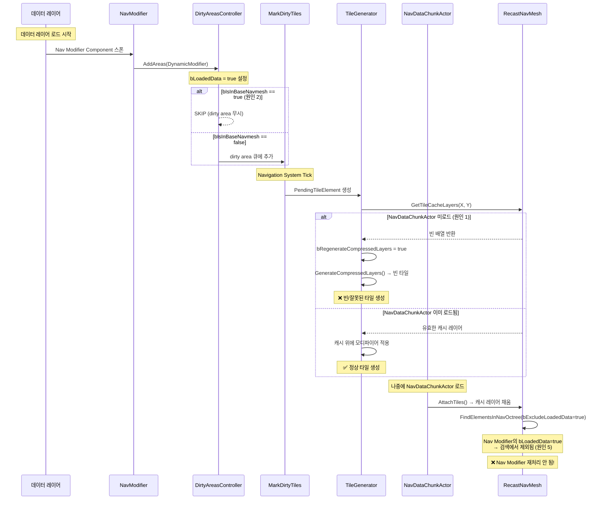

# DynamicModifiersOnly 쿠킹 빌드 Nav Modifier 미동작 — 소스 코드 심층 분석

> **작성일**: 2026-02-15
> **엔진 버전**: UE 5.7
> **관련 이슈**: [#9](https://github.com/jiy12345/UE5TestProject/issues/9)

---

## 개요

이 문서는 **DynamicModifiersOnly 모드에서 데이터 레이어에 속한 Nav Modifier가 PIE에서는 동작하지만 쿠킹 빌드에서는 동작하지 않는 문제**의 원인을 엔진 소스 코드 레벨에서 심층 분석한 결과입니다.

4가지 주요 코드 경로를 병렬 분석하여 **5가지 잠재 원인**을 도출했으며, 특히 **원인 5 (bExcludeLoadedData 필터)** 는 이전 분석에서 발견하지 못한 새로운 원인입니다.

---

## 1. 핵심 코드 흐름 요약

### 1.1 Nav Modifier 등록 → Dirty Area 생성 체인

```
NavModifierComponent::OnRegister()
  └→ FNavigationSystem::OnComponentRegistered()
      └→ RegisterElementWithNavOctree()
          ├→ FNavigationDirtyElement 생성
          │   ├ bIsFromVisibilityChange = Level->HasVisibilityChangeRequestPending()
          │   └ bIsInBaseNavmesh = IsInBaseNavmesh(Actor)
          └→ PendingUpdates에 추가
              └→ ProcessPendingOctreeUpdates() → AddElementToNavOctree()
                  ├→ GetDirtyFlag(): HasDynamicModifiers() → Modifiers.IsDynamic()
                  │   └ IsDynamic() = !Areas.IsEmpty() || !SimpleLinks.IsEmpty() || !CustomLinks.IsEmpty()
                  │   └ NavModifierComponent → Areas 있음 → DynamicModifier 플래그 ✓
                  ├→ bLoadedData = bIsFromVisibilityChange  ← ★ 중요
                  └→ DirtyAreasController::AddAreas()
                      └ 필터링 로직 (아래 2.1 참조)
```

**소스 파일**: `NavigationDataHandler.cpp:81-246`

### 1.2 Dirty Area 필터링 게이트

```
DirtyAreasController::AddAreas()
  │
  ├─ GATE 1: WP Dynamic Mode 필터
  │   bUseWorldPartitionedDynamicMode == true
  │   && bIsFromVisibilityChange == true    (레벨 로딩/언로딩)
  │   && bIsInBaseNavmesh == true           (BaseNavmeshDataLayers에 포함)
  │   → SKIP (dirty area 무시)
  │
  ├─ GATE 2: ShouldSkipObjectPredicate 커스텀 필터
  │   → 외부 바인딩된 조건자 매칭 시 SKIP
  │
  ├─ GATE 3: Bounds 유효성
  │   → IsValid == false 또는 IsNearlyZero() → SKIP
  │
  └─ GATE 4: Accumulation Lock
      bCanAccumulateDirtyAreas == false → SKIP (silent drop!)
```

**소스 파일**: `NavigationDirtyAreasController.cpp:138-274`

### 1.3 Dirty Area → 타일 리빌드 체인

```
MarkDirtyTiles() [RecastNavMeshGenerator.cpp:6549-6820]
  │
  ├─ 필터: bGameStaticNavMesh && !DynamicModifier → SKIP
  │   (DynamicModifiersOnly에서는 DynamicModifier 플래그 필수)
  │
  └→ PendingTileElement 생성 (bRebuildGeometry = false for GameStaticNavMesh)
      └→ CreateTileGenerator() → FRecastTileGenerator::Setup()
          │
          ├─ DirtyAreas.Num() > 0 → bGeometryChanged = false
          ├─ CompressedLayers = GetTileCacheLayers(TileX, TileY)
          ├─ bRegenerateCompressedLayers = (CompressedLayers.Num() == 0)  ← ★
          │
          └→ GenerateTile()
              ├─ if bRegenerateCompressedLayers:
              │   └ GenerateCompressedLayers() → 지오메트리 없음 → 빈 타일 (but returns true!)
              └─ GenerateNavigationData() → CompressedLayers 비어있으면 빈 결과
```

**소스 파일**: `RecastNavMeshGenerator.cpp:1800-1856, 2680-2726, 3706-3813`

### 1.4 NavDataChunkActor 타일 스트리밍 체인

```
NavigationDataChunkActor::BeginPlay()
  └→ AddNavigationDataChunkToWorld()
      └→ UNavigationSystemV1::AddNavigationDataChunk()
          └→ ARecastNavMesh::OnStreamingNavDataAdded()
              │
              ├─ Step 1: AttachNavMeshDataChunk()
              │   └ AttachTiles(): 타일 mesh + CompressedTileCacheLayers 추가
              │     └ AddTileCacheLayer(X, Y, Layer, Data)  ← 타일 캐시 채움
              │
              └─ Step 2: (WP Dynamic Only) 기존 Nav 옥트리 요소 재처리
                  Filter.bExcludeLoadedData = true  ← ★★★ 핵심
                  FindElementsInNavOctree(Bounds, Filter)
                  → bLoadedData == true인 요소는 제외됨
                  → 각 요소에 대해 AddDirtyArea(ENavigationDirtyFlag::All)
```

**소스 파일**: `RecastNavMesh.cpp:3188-3231, NavigationDataChunkActor.cpp:102-125`

---

## 2. 원인 분석

### 원인 1: CompressedTileCacheLayers 로딩 순서 문제 (유력)

**핵심 소스**: `RecastNavMeshGenerator.cpp:1800-1815`

```cpp
const bool bGeometryChanged = (DirtyAreas.Num() == 0);
if (!bGeometryChanged)
{
    CompressedLayers = ParentGenerator.GetOwner()->GetTileCacheLayers(TileX, TileY);
}
bRegenerateCompressedLayers = (bGeometryChanged || TileConfig.bGenerateLinks || CompressedLayers.Num() == 0);
```

**문제 시나리오**:
1. Nav Modifier dirty area가 처리될 때 NavDataChunkActor가 아직 미로드
2. `GetTileCacheLayers()` → 빈 배열 반환 (`CompressedTileCacheLayers` 맵에 엔트리 없음)
3. `bRegenerateCompressedLayers = true` (CompressedLayers.Num() == 0)
4. `GenerateCompressedLayers()` 호출 → 지오메트리 없음 (SkipNavGeometry 모드) → `SolidHF->pools == 0`
5. **빈 타일이지만 `true` 반환** (Line 3723: `return true; // empty tile`)
6. 결과: 빈 타일이 네비메시에 추가됨

**PIE에서 동작하는 이유**: 에디터에서 네비메시가 이미 완전 빌드됨 → CompressedTileCacheLayers가 항상 존재

---

### 원인 2: WP Dynamic Mode의 BaseNavmeshDataLayers 필터링

**핵심 소스**: `NavigationDirtyAreasController.cpp:158-180`

```cpp
if (bUseWorldPartitionedDynamicMode)
{
    if (const bool bIsFromVisibilityChange = ...)
    {
        if (const bool bIsIncludedInBaseNavmesh = ...)
        {
            return;  // ← dirty area 무시!
        }
    }
}
```

**문제 시나리오**:
- Nav Modifier의 데이터 레이어가 `WorldSettings->BaseNavmeshDataLayers`에 포함됨
- 데이터 레이어 로드 = visibility change → `bIsFromVisibilityChange = true`
- BaseNavmeshDataLayers에 포함 → `bIsInBaseNavmesh = true`
- 두 조건 모두 true → **dirty area가 완전히 무시됨**

**IsInBaseNavmesh() 로직** (`NavigationTypes.cpp:50-77`):
```cpp
bool IsInBaseNavmesh(const UObject* Object)
{
    if (!Actor->HasDataLayers()) return true;  // 데이터 레이어 없으면 항상 base
    for (const auto& DataLayer : WorldSettings->BaseNavmeshDataLayers)
    {
        if (Actor->ContainsDataLayer(DataLayer)) return true;  // 매칭되면 base
    }
    return false;  // 비매칭 → base 아님
}
```

**검증 방법**: World Settings에서 BaseNavmeshDataLayers 배열을 확인하면 즉시 판단 가능

---

### 원인 3: Dirty Flag 타입 문제

**핵심 소스**: `NavigationRelevantData.h:135-150`

```cpp
inline ENavigationDirtyFlag GetDirtyFlag() const
{
    const bool bSetGeometryFlag = HasGeometry() || IsPendingLazyGeometryGathering() ||
        Modifiers.GetFillCollisionUnderneathForNavmesh() ||
        Modifiers.GetMaskFillCollisionUnderneathForNavmesh() ||
        (Modifiers.GetNavMeshResolution() != ENavigationDataResolution::Invalid);

    return (bSetGeometryFlag ? ENavigationDirtyFlag::Geometry : None)
        | (HasDynamicModifiers() ? ENavigationDirtyFlag::DynamicModifier : None)
        | (Modifiers.HasAgentHeightAdjust() ? ENavigationDirtyFlag::UseAgentHeight : None);
}
```

**`IsDynamic()` 구현** (`NavigationModifier.h:304-308`):
```cpp
inline bool IsDynamic() const
{
    return !Areas.IsEmpty() || !SimpleLinks.IsEmpty() || !CustomLinks.IsEmpty();
}
```

NavModifierComponent는 `Areas`에 area modifier를 추가하므로 `IsDynamic() == true` → `DynamicModifier` 플래그가 정상 설정됨.

**다만**, `NavMeshResolution != Invalid`이면 `Geometry` 플래그도 추가됨. `MarkDirtyTiles()` 필터는 `DynamicModifier` 플래그만 확인하므로 통과하지만, 이후 처리에서 문제가 될 수 있음.

**위험 속성**:
| 속성 | true일 때 | 영향 |
|------|-----------|------|
| `FillCollisionUnderneathForNavmesh` | Geometry 플래그 추가 | ⚠️ |
| `MaskFillCollisionUnderneathForNavmesh` | Geometry 플래그 추가 | ⚠️ |
| `NavMeshResolution != Invalid` | Geometry 플래그 추가 | ⚠️ |

---

### 원인 4: AttachTiles 소유권 이전 타이밍

**핵심 소스**: `RecastNavMeshDataChunk.cpp:203-345`

게임 월드에서:
```cpp
const bool bKeepCopyOfData = !bIsGameWorld;       // false → 소유권 이전
const bool bKeepCopyOfCacheData = !bIsGameWorld;   // false → 소유권 이전
```

AttachTiles 후 TileCacheRawData는 null이 됨:
```cpp
if (bKeepCopyOfCacheData == false)
{
    TileData.TileCacheDataSize = 0;
    TileData.TileCacheRawData->RawData = nullptr;  // ← 소유권 이전 후 null
}
```

DetachTiles에서 `bTakeCacheDataOwnership = true`로 소유권을 돌려받을 수 있으나, 언로드→재로드 시 타이밍 이슈 가능.

---

### ★ 원인 5 (신규): bExcludeLoadedData 필터에 의한 재처리 누락

**이번 분석에서 새로 발견된 원인으로, 원인 1과 결합하면 가장 유력한 버그 시나리오를 구성합니다.**

**핵심 소스**:
- `NavigationDataHandler.cpp:168-172` — bLoadedData 설정
- `RecastNavMesh.cpp:3210` — bExcludeLoadedData 필터
- `NavigationTypes.cpp:247` — IsMatchingFilter에서 bLoadedData 체크

#### bLoadedData 설정 시점

```cpp
// NavigationDataHandler.cpp:168-172
if (DirtyAreasController.bUseWorldPartitionedDynamicMode)
{
    OctreeElement.Data->bLoadedData = DirtyElement.bIsFromVisibilityChange
                                    || NavigationElement.IsFromLevelVisibilityChange();
}
```

데이터 레이어로 로드된 Nav Modifier는 **항상 `bLoadedData = true`** 가 됨 (레벨 로딩 = visibility change).

#### OnStreamingNavDataAdded의 필터

```cpp
// RecastNavMesh.cpp:3208-3210
FNavigationOctreeFilter Filter;
Filter.bIncludeGeometry = true;
Filter.bExcludeLoadedData = true;  // ← bLoadedData == true인 요소 제외!
```

```cpp
// NavigationTypes.cpp:245-250
bool FNavigationRelevantData::IsMatchingFilter(const FNavigationRelevantDataFilter& Filter) const
{
    if (Filter.bExcludeLoadedData && bLoadedData)
    {
        return false;  // ← 필터 매칭 실패 → 검색 결과에서 제외
    }
    // ...
}
```

#### 버그 시나리오 (원인 1 + 원인 5 결합)

```
[Frame N] 데이터 레이어 로드 → Nav Modifier 등록
  ├─ bLoadedData = true (레벨 visibility change)
  ├─ bIsFromVisibilityChange = true
  ├─ bIsInBaseNavmesh = false (base 아닌 데이터 레이어)
  └─ dirty area 생성 ✓ (원인 2 필터 통과)

[Frame N ~ N+1] dirty area 처리 (MarkDirtyTiles → 타일 생성)
  ├─ GetTileCacheLayers() → 빈 배열 (NavDataChunkActor 미로드)
  ├─ bRegenerateCompressedLayers = true
  ├─ GenerateCompressedLayers() → 지오메트리 없음 → 빈 타일
  └─ 결과: 빈/잘못된 타일이 네비메시에 추가됨 ❌

[Frame N+1 ~ M] NavigationDataChunkActor 로드
  ├─ AttachTiles() → CompressedTileCacheLayers 채움 ✓
  └─ OnStreamingNavDataAdded() → FindElementsInNavOctree()
      ├─ Filter.bExcludeLoadedData = true
      ├─ Nav Modifier의 bLoadedData = true
      └─ 검색 결과에서 제외됨 → AddDirtyArea 호출 안 됨 ❌
         ↑ Nav Modifier가 재처리되지 않음!

[결과] Nav Modifier 효과가 네비메시에 반영되지 않음
```

**PIE에서 동작하는 이유**:
- PIE에서는 에디터가 이미 CompressedTileCacheLayers를 완전히 빌드한 상태
- 모든 타일 캐시가 처음부터 존재 → `GetTileCacheLayers()`가 항상 유효한 데이터 반환
- 따라서 `bRegenerateCompressedLayers = false` → 기존 캐시 레이어 위에 모디파이어 적용 ✓

---

## 3. 원인별 확률 및 우선순위 평가

| # | 원인 | 확률 | 검증 난이도 | 비고 |
|---|------|------|-------------|------|
| **5** | bExcludeLoadedData 필터 + 타이밍 | **★★★★★** | 중 (로그 추가) | 원인 1과 결합 시 가장 유력 |
| **1** | CompressedTileCacheLayers 타이밍 | **★★★★** | 중 (엔진 수정) | 원인 5의 전제 조건 |
| **2** | BaseNavmeshDataLayers 필터 | **★★★** | 하 (에디터 확인) | 설정에 따라 즉시 확인 가능 |
| **3** | Dirty Flag 타입 문제 | **★★** | 하 (에디터 확인) | NavModifier는 정상적으로 DynamicModifier 설정 |
| **4** | AttachTiles 소유권 이전 | **★** | 상 (복잡 시나리오) | 단순 로드/언로드에서는 문제 없을 가능성 |

---

## 4. 전체 코드 흐름 다이어그램



---

## 5. 검증 계획

### 5.1 최우선: 원인 2 확인 (에디터에서 즉시 가능)

World Settings → Navigation → **Base Navmesh Data Layers** 배열에서 해당 Nav Modifier의 데이터 레이어가 포함되어 있는지 확인.

### 5.2 원인 5 + 1 검증 (로그 추가)

#### 로그 포인트 A: bLoadedData 설정 확인
```cpp
// NavigationDataHandler.cpp:171 이후
UE_LOG(LogNavigation, Warning, TEXT("[NavDebug] OctreeElement bLoadedData=%d, "
    "bIsFromVisibilityChange=%d, IsFromLevelVisibilityChange=%d, Element=%s"),
    OctreeElement.Data->bLoadedData,
    DirtyElement.bIsFromVisibilityChange,
    NavigationElement.IsFromLevelVisibilityChange(),
    *NavigationElement.GetPathName());
```

#### 로그 포인트 B: FindElementsInNavOctree 결과 확인
```cpp
// RecastNavMesh.cpp:3213 이후
UE_LOG(LogNavigation, Warning, TEXT("[NavDebug] OnStreamingNavDataAdded: "
    "Found %d non-loaded elements in bounds. ChunkActor=%s"),
    NavElements.Num(), *InActor.GetName());
```

#### 로그 포인트 C: CompressedTileCacheLayers 확인
```cpp
// RecastNavMeshGenerator.cpp:1808 이후
if (!bGeometryChanged && CompressedLayers.Num() == 0)
{
    UE_LOG(LogNavigation, Error, TEXT("[NavDebug] Tile(%d,%d) PROBLEM: "
        "Modifier-only rebuild but CompressedLayers is EMPTY!"),
        TileX, TileY);
}
```

### 5.3 판단 기준

| 로그 결과 | 원인 판단 |
|-----------|-----------|
| 로그 A에서 Nav Modifier의 `bLoadedData=true` | 원인 5의 전제 조건 확인 |
| 로그 B에서 `Found 0 non-loaded elements` | **원인 5 확정** — Nav Modifier가 재처리 대상에서 제외됨 |
| 로그 C에서 `CompressedLayers is EMPTY` | **원인 1 확정** — 타일 캐시 미로드 상태에서 리빌드 |
| 로그 B + C 모두 해당 | **원인 1+5 결합** — 가장 유력한 시나리오 |

---

## 6. 해결 방안 (검증 후)

### 방안 A: OnStreamingNavDataAdded에서 bExcludeLoadedData 필터 수정

비-base navmesh 데이터 레이어의 loaded 요소도 재처리하도록 필터 조건 변경:

```cpp
// RecastNavMesh.cpp:3208-3210 수정 제안
FNavigationOctreeFilter Filter;
Filter.bIncludeGeometry = true;
// Filter.bExcludeLoadedData = true;  // 기존: loaded 데이터 제외
Filter.bExcludeLoadedData = false;     // 수정: loaded 데이터 포함
// 대신 IsInBaseNavigationData()로 base navmesh만 제외
```

### 방안 B: AttachTiles 후 해당 영역의 모든 modifier dirty area 재생성

```cpp
// OnStreamingNavDataAdded에서 AttachTiles 후:
// bLoadedData 상관없이 해당 영역의 모든 dynamic modifier를 재처리
FNavigationOctreeFilter Filter;
Filter.bIncludeAreas = true;  // area modifier 포함
// bExcludeLoadedData를 설정하지 않음
```

### 방안 C: TileGenerator에서 CompressedLayers 비어있을 때 지연 처리

```cpp
// RecastNavMeshGenerator.cpp - Setup() 수정
if (!bGeometryChanged && CompressedLayers.Num() == 0)
{
    // 타일 캐시가 아직 로드되지 않음 → 타일 생성 지연
    bShouldDeferTileGeneration = true;
    return;  // 나중에 타일 캐시 로드 후 재시도
}
```

---

## 7. 관련 소스 파일 전체 목록

| 파일 | 핵심 라인 | 역할 |
|------|-----------|------|
| `NavigationDirtyAreasController.cpp` | 138-274 | AddAreas() — dirty area 필터링 전체 |
| `NavigationDirtyAreasController.h` | 36-37 | bUseWorldPartitionedDynamicMode 플래그 |
| `NavigationDirtyElement.h` | 12-71 | bIsFromVisibilityChange, bIsInBaseNavmesh |
| `NavigationDirtyElement.cpp` | 8-28 | FNavigationDirtyElement 생성자 |
| `NavigationElement.h` | 305-390 | bIsInBaseNavigationData, bIsFromLevelVisibilityChange |
| `NavigationElement.cpp` | 32-50 | FNavigationElement 생성자 (플래그 초기화) |
| `NavigationTypes.cpp` | 29-77 | IsLevelVisibilityChanging(), IsInBaseNavmesh() |
| `NavigationTypes.cpp` | 245-250 | IsMatchingFilter() — bExcludeLoadedData 체크 |
| `NavigationRelevantData.h` | 94, 135-150 | bLoadedData, GetDirtyFlag() |
| `NavigationModifier.h` | 304-308 | IsDynamic() |
| `NavigationDataHandler.cpp` | 81-246, 168-172 | 옥트리 등록, bLoadedData 설정 |
| `RecastNavMeshGenerator.cpp` | 1800-1856 | Setup() — CompressedLayers 조회 |
| `RecastNavMeshGenerator.cpp` | 2680-2726 | GenerateTile() |
| `RecastNavMeshGenerator.cpp` | 3706-3813 | GenerateCompressedLayers() |
| `RecastNavMeshGenerator.cpp` | 5105-5108 | IsGameStaticNavMesh() |
| `RecastNavMeshGenerator.cpp` | 6549-6820 | MarkDirtyTiles() — DynamicModifier 필터 |
| `RecastNavMeshGenerator.cpp` | 6686-6715 | PendingTileElement 생성 |
| `RecastNavMesh.cpp` | 3188-3231 | OnStreamingNavDataAdded() |
| `RecastNavMesh.cpp` | 3233-3247 | OnStreamingNavDataRemoved() |
| `RecastNavMesh.cpp` | 3263-3271 | AttachNavMeshDataChunk() |
| `RecastNavMeshDataChunk.cpp` | 96-199 | Serialize/SerializeRecastData |
| `RecastNavMeshDataChunk.cpp` | 203-345 | AttachTiles() |
| `RecastNavMeshDataChunk.cpp` | 359-458 | DetachTiles() |
| `PImplRecastNavMesh.cpp` | 3620-3636 | AddTileCacheLayer() |
| `PImplRecastNavMesh.cpp` | 3658-3661 | GetTileCacheLayers() |
| `NavigationDataChunkActor.cpp` | 102-125 | BeginPlay/AddNavigationDataChunkToWorld |
| `NavigationSystem.cpp` | 1189-1201 | SkipNavGeometry/StoreNavGeometry 설정 |
| `NavigationSystem.cpp` | 1478-1491 | bUseWorldPartitionedDynamicMode 설정 |
| `NavModifierComponent.cpp` | 239-247 | GetNavigationData() — area modifier 추가 |

---

## 8. PIE vs 쿠킹 빌드 차이 요약

| 항목 | PIE | 쿠킹 빌드 |
|------|-----|-----------|
| CompressedTileCacheLayers | 에디터 빌드 시 이미 채워짐 | NavDataChunkActor 로드 후 채워짐 |
| IsGameWorld() | true (PIE도 게임 월드) | true |
| 타일 데이터 소유권 | 복사본 유지 (bKeepCopy=true) | 이전 (bKeepCopy=false) |
| Nav Modifier 로드 타이밍 | 에디터에서 즉시 등록 | 데이터 레이어 활성화 시 스트리밍 |
| NavDataChunk 로드 타이밍 | 에디터에서 즉시 가용 | 스트리밍 셀에 따라 지연 가능 |
| bLoadedData | 적용됨 | 적용됨 |
| 네비메시 초기 상태 | 에디터 빌드 결과 (완전) | 쿠킹 데이터 (스트리밍) |
