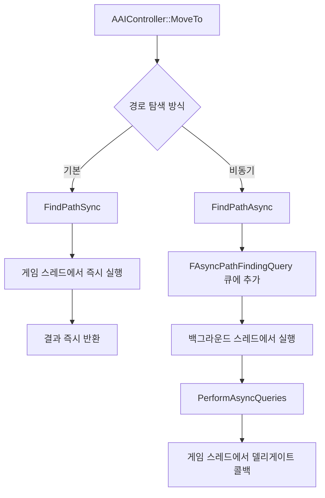

# 01. 길찾기 파이프라인 전체 조감도

> **작성일**: 2026-04-16
> **엔진 버전**: UE 5.5

## 1. 전체 흐름

AI가 목적지로 이동할 때, 내부적으로 다음 3단계를 거칩니다:

1. **경로 요청** — `AAIController::MoveTo()` → `UNavigationSystemV1::FindPathSync()`
2. **경로 탐색** — `FPImplRecastNavMesh::FindPath()` → Detour A* → Funnel 알고리즘
3. **경로 추적** — `UPathFollowingComponent::FollowPathSegment()` (프레임별 이동)

```
AAIController::MoveToLocation()
    │
    ▼
AAIController::MoveTo()                           ← 이동 요청 검증 및 오케스트레이션
    ├── BuildPathfindingQuery()                    ← FPathFindingQuery 생성
    ├── FindPathForMoveRequest()                   ← NavigationSystem에 경로 탐색 위임
    │       │
    │       ▼
    │   UNavigationSystemV1::FindPathSync()        ← 동기 경로 탐색 진입점
    │       │
    │       ▼
    │   ARecastNavMesh::FindPath()                 ← NavData 가상 함수 호출
    │       │
    │       ▼
    │   FPImplRecastNavMesh::FindPath()            ← Detour 브릿지
    │       ├── dtNavMeshQuery::findPath()         ← [Detour] A* 탐색 → 폴리곤 코리더
    │       └── PostProcessPathInternal()
    │               └── findStraightPath()         ← [Detour] 퍼널 알고리즘 → 웨이포인트
    │
    └── UPathFollowingComponent::RequestMove()     ← 경로 수락 및 추적 시작
            │
            ▼
        FollowPathSegment() (매 프레임)             ← 웨이포인트 따라 이동
            ├── RequestPathMove() / RequestDirectMove()
            └── 도착 판정 → OnPathFinished()
```

> **소스 확인 위치**
> - `AAIController::MoveToLocation()`: `Engine/Source/Runtime/AIModule/Private/AIController.cpp:593`
> - `AAIController::MoveTo()`: `AIController.cpp:645`
> - `UNavigationSystemV1::FindPathSync()`: `Engine/Source/Runtime/NavigationSystem/Private/NavigationSystem.cpp:1833`
> - `FPImplRecastNavMesh::FindPath()`: `Engine/Source/Runtime/NavigationSystem/Private/NavMesh/PImplRecastNavMesh.cpp:1173`
> - `dtNavMeshQuery::findPath()`: `Engine/Source/Runtime/Navmesh/Private/Detour/DetourNavMeshQuery.cpp:1578`
> - `UPathFollowingComponent::RequestMove()`: `Engine/Source/Runtime/AIModule/Private/Navigation/PathFollowingComponent.cpp:351`

---

## 2. 레이어 구조

길찾기 시스템은 3개의 레이어로 구성됩니다:

```
┌──────────────────────────────────────────────────────────┐
│                   게임플레이 레이어                         │
│                                                          │
│  AAIController          FAIMoveRequest                   │
│  └── MoveTo()           (목적지, 수락 반경, 필터 등)       │
│                                                          │
├──────────────────────────────────────────────────────────┤
│                   UE 네비게이션 레이어                      │
│                                                          │
│  UNavigationSystemV1    FPathFindingQuery                │
│  ├── FindPathSync()     (시작점, 끝점, NavData, 필터)     │
│  └── FindPathAsync()                                     │
│                                                          │
│  FPImplRecastNavMesh    FNavMeshPath                     │
│  └── FindPath()         (PathCorridor + PathPoints)      │
│                                                          │
│  UPathFollowingComponent                                 │
│  └── FollowPathSegment()                                 │
│                                                          │
├──────────────────────────────────────────────────────────┤
│                 Detour 라이브러리 레이어                    │
│                                                          │
│  dtNavMeshQuery                                          │
│  ├── findPath()           → A* 탐색 (폴리곤 코리더)       │
│  └── findStraightPath()   → 퍼널 알고리즘 (웨이포인트)     │
│                                                          │
│  dtNavMesh / dtNodePool / dtNodeQueue                    │
│  (NavMesh 데이터)  (노드 풀)    (우선순위 큐)              │
└──────────────────────────────────────────────────────────┘
```

---

## 3. 핵심 데이터 구조

### 3.1 경로 요청

| 구조체 | 위치 | 역할 |
|--------|------|------|
| `FAIMoveRequest` | `AITypes.h` | 이동 요청 파라미터 (목적지, 수락 반경, 필터 등) |
| `FPathFindingQuery` | `NavigationSystemTypes.h:61` | NavigationSystem에 전달되는 쿼리 (시작/끝 위치, NavData, 필터) |
| `FNavPathSharedPtr` | `NavigationSystemTypes.h:34` | `TSharedPtr<FNavigationPath, ESPMode::ThreadSafe>` |

### 3.2 경로 결과

| 구조체 | 위치 | 역할 |
|--------|------|------|
| `FNavMeshPath` | `NavMeshPath.h` | 최종 경로 데이터. `PathCorridor`(폴리곤 시퀀스) + `PathPoints`(웨이포인트) |
| `FNavPathPoint` | `NavigationData.h` | 위치(`FVector`) + 폴리곤 참조(`NavNodeRef`) 쌍 |
| `dtQueryResult` | Detour 내부 | `findPath()` 결과. 폴리곤 ID 배열(코리더) |

### 3.3 경로 추적

| 구조체 | 위치 | 역할 |
|--------|------|------|
| `EPathFollowingStatus` | `PathFollowingComponent.h` | 상태 머신: `Idle` → `Waiting` → `Moving` → `Paused` |
| `FPathFollowingResult` | `PathFollowingComponent.h` | 이동 결과 (성공/실패/중단 + 원인) |

---

## 4. 동기 vs 비동기 경로 탐색



- **동기** (`FindPathSync`): 호출 스레드에서 즉시 `ARecastNavMesh::FindPath()` 실행. `MoveTo()` 기본 동작.
- **비동기** (`FindPathAsync`): QueryID를 즉시 반환하고, 백그라운드 스레드에서 탐색 후 델리게이트로 결과 전달.

> **소스 확인 위치**
> - `FindPathSync()`: `NavigationSystem.cpp:1833` — `Query.NavData->FindPath()` 호출
> - `FindPathAsync()`: `NavigationSystem.cpp:1917` — `AsyncPathFindingQueries` 큐에 추가
> - `PerformAsyncQueries()`: `NavigationSystem.cpp:1999` — 백그라운드 스레드에서 실행

---

## 5. 경로 탐색의 2단계

Detour의 경로 탐색은 2단계로 나뉩니다:

### 5.1 Stage 1: A* 탐색 — 폴리곤 코리더 생성

`dtNavMeshQuery::findPath()`가 NavMesh 폴리곤 그래프에서 A* 탐색을 수행하여
시작 폴리곤부터 목표 폴리곤까지의 **폴리곤 시퀀스(코리더)**를 생성합니다.

```
시작 ──── [Poly A] ── [Poly B] ── [Poly C] ── [Poly D] ──── 목표
                    폴리곤 코리더 (Polygon Corridor)
```

이 단계의 결과는 "어떤 폴리곤을 순서대로 통과해야 하는가"입니다.

### 5.2 Stage 2: 퍼널 알고리즘 — 웨이포인트 생성

`findStraightPath()`가 폴리곤 코리더를 입력받아 **퍼널(Funnel) 알고리즘**(Simple Stupid Funnel Algorithm)으로
실제 이동할 **웨이포인트** 목록을 생성합니다.

```
시작 ─────*────────────*──────── 목표
          ↑            ↑
       웨이포인트    웨이포인트
  (방향 전환이 필요한 꼭짓점만 남김)
```

이 단계의 결과는 "어떤 좌표를 순서대로 이동해야 하는가"입니다.

> **소스 확인 위치**
> - Stage 1: `DetourNavMeshQuery.cpp:1578` — `findPath()` (A* 메인 루프)
> - Stage 2: `DetourNavMeshQuery.cpp:2538` — `findStraightPath()` (퍼널 알고리즘)
> - UE에서의 호출: `PImplRecastNavMesh.cpp:1173` — `FindPath()`에서 Stage 1 호출, `:1218` — `PostProcessPathInternal()`에서 Stage 2 호출

---

## 6. 문서 안내

| 관심 주제 | 문서 |
|-----------|------|
| A* 알고리즘의 구체적 구현 (노드 풀, 비용 함수, 휴리스틱) | [02-detour-a-star.md](02-detour-a-star.md) |
| 퍼널 알고리즘으로 직선 경로 생성하는 원리 | [03-funnel-algorithm.md](03-funnel-algorithm.md) |
| UE가 Detour를 래핑하는 방식과 비동기 처리 | [04-ue-pathfinding-pipeline.md](04-ue-pathfinding-pipeline.md) |
| AI가 경로를 따라 이동하는 메커니즘 | [05-path-following.md](05-path-following.md) |
| 경로 무효화 및 자동 재탐색 | [06-path-invalidation.md](06-path-invalidation.md) |
| 디버그 시각화로 직접 확인하는 실습 | [07-practical-guide.md](07-practical-guide.md) |
