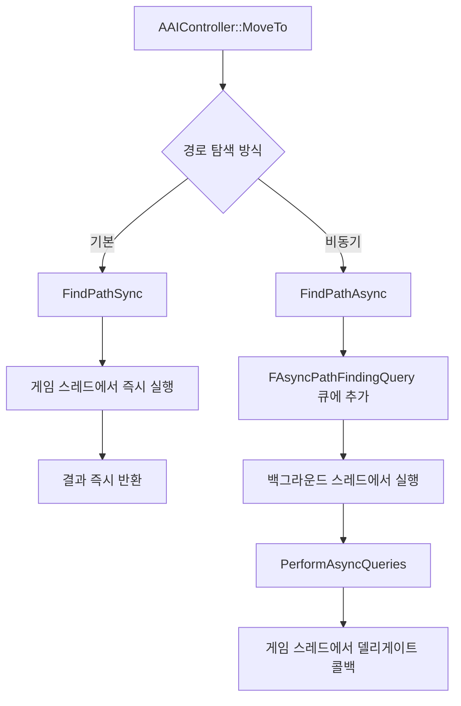

# 01. 길찾기 파이프라인 전체 조감도

> **작성일**: 2026-04-16
> **엔진 버전**: UE 5.5

## 1. 전체 흐름

AI가 목적지로 이동할 때, 내부적으로 다음 3단계를 거칩니다:

1. **경로 요청** — `AAIController::MoveTo()` → `UNavigationSystemV1::FindPathSync()`
2. **경로 탐색** — `FPImplRecastNavMesh::FindPath()` → Detour A* → Funnel 알고리즘
3. **경로 추적** — `UPathFollowingComponent::FollowPathSegment()` (프레임별 이동)

```
AAIController::MoveToLocation()
    │
    ▼
AAIController::MoveTo()                           ← 이동 요청 검증 및 오케스트레이션
    ├── BuildPathfindingQuery()                    ← FPathFindingQuery 생성
    ├── FindPathForMoveRequest()                   ← NavigationSystem에 경로 탐색 위임
    │       │
    │       ▼
    │   UNavigationSystemV1::FindPathSync()        ← 동기 경로 탐색 진입점
    │       │
    │       ▼
    │   ARecastNavMesh::FindPath()                 ← NavData 가상 함수 호출
    │       │
    │       ▼
    │   FPImplRecastNavMesh::FindPath()            ← Detour 브릿지
    │       ├── dtNavMeshQuery::findPath()         ← [Detour] A* 탐색 → 폴리곤 코리더
    │       └── PostProcessPathInternal()
    │               └── findStraightPath()         ← [Detour] 퍼널 알고리즘 → 웨이포인트
    │
    └── UPathFollowingComponent::RequestMove()     ← 경로 수락 및 추적 시작
            │
            ▼
        FollowPathSegment() (매 프레임)             ← 웨이포인트 따라 이동
            ├── RequestPathMove() / RequestDirectMove()
            └── 도착 판정 → OnPathFinished()
```

> **소스 확인 위치**
> - `AAIController::MoveToLocation()`: `Engine/Source/Runtime/AIModule/Private/AIController.cpp:593`
> - `AAIController::MoveTo()`: `AIController.cpp:645`
> - `UNavigationSystemV1::FindPathSync()`: `Engine/Source/Runtime/NavigationSystem/Private/NavigationSystem.cpp:1833`
> - `FPImplRecastNavMesh::FindPath()`: `Engine/Source/Runtime/NavigationSystem/Private/NavMesh/PImplRecastNavMesh.cpp:1173`
> - `dtNavMeshQuery::findPath()`: `Engine/Source/Runtime/Navmesh/Private/Detour/DetourNavMeshQuery.cpp:1578`
> - `UPathFollowingComponent::RequestMove()`: `Engine/Source/Runtime/AIModule/Private/Navigation/PathFollowingComponent.cpp:351`

### 1.1 용어 정리

문서 전체에서 자주 등장하는 핵심 용어를 먼저 정리합니다.

| 용어 | 의미 |
|------|------|
| **동기(Synchronous) 경로 탐색** | 함수가 경로 탐색이 **끝날 때까지 리턴하지 않는** 방식. 호출자가 그 결과를 즉시 받아서 사용. "데이터 동기화(sync)"와는 무관한, 프로그래밍의 동기/비동기 실행(synchronous/asynchronous execution) 개념. |
| **비동기(Asynchronous) 경로 탐색** | 함수가 **즉시 리턴**하고, 탐색은 백그라운드에서 진행됨. 완료되면 콜백(델리게이트)으로 결과를 받음. |
| **코리더(Corridor)** | 영어 **"복도/통로"**의 음차. 충돌체(collider)와는 전혀 다른 단어임. A* 탐색 결과로 나오는 **폴리곤의 연속된 시퀀스**를 뜻함. 시작 폴리곤부터 목표 폴리곤까지 이어지는 "통과해야 할 폴리곤들의 복도"라는 의미. |
| **퍼널(Funnel) 알고리즘** | 영어 **"깔때기"**. 폴리곤 코리더를 최단 직선 경로로 바꿔주는 후처리 알고리즘. 시작점에서 보는 시야각을 "깔때기"처럼 점점 좁혀가며, 방향을 꺾어야 하는 꼭짓점만 웨이포인트로 뽑아냄. 자세한 원리는 [03-funnel-algorithm.md](03-funnel-algorithm.md) 참고. |
| **웨이포인트(Waypoint)** | AI가 실제로 이동할 **경유 좌표** 목록. 퍼널 알고리즘이 생성한 최종 경로. |

---

## 2. 레이어 구조

길찾기 시스템은 3개의 레이어로 구성됩니다:

```
┌──────────────────────────────────────────────────────────┐
│                   게임플레이 레이어                         │
│                                                          │
│  AAIController          FAIMoveRequest                   │
│  └── MoveTo()           (목적지, 수락 반경, 필터 등)       │
│                                                          │
├──────────────────────────────────────────────────────────┤
│                   UE 네비게이션 레이어                      │
│                                                          │
│  UNavigationSystemV1    FPathFindingQuery                │
│  ├── FindPathSync()     (시작점, 끝점, NavData, 필터)     │
│  └── FindPathAsync()                                     │
│                                                          │
│  FPImplRecastNavMesh    FNavMeshPath                     │
│  └── FindPath()         (PathCorridor + PathPoints)      │
│                                                          │
│  UPathFollowingComponent                                 │
│  └── FollowPathSegment()                                 │
│                                                          │
├──────────────────────────────────────────────────────────┤
│                 Detour 라이브러리 레이어                    │
│                                                          │
│  dtNavMeshQuery                                          │
│  ├── findPath()           → A* 탐색 (폴리곤 코리더)       │
│  └── findStraightPath()   → 퍼널 알고리즘 (웨이포인트)     │
│                                                          │
│  dtNavMesh / dtNodePool / dtNodeQueue                    │
│  (NavMesh 데이터)  (노드 풀)    (우선순위 큐)              │
└──────────────────────────────────────────────────────────┘
```

---

## 3. 핵심 데이터 구조

### 3.1 경로 요청

| 구조체 | 위치 | 역할 |
|--------|------|------|
| `FAIMoveRequest` | `AITypes.h` | 이동 요청 파라미터 (목적지, 수락 반경, 필터 등) |
| `FPathFindingQuery` | `NavigationSystemTypes.h:61` | NavigationSystem에 전달되는 쿼리 (시작/끝 위치, NavData, 필터) |
| `FNavPathSharedPtr` | `NavigationSystemTypes.h:34` | `TSharedPtr<FNavigationPath, ESPMode::ThreadSafe>` |

### 3.2 경로 결과

| 구조체 | 위치 | 역할 |
|--------|------|------|
| `FNavMeshPath` | `NavMeshPath.h` | 최종 경로 데이터. `PathCorridor`(폴리곤 시퀀스) + `PathPoints`(웨이포인트) |
| `FNavPathPoint` | `NavigationData.h` | 위치(`FVector`) + 폴리곤 참조(`NavNodeRef`) 쌍 |
| `dtQueryResult` | Detour 내부 | `findPath()` 결과. 폴리곤 ID 배열(코리더) |

### 3.3 경로 추적

| 구조체 | 위치 | 역할 |
|--------|------|------|
| `EPathFollowingStatus` | `PathFollowingComponent.h` | 상태 머신: `Idle` → `Waiting` → `Moving` → `Paused` |
| `FPathFollowingResult` | `PathFollowingComponent.h` | 이동 결과 (성공/실패/중단 + 원인) |

---

## 4. 동기 vs 비동기 경로 탐색



- **동기** (`FindPathSync`): 호출 스레드에서 즉시 `ARecastNavMesh::FindPath()` 실행. `MoveTo()` 기본 동작.
- **비동기** (`FindPathAsync`): QueryID를 즉시 반환하고, 백그라운드 스레드에서 탐색 후 델리게이트로 결과 전달.

> **소스 확인 위치**
> - `FindPathSync()`: `NavigationSystem.cpp:1833` — `Query.NavData->FindPath()` 호출
> - `FindPathAsync()`: `NavigationSystem.cpp:1917` — `AsyncPathFindingQueries` 큐에 추가
> - `PerformAsyncQueries()`: `NavigationSystem.cpp:1999` — 백그라운드 스레드에서 실행

### 4.1 왜 두 가지가 존재하는가

**동기 방식의 본질적 문제**: 경로 탐색은 NavMesh 크기와 목적지 거리에 따라 수 ms~수십 ms 이상 걸릴 수 있습니다.
게임 스레드에서 블로킹 방식으로 실행되면 **프레임 드롭**이 발생할 수 있습니다.
특히 군집(다수 AI) 상황에서 한 프레임에 여러 AI가 동시에 경로 요청을 내면 누적 지연이 심각해집니다.

**비동기 방식의 해법**: 탐색을 별도 스레드에서 실행하면 게임 스레드는 블로킹되지 않으므로 프레임 예산을 지킬 수 있습니다.
단점은 결과가 **다음 틱 이후**에 도착하므로, 즉시 결과를 쓰는 코드 흐름에는 쓸 수 없습니다.

### 4.2 선택 가이드

| 상황 | 추천 | 이유 |
|------|------|------|
| AI 한두 명, 짧은 경로 | **동기** | 코드가 단순. 프레임 영향 미미 |
| AIController의 `MoveTo` (기본 케이스) | **동기** | 엔진 기본값. 내부적으로 동기 호출 후 `PathFollowingComponent`에 즉시 전달 |
| 장거리 경로 (월드 파티션 맵 전체 횡단 등) | **비동기** | 탐색 비용 큼. 블로킹 시 스파이크 발생 |
| 다수 AI 동시 경로 요청 (몹 웨이브, RTS 등) | **비동기** | 탐색을 여러 프레임에 분산하여 누적 지연 회피 |
| EQS/AI 서비스의 주기적 경로 테스트 | **비동기** | 결과가 지연돼도 무방한 백그라운드 성격 |
| 경로가 있는지 "존재 여부"만 확인 (`TestPath`) | **비동기** 권장 | 경로가 없을 때 탐색 비용이 최대치로 올라감 |

> **엔진 기본 동작**: `AAIController::MoveTo()`는 내부적으로 `FindPathSync`(동기)를 호출합니다.
> 비동기가 필요하면 `UNavigationSystemV1::FindPathAsync()`를 직접 호출하고 델리게이트로 결과를 받아 처리해야 합니다.

### 4.3 시간 프로파일 비교

```
동기(Sync):  [MoveTo ─── findPath(블로킹) ─── RequestMove] → 한 프레임 내 완료
                       ↑ 프레임 스파이크 위험

비동기(Async): [MoveTo ─── 큐 등록] → 다음 프레임들...
                                      ↓
                    [백그라운드 스레드에서 findPath]
                                      ↓
                                [델리게이트 콜백 → RequestMove]
```

---

## 5. 경로 탐색의 2단계

Detour의 경로 탐색은 2단계로 나뉩니다:

### 5.1 Stage 1: A* 탐색 — 폴리곤 코리더 생성

`dtNavMeshQuery::findPath()`가 NavMesh 폴리곤 그래프에서 A* 탐색을 수행하여
시작 폴리곤부터 목표 폴리곤까지의 **폴리곤 시퀀스(코리더)**를 생성합니다.

```
시작 ──── [Poly A] ── [Poly B] ── [Poly C] ── [Poly D] ──── 목표
                    폴리곤 코리더 (Polygon Corridor)
```

이 단계의 결과는 "어떤 폴리곤을 순서대로 통과해야 하는가"입니다.

#### A* 평가 함수: f(n) = g(n) + h(n)

A*의 각 노드(폴리곤)는 세 가지 값으로 평가됩니다. **휴리스틱과 비용 함수는 서로 다른 역할**을 하므로 구분이 중요합니다.

| 기호 | 이름 | Detour 구현 | 폴리곤 가중치가 쓰이는가? |
|------|------|-------------|-------------------------|
| **g(n)** | **비용(Cost)** — 시작점부터 이 노드까지의 누적 실제 이동 비용 | `dtVdist(pa, pb) × m_areaCost[area] + m_areaFixedCost` | ✅ **여기에 폴리곤 영역 가중치가 들어감** |
| **h(n)** | **휴리스틱(Heuristic)** — 이 노드에서 목표까지의 예상 비용 | `dtVdist(neiPos, endPos) × H_SCALE` | ❌ **순수 유클리드 거리만 사용** |
| **f(n)** | **총 평가값** = g(n) + h(n) | `cost + heuristic` (A* 우선순위 큐 정렬 기준) | — |

즉, "폴리곤 가중치가 휴리스틱 역할인가?"라는 질문에 답하면:

> **폴리곤 가중치(`m_areaCost`)는 휴리스틱이 아니라 비용 함수 `g(n)`의 구성 요소입니다.**
> 휴리스틱 `h(n)`은 현재 위치에서 목표까지의 **유클리드 거리 × H_SCALE**로만 계산되며, 영역 종류와 무관합니다.

**왜 이렇게 분리되어 있는가:**
- **g(n)**: "이미 간 길이 얼마나 비쌌는가" — 실제로 통과한 영역의 비용을 반영 (늪지대라면 비쌈)
- **h(n)**: "앞으로 얼마나 더 가야 하는가" — **어떤 영역을 통과할지 아직 모르므로** 직선거리로 낙관적 추정
- A*가 **최단 경로를 보장**하려면 h(n)이 실제 남은 비용보다 **절대 과대평가하지 않아야** 함(admissible). 그래서 h는 보수적으로 직선거리를 쓰고, H_SCALE을 0.999로 설정하여 안전 마진을 둠.

상세 비용 계산 공식과 H_SCALE 의미는 [02-detour-a-star.md](02-detour-a-star.md#33-비용-및-휴리스틱-계산) 참고.

### 5.2 Stage 2: 퍼널 알고리즘 — 웨이포인트 생성

`findStraightPath()`가 폴리곤 코리더를 입력받아 **퍼널(Funnel) 알고리즘**(Simple Stupid Funnel Algorithm)으로
실제 이동할 **웨이포인트** 목록을 생성합니다.

```
시작 ─────*────────────*──────── 목표
          ↑            ↑
       웨이포인트    웨이포인트
  (방향 전환이 필요한 꼭짓점만 남김)
```

이 단계의 결과는 "어떤 좌표를 순서대로 이동해야 하는가"입니다.

> **소스 확인 위치**
> - Stage 1: `DetourNavMeshQuery.cpp:1578` — `findPath()` (A* 메인 루프)
> - Stage 2: `DetourNavMeshQuery.cpp:2538` — `findStraightPath()` (퍼널 알고리즘)
> - UE에서의 호출: `PImplRecastNavMesh.cpp:1173` — `FindPath()`에서 Stage 1 호출, `:1218` — `PostProcessPathInternal()`에서 Stage 2 호출

---

## 6. 문서 안내

| 관심 주제 | 문서 |
|-----------|------|
| A* 알고리즘의 구체적 구현 (노드 풀, 비용 함수, 휴리스틱) | [02-detour-a-star.md](02-detour-a-star.md) |
| 퍼널 알고리즘으로 직선 경로 생성하는 원리 | [03-funnel-algorithm.md](03-funnel-algorithm.md) |
| UE가 Detour를 래핑하는 방식과 비동기 처리 | [04-ue-pathfinding-pipeline.md](04-ue-pathfinding-pipeline.md) |
| AI가 경로를 따라 이동하는 메커니즘 | [05-path-following.md](05-path-following.md) |
| 경로 무효화 및 자동 재탐색 | [06-path-invalidation.md](06-path-invalidation.md) |
| 디버그 시각화로 직접 확인하는 실습 | [07-practical-guide.md](07-practical-guide.md) |
