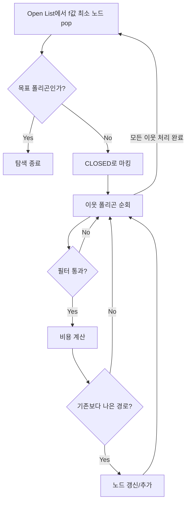
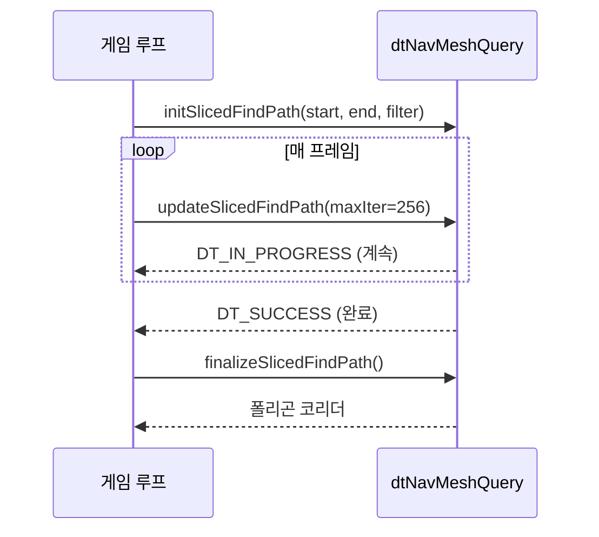
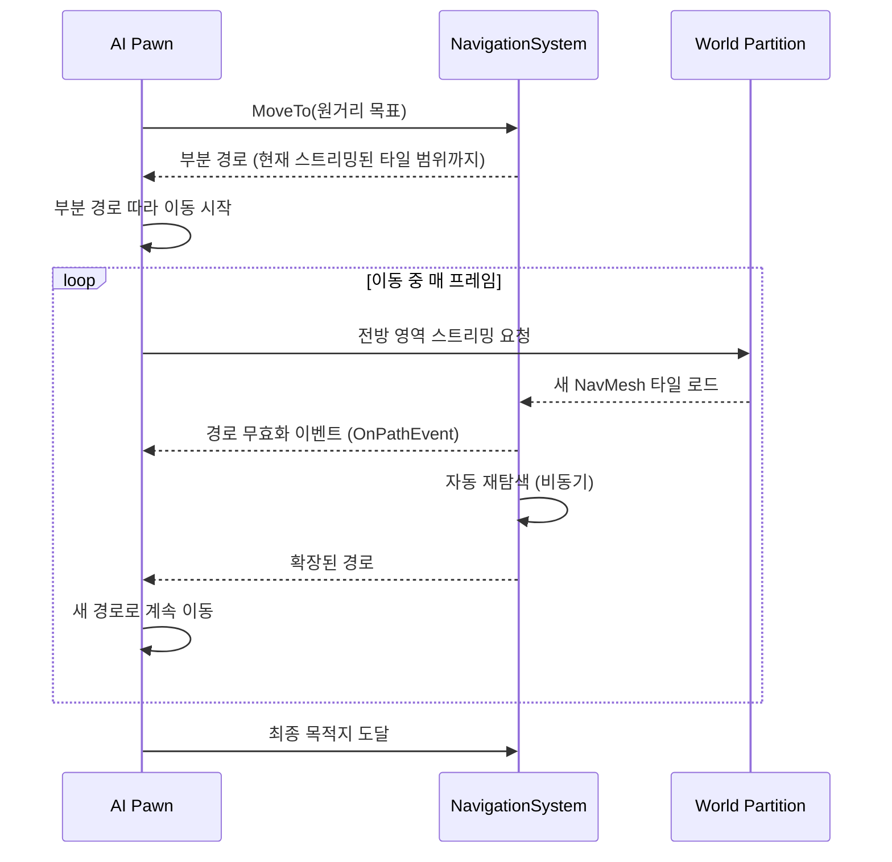

# 02. Detour A* 알고리즘 심층 분석

> **작성일**: 2026-04-16
> **엔진 버전**: UE 5.5

## 1. 개요

`dtNavMeshQuery::findPath()`는 NavMesh의 폴리곤 그래프에서 **A* 탐색**을 수행합니다.
결과는 시작 폴리곤부터 목표 폴리곤까지의 **폴리곤 코리더**(polygon corridor)입니다.

```
입력: startRef(시작 폴리곤), endRef(목표 폴리곤), startPos, endPos
출력: dtQueryResult (폴리곤 ID 시퀀스 + 각 구간 비용)
```

> **소스 확인 위치**
> - `Engine/Source/Runtime/Navmesh/Private/Detour/DetourNavMeshQuery.cpp:1578` — `findPath()` 함수 전체

---

## 2. 핵심 데이터 구조

### 2.1 dtNode — A* 탐색 노드

```cpp
// DetourNode.h:38-46
struct dtNode
{
    dtReal pos[3];              // 노드 위치 (보통 이전→현재 폴리곤 공유 에지의 중점)
    dtReal cost;                // g(n): 시작 노드부터 이 노드까지의 실제 비용
    dtReal total;               // f(n) = g(n) + h(n): 총 예상 비용
    unsigned int pidx : 30;     // 부모 노드 인덱스 (노드 풀 내 인덱스)
    unsigned int flags : 2;     // DT_NODE_OPEN(0x01) 또는 DT_NODE_CLOSED(0x02)
    dtPolyRef id;               // 이 노드가 대응하는 폴리곤 참조 ID
};
```

하나의 폴리곤에 하나의 `dtNode`가 대응합니다. `pidx`로 부모를 역추적하여 최종 경로를 복원합니다.

**이 값들은 언제 채워지는가?** — `dtNode`는 **탐색 시작 시점에 비어 있고, A* 메인 루프가 돌면서 실시간으로 채워집니다.**
NavMesh 빌드 시점에 미리 계산해 두는 값이 **아닙니다** (다른 출발점/목적지마다 값이 완전히 달라지기 때문).

| 필드 | 언제 채워지는가 | 값의 출처 |
|------|----------------|-----------|
| `pos` | A* 루프 중, 이웃 노드 평가 시 | 폴리곤 공유 에지의 중점 (`getEdgeMidPoint`) 또는 시작점 |
| `cost` | A* 루프 중, 이웃 노드 갱신 시 | 부모 노드 `cost` + 이번 에지 비용 (`filter->getCost()`) |
| `total` | A* 루프 중, 이웃 노드 갱신 시 | `cost + heuristic` (휴리스틱은 매번 재계산) |
| `pidx` | A* 루프 중, 이웃 노드 갱신 시 | 현재 탐색 중인 부모 노드의 노드 풀 인덱스 |
| `flags` | OPEN 추가 / CLOSED 확정 시마다 | `DT_NODE_OPEN` 또는 `DT_NODE_CLOSED` 비트 |
| `id` | 해당 폴리곤 첫 방문 시 (`getNode(polyRef)` 시점) | 이 노드가 대응하는 폴리곤 ID — **유일한 "정적" 값** |

즉 `id`만이 NavMesh의 폴리곤 식별자이고, 나머지는 모두 A* 계산의 산물입니다.

> **소스 확인 위치**
> - `Engine/Source/Runtime/Navmesh/Public/Detour/DetourNode.h:38-46` — 구조체 정의
> - 필드 채워지는 시점: `DetourNavMeshQuery.cpp:1611-1620` (시작 노드), `:1779-1800` (이웃 노드 갱신)

### 2.1.1 dtPolyRef — 폴리곤 식별자

`id` 필드의 타입인 `dtPolyRef`는 "폴리곤 액터"나 "컴포넌트"를 가리키는 포인터가 **아닙니다.** UObject 시스템과는 완전히 독립적인 **64비트 정수 핸들**입니다.

```cpp
// DetourNavMesh.h:56
typedef UEType_uint64 dtPolyRef;  // 64비트 부호 없는 정수
```

내부는 3개 필드가 비트 패킹된 형태입니다:

```
┌──────────────┬─────────────┬────────────┐
│  salt        │  tileIdx    │  polyIdx   │
│  (세대 번호) │  (타일 인덱스)│(타일 내 인덱스)│
└──────────────┴─────────────┴────────────┘
    m_saltBits   m_tileBits    m_polyBits
```

- **polyIdx**: 해당 타일 내에서의 폴리곤 배열 인덱스
- **tileIdx**: `dtNavMesh`의 타일 배열 인덱스
- **salt**: "세대 번호". 타일이 언로드되었다가 같은 슬롯에 다른 타일이 로드되면 salt가 증가 → **stale 참조**를 감지하여 잘못된 폴리곤을 쓰지 않도록 함 (월드 파티션 스트리밍 시 중요)

실제 폴리곤 데이터(`dtPoly*`)와 타일(`dtMeshTile*`)은 `getTileAndPolyByRefUnsafe(ref, ...)` 같은 함수로 얻습니다. 이 과정은 포인터 역참조가 아니라 **정수 연산 + 배열 인덱싱**입니다.

```cpp
// 참조 해제 패턴
const dtMeshTile* tile = 0;
const dtPoly* poly = 0;
m_nav->getTileAndPolyByRefUnsafe(polyRef, &tile, &poly);
// → tile = &m_tiles[tileIdx], poly = &tile->polys[polyIdx]
```

UObject 참조가 아니므로 **GC 대상이 아니고**, 스레드 간에도 안전하게 넘길 수 있습니다(해당 타일이 언로드되지 않는 한).

> **소스 확인 위치**
> - `dtPolyRef` typedef: `DetourNavMesh.h:56`
> - `encodePolyId()` / `decodePolyId()`: `DetourNavMesh.h:747-765` — 비트 패킹 방식
> - `getTileAndPolyByRefUnsafe()`: `DetourNavMesh.h:637`

### 2.2 dtNodePool — 노드 풀 (해시 테이블)

`dtPolyRef` → `dtNode` 매핑을 해시 테이블로 관리합니다.

```
┌─────────────────────────────────┐
│ Hash Table (m_first[hashSize])  │
├─────────────────────────────────┤
│ bucket[0] → Node₃ → Node₇ → ∅ │  (체이닝으로 충돌 해결)
│ bucket[1] → ∅                   │
│ bucket[2] → Node₁ → ∅          │
│ ...                             │
├─────────────────────────────────┤
│ Node Array (m_nodes[maxNodes])  │
│ [Node₀] [Node₁] [Node₂] ...   │  (선형 배열, 순차 할당)
└─────────────────────────────────┘
```

- `getNode(dtPolyRef)`: 해당 폴리곤의 노드를 찾거나, 없으면 새로 할당
- `findNode(dtPolyRef)`: 찾기만 하고 할당하지 않음
- 노드 풀이 가득 차면 `findPath()`가 `DT_OUT_OF_NODES` 상태를 반환

> **소스 확인 위치**
> - `DetourNode.h:49-114` — `dtNodePool` 클래스 정의

### 2.3 dtNodeQueue — 우선순위 큐 (바이너리 힙)

Open List를 **바이너리 최소 힙**으로 구현합니다. `total` 값(f(n))이 가장 작은 노드가 먼저 나옵니다.

- `push(node)`: 힙에 추가 후 `bubbleUp()` — O(log n)
- `pop()`: 루트(최소) 추출 후 `trickleDown()` — O(log n)
- `modify(node)`: 기존 노드의 `total` 값이 바뀌었을 때 힙 위치 조정 — O(n) 탐색 + O(log n) 정렬

> **소스 확인 위치**
> - `DetourNode.h:116-176` — `dtNodeQueue` 클래스 정의

---

## 3. findPath() 단계별 분석

### 3.1 초기화 (라인 1587-1623)

```cpp
// 1. 노드 풀과 Open List 초기화
m_nodePool->clear();
m_openList->clear();

// 2. 시작 노드 생성
dtNode* startNode = m_nodePool->getNode(startRef);
dtVcopy(startNode->pos, startPos);
startNode->pidx = 0;              // 부모 없음
startNode->cost = 0;              // g(start) = 0
startNode->total = dtVdist(startPos, endPos) * H_SCALE;  // f = 0 + h
startNode->id = startRef;
startNode->flags = DT_NODE_OPEN;
m_openList->push(startNode);      // Open List에 추가
```

**H_SCALE 계산**:
```cpp
// DetourNavMeshQuery.cpp:1604
const dtReal H_SCALE = filter->getModifiedHeuristicScale();
```

`getModifiedHeuristicScale()`는 `heuristicScale * max(lowestAreaCost, 1.0)`을 반환합니다.
기본값은 `0.999f`로, 유클리드 거리 휴리스틱이 **허용 가능**(admissible)하도록 보장합니다.

> **주의 — "거리"와 "폴리곤 가중치"의 관계**
>
> H_SCALE 공식에 `lowestAreaCost`가 들어가는 것을 보고 "A* 비용은 폴리곤 가중치만 쓰고 거리는 무시되는 것 아닌가?" 오해할 수 있는데, **반대입니다.**
>
> - **비용 `g(n)` (§3.4)**: `거리 × 영역가중치 + 영역진입비용` — **거리와 가중치 둘 다** 곱해서 사용
> - **휴리스틱 `h(n)`**: `거리 × H_SCALE` — 거리만 사용
>
> H_SCALE이 `lowestAreaCost`를 반영하는 이유는 **admissibility 보존** 때문입니다. 맵 전체의 최저 영역 가중치가 0.5라면, 실제 남은 비용의 하한도 `거리 × 0.5`가 됩니다. H_SCALE이 0.5보다 크면 h가 과대평가될 위험이 있으므로 맵 특성에 맞춰 스케일을 낮추는 안전장치입니다.

> **소스 확인 위치**
> - 시작 노드 생성: `DetourNavMeshQuery.cpp:1611-1620`
> - H_SCALE 계산: `DetourNavMeshQuery.cpp:1604`
> - `getModifiedHeuristicScale()`: `DetourNavMeshQuery.h` — `dtQueryFilter::getModifiedHeuristicScale()`

### 3.2 메인 루프 (라인 1630-1810)



#### Step 1: 최적 노드 선택

```cpp
// DetourNavMeshQuery.cpp:1630-1643
while (!m_openList->empty())
{
    dtNode* bestNode = m_openList->pop();     // f(n) 최소 노드
    bestNode->flags &= ~DT_NODE_OPEN;
    bestNode->flags |= DT_NODE_CLOSED;        // CLOSED로 전환
    
    if (bestNode->id == endRef)               // 목표 도달 시 종료
    {
        lastBestNode = bestNode;
        break;
    }
```

##### 왜 "목표에 도달하자마자 바로 종료"해도 최적 경로가 보장되는가

"모든 노드를 다 탐색하고 막다른 길까지 가야 최적 경로를 알 수 있는 것 아니냐?"는 직관은 **다익스트라(Dijkstra)**에 해당합니다.
**A***는 **휴리스틱이 admissible**(h(n) ≤ n에서 목표까지 실제 비용)이면 **목표를 처음 pop하는 순간 그 경로가 최적임이 수학적으로 보장됩니다.**

증명 스케치:

1. Open List는 `f(n) = g(n) + h(n)` 오름차순 정렬 (min-heap)
2. 목표 노드 `goal`을 pop한 시점의 `f(goal) = g(goal) + h(goal) = g(goal) + 0 = g(goal)` (목표에서 목표까지 거리는 0)
3. Open에 남아있는 임의의 노드 `n`에 대해 `f(goal) ≤ f(n)` (min-heap이므로)
4. 만약 `n`을 경유하는 더 짧은 경로가 존재한다면, 그 경로의 실제 총 비용 `C(n→goal via) = g(n) + (n에서 goal까지 실제 비용)`
5. admissible이므로 `h(n) ≤ (n에서 goal까지 실제 비용)` → `f(n) = g(n) + h(n) ≤ C(n→goal via)`
6. 따라서 `g(goal) = f(goal) ≤ f(n) ≤ C(n→goal via)` — 이미 발견한 경로가 더 짧거나 같음. QED.

핵심 조건:
- **h가 admissible이어야 함** (Detour는 `0.999 × 거리`로 약간 축소하여 보수적으로 유지)
- **간선 비용이 음수가 아니어야 함** (NavMesh에서는 자명)
- **OPEN List가 min-heap으로 올바르게 유지되어야 함**

그래서 가중치가 극단적으로 크더라도(늪지대 100배 등) 문제없이 동작합니다 — 가중치가 커진 만큼 `g(n)`도 커져서 우선순위 큐에서 뒤로 밀리므로.

> **직관적 설명**: f값은 "이 노드를 거쳐 목표로 가는 최선의 시나리오" 하한선. 목표를 pop했다는 건 "더 빠른 시나리오가 있을 가능성이 있는 다른 노드가 없다"는 뜻.

#### Step 2: 이웃 폴리곤 순회 및 필터링

```cpp
// DetourNavMeshQuery.cpp:1668-1698
unsigned int i = bestPoly->firstLink;
while (i != DT_NULL_LINK)
{
    const dtLink& link = m_nav->getLink(bestTile, i);
    i = link.next;
    
    dtPolyRef neighbourRef = link.ref;
    
    // 무효 참조, 부모로의 역행, 유효하지 않은 링크 방향 건너뛰기
    if (!neighbourRef || neighbourRef == parentRef
        || !filter->isValidLinkSide(link.side))
        continue;
    
    // passFilter: include/exclude 플래그 + areaCost < DT_UNWALKABLE_POLY_COST
    // passLinkFilterByRef: 커스텀 NavLink 필터 (UE 스마트 링크)
    if (!filter->passFilter(neighbourRef, neighbourTile, neighbourPoly)
        || !passLinkFilterByRef(neighbourTile, neighbourRef))
        continue;
```

**폴리곤 인접 관계**: 각 폴리곤의 `firstLink`에서 시작하는 **링크드 리스트**로 이웃을 순회합니다.
`dtLink`는 이웃 폴리곤 참조(`ref`), 공유 에지 번호(`edge`), 다음 링크 인덱스(`next`)를 가집니다.

##### "부모로의 역행" 체크 (`neighbourRef == parentRef`)

트리 구조로 생각하는 것이 **아닙니다.** A*가 탐색하는 그래프는 일반 그래프(순환 가능)이지만, 탐색 과정에서 현재까지 구축된 **부모 포인터 체인**은 자연스럽게 트리 형태가 됩니다.

`parentRef`는 **현재 확장 중인 `bestNode`의 부모 노드의 폴리곤 ID**로, 여기서 얻습니다:

```cpp
// DetourNavMeshQuery.cpp:1660-1666
dtPolyRef parentRef = 0;
if (bestNode->pidx)
    parentRef = m_nodePool->getNodeAtIdx(bestNode->pidx)->id;
```

"역행"의 의미: `bestNode`의 이웃을 탐색할 때, 바로 직전에 거쳐 왔던 폴리곤(=부모)으로 다시 가는 링크는 명백히 낭비이므로 스킵. 이것은 **단순한 1-스텝 최적화**이지, A*의 정확성을 위해 필수적인 것은 아닙니다 (어차피 `total >= neighbourNode->total` 체크에서 스킵되었을 것). 다만 비용 계산을 아예 생략하므로 성능에 도움이 됩니다.

**전체적인 루프/재방문 처리**는 뒤의 OPEN/CLOSED 체크에서 이루어집니다 — 부모 역행 체크는 "가장 흔한 낭비 케이스"를 조기 차단하는 빠른 경로일 뿐입니다.

##### 필터(Filter) 체계

이웃 폴리곤이 탐색 대상이 될 수 있는지 4단계로 검증합니다:

| 체크 | 소스 | 실패 시 | 목적 |
|------|------|---------|------|
| `isValidLinkSide(link.side)` | `DetourNavMeshQuery.cpp:1679` | skip | **역방향 오프메시 링크 차단** (isBacktracking 플래그와 연동) |
| `passFilter(ref, tile, poly)` | `DetourNavMeshQuery.h:137` | skip | **폴리곤 자체의 통행 가능성** 검사 |
| `passLinkFilterByRef(tile, ref)` | PImplRecastNavMesh에서 주입 | skip | **UE 커스텀 NavLink** (스마트 링크, 액터 기반 링크) 활성/비활성 |
| `getCost(...) < DT_UNWALKABLE_POLY_COST` | 비용 계산 후 | skip | **간선 비용이 무한대인 경우** (커스텀 필터에서 개별 간선을 차단) |

**`passFilter()`의 세부 동작** — 3가지 조건을 **모두 만족**해야 통과:

```cpp
// DetourNavMeshQuery.h:109-119 (passInlineFilter)
bool passInlineFilter(ref, tile, poly) {
    return (poly->flags & m_includeFlags) != 0    // (1) 포함 플래그 중 하나라도 켜져 있어야 함
        && (poly->flags & m_excludeFlags) == 0    // (2) 제외 플래그가 하나도 켜져 있지 않아야 함
        && (m_areaCost[poly->getArea()] < DT_UNWALKABLE_POLY_COST)  // (3) 영역이 통행 가능해야 함
        && (m_areaFixedCost[poly->getArea()] < DT_UNWALKABLE_POLY_COST); // (4) UE 확장
}
```

| 조건 | 의미 | 쓰임새 |
|------|------|--------|
| **includeFlags** | 폴리곤의 `flags` 중 하나라도 이 마스크에 매칭 | "걷기 전용 길만 통과" 같은 경로 제한 |
| **excludeFlags** | 폴리곤의 `flags`와 이 마스크가 교집합 0 | "위험 지역 제외" 같은 영역 회피 |
| **areaCost** | 해당 영역의 이동 가중치가 유한 | `SetAreaCost(Cliff, FLT_MAX)`로 절벽 차단 |
| **areaFixedCost** | 영역 진입 고정 비용이 유한 (UE) | 영역 전환 자체를 금지 |

**`m_includeFlags` / `m_excludeFlags`는 무엇인가**: 각 폴리곤의 `dtPoly::flags`(16비트)는 에디터에서 `UNavArea` 클래스가 지정하는 비트 플래그입니다. `UNavigationQueryFilter`에서 "이 필터는 어떤 플래그를 허용/거부할지" 설정하면 탐색 시 해당 폴리곤이 걸러집니다.

#### Step 3: 노드 위치 결정

```cpp
// DetourNavMeshQuery.cpp:1715-1728
dtReal neiPos[3] = { 0.0f, 0.0f, 0.0f };
if (H_SCALE <= 1.0f || neighbourNode->flags == 0)
{
    // 허용 가능 휴리스틱: 공유 에지 중점을 노드 위치로 사용 (정확한 비용 계산)
    getEdgeMidPoint(bestRef, bestPoly, bestTile,
        neighbourRef, neighbourPoly, neighbourTile, neiPos);
}
else
{
    // 비허용 휴리스틱: 기존 노드 위치 유지 (순환 방지)
    dtVcopy(neiPos, neighbourNode->pos);
}
```

**허용 가능(admissible) 휴리스틱** (H_SCALE <= 1.0): 에지 중점을 사용하여 더 정확한 비용을 계산합니다.
**비허용 가능(non-admissible) 휴리스틱** (H_SCALE > 1.0): 이미 방문한 노드의 위치를 바꾸면 순환이 발생할 수 있으므로 고정합니다.

#### Step 4: 비용 및 휴리스틱 계산

```cpp
// DetourNavMeshQuery.cpp:1730-1750
dtReal curCost = filter->getCost(
    bestNode->pos, neiPos,         // 이전 위치 → 현재 위치
    parentRef, parentTile, parentPoly,
    bestRef, bestTile, bestPoly,
    neighbourRef, neighbourTile, neighbourPoly);

cost = bestNode->cost + curCost;   // g(neighbour) = g(current) + edge cost
heuristic = dtVdist(neiPos, endPos) * H_SCALE;  // h(neighbour)

const dtReal total = cost + heuristic;  // f(neighbour) = g + h
```

**비용 함수 (`getCost`)**:

```cpp
// DetourNavMeshQuery.h:147-159
cost = dtVdist(pa, pb) * m_areaCost[curPoly->getArea()]
     + m_areaFixedCost[nextPoly->getArea()]   // 영역이 바뀔 때만 추가
```

| 요소 | 설명 |
|------|------|
| `dtVdist(pa, pb)` | 두 노드 위치 사이의 유클리드 거리 **(3D 실제 이동 거리)** |
| `m_areaCost[area]` | 영역별 가중치 (기본 1.0, 늪지대 = 3.0 등으로 설정 가능) |
| `m_areaFixedCost[area]` | 영역 진입 시 고정 비용 (UE 확장) |

**중요 — 거리는 반드시 고려됨**: 비용은 `거리 × 가중치`로 **거리와 가중치를 곱**한 값입니다. "거리 무시하고 가중치만 본다"가 아니라, "거리에 영역별 배수를 적용한다"로 이해해야 합니다. 예:

| 상황 | 거리 | 영역가중치 | 비용 |
|------|------|----------|------|
| 평지 10m | 10 | 1.0 | 10 |
| 늪지 5m | 5 | 3.0 | 15 |
| 평지 20m | 20 | 1.0 | 20 |
| 절벽 어떤 길이든 | — | FLT_MAX | 통행 불가 (필터에서 차단) |

→ 이 예에서 "평지 10m"와 "늪지 5m"는 거리는 반대지만 실제 비용은 "늪지 5m"가 더 큽니다. 가중치가 물리적 거리를 왜곡한다고 생각하면 됩니다.

**`curCost`의 의미 (Step 5에서 다시 나옴)**: `curCost`는 `bestNode` **한 폴리곤에서 바로 인접한 이웃 폴리곤으로 가는 단일 에지의 비용**입니다. 시작점부터 누적된 비용이 아닙니다. 시작부터 이웃까지 누적은 `cost = bestNode->cost + curCost` 한 줄로 만들어집니다.

> **소스 확인 위치**
> - 비용 함수: `DetourNavMeshQuery.h:147-159` — `getInlineCost()`
> - `dtQueryFilterData` 구조체: `DetourNavMeshQuery.h:66-91` — `m_areaCost`, `m_areaFixedCost`, `heuristicScale` 등
> - `curCost` 누적: `DetourNavMeshQuery.cpp:1738-1746`

#### Step 5: 노드 갱신 판정

```cpp
// DetourNavMeshQuery.cpp:1752-1777
// (1) 이미 OPEN에 있고 기존 total이 더 작으면 건너뛰기
if ((neighbourNode->flags & DT_NODE_OPEN) && total >= neighbourNode->total)
    continue;

// (2) 이미 CLOSED이고 기존 total이 더 작으면 건너뛰기
if ((neighbourNode->flags & DT_NODE_CLOSED) && total >= neighbourNode->total)
    continue;

// (3) 현재 링크 비용이 DT_UNWALKABLE_POLY_COST이면 건너뛰기
if (curCost == DT_UNWALKABLE_POLY_COST)
    continue;

// (4) [UE 확장] costLimit 초과 시 건너뛰기
if (total > costLimit)
    continue;
```

##### 4가지 스킵 조건 상세

| 조건 | 상황 | 의미 |
|------|------|------|
| **(1) OPEN + total ≥ 기존** | 이웃은 "아직 확장 안 된" 상태로 OPEN에 있음 | 이전에 다른 경로로 이 노드에 도달한 비용이 더 낮거나 같음 → 새 경로는 개선이 아님, 무시 |
| **(2) CLOSED + total ≥ 기존** | 이웃은 "이미 확장된" CLOSED 상태 | CLOSED 노드까지의 최적 비용이 이미 확정되었을 가능성이 높음 → 더 나은 경로 아니면 무시 |
| **(3) curCost = UNWALKABLE** | 이번 에지 자체가 통행 불가 | 필터가 "이 특정 간선은 통행 불가"로 판정했을 때 (영역은 괜찮지만 특정 연결이 차단된 경우) |
| **(4) total > costLimit** | 누적 비용이 사용자 지정 상한 초과 | UE 확장: 무한 탐색 방지용 가지치기 |

##### OPEN/CLOSED 상태의 의미 (재정리)

| 플래그 | 의미 | 다음 동작 가능성 |
|--------|------|------------------|
| **없음 (0)** | 이 폴리곤에 대응하는 dtNode는 있지만 아직 어느 리스트에도 올라가지 않음 | 현재 에지 평가로 OPEN에 추가될 예정 |
| **DT_NODE_OPEN** | 발견되었으나 **아직 확장(이웃 탐색) 안 됨** | Open 힙에서 언젠가 pop되어 CLOSED 전환 |
| **DT_NODE_CLOSED** | Open에서 pop되어 **이미 확장 완료** | 원칙적으로 변경 없음, 단 더 나은 경로 발견 시 **재활성화(re-open) 가능** |

##### "CLOSED가 갱신되면 자손도 전파되어야 하지 않나?" — 핵심 질문

**답: Detour는 자동으로 전파합니다.** 메인 A* 루프에서 CLOSED 노드가 재활성화되는 경로를 실제 코드로 따라가봅니다.

**(a) CLOSED 체크를 통과시키는 조건** — `DetourNavMeshQuery.cpp:1760-1764`

```cpp
// 이 노드는 이미 visit/process되었고, 새 결과가 더 나쁘면 skip
if ((neighbourNode->flags & DT_NODE_CLOSED) && total >= neighbourNode->total)
{
    UE_RECAST_ASTAR_LOG(Display, TEXT("      Skipping new cost higher..."));
    continue;
}
```

→ 새 `total < neighbourNode->total`일 때만 `continue`를 타지 않고 아래로 떨어짐. 이 한 줄이 **"CLOSED라도 더 나은 경로면 재활성화"의 직접 근거**.

**(b) CLOSED 비트 해제 + cost/total 갱신** — `:1779-1785`

```cpp
// Add or update the node.
neighbourNode->pidx  = m_nodePool->getNodeIdx(bestNode);       // 새 부모로 교체 (경로 복원 시 반영됨)
neighbourNode->id    = neighbourRef;
neighbourNode->flags = (neighbourNode->flags & ~DT_NODE_CLOSED); // ★ CLOSED 비트 해제
neighbourNode->cost  = cost;                                    // g 낮아진 값
neighbourNode->total = total;                                   // f 낮아진 값
dtVcopy(neighbourNode->pos, neiPos);
```

**(c) OPEN 힙에 재삽입** — `:1787-1800`

```cpp
if (neighbourNode->flags & DT_NODE_OPEN)
{
    // OPEN이었으면 힙 위치만 조정
    m_openList->modify(neighbourNode);
}
else
{
    // CLOSED였던 노드는 여기로 들어와서:
    neighbourNode->flags |= DT_NODE_OPEN;    // ★ OPEN 비트 ON
    m_openList->push(neighbourNode);         // ★ 힙에 재푸시 → 다시 pop 대상
    m_queryNodes++;
}
```

**자손까지의 재귀 전파**: (c)에서 push된 노드는 다시 pop되어 CLOSED로 마킹(`:1635-1636`)되고 이웃 M을 재탐색. 각 M에 대해 (a)의 체크가 **새 cost 기준**으로 평가되고, 개선이 있으면 동일한 (b)+(c) 경로를 타서 M도 재활성화. 더 이상 개선이 없을 때까지 반복 (종료 보장은 `:1627-1650`의 `loopCounter` 한계 및 비음수 비용으로 뒷받침).

즉 **"CLOSED는 영구 확정이 아니라 '현재까지 최선'"**이며, 새 경로가 개선이면 다시 OPEN으로 내려와서 자손까지 비용 전파가 일어납니다.

##### 이 재활성화가 실제로 발생하는가 — admissible vs consistent 구분

"자손 전파가 필요한가"는 휴리스틱의 **단조성(consistency)**에 달려 있습니다. 단순히 admissible한 것만으로는 부족할 수 있습니다.

| h의 성질 | 정의 | CLOSED 재활성화 |
|---|---|---|
| **Consistent (단조)** | 모든 간선 `(n, n')`에 대해 `h(n) ≤ cost(n, n') + h(n')` | **이론적으로 절대 발생 안 함** — 첫 CLOSED 시점이 곧 최적 |
| **Admissible but inconsistent** | `h(n) ≤ 실제 잔여비용`이지만 단조롭지 않음 | 발생 가능, 여러 번 갱신·재활성화하며 최적으로 수렴 |
| **Non-admissible** | 과대평가 허용 (Weighted A*) | 빈번, 순환 위험 → `shouldIgnoreClosedNodes` 옵션 필요 (§4.2) |

**Detour의 기본 휴리스틱은 consistent입니다.** `H_SCALE = 0.999 × max(lowestAreaCost, 1.0)`이고 모든 `areaCost ≥ 1.0`인 표준 설정에서 역삼각 부등식으로 증명됩니다:

```
|h(n) - h(n')| ≤ ||n - n'|| × H_SCALE       (유클리드 거리 × 상수의 Lipschitz 상수)
cost(n, n') = ||n - n'|| × areaCost          (H_SCALE ≤ lowestAreaCost ≤ areaCost)
⇒ h(n) - h(n') ≤ cost(n, n')                (consistency 성립)
```

따라서 **기본 설정에서 첫 CLOSED 시점이 곧 최적**이며, 재활성화는 이론적으로 발생하지 않습니다.

**그러면 왜 재활성화 코드 자체는 존재하는가** — 예외 상황 대비 **안전장치**입니다:

| 예외 상황 | 일관성이 깨지는 이유 |
|----------|-------------------|
| **부동소수점 오차** | cost 비교가 이론값과 미세하게 엇갈려 같은 노드가 두 번 pop될 수 있음 |
| **커스텀 필터의 동적 비용** | `getCost()`가 호출 컨텍스트에 따라 다른 값을 반환하면 단조성 위반 |
| **lowestAreaCost < 1.0** | `H_SCALE = 0.999 × max(lowestAreaCost, 1.0) = 0.999`로 유지되지만 일부 간선의 `areaCost < 0.999`면 inconsistency |
| **Weighted A* 모드** | 의도적으로 `heuristicScale > 1.0`로 설정 (§4.2) |

즉 "재활성화 + 자손 전파" 메커니즘은 **admissible-but-inconsistent 상황에서만 실제로 작동**하며, 표준 설정에서는 이론적으로 호출되지 않는 safety net으로만 존재합니다. 이 때문에 "최적성이 보장되려면 재탐색이 필요한 것 아니냐"는 직관적 우려는 이론적으로는 유효하고, Detour는 그 경우에도 올바르게 처리합니다.

##### 그래서 CLOSED는 "다시 오지 말라"는 뜻인가?

엄밀히는 **"현재까지 확장이 완료된 상태"** 마킹입니다. 다른 노드가 이 CLOSED 노드로 **들어오는 간선**은 Step 5의 (2)에서 평가되어, 더 나은 경로면 실제로 다시 받아들여집니다. "이 노드로 돌아오지 말라"가 아니라 "이 노드의 현재 비용이 이미 최선으로 보이니, 새 경로가 그보다 나쁘면 무시"라는 뜻입니다.

#### Step 6: 노드 갱신 또는 추가

```cpp
// DetourNavMeshQuery.cpp:1779-1800
neighbourNode->pidx = m_nodePool->getNodeIdx(bestNode);  // 부모 설정
neighbourNode->id = neighbourRef;
neighbourNode->flags = (neighbourNode->flags & ~DT_NODE_CLOSED);
neighbourNode->cost = cost;
neighbourNode->total = total;
dtVcopy(neighbourNode->pos, neiPos);

if (neighbourNode->flags & DT_NODE_OPEN)
{
    // 이미 OPEN에 있으면 힙 위치 조정
    m_openList->modify(neighbourNode);
}
else
{
    // 새로 OPEN에 추가
    neighbourNode->flags |= DT_NODE_OPEN;
    m_openList->push(neighbourNode);
    m_queryNodes++;
}
```

### 3.3 경로 복원 (라인 1815-1853)

A* 탐색이 끝나면 목표 노드(또는 부분 경로의 마지막 노드)에서 부모 포인터를 역추적하여 경로를 복원합니다.

```cpp
// DetourNavMeshQuery.cpp:1815-1846
// 1단계: 부모 포인터 역전 (linked list reversal)
dtNode* prev = 0;
dtNode* node = lastBestNode;
do
{
    dtNode* next = m_nodePool->getNodeAtIdx(node->pidx);
    node->pidx = m_nodePool->getNodeIdx(prev);
    prev = node;
    node = next;
}
while (node);

// 2단계: 역전된 리스트를 따라가며 결과 저장
dtReal prevCost = 0.0f;
node = prev;
do
{
    result.addItem(node->id, node->cost - prevCost, 0, 0);  // (폴리곤ID, 구간비용)
    prevCost = node->cost;
    node = m_nodePool->getNodeAtIdx(node->pidx);
}
while (node);
```

목표에 도달하지 못하면 `DT_PARTIAL_RESULT` 플래그가 설정되어 **부분 경로**가 반환됩니다:
```cpp
// DetourNavMeshQuery.cpp:1812-1813
if (lastBestNode->id != endRef)
    status |= DT_PARTIAL_RESULT;
```

##### 부분 경로는 언제 발생하고, 어디에 쓰이는가

**발생 시나리오**:

| 시나리오 | 설명 |
|----------|------|
| **목표가 고립된 섬** | 시작 폴리곤과 목표 폴리곤이 NavMesh 그래프에서 연결되지 않음 (예: 건너뛸 수 없는 물줄기) |
| **목표 폴리곤이 아예 없음** | 목표 위치가 NavMesh 바깥 (`findNearestPoly` 실패) |
| **costLimit 도달** | `total > costLimit`에 걸려 탐색 조기 종료 |
| **노드 풀 고갈** | `m_nodePool`이 `maxNodes`에 도달 → `DT_OUT_OF_NODES` 플래그와 함께 부분 경로 |
| **월드 파티션 미스트림 구역** | 목표 방향 타일이 아직 로드되지 않아 그래프가 끊겨 있음 |

**`lastBestNode`의 선정 기준**: Step 2~4 과정에서 **휴리스틱(목표까지 직선거리)이 가장 작은 노드**가 지속적으로 `lastBestNode`로 갱신됩니다 (`DetourNavMeshQuery.cpp:1803-1807`). 즉 부분 경로는 "목표에 가장 가까이 다가간 지점까지의 경로"입니다.

**활용 패턴**:

1. **"갈 수 있는 곳까지 이동"** — FPS에서 플레이어가 발판 위로 뛰어올라 NavMesh 바깥에 있어도, AI는 발판 바로 아래까지 다가가서 대기
2. **월드 파티션 스트리밍과 결합** — AI가 부분 경로를 따라 이동하는 동안 새 타일이 스트리밍 인 → 경로 무효화 → 재탐색으로 확장된 경로 획득 ([06-path-invalidation.md](06-path-invalidation.md) 참고)
3. **골 액터 추적** — 도달 불가능한 위치에 있는 목표 액터라도 가장 가까운 지점까지 추격 (포탑 너머 숨은 적 등)
4. **"bAllowPartialPaths = false" 모드** — 일부 퀘스트 오브젝트는 "완전한 경로가 없으면 이동 실패" 처리 필요 (`FAIMoveRequest::IsUsingPartialPaths()`)

`AAIController::MoveTo`의 기본 동작은 **부분 경로 허용(true)**입니다. 이 설정이 꺼져 있으면 부분 경로가 와도 이동 요청이 실패 처리됩니다.

> **소스 확인 위치**
> - 경로 복원: `DetourNavMeshQuery.cpp:1815-1853`
> - 부분 경로 플래그: `DetourNavMeshQuery.cpp:1812-1813`
> - `lastBestNode` 갱신: `DetourNavMeshQuery.cpp:1803-1807`
> - UE에서 부분 경로 설정: `FAIMoveRequest::IsUsingPartialPaths()`

---

## 4. UE 확장 기능

### 4.1 costLimit — 탐색 범위 제한

```cpp
// DetourNavMeshQuery.cpp:1580-1581
dtStatus dtNavMeshQuery::findPath(..., const dtReal costLimit, ...)
```

`total > costLimit`인 노드는 확장하지 않습니다.
넓은 NavMesh에서 먼 목적지로의 탐색 비용을 제한하여 **성능을 보호**합니다.

#### costLimit은 어디서 결정되는가

`costLimit`은 **호출자가 지정**하며, Detour 내부에서 정해지는 값이 아닙니다. UE에서 AI 이동 요청 시 `FPathFindingQuery`를 만들 때 다음 공식으로 계산됩니다:

```cpp
// NavigationData.cpp:102-112 (FPathFindingQuery::ComputeCostLimitFromHeuristic)
FVector::FReal ComputeCostLimitFromHeuristic(
    StartPos, EndPos, HeuristicScale, CostLimitFactor, MinimumCostLimit)
{
    if (CostLimitFactor == FLT_MAX)
        return FLT_MAX;   // 제한 없음
    
    const FReal OriginalHeuristicEstimate = HeuristicScale * FVector::Dist(StartPos, EndPos);
    return FMath::Clamp(
        CostLimitFactor * OriginalHeuristicEstimate,
        MinimumCostLimit,
        TNumericLimits<FReal>::Max());
}
```

즉 `costLimit = max(MinimumCostLimit, CostLimitFactor × HeuristicScale × 직선거리)`.

| 파라미터 | 기본값 | 의미 |
|----------|--------|------|
| `CostLimitFactor` | `FLT_MAX` (= 제한 없음) | 직선거리 대비 몇 배까지 탐색 허용할지 |
| `MinimumCostLimit` | `0` | 짧은 경로에서 너무 작게 clamp되지 않도록 하한 |
| `HeuristicScale` | 필터의 H_SCALE (보통 0.999) | 휴리스틱 추정 기준치 |

UE 기본 `MoveTo`에서는 `CostLimitFactor`가 `FLT_MAX`로 설정되어 **사실상 제한이 없습니다** (`FAIMoveRequest::IsApplyingCostLimitFromHeuristic()`가 false인 경우 적용 자체가 스킵됨).

#### "길이 있는데도 못 가는 상황"이 발생할 수 있는가

**예, 의도적으로 설정하면 발생합니다.** `CostLimitFactor`를 예를 들어 `2.0`으로 설정하고 시작→목표 직선거리의 2배까지만 탐색 허용한다면:

- 복잡한 우회로가 직선거리의 3배 이상 걸리는 경우 → 탐색 중단 → **부분 경로 반환** (실제로 경로는 존재함에도 불구하고)
- 이 경우 반환되는 status에는 `DT_PARTIAL_RESULT`가 포함되고, `lastBestNode`는 "costLimit 안에서 가장 목표에 가까웠던 노드"가 됩니다

#### 애초에 시작→목표 직선거리가 costLimit보다 큰 경우

이 경우 `startNode->total = 직선거리 × H_SCALE`이 이미 `costLimit`을 초과할 수 있습니다. 하지만 **시작 노드는 costLimit 체크를 받지 않고 무조건 OPEN에 들어갑니다** (`DetourNavMeshQuery.cpp:1611-1620`). costLimit 체크는 **이웃 노드 확장 시점**(Step 5)에서만 이루어지므로, 시작 노드는 최소 1번은 pop되어 이웃을 탐색합니다.

그러나 곧 모든 이웃이 `total > costLimit`에 걸려 스킵되어 Open이 비어버리면 탐색이 종료되고, 결과는 "시작 폴리곤만 포함한 부분 경로"가 됩니다. 즉 **길이 아예 있는지조차 판단하기 전에 탐색이 끝날 수 있습니다.**

**권장**: 제한이 꼭 필요한 게 아니면 `CostLimitFactor`를 기본값(`FLT_MAX`)으로 두고, 성능 이슈가 나는 구체적 상황에서만 조정.

### 4.2 shouldIgnoreClosedNodes — CLOSED 노드 건너뛰기

```cpp
// DetourNavMeshQuery.cpp:1707-1712
if (shouldIgnoreClosedNodes && (neighbourNode->flags & DT_NODE_CLOSED) != 0)
    continue;
```

H_SCALE > 1.0 (비허용 가능 휴리스틱)을 사용할 때 **순환 방지**를 위한 옵션입니다.
이미 CLOSED인 노드를 재방문하지 않으므로 최적성은 포기하지만 탐색이 반드시 종료됩니다.

#### "비허용 가능 휴리스틱"이 뭔가

**허용 가능(admissible) 휴리스틱**: 모든 노드 `n`에서 `h(n) ≤ n에서 목표까지의 실제 최소 비용`. 즉 **절대 과대평가하지 않음.** 이 조건이 성립하면 A*는 최적 경로를 보장합니다.

**비허용 가능(non-admissible) 휴리스틱**: `h(n)`이 실제 비용을 **과대평가할 수 있음.** 대표 예가 "Weighted A*" — 일부러 `h`를 부풀려서 목표 방향으로 공격적으로 탐색(Greedy에 가까움). 경로 품질은 떨어지지만 탐색 노드 수가 크게 줄어 빠름.

Detour에서는 `HeuristicScale`을 1.0보다 크게 설정하면 비허용이 됩니다 (기본 0.999로 허용 유지).

#### CLOSED 재활성화와 무한 루프의 관계

**허용 휴리스틱에서는** §3.2에서 설명한 "CLOSED → OPEN 재활성화"가 안전합니다. h가 실제 비용을 하회하므로, 더 나은 경로는 유한 횟수 내에 발견되고 수렴합니다.

**비허용 휴리스틱에서는** 문제가 생깁니다. 노드 A의 비용이 갱신되면 그 자손들도 재평가되고, 자손 중 하나가 다시 A의 이웃을 평가하면서 A의 비용을 또 갱신... 처럼 순환이 발생할 수 있습니다. 특히 h가 공격적으로 과대평가되어 있으면 "짧아 보였던 경로가 실제로는 멀었음"을 뒤늦게 발견하며 여러 노드를 반복 재활성화할 수 있습니다.

`shouldIgnoreClosedNodes = true`가 이 문제를 해결합니다:
- CLOSED 노드는 **다시는 갱신되지 않음**
- 순환 불가 → 탐색 종료 보장
- 단점: 실제로는 더 나은 경로가 있었더라도 놓침 (**최적성 희생**)

#### 정리

| 모드 | HeuristicScale | shouldIgnoreClosedNodes | 속성 |
|------|----------------|-------------------------|------|
| **Admissible A*** (기본) | ≤ 1.0 (보통 0.999) | false | 최적 경로 보장, 탐색 종료 보장 |
| **Weighted A*** | > 1.0 (예: 1.5) | **true** (권장) | 빠르지만 최적성 포기 |
| **Weighted A* (안전장치 해제)** | > 1.0 | false | 순환 재활성화로 오래 걸리거나 실패 가능 — 비추천 |

> **요약**: 질문에 답하자면 "CLOSED 노드 비용을 재방문해 갱신해야 진짜 최적이 나오는데, 비허용 휴리스틱에서는 그게 순환을 일으킬 수 있어서, 성능과 종료 보장을 위해 재방문을 막는 것"이라는 이해가 맞습니다. 허용 휴리스틱에서는 재방문이 있어도 유한 시간에 수렴하므로 이 옵션이 false여도 됩니다.

### 4.3 무한 루프 방지

```cpp
// DetourNavMeshQuery.cpp:1627-1650
int loopCounter = 0;
const int loopLimit = m_nodePool->getMaxRuntimeNodes() + 1;

// while (!m_openList->empty()) 루프 내부에서...
loopCounter++;
if (loopCounter >= loopLimit * 4)
    break;
```

#### loopCounter는 언제/왜 증가하나

**증가 시점**: A* 메인 루프의 **매 반복**(= OPEN에서 노드를 하나 pop할 때마다) 1씩 증가. **특정 "루프 인식" 조건이 있는 것이 아니라 단순 카운터**입니다.

**존재 이유**: 이론적으로 허용 가능 휴리스틱에서는 각 노드가 상수 번만 재활성화되므로 루프의 총 반복 횟수는 `O(maxNodes)`로 유한합니다. 하지만 실제로는 다음과 같은 pathological 케이스에서 반복 횟수가 폭주할 수 있습니다:

- **부동소수점 오차**: `cost` 비교에서 미세한 차이로 같은 노드가 여러 번 CLOSED→OPEN 재활성화
- **비허용 휴리스틱 + shouldIgnoreClosedNodes = false**: §4.2에서 설명한 순환
- **NavMesh 자체의 특수 연결** (오프메시 링크가 양방향으로 엮여 있거나)

`loopLimit * 4 = (maxRuntimeNodes + 1) × 4` 는 "이론적 상한의 4배까지는 허용하되 그 이상은 비정상으로 간주"하는 **하드 리밋**입니다. 대부분의 경우 이 한계에 도달하지 않습니다.

**한계 도달 시 처리**: `break`로 메인 루프를 빠져나가고, 그때까지 축적된 `lastBestNode`를 기반으로 **부분 경로가 반환**됩니다. 사용자 입장에서는 "경로가 있긴 한데 엔진이 완전한 경로를 찾지 못했다"로 인식됩니다.

---

## 5. Sliced Pathfinding — 프레임 분산 탐색

긴 경로 탐색을 여러 프레임에 걸쳐 분산 실행할 수 있습니다.

| 함수 | 역할 |
|------|------|
| `initSlicedFindPath()` | 쿼리 상태 초기화 (시작 노드 생성, `m_query`에 저장) |
| `updateSlicedFindPath(maxIter)` | `maxIter`개 노드까지만 확장. 미완료 시 `DT_IN_PROGRESS` 반환 |
| `finalizeSlicedFindPath()` | 탐색 완료 후 경로 복원 |



`m_query` 구조체(`dtQueryData`)에 탐색 상태를 저장하여 프레임 간에 유지합니다.

> **소스 확인 위치**
> - `initSlicedFindPath()`: `DetourNavMeshQuery.cpp:2021`
> - `updateSlicedFindPath()`: `DetourNavMeshQuery.cpp:2077`
> - `finalizeSlicedFindPath()`: `DetourNavMeshQuery.cpp:2284`

### 5.1 월드 파티션 스트리밍과의 조합 가능성

"AI가 도중에 스트리밍이 완료될 때마다 추가 경로를 다시 계산하도록 만들 수 있는가?"라는 질문에 답하자면 — **가능하며, 실제로 엔진이 그렇게 동작합니다.** 단 Sliced Pathfinding이 아니라 **부분 경로 + 경로 무효화 메커니즘**의 조합으로 구현됩니다.

**권장 구성 (월드 파티션 맵에서 원거리 이동)**:

| 컴포넌트 | 역할 |
|----------|------|
| `FAIMoveRequest::SetUsePartialPaths(true)` | 경로가 끊겨 있어도 "갈 수 있는 곳까지" 이동 시작 |
| `FNavigationPath::EnableRecalculationOnInvalidation(true)` | NavMesh 타일 변경 시 자동 재탐색 트리거 |
| World Partition + NavigationDataChunkActor | AI가 이동함에 따라 전방 타일이 스트리밍 인 → 기존 부분 경로 무효화 |
| `FindPathAsync` (선택) | 확장된 NavMesh에서 긴 재탐색을 백그라운드로 수행 |

**동작 흐름**:



**Sliced Pathfinding이 적합한 시나리오**:
- 이미 NavMesh가 충분히 로드된 상황에서 **매우 긴 경로**를 여러 프레임에 나눠 계산해야 할 때 (RTS의 대규모 이동 명령 등)
- 월드 파티션 스트리밍과는 **별도의 문제**를 해결하므로, 두 기능은 독립적으로 조합 가능

자세한 경로 무효화 메커니즘은 [06-path-invalidation.md](06-path-invalidation.md) 참고.

---

## 6. A* 알고리즘 특성 요약

| 특성 | 값/설명 |
|------|---------|
| **변형** | 표준 A* (노드 위치 업데이트가 있는 Lazy A* 변형) |
| **그래프** | NavMesh 폴리곤 인접 그래프 (링크드 리스트 순회) |
| **Open List** | 바이너리 최소 힙 (`dtNodeQueue`) |
| **Closed List** | 노드 플래그 비트 (`DT_NODE_CLOSED`) |
| **노드 풀** | 해시 테이블 (`dtNodePool`), 폴리곤당 1개 노드 |
| **휴리스틱** | 유클리드 거리 * H_SCALE (기본 0.999f, admissible) |
| **비용 함수** | `거리 * 영역가중치 + 영역진입고정비용` |
| **최적성** | H_SCALE <= 1.0일 때 최적 경로 보장 |
| **부분 경로** | 목표 미도달 시 가장 가까운 노드까지의 경로 반환 |
| **UE 확장** | costLimit, shouldIgnoreClosedNodes, 무한루프 방지 |
