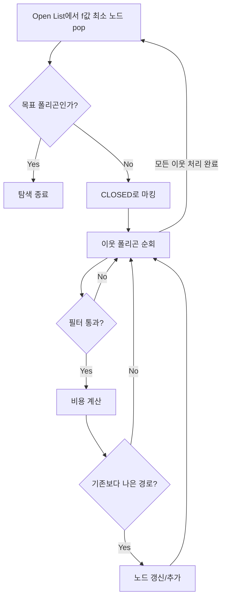
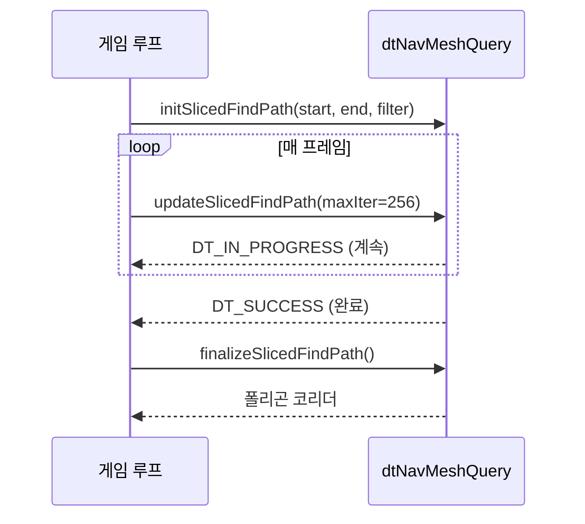

# 02. Detour A* 알고리즘 심층 분석

> **작성일**: 2026-04-16
> **엔진 버전**: UE 5.5

## 1. 개요

`dtNavMeshQuery::findPath()`는 NavMesh의 폴리곤 그래프에서 **A* 탐색**을 수행합니다.
결과는 시작 폴리곤부터 목표 폴리곤까지의 **폴리곤 코리더**(polygon corridor)입니다.

```
입력: startRef(시작 폴리곤), endRef(목표 폴리곤), startPos, endPos
출력: dtQueryResult (폴리곤 ID 시퀀스 + 각 구간 비용)
```

> **소스 확인 위치**
> - `Engine/Source/Runtime/Navmesh/Private/Detour/DetourNavMeshQuery.cpp:1578` — `findPath()` 함수 전체

---

## 2. 핵심 데이터 구조

### 2.1 dtNode — A* 탐색 노드

```cpp
// DetourNode.h:38-46
struct dtNode
{
    dtReal pos[3];              // 노드 위치 (보통 이전→현재 폴리곤 공유 에지의 중점)
    dtReal cost;                // g(n): 시작 노드부터 이 노드까지의 실제 비용
    dtReal total;               // f(n) = g(n) + h(n): 총 예상 비용
    unsigned int pidx : 30;     // 부모 노드 인덱스 (노드 풀 내 인덱스)
    unsigned int flags : 2;     // DT_NODE_OPEN(0x01) 또는 DT_NODE_CLOSED(0x02)
    dtPolyRef id;               // 이 노드가 대응하는 폴리곤 참조 ID
};
```

하나의 폴리곤에 하나의 `dtNode`가 대응합니다. `pidx`로 부모를 역추적하여 최종 경로를 복원합니다.

> **소스 확인 위치**
> - `Engine/Source/Runtime/Navmesh/Public/Detour/DetourNode.h:38-46`

### 2.2 dtNodePool — 노드 풀 (해시 테이블)

`dtPolyRef` → `dtNode` 매핑을 해시 테이블로 관리합니다.

```
┌─────────────────────────────────┐
│ Hash Table (m_first[hashSize])  │
├─────────────────────────────────┤
│ bucket[0] → Node₃ → Node₇ → ∅ │  (체이닝으로 충돌 해결)
│ bucket[1] → ∅                   │
│ bucket[2] → Node₁ → ∅          │
│ ...                             │
├─────────────────────────────────┤
│ Node Array (m_nodes[maxNodes])  │
│ [Node₀] [Node₁] [Node₂] ...   │  (선형 배열, 순차 할당)
└─────────────────────────────────┘
```

- `getNode(dtPolyRef)`: 해당 폴리곤의 노드를 찾거나, 없으면 새로 할당
- `findNode(dtPolyRef)`: 찾기만 하고 할당하지 않음
- 노드 풀이 가득 차면 `findPath()`가 `DT_OUT_OF_NODES` 상태를 반환

> **소스 확인 위치**
> - `DetourNode.h:49-114` — `dtNodePool` 클래스 정의

### 2.3 dtNodeQueue — 우선순위 큐 (바이너리 힙)

Open List를 **바이너리 최소 힙**으로 구현합니다. `total` 값(f(n))이 가장 작은 노드가 먼저 나옵니다.

- `push(node)`: 힙에 추가 후 `bubbleUp()` — O(log n)
- `pop()`: 루트(최소) 추출 후 `trickleDown()` — O(log n)
- `modify(node)`: 기존 노드의 `total` 값이 바뀌었을 때 힙 위치 조정 — O(n) 탐색 + O(log n) 정렬

> **소스 확인 위치**
> - `DetourNode.h:116-176` — `dtNodeQueue` 클래스 정의

---

## 3. findPath() 단계별 분석

### 3.1 초기화 (라인 1587-1623)

```cpp
// 1. 노드 풀과 Open List 초기화
m_nodePool->clear();
m_openList->clear();

// 2. 시작 노드 생성
dtNode* startNode = m_nodePool->getNode(startRef);
dtVcopy(startNode->pos, startPos);
startNode->pidx = 0;              // 부모 없음
startNode->cost = 0;              // g(start) = 0
startNode->total = dtVdist(startPos, endPos) * H_SCALE;  // f = 0 + h
startNode->id = startRef;
startNode->flags = DT_NODE_OPEN;
m_openList->push(startNode);      // Open List에 추가
```

**H_SCALE 계산**:
```cpp
// DetourNavMeshQuery.cpp:1604
const dtReal H_SCALE = filter->getModifiedHeuristicScale();
```

`getModifiedHeuristicScale()`는 `heuristicScale * max(lowestAreaCost, 1.0)`을 반환합니다.
기본값은 `0.999f`로, 유클리드 거리 휴리스틱이 **허용 가능**(admissible)하도록 보장합니다.

> **소스 확인 위치**
> - 시작 노드 생성: `DetourNavMeshQuery.cpp:1611-1620`
> - H_SCALE 계산: `DetourNavMeshQuery.cpp:1604`
> - `getModifiedHeuristicScale()`: `DetourNavMeshQuery.h` — `dtQueryFilter::getModifiedHeuristicScale()`

### 3.2 메인 루프 (라인 1630-1810)



#### Step 1: 최적 노드 선택

```cpp
// DetourNavMeshQuery.cpp:1630-1643
while (!m_openList->empty())
{
    dtNode* bestNode = m_openList->pop();     // f(n) 최소 노드
    bestNode->flags &= ~DT_NODE_OPEN;
    bestNode->flags |= DT_NODE_CLOSED;        // CLOSED로 전환
    
    if (bestNode->id == endRef)               // 목표 도달 시 종료
    {
        lastBestNode = bestNode;
        break;
    }
```

#### Step 2: 이웃 폴리곤 순회 및 필터링

```cpp
// DetourNavMeshQuery.cpp:1668-1698
unsigned int i = bestPoly->firstLink;
while (i != DT_NULL_LINK)
{
    const dtLink& link = m_nav->getLink(bestTile, i);
    i = link.next;
    
    dtPolyRef neighbourRef = link.ref;
    
    // 무효 참조, 부모로의 역행, 유효하지 않은 링크 방향 건너뛰기
    if (!neighbourRef || neighbourRef == parentRef
        || !filter->isValidLinkSide(link.side))
        continue;
    
    // passFilter: include/exclude 플래그 + areaCost < DT_UNWALKABLE_POLY_COST
    // passLinkFilterByRef: 커스텀 NavLink 필터 (UE 스마트 링크)
    if (!filter->passFilter(neighbourRef, neighbourTile, neighbourPoly)
        || !passLinkFilterByRef(neighbourTile, neighbourRef))
        continue;
```

**폴리곤 인접 관계**: 각 폴리곤의 `firstLink`에서 시작하는 **링크드 리스트**로 이웃을 순회합니다.
`dtLink`는 이웃 폴리곤 참조(`ref`), 공유 에지 번호(`edge`), 다음 링크 인덱스(`next`)를 가집니다.

#### Step 3: 노드 위치 결정

```cpp
// DetourNavMeshQuery.cpp:1715-1728
dtReal neiPos[3] = { 0.0f, 0.0f, 0.0f };
if (H_SCALE <= 1.0f || neighbourNode->flags == 0)
{
    // 허용 가능 휴리스틱: 공유 에지 중점을 노드 위치로 사용 (정확한 비용 계산)
    getEdgeMidPoint(bestRef, bestPoly, bestTile,
        neighbourRef, neighbourPoly, neighbourTile, neiPos);
}
else
{
    // 비허용 휴리스틱: 기존 노드 위치 유지 (순환 방지)
    dtVcopy(neiPos, neighbourNode->pos);
}
```

**허용 가능(admissible) 휴리스틱** (H_SCALE <= 1.0): 에지 중점을 사용하여 더 정확한 비용을 계산합니다.
**비허용 가능(non-admissible) 휴리스틱** (H_SCALE > 1.0): 이미 방문한 노드의 위치를 바꾸면 순환이 발생할 수 있으므로 고정합니다.

#### Step 4: 비용 및 휴리스틱 계산

```cpp
// DetourNavMeshQuery.cpp:1730-1750
dtReal curCost = filter->getCost(
    bestNode->pos, neiPos,         // 이전 위치 → 현재 위치
    parentRef, parentTile, parentPoly,
    bestRef, bestTile, bestPoly,
    neighbourRef, neighbourTile, neighbourPoly);

cost = bestNode->cost + curCost;   // g(neighbour) = g(current) + edge cost
heuristic = dtVdist(neiPos, endPos) * H_SCALE;  // h(neighbour)

const dtReal total = cost + heuristic;  // f(neighbour) = g + h
```

**비용 함수 (`getCost`)**:

```cpp
// DetourNavMeshQuery.h:147-159
cost = dtVdist(pa, pb) * m_areaCost[curPoly->getArea()]
     + m_areaFixedCost[nextPoly->getArea()]   // 영역이 바뀔 때만 추가
```

| 요소 | 설명 |
|------|------|
| `dtVdist(pa, pb)` | 두 노드 위치 사이의 유클리드 거리 |
| `m_areaCost[area]` | 영역별 가중치 (기본 1.0, 늪지대 = 3.0 등으로 설정 가능) |
| `m_areaFixedCost[area]` | 영역 진입 시 고정 비용 (UE 확장) |

> **소스 확인 위치**
> - 비용 함수: `DetourNavMeshQuery.h:147-159` — `getInlineCost()`
> - `dtQueryFilterData` 구조체: `DetourNavMeshQuery.h:66-91` — `m_areaCost`, `m_areaFixedCost`, `heuristicScale` 등

#### Step 5: 노드 갱신 판정

```cpp
// DetourNavMeshQuery.cpp:1752-1777
// (1) 이미 OPEN에 있고 기존 total이 더 작으면 건너뛰기
if ((neighbourNode->flags & DT_NODE_OPEN) && total >= neighbourNode->total)
    continue;

// (2) 이미 CLOSED이고 기존 total이 더 작으면 건너뛰기
if ((neighbourNode->flags & DT_NODE_CLOSED) && total >= neighbourNode->total)
    continue;

// (3) 현재 링크 비용이 DT_UNWALKABLE_POLY_COST이면 건너뛰기
if (curCost == DT_UNWALKABLE_POLY_COST)
    continue;

// (4) [UE 확장] costLimit 초과 시 건너뛰기
if (total > costLimit)
    continue;
```

#### Step 6: 노드 갱신 또는 추가

```cpp
// DetourNavMeshQuery.cpp:1779-1800
neighbourNode->pidx = m_nodePool->getNodeIdx(bestNode);  // 부모 설정
neighbourNode->id = neighbourRef;
neighbourNode->flags = (neighbourNode->flags & ~DT_NODE_CLOSED);
neighbourNode->cost = cost;
neighbourNode->total = total;
dtVcopy(neighbourNode->pos, neiPos);

if (neighbourNode->flags & DT_NODE_OPEN)
{
    // 이미 OPEN에 있으면 힙 위치 조정
    m_openList->modify(neighbourNode);
}
else
{
    // 새로 OPEN에 추가
    neighbourNode->flags |= DT_NODE_OPEN;
    m_openList->push(neighbourNode);
    m_queryNodes++;
}
```

### 3.3 경로 복원 (라인 1815-1853)

A* 탐색이 끝나면 목표 노드(또는 부분 경로의 마지막 노드)에서 부모 포인터를 역추적하여 경로를 복원합니다.

```cpp
// DetourNavMeshQuery.cpp:1815-1846
// 1단계: 부모 포인터 역전 (linked list reversal)
dtNode* prev = 0;
dtNode* node = lastBestNode;
do
{
    dtNode* next = m_nodePool->getNodeAtIdx(node->pidx);
    node->pidx = m_nodePool->getNodeIdx(prev);
    prev = node;
    node = next;
}
while (node);

// 2단계: 역전된 리스트를 따라가며 결과 저장
dtReal prevCost = 0.0f;
node = prev;
do
{
    result.addItem(node->id, node->cost - prevCost, 0, 0);  // (폴리곤ID, 구간비용)
    prevCost = node->cost;
    node = m_nodePool->getNodeAtIdx(node->pidx);
}
while (node);
```

목표에 도달하지 못하면 `DT_PARTIAL_RESULT` 플래그가 설정되어 **부분 경로**가 반환됩니다:
```cpp
// DetourNavMeshQuery.cpp:1812-1813
if (lastBestNode->id != endRef)
    status |= DT_PARTIAL_RESULT;
```

> **소스 확인 위치**
> - 경로 복원: `DetourNavMeshQuery.cpp:1815-1853`
> - 부분 경로 플래그: `DetourNavMeshQuery.cpp:1812-1813`

---

## 4. UE 확장 기능

### 4.1 costLimit — 탐색 범위 제한

```cpp
// DetourNavMeshQuery.cpp:1580-1581
dtStatus dtNavMeshQuery::findPath(..., const dtReal costLimit, ...)
```

`total > costLimit`인 노드는 확장하지 않습니다.
넓은 NavMesh에서 먼 목적지로의 탐색 비용을 제한하여 **성능을 보호**합니다.

### 4.2 shouldIgnoreClosedNodes — CLOSED 노드 건너뛰기

```cpp
// DetourNavMeshQuery.cpp:1707-1712
if (shouldIgnoreClosedNodes && (neighbourNode->flags & DT_NODE_CLOSED) != 0)
    continue;
```

H_SCALE > 1.0 (비허용 가능 휴리스틱)을 사용할 때 **순환 방지**를 위한 옵션입니다.
이미 CLOSED인 노드를 재방문하지 않으므로 최적성은 포기하지만 탐색이 반드시 종료됩니다.

### 4.3 무한 루프 방지

```cpp
// DetourNavMeshQuery.cpp:1627-1650
int loopCounter = 0;
const int loopLimit = m_nodePool->getMaxRuntimeNodes() + 1;

// ...
loopCounter++;
if (loopCounter >= loopLimit * 4)
    break;
```

네비게이션 그래프에 순환이 있을 경우를 대비한 **안전장치**입니다.

---

## 5. Sliced Pathfinding — 프레임 분산 탐색

긴 경로 탐색을 여러 프레임에 걸쳐 분산 실행할 수 있습니다.

| 함수 | 역할 |
|------|------|
| `initSlicedFindPath()` | 쿼리 상태 초기화 (시작 노드 생성, `m_query`에 저장) |
| `updateSlicedFindPath(maxIter)` | `maxIter`개 노드까지만 확장. 미완료 시 `DT_IN_PROGRESS` 반환 |
| `finalizeSlicedFindPath()` | 탐색 완료 후 경로 복원 |



`m_query` 구조체(`dtQueryData`)에 탐색 상태를 저장하여 프레임 간에 유지합니다.

> **소스 확인 위치**
> - `initSlicedFindPath()`: `DetourNavMeshQuery.cpp:2021`
> - `updateSlicedFindPath()`: `DetourNavMeshQuery.cpp:2077`
> - `finalizeSlicedFindPath()`: `DetourNavMeshQuery.cpp:2284`

---

## 6. A* 알고리즘 특성 요약

| 특성 | 값/설명 |
|------|---------|
| **변형** | 표준 A* (노드 위치 업데이트가 있는 Lazy A* 변형) |
| **그래프** | NavMesh 폴리곤 인접 그래프 (링크드 리스트 순회) |
| **Open List** | 바이너리 최소 힙 (`dtNodeQueue`) |
| **Closed List** | 노드 플래그 비트 (`DT_NODE_CLOSED`) |
| **노드 풀** | 해시 테이블 (`dtNodePool`), 폴리곤당 1개 노드 |
| **휴리스틱** | 유클리드 거리 * H_SCALE (기본 0.999f, admissible) |
| **비용 함수** | `거리 * 영역가중치 + 영역진입고정비용` |
| **최적성** | H_SCALE <= 1.0일 때 최적 경로 보장 |
| **부분 경로** | 목표 미도달 시 가장 가까운 노드까지의 경로 반환 |
| **UE 확장** | costLimit, shouldIgnoreClosedNodes, 무한루프 방지 |
