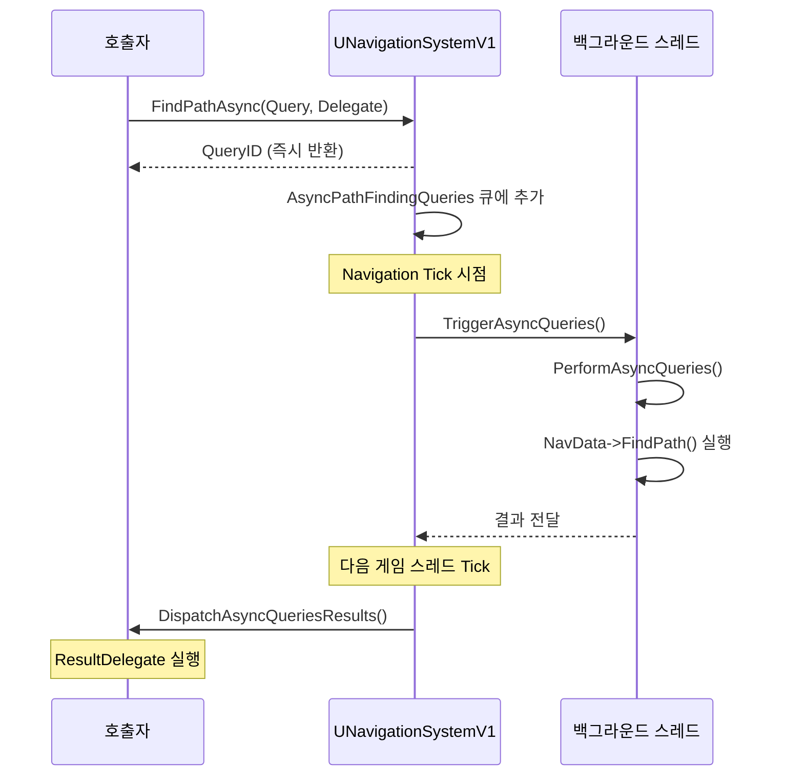

# 04. UE 길찾기 래퍼 계층

> **작성일**: 2026-04-16
> **엔진 버전**: UE 5.5

## 1. 개요

UE는 Detour 라이브러리를 직접 노출하지 않고 여러 계층의 래퍼를 통해 통합합니다.
이 문서는 `AAIController::MoveTo()` 호출이 Detour의 `findPath()`까지 도달하는 과정과,
그 결과가 다시 UE의 `FNavMeshPath`로 변환되는 과정을 분석합니다.

---

## 2. AAIController — 이동 요청 진입점

### 2.1 MoveToLocation()

```cpp
// AIController.cpp:593
EPathFollowingRequestResult::Type AAIController::MoveToLocation(
    const FVector& Dest,
    float AcceptanceRadius,
    bool bStopOnOverlap,
    bool bUsePathfinding,
    bool bProjectDestinationToNavigation,
    bool bCanStrafe,
    TSubclassOf<UNavigationQueryFilter> FilterClass,
    bool bAllowPartialPaths)
```

파라미터들을 `FAIMoveRequest`로 변환하여 `MoveTo()`에 전달하는 편의 함수입니다.

### 2.2 MoveTo() — 핵심 오케스트레이터

```cpp
// AIController.cpp:645
FPathFollowingRequestResult AAIController::MoveTo(
    const FAIMoveRequest& MoveRequest,
    FNavPathSharedPtr* OutPath)
```

전체 흐름:

```
MoveTo()
├── 1. MoveRequest 검증 (목적지 유효성, 에이전트 존재 여부)
├── 2. 목적지를 NavMesh에 투사 (bProjectDestinationToNavigation)
├── 3. 이미 목표 지점에 도달했는지 확인
├── 4. BuildPathfindingQuery()  ← FPathFindingQuery 생성
├── 5. FindPathForMoveRequest() ← NavigationSystem에 경로 탐색 위임
├── 6. MergePaths()             ← 기존 경로와 병합 (선택)
└── 7. PathFollowingComponent->RequestMove()  ← 경로 추적 시작
```

> **소스 확인 위치**
> - `MoveTo()`: `AIController.cpp:645-765`
> - `BuildPathfindingQuery()`: `AIController.cpp:822-878`
> - `FindPathForMoveRequest()`: `AIController.cpp:880-899`

### 2.3 BuildPathfindingQuery()

`FPathFindingQuery`를 구성합니다:

```cpp
// AIController.cpp:822
bool AAIController::BuildPathfindingQuery(
    const FAIMoveRequest& MoveRequest,
    const FVector& StartLocation,
    FPathFindingQuery& OutQuery) const
```

주요 동작:
1. `MoveRequest`에서 에이전트 속성에 맞는 `ARecastNavMesh`를 가져옴
2. 목표 위치 추출 (MoveToActor인 경우 `INavAgentInterface`로 오프셋 계산)
3. 네비게이션 필터 클래스 설정
4. `PathFollowingComponent->OnPathfindingQuery()`로 쿼리 커스터마이징 기회 제공

#### NavData는 "공유"인가 "에이전트별"인가?

질문이 자주 나오는 지점이라 명확히 정리합니다.

UE는 `Project Settings → Navigation System → Supported Agents`에 정의된 각 **에이전트 타입마다 별도의 `ARecastNavMesh` 인스턴스**를 월드에 생성합니다. 에이전트 타입은 주로 **크기(AgentRadius, AgentHeight, AgentMaxSlope 등)**로 구분됩니다.

```
Supported Agents:
├── [0] "Human"   (Radius=34, Height=144)  → ARecastNavMesh 인스턴스 A
├── [1] "Dog"     (Radius=20, Height=60)   → ARecastNavMesh 인스턴스 B
└── [2] "Giant"   (Radius=100, Height=250) → ARecastNavMesh 인스턴스 C
```

각 NavMesh는 해당 크기의 에이전트가 **실제로 통과할 수 있는 공간만** 폴리곤으로 만들어 두기 때문에 경로 탐색 결과도 당연히 달라집니다 (작은 개는 좁은 틈을 통과하지만 거인은 못 통과).

`GetNavDataForProps(AgentProperties)`가 에이전트 속성을 받아 **가장 잘 맞는 NavData를 선택**합니다 (`AgentToNavDataMap` 조회 + best-fit 매칭, `NavigationSystem.cpp:2287`).

| 속성 | 경로 결과에 영향? | 이유 |
|------|-------------------|------|
| **AgentRadius** | ✅ 큰 영향 | NavMesh 빌드 시 통과 가능 공간이 달라짐 → 다른 NavData 인스턴스 |
| **AgentHeight** | ✅ 큰 영향 | 낮은 터널은 작은 에이전트만 통과 가능 → 다른 NavData |
| **AgentMaxSlope** | ✅ 영향 | 가파른 경사 통과 가능 여부 → 다른 NavData |
| **AgentSpeed** | ❌ **영향 없음** | 경로 탐색은 거리·비용만 보며 속도는 고려 안 함. PathFollowing 단계에서만 쓰임 |
| **쿼리 필터(UNavigationQueryFilter)** | ✅ 영향 | 같은 NavData라도 필터에 따라 결과 달라짐 (§6 참고) |

**즉**:
- **크기가 다른 에이전트**는 서로 다른 `ARecastNavMesh`를 사용 (공유 아님)
- **같은 크기 에이전트 여러 마리**는 같은 `ARecastNavMesh`를 공유. 이 경우 개체별 경로 차이는 **쿼리 필터(UNavigationQueryFilter)**로 조정 — "이 AI는 늪지대 싫어함", "저 AI는 도로 선호" 같은 식으로.
- **속도는 경로 탐색이 아닌 이동 단계**에서 반영됨. 같은 NavData/필터로 찾은 경로를, 속도만 다르게 적용해 빠르게/느리게 따라가는 구조.

> **소스 확인 위치**
> - `GetNavDataForProps()`: `Engine/Source/Runtime/NavigationSystem/Private/NavigationSystem.cpp:2287`
> - `AgentToNavDataMap`: 에이전트별 NavData 매핑
> - `SupportedAgents` 설정: `DefaultEngine.ini` 또는 `Project Settings → Navigation System`

### 2.4 FindPathForMoveRequest()

```cpp
// AIController.cpp:880
void AAIController::FindPathForMoveRequest(
    const FAIMoveRequest& MoveRequest,
    FPathFindingQuery& Query,
    FNavPathSharedPtr& OutPath) const
{
    // NavigationSystem에 동기 경로 탐색 요청
    UNavigationSystemV1* NavSys = ...;
    NavSys->FindPathSync(Query);
}
```

---

## 3. UNavigationSystemV1 — 경로 탐색 분배기

### 3.0 동기 vs 비동기 — 누가 선택하는가

**호출자가 직접 선택**합니다. `UNavigationSystemV1`에는 `FindPathSync`와 `FindPathAsync` 두 함수가 별도로 존재하고, **게임 코드가 어느 쪽을 호출할지 결정**합니다. NavigationSystem 내부에서 자동 최적화로 나눠 쓰는 게 아닙니다.

| 주체 | 선택 |
|------|------|
| `AAIController::MoveTo()` | 기본적으로 **동기** (`FindPathSync` 호출) |
| 사용자 게임플레이 코드 | 직접 `FindPathSync` 또는 `FindPathAsync` 호출 가능 |
| `UAIAsyncTaskBlueprintProxy` / 일부 BP 노드 | **비동기** 경로 사용 |

**선택 기준** (자세한 내용은 [01-pathfinding-overview.md §4.1~4.3](01-pathfinding-overview.md) 참고):

| 상황 | 선택 |
|------|------|
| AI 한두 명, 짧은 경로 | 동기 (단순, 영향 미미) |
| `MoveTo` 기본 케이스 | 동기 (엔진 기본값) |
| 장거리 경로, 월드 파티션 횡단 | 비동기 (스파이크 방지) |
| 다수 AI 동시 요청 (RTS, 몹 웨이브) | 비동기 (부하 분산) |
| 주기적 경로 존재 체크 (EQS 등) | 비동기 (지연 무방) |

핵심은 **"게임 스레드를 블로킹해도 되는가"**. 짧고 급한 탐색은 동기로, 길거나 대량이면 비동기로 백그라운드에 밀어넣는다고 이해하면 됩니다.

### 3.1 FindPathSync()

```cpp
// NavigationSystem.cpp:1833
FPathFindingResult UNavigationSystemV1::FindPathSync(
    const FNavAgentProperties& AgentProperties,
    FPathFindingQuery Query,
    EPathFindingMode::Type Mode)
```

핵심 로직:
```cpp
// NavData가 설정되지 않았으면 에이전트에 맞는 NavData 가져오기
if (Query.NavData.IsValid() == false)
    Query.NavData = GetNavDataForProps(Query.NavAgentProperties);

// NavData의 FindPath() 가상 함수 호출 (ARecastNavMesh::FindPath())
Query.NavData->FindPath(AgentProperties, Query);
```

### 3.2 FindPathAsync()

```cpp
// NavigationSystem.cpp:1917
uint32 UNavigationSystemV1::FindPathAsync(
    const FNavAgentProperties& AgentProperties,
    FPathFindingQuery Query,
    const FNavPathQueryDelegate& ResultDelegate,
    EPathFindingMode::Type Mode)
```

비동기 경로 탐색은 다음 순서로 동작합니다:



> **소스 확인 위치**
> - `FindPathAsync()`: `NavigationSystem.cpp:1917`
> - `PerformAsyncQueries()`: `NavigationSystem.cpp:1999` — 백그라운드 스레드에서 FindPath() 실행
> - `DispatchAsyncQueriesResults()`: 게임 스레드에서 결과 델리게이트 호출

---

## 4. FPImplRecastNavMesh — Detour 브릿지

### 4.1 INITIALIZE_NAVQUERY 매크로

```cpp
// PImplRecastNavMesh.cpp:43
#define INITIALIZE_NAVQUERY(NavQueryVariable, NumNodes, LinkFilter)
```

**스레드 안전성**: Detour의 `dtNavMeshQuery`는 내부 상태를 가지므로 스레드 간 공유할 수 없습니다.
이 매크로는 실행 스레드에 따라 적절한 쿼리 객체를 선택합니다:

- **게임 스레드**: `SharedNavQuery` (미리 할당된 공유 인스턴스)
- **백그라운드 스레드**: 지역 변수로 새 `dtNavMeshQuery` 생성

### 4.2 FindPath()

```cpp
// PImplRecastNavMesh.cpp:1173
ENavigationQueryResult::Type FPImplRecastNavMesh::FindPath(
    const FVector& StartLoc,
    const FVector& EndLoc,
    const FVector::FReal CostLimit,
    const bool bRequireNavigableEndLocation,
    FNavMeshPath& Path,
    const FNavigationQueryFilter& InQueryFilter,
    const UObject* Owner) const
```

실행 흐름:

```
FPImplRecastNavMesh::FindPath()
│
├── 1. 입력 검증 (DetourNavMesh, QueryFilter 유효성)
│
├── 2. INITIALIZE_NAVQUERY(NavQuery, ...)
│      └── 스레드에 맞는 dtNavMeshQuery 준비
│
├── 3. InitPathfinding()
│      ├── UE 좌표 → Recast 좌표 변환 (Y축 반전, 스케일 적용)
│      └── findNearestPoly()로 StartPolyID, EndPolyID 확보
│
├── 4. NavQuery.findPath(StartPoly, EndPoly, StartPos, EndPos, CostLimit, Filter, Result)
│      └── ★ Detour A* 탐색 실행 → 폴리곤 코리더 생성
│
└── 5. PostProcessPathInternal(FindPathStatus, Path, NavQuery, Filter, ...)
       └── 결과를 FNavMeshPath로 변환
```

### 4.3 좌표 변환

UE와 Recast는 좌표계가 다릅니다:

| | UE | Recast |
|---|---|---|
| 상방 | Z-up | Y-up |
| 스케일 | cm | 실수값 |

`InitPathfinding()` 내부에서 `Unreal2RecastPoint()`로 변환하고,
결과를 `Recast2UnrealPoint()`로 역변환합니다.

### 4.4 PostProcessPathInternal()

```cpp
// PImplRecastNavMesh.cpp:1218
ENavigationQueryResult::Type FPImplRecastNavMesh::PostProcessPathInternal(
    dtStatus FindPathStatus, FNavMeshPath& Path, ...)
```

1. **단일 폴리곤**: 시작과 끝이 같은 폴리곤이면 직선 경로 반환
2. **PostProcessPath()** 호출:
   - 폴리곤 코리더를 `FNavMeshPath::PathCorridor`에 복사
   - 각 구간의 비용을 `PathCorridorCost`에 복사
   - 오프메시 링크 ID를 `CustomNavLinkIds`에 저장
3. **PerformStringPulling()**: 퍼널 알고리즘으로 최종 웨이포인트 생성

#### 퍼널은 post-processing 단계에서 실행된다

길찾기는 두 단계로 나뉜다고 [§5 of 01-pathfinding-overview.md](01-pathfinding-overview.md)에서 설명했는데, 이 두 단계가 UE 코드에서는 다음처럼 시간축으로 벌어집니다:

```
FPImplRecastNavMesh::FindPath()
│
├── Stage 1: A* 탐색 (Detour findPath)        ← 탐색 자체
│     └── 결과: 폴리곤 ID 시퀀스 (corridor)
│
└── Stage 2: PostProcessPathInternal()         ← 포스트 프로세싱
      ├── PostProcessPath()
      │     └── 코리더 → FNavMeshPath 복사
      │
      └── PerformStringPulling()
            └── ARecastNavMesh::FindStraightPath()
                  └── dtNavMeshQuery::findStraightPath()  ← ★ 퍼널 알고리즘 실행
                        └── 결과: 웨이포인트 (FNavPathPoint)
```

그래서 퍼널은 **A* 탐색이 끝난 후, 경로가 AI에게 전달되기 전**의 포스트 프로세싱 단계에서 한 번 돌아갑니다. A* 루프 안에서 매번 돌리는 게 아니라, 전체 탐색 결과에 대해 **한 번만** 실행됩니다.

`FindPath()` 반환 시점에는 이미 `FNavMeshPath` 안에 **코리더(폴리곤)와 웨이포인트(좌표) 둘 다** 들어 있는 상태가 됩니다.

> **소스 확인 위치**
> - `FindPath()`: `PImplRecastNavMesh.cpp:1173-1215`
> - `PostProcessPathInternal()`: `PImplRecastNavMesh.cpp:1218`
> - `PostProcessPath()`: `PImplRecastNavMesh.cpp:1399`
> - `INITIALIZE_NAVQUERY`: `PImplRecastNavMesh.cpp:43`

---

## 5. FNavMeshPath — 경로 데이터

`FNavMeshPath`는 `FNavigationPath`를 상속하며, NavMesh 전용 데이터를 추가로 보유합니다.

### 5.1 2단계 데이터

| 필드 | 타입 | 설명 |
|------|------|------|
| `PathCorridor` | `TArray<NavNodeRef>` | A* 결과: 폴리곤 ID 시퀀스 |
| `PathCorridorCost` | `TArray<float>` | **폴리곤 간** A* 이동 비용 (웨이포인트 간이 아님) |
| `PathPoints` | `TArray<FNavPathPoint>` | String Pulling 결과: 최종 웨이포인트 좌표 |

#### PathCorridorCost는 폴리곤 기반? 웨이포인트 기반?

**폴리곤 기반입니다.** `PathCorridor[i]` → `PathCorridor[i+1]` 사이의 A* 비용이 그대로 저장됩니다. 퍼널 알고리즘 실행과 무관하게, Detour `findPath()`가 반환한 `dtQueryResult`의 각 구간 비용을 그대로 복사합니다 (`PImplRecastNavMesh.cpp:1424-1437`).

```
PathCorridor:      [Poly A] ── [Poly B] ── [Poly C] ── [Poly D]
PathCorridorCost:          [ab]       [bc]       [cd]
                          (A→B 비용)  (B→C 비용) (C→D 비용)

PathPoints:        [Start] ────*──── [End]     ← 퍼널 알고리즘 결과
                              ↑
                    (별도 비용 배열 없음)
```

| 배열 | 단위 | 개수 | 포함 정보 |
|------|------|------|-----------|
| `PathCorridorCost` | 폴리곤 간 에지 | `PathCorridor.Num() - 1` | A* 비용(거리 × 영역가중치 + 영역진입비용) |
| `PathPoints` | 웨이포인트 좌표 | 방향 전환 수에 따라 가변 | 위치(`FVector`) + 폴리곤 참조만 |

웨이포인트 간 비용이 필요하면 `PathPoints[i].Location` 간 유클리드 거리로 별도 계산해야 합니다 (`FNavigationPath::GetLengthFromPosition` 등 사용).

**왜 폴리곤 기반인가**: A*가 폴리곤 그래프에서 동작하므로 비용도 폴리곤 단위로 누적됩니다. 퍼널은 후처리이므로 웨이포인트 사이 거리를 A*의 비용 공식(영역 가중치 적용)으로 다시 계산하려면 웨이포인트가 지나간 모든 폴리곤의 영역을 재추적해야 해서 비효율적입니다. 따라서 "상세 비용 = 코리더 단위, 경로 시각화 = 웨이포인트 단위"로 역할을 분리한 셈입니다.

### 5.2 String Pulling 실행

```cpp
// NavMeshPath.cpp:130-139
void FNavMeshPath::PerformStringPulling(...)
{
    ARecastNavMesh::FindStraightPath(...)
    // → 내부적으로 dtNavMeshQuery::findStraightPath() 호출
}
```

#### "String Pulling" 이라는 이름의 유래

String Pulling은 **"실을 팽팽하게 당기기"**라는 뜻으로, 퍼널 알고리즘의 결과를 직관적으로 표현하는 이름입니다.

```
코리더가 꼬불꼬불한 통로라고 상상:

원래 시작→끝을 (통로 벽을 따라) 느슨하게 늘어놓은 실(string):
  Start ─┐   ┌─────┐      ┌──End
         └───┘     └──────┘

양 끝을 잡고 실을 "팽팽하게 당기면(pulling)" 통로 벽의 꼭짓점에 걸쳐 최단 경로가 됨:
  Start ●───*───*───●──End
              ↑
         걸친 꼭짓점 = 웨이포인트
```

용어 정리:
| 이름 | 쓰임 |
|------|------|
| **Funnel Algorithm** | 알고리즘의 작동 원리(시야 좁히기) 관점의 이름 |
| **Simple Stupid Funnel Algorithm (SSFA)** | Mikko Mononen이 Recast/Detour에 구현한 단순화 버전의 공식 이름 |
| **String Pulling** | 결과 경로가 "실 당기기"처럼 나온다는 시각적 메타포. UE 엔진 함수명(`PerformStringPulling`)으로 채택 |

세 용어 모두 같은 알고리즘을 가리키며, 그래픽/게임 업계에서 혼용됩니다. UE 코드에서는 엔진 함수명으로 `StringPulling`을 쓰고, 내부 Detour 호출은 `findStraightPath` 함수명을 씁니다.

알고리즘 원리 상세는 [03-funnel-algorithm.md](03-funnel-algorithm.md) 참고.

> **소스 확인 위치**
> - `FNavMeshPath`: `Engine/Source/Runtime/NavigationSystem/Public/NavMesh/NavMeshPath.h`
> - `PerformStringPulling()`: `Engine/Source/Runtime/NavigationSystem/Private/NavMesh/NavMeshPath.cpp:130`
> - `PathCorridorCost` 복사: `PImplRecastNavMesh.cpp:1424-1437`

---

## 6. dtQueryFilter와 UE의 FNavigationQueryFilter

### 6.1 계층 관계

```
UNavigationQueryFilter (UObject, 에디터에서 설정)
    │
    ▼
FNavigationQueryFilter (런타임 래퍼)
    │
    ▼
FRecastQueryFilter (Recast 전용 구현)
    │
    ▼
dtQueryFilter (Detour 라이브러리)
    └── dtQueryFilterData
        ├── m_areaCost[64]       // 영역별 이동 비용 가중치
        ├── m_areaFixedCost[64]  // 영역 진입 고정 비용
        ├── heuristicScale       // 휴리스틱 스케일 (기본 0.999)
        ├── m_includeFlags       // 포함 플래그
        ├── m_excludeFlags       // 제외 플래그
        ├── m_isBacktracking     // 역추적 허용 여부
        └── m_shouldIgnoreClosedNodes  // CLOSED 노드 무시 여부
```

### 6.2 필터 값별 활용 예시

각 필터 필드의 역할과 실제 게임 활용 시나리오를 정리합니다.

#### (1) `m_areaCost[area]` — 영역별 이동 비용 배수

특정 영역을 **"꺼림칙하지만 갈 수는 있는"** 상태로 만듭니다. 기본값 1.0에서 높일수록 A*가 해당 영역을 피하려 합니다.

```cpp
// 기본 1.0 → AI가 늪지를 꺼려 우회 시도
Filter->SetAreaCost(ENavArea::Swamp, 3.0f);

// 길 영역은 오히려 선호 (1.0 미만으로 낮춤)
Filter->SetAreaCost(ENavArea::Road, 0.5f);
```

| 시나리오 | 설정 예 |
|----------|---------|
| RPG 몬스터가 도시 안쪽을 싫어함 | `SetAreaCost(City, 5.0)` |
| 스텔스 AI가 개활지 회피 | `SetAreaCost(OpenField, 4.0)` |
| NPC가 포장도로 선호 | `SetAreaCost(Pavement, 0.7)` |
| 저격수 AI가 경사로 선호 (고지대 루트) | `SetAreaCost(Slope, 0.8)` |

#### (2) `m_areaCost[area] = DT_UNWALKABLE_POLY_COST` — 통행 금지

`FLT_MAX`로 설정하면 해당 영역은 **완전히 차단**됩니다. `passFilter()`에서 걸러져 A*가 후보로조차 고려하지 않습니다.

```cpp
Filter->SetAreaCost(ENavArea::Lava, DT_UNWALKABLE_POLY_COST);  // 용암 진입 불가
Filter->SetAreaCost(ENavArea::EnemyTerritory, DT_UNWALKABLE_POLY_COST);  // 적 진영 접근 불가
```

| 시나리오 | 설정 예 |
|----------|---------|
| 좀비는 물 못 건넘 | `SetAreaCost(Water, UNWALKABLE)` |
| 비행 AI만 통과하는 구역 | 지상 필터에서 `SetAreaCost(AerialOnly, UNWALKABLE)` |
| 팀 A는 팀 B의 영역 못 들어감 | `SetAreaCost(TeamBZone, UNWALKABLE)` |

#### (3) `m_areaFixedCost[area]` — 영역 진입 고정 비용 (UE 확장)

**영역 전환 자체에 추가 비용**을 부과합니다. 거리와 무관하게 "들어가는 순간" 페널티. 영역을 드나드는 경로보다 **계속 한 영역에 머무는** 경로를 선호하게 만듭니다.

```cpp
// 건물에 들어갔다 나오는 것 자체가 비쌈
Filter->SetAreaFixedCost(ENavArea::Indoor, 100.0f);
```

| 시나리오 | 설정 예 |
|----------|---------|
| AI가 실내외 왕복을 꺼림 | `SetAreaFixedCost(Indoor, 50)` |
| 워프 포탈 사용에 "발동 비용" | `SetAreaFixedCost(Portal, 200)` |
| 위험 지역 경계선 넘기 자체가 비쌈 | `SetAreaFixedCost(DangerZone, 30)` |

`areaCost`와의 차이:
- `areaCost` = **거리 × 배수** (길이에 비례)
- `areaFixedCost` = **한 번만 붙는 가산** (영역에 들어가는 순간)

→ 긴 늪지를 지나갈 땐 `areaCost` 효과가 크고, 짧은 경계선 진입에는 `areaFixedCost` 효과가 큼.

#### (4) `m_includeFlags` — 허용 폴리곤 플래그 마스크

폴리곤의 `flags`(UNavArea가 지정)와 **하나라도 겹치는** 폴리곤만 통과 가능.

```cpp
// "Walkable" 플래그가 있는 폴리곤만 대상
Filter->SetIncludeFlags(EFlag::Walkable);

// Walkable 또는 Swimmable 중 하나라도 해당되면 OK
Filter->SetIncludeFlags(EFlag::Walkable | EFlag::Swimmable);
```

| 시나리오 | 설정 예 |
|----------|---------|
| 걷기 전용 AI | `SetIncludeFlags(Walkable)` |
| 수륙 양용 보트 | `SetIncludeFlags(Walkable \| Swimmable)` |
| 지상 차량(도로만) | `SetIncludeFlags(Road)` |

#### (5) `m_excludeFlags` — 금지 폴리곤 플래그 마스크

폴리곤 플래그 중 하나라도 이 마스크와 겹치면 **통과 금지**. `includeFlags`보다 우선순위가 높은 차단 필터.

```cpp
// "Disabled" 플래그는 무조건 거부
Filter->SetExcludeFlags(EFlag::Disabled);

// 스텔스 AI는 조명 구역 회피
Filter->SetExcludeFlags(EFlag::Lit);
```

| 시나리오 | 설정 예 |
|----------|---------|
| 레벨 디자이너가 임시로 막아둔 영역 | `SetExcludeFlags(Disabled)` |
| 스텔스 유닛이 밝은 곳 회피 | `SetExcludeFlags(Lit)` |
| 차량이 보도블록 회피 | `SetExcludeFlags(PedestrianOnly)` |

**includeFlags vs excludeFlags**:
- include: "이것만 허용" (whitelist, OR)
- exclude: "이것만 차단" (blacklist, OR)
- 두 플래그는 **함께** 적용됨 → include를 통과하고 exclude에 안 걸려야 최종 통과

#### (6) `heuristicScale` — 휴리스틱 스케일

A*의 **탐색 적극성** 조정 (자세한 내용은 [02-detour-a-star.md §3.1, §4.2](02-detour-a-star.md) 참고).

```cpp
// 기본값 0.999 (admissible, 최적 경로 보장)
Filter->SetHeuristicScale(0.999f);

// 1.5 (weighted A*, 최적성 포기하고 빠르게 탐색)
Filter->SetHeuristicScale(1.5f);
```

| 시나리오 | 설정 예 |
|----------|---------|
| 정확한 최단 경로 필요 (플레이어, 중요 NPC) | `0.999` (기본) |
| 다수 몹의 대략적 이동 (품질보다 속도) | `1.5 ~ 2.0` |
| 디버그/테스트 — 강력한 탐색 제한 | `3.0+` |

**주의**: `>1.0`이면 **경로가 최적이 아닐 수 있음** + `shouldIgnoreClosedNodes=true` 권장 (순환 방지).

#### (7) `m_isBacktracking` — 역방향 오프메시 링크 허용

오프메시 링크(점프, 텔레포트 등)를 **원래 방향과 반대로** 통과할 수 있는지.

```cpp
// 일반: 점프 링크는 지정된 방향으로만 통과
Filter->SetBacktrackingAllowed(false);

// 도주 AI가 왔던 길로 튀어 돌아가야 할 때
Filter->SetBacktrackingAllowed(true);
```

| 시나리오 | 설정 예 |
|----------|---------|
| 기본 (단방향 점프) | `false` |
| AI가 후퇴/도주 | `true` |
| 양방향 워프 포탈 | `true` |

#### (8) `m_shouldIgnoreClosedNodes` — CLOSED 노드 무시

A* 내부 동작 옵션. Weighted A* 사용 시 순환 방지.

```cpp
// 기본
Filter->SetShouldIgnoreClosedNodes(false);

// Weighted A* + 순환 방지
Filter->SetHeuristicScale(1.5f);
Filter->SetShouldIgnoreClosedNodes(true);
```

상세 동작은 [02-detour-a-star.md §4.2](02-detour-a-star.md) 참고.

### 6.3 필터 종합 활용 전략

실제 게임에서는 여러 필터 클래스를 **상황별로 준비해 두고 MoveRequest마다 선택**하는 패턴이 일반적입니다.

```
/Game/AI/Filters/
├── FilterDefault.uasset       ← 기본 (모든 걷기 가능 영역)
├── FilterStealth.uasset       ← 조명 회피 + 소음 지역 회피
├── FilterFlee.uasset          ← 역방향 점프 허용 + 빠른 탐색
├── FilterPatrol.uasset        ← 순찰로 선호 (Road cost 낮음)
└── FilterVehicle.uasset       ← 도로 전용 + 보도 차단
```

```cpp
// 상황에 맞춰 필터 변경
MoveRequest.SetNavigationFilter(UFilterStealth::StaticClass());
AIController->MoveTo(MoveRequest);
```

> **소스 확인 위치**
> - `dtQueryFilterData`: `DetourNavMeshQuery.h:66-91`
> - `passInlineFilter()`: `DetourNavMeshQuery.h:109-118`
> - `getInlineCost()`: `DetourNavMeshQuery.h:147-159`
> - UE 래퍼: `Engine/Source/Runtime/NavigationSystem/Public/NavFilters/NavigationQueryFilter.h`
