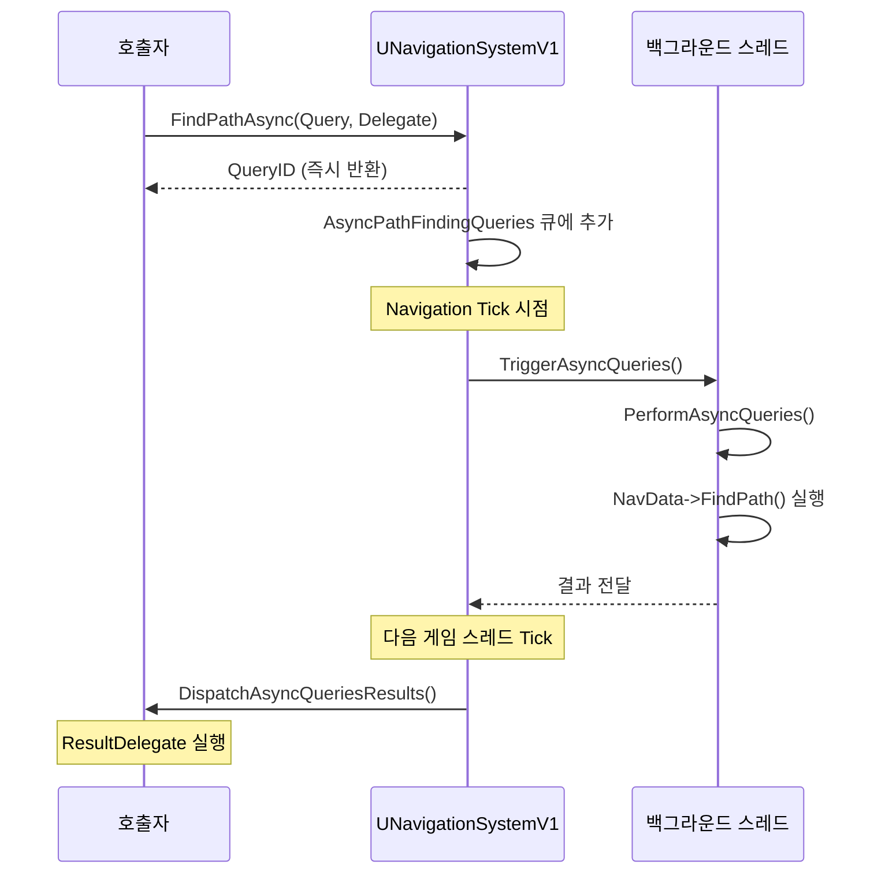

# 04. UE 길찾기 래퍼 계층

> **작성일**: 2026-04-16
> **엔진 버전**: UE 5.5

## 1. 개요

UE는 Detour 라이브러리를 직접 노출하지 않고 여러 계층의 래퍼를 통해 통합합니다.
이 문서는 `AAIController::MoveTo()` 호출이 Detour의 `findPath()`까지 도달하는 과정과,
그 결과가 다시 UE의 `FNavMeshPath`로 변환되는 과정을 분석합니다.

---

## 2. AAIController — 이동 요청 진입점

### 2.1 MoveToLocation()

```cpp
// AIController.cpp:593
EPathFollowingRequestResult::Type AAIController::MoveToLocation(
    const FVector& Dest,
    float AcceptanceRadius,
    bool bStopOnOverlap,
    bool bUsePathfinding,
    bool bProjectDestinationToNavigation,
    bool bCanStrafe,
    TSubclassOf<UNavigationQueryFilter> FilterClass,
    bool bAllowPartialPaths)
```

파라미터들을 `FAIMoveRequest`로 변환하여 `MoveTo()`에 전달하는 편의 함수입니다.

### 2.2 MoveTo() — 핵심 오케스트레이터

```cpp
// AIController.cpp:645
FPathFollowingRequestResult AAIController::MoveTo(
    const FAIMoveRequest& MoveRequest,
    FNavPathSharedPtr* OutPath)
```

전체 흐름:

```
MoveTo()
├── 1. MoveRequest 검증 (목적지 유효성, 에이전트 존재 여부)
├── 2. 목적지를 NavMesh에 투사 (bProjectDestinationToNavigation)
├── 3. 이미 목표 지점에 도달했는지 확인
├── 4. BuildPathfindingQuery()  ← FPathFindingQuery 생성
├── 5. FindPathForMoveRequest() ← NavigationSystem에 경로 탐색 위임
├── 6. MergePaths()             ← 기존 경로와 병합 (선택)
└── 7. PathFollowingComponent->RequestMove()  ← 경로 추적 시작
```

> **소스 확인 위치**
> - `MoveTo()`: `AIController.cpp:645-765`
> - `BuildPathfindingQuery()`: `AIController.cpp:822-878`
> - `FindPathForMoveRequest()`: `AIController.cpp:880-899`

### 2.3 BuildPathfindingQuery()

`FPathFindingQuery`를 구성합니다:

```cpp
// AIController.cpp:822
bool AAIController::BuildPathfindingQuery(
    const FAIMoveRequest& MoveRequest,
    const FVector& StartLocation,
    FPathFindingQuery& OutQuery) const
```

주요 동작:
1. `MoveRequest`에서 에이전트 속성에 맞는 `ARecastNavMesh`를 가져옴
2. 목표 위치 추출 (MoveToActor인 경우 `INavAgentInterface`로 오프셋 계산)
3. 네비게이션 필터 클래스 설정
4. `PathFollowingComponent->OnPathfindingQuery()`로 쿼리 커스터마이징 기회 제공

### 2.4 FindPathForMoveRequest()

```cpp
// AIController.cpp:880
void AAIController::FindPathForMoveRequest(
    const FAIMoveRequest& MoveRequest,
    FPathFindingQuery& Query,
    FNavPathSharedPtr& OutPath) const
{
    // NavigationSystem에 동기 경로 탐색 요청
    UNavigationSystemV1* NavSys = ...;
    NavSys->FindPathSync(Query);
}
```

---

## 3. UNavigationSystemV1 — 경로 탐색 분배기

### 3.1 FindPathSync()

```cpp
// NavigationSystem.cpp:1833
FPathFindingResult UNavigationSystemV1::FindPathSync(
    const FNavAgentProperties& AgentProperties,
    FPathFindingQuery Query,
    EPathFindingMode::Type Mode)
```

핵심 로직:
```cpp
// NavData가 설정되지 않았으면 에이전트에 맞는 NavData 가져오기
if (Query.NavData.IsValid() == false)
    Query.NavData = GetNavDataForProps(Query.NavAgentProperties);

// NavData의 FindPath() 가상 함수 호출 (ARecastNavMesh::FindPath())
Query.NavData->FindPath(AgentProperties, Query);
```

### 3.2 FindPathAsync()

```cpp
// NavigationSystem.cpp:1917
uint32 UNavigationSystemV1::FindPathAsync(
    const FNavAgentProperties& AgentProperties,
    FPathFindingQuery Query,
    const FNavPathQueryDelegate& ResultDelegate,
    EPathFindingMode::Type Mode)
```

비동기 경로 탐색은 다음 순서로 동작합니다:



> **소스 확인 위치**
> - `FindPathAsync()`: `NavigationSystem.cpp:1917`
> - `PerformAsyncQueries()`: `NavigationSystem.cpp:1999` — 백그라운드 스레드에서 FindPath() 실행
> - `DispatchAsyncQueriesResults()`: 게임 스레드에서 결과 델리게이트 호출

---

## 4. FPImplRecastNavMesh — Detour 브릿지

### 4.1 INITIALIZE_NAVQUERY 매크로

```cpp
// PImplRecastNavMesh.cpp:43
#define INITIALIZE_NAVQUERY(NavQueryVariable, NumNodes, LinkFilter)
```

**스레드 안전성**: Detour의 `dtNavMeshQuery`는 내부 상태를 가지므로 스레드 간 공유할 수 없습니다.
이 매크로는 실행 스레드에 따라 적절한 쿼리 객체를 선택합니다:

- **게임 스레드**: `SharedNavQuery` (미리 할당된 공유 인스턴스)
- **백그라운드 스레드**: 지역 변수로 새 `dtNavMeshQuery` 생성

### 4.2 FindPath()

```cpp
// PImplRecastNavMesh.cpp:1173
ENavigationQueryResult::Type FPImplRecastNavMesh::FindPath(
    const FVector& StartLoc,
    const FVector& EndLoc,
    const FVector::FReal CostLimit,
    const bool bRequireNavigableEndLocation,
    FNavMeshPath& Path,
    const FNavigationQueryFilter& InQueryFilter,
    const UObject* Owner) const
```

실행 흐름:

```
FPImplRecastNavMesh::FindPath()
│
├── 1. 입력 검증 (DetourNavMesh, QueryFilter 유효성)
│
├── 2. INITIALIZE_NAVQUERY(NavQuery, ...)
│      └── 스레드에 맞는 dtNavMeshQuery 준비
│
├── 3. InitPathfinding()
│      ├── UE 좌표 → Recast 좌표 변환 (Y축 반전, 스케일 적용)
│      └── findNearestPoly()로 StartPolyID, EndPolyID 확보
│
├── 4. NavQuery.findPath(StartPoly, EndPoly, StartPos, EndPos, CostLimit, Filter, Result)
│      └── ★ Detour A* 탐색 실행 → 폴리곤 코리더 생성
│
└── 5. PostProcessPathInternal(FindPathStatus, Path, NavQuery, Filter, ...)
       └── 결과를 FNavMeshPath로 변환
```

### 4.3 좌표 변환

UE와 Recast는 좌표계가 다릅니다:

| | UE | Recast |
|---|---|---|
| 상방 | Z-up | Y-up |
| 스케일 | cm | 실수값 |

`InitPathfinding()` 내부에서 `Unreal2RecastPoint()`로 변환하고,
결과를 `Recast2UnrealPoint()`로 역변환합니다.

### 4.4 PostProcessPathInternal()

```cpp
// PImplRecastNavMesh.cpp:1218
ENavigationQueryResult::Type FPImplRecastNavMesh::PostProcessPathInternal(
    dtStatus FindPathStatus, FNavMeshPath& Path, ...)
```

1. **단일 폴리곤**: 시작과 끝이 같은 폴리곤이면 직선 경로 반환
2. **PostProcessPath()** 호출:
   - 폴리곤 코리더를 `FNavMeshPath::PathCorridor`에 복사
   - 각 구간의 비용을 `PathCorridorCost`에 복사
   - 오프메시 링크 ID를 `CustomNavLinkIds`에 저장
3. **PerformStringPulling()**: 퍼널 알고리즘으로 최종 웨이포인트 생성

> **소스 확인 위치**
> - `FindPath()`: `PImplRecastNavMesh.cpp:1173-1215`
> - `PostProcessPathInternal()`: `PImplRecastNavMesh.cpp:1218`
> - `PostProcessPath()`: `PImplRecastNavMesh.cpp:1399`
> - `INITIALIZE_NAVQUERY`: `PImplRecastNavMesh.cpp:43`

---

## 5. FNavMeshPath — 경로 데이터

`FNavMeshPath`는 `FNavigationPath`를 상속하며, NavMesh 전용 데이터를 추가로 보유합니다.

### 5.1 2단계 데이터

| 필드 | 타입 | 설명 |
|------|------|------|
| `PathCorridor` | `TArray<NavNodeRef>` | A* 결과: 폴리곤 ID 시퀀스 |
| `PathCorridorCost` | `TArray<float>` | 각 코리더 구간의 비용 |
| `PathPoints` | `TArray<FNavPathPoint>` | String Pulling 결과: 최종 웨이포인트 |

### 5.2 String Pulling 실행

```cpp
// NavMeshPath.cpp:130-139
void FNavMeshPath::PerformStringPulling(...)
{
    ARecastNavMesh::FindStraightPath(...)
    // → 내부적으로 dtNavMeshQuery::findStraightPath() 호출
}
```

> **소스 확인 위치**
> - `FNavMeshPath`: `Engine/Source/Runtime/NavigationSystem/Public/NavMesh/NavMeshPath.h`
> - `PerformStringPulling()`: `Engine/Source/Runtime/NavigationSystem/Private/NavMesh/NavMeshPath.cpp:130`

---

## 6. dtQueryFilter와 UE의 FNavigationQueryFilter

### 6.1 계층 관계

```
UNavigationQueryFilter (UObject, 에디터에서 설정)
    │
    ▼
FNavigationQueryFilter (런타임 래퍼)
    │
    ▼
FRecastQueryFilter (Recast 전용 구현)
    │
    ▼
dtQueryFilter (Detour 라이브러리)
    └── dtQueryFilterData
        ├── m_areaCost[64]       // 영역별 이동 비용 가중치
        ├── m_areaFixedCost[64]  // 영역 진입 고정 비용
        ├── heuristicScale       // 휴리스틱 스케일 (기본 0.999)
        ├── m_includeFlags       // 포함 플래그
        ├── m_excludeFlags       // 제외 플래그
        ├── m_isBacktracking     // 역추적 허용 여부
        └── m_shouldIgnoreClosedNodes  // CLOSED 노드 무시 여부
```

### 6.2 영역 비용 커스터마이징 예시

```cpp
// UE C++에서 NavQueryFilter 설정
UNavigationQueryFilter* Filter = ...;
FRecastQueryFilter* RecastFilter = static_cast<FRecastQueryFilter*>(
    Filter->GetImplementation());

// '늪지대' 영역의 비용을 3배로 설정 → AI가 늪지대를 피하는 경로 선택
RecastFilter->SetAreaCost(ENavArea::Swamp, 3.0f);

// '절벽' 영역을 통과 불가로 설정
RecastFilter->SetAreaCost(ENavArea::Cliff, DT_UNWALKABLE_POLY_COST);
```

> **소스 확인 위치**
> - `dtQueryFilterData`: `DetourNavMeshQuery.h:66-91`
> - `passInlineFilter()`: `DetourNavMeshQuery.h:109-118`
> - `getInlineCost()`: `DetourNavMeshQuery.h:147-159`
