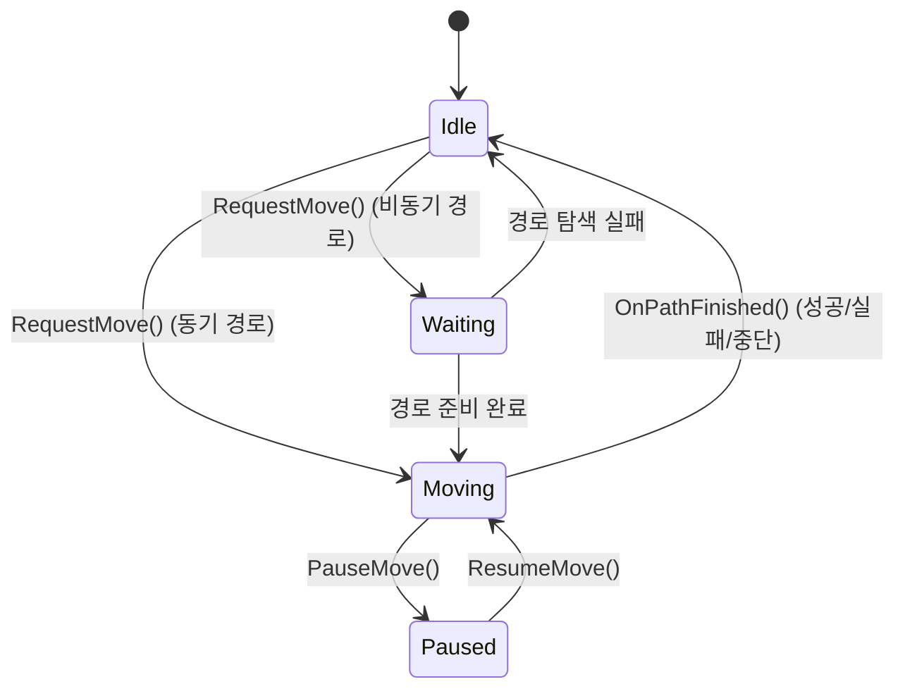

# 05. 경로 추적 — UPathFollowingComponent

> **작성일**: 2026-04-16
> **엔진 버전**: UE 5.5

## 1. 개요

`UPathFollowingComponent`는 계산된 경로(웨이포인트 목록)를 따라 AI 폰을 프레임 단위로 이동시키는 컴포넌트입니다.
경로를 수락하고, 웨이포인트를 순서대로 추적하며, NavLink 통과 및 도착 판정을 처리합니다.

> **소스 확인 위치**
> - 헤더: `Engine/Source/Runtime/AIModule/Public/Navigation/PathFollowingComponent.h`
> - 구현: `Engine/Source/Runtime/AIModule/Private/Navigation/PathFollowingComponent.cpp`

---

## 2. 상태 머신



| 상태 | 설명 | 캐릭터 이동 |
|------|------|-----------|
| `Idle` | 이동 없음 | 정지 |
| `Waiting` | 비동기 경로가 아직 준비되지 않음 (타이머로 대기) | **정지** — 경로 데이터가 없어 목표 방향을 알 수 없음 |
| `Moving` | 웨이포인트를 따라 이동 중 | 이동 중 (가속/속도 명령 계속 발행) |
| `Paused` | 일시 정지 (ResumeMove로 재개) | 정지 (경로는 유지됨) |

### 2.1 Waiting 상태 동작 상세

`Waiting`은 **비동기 경로 요청 직후 아직 결과 콜백이 오지 않은 상태**입니다. 이 시간 동안:

- 캐릭터는 **그 자리에 정지**합니다. `PathFollowingComponent`는 아직 경로가 없으므로 `RequestPathMove` / `RequestDirectMove`를 호출하지 않음 → MovementComponent가 이동 입력을 못 받음 → 가속 0 → 정지.
- 내부적으로 타이머가 돌며 `FindPathAsync`의 완료를 기다립니다. 완료되면 델리게이트 콜백이 `HandlePathUpdateEvent()`를 호출하여 `Moving` 상태로 전환.
- 타임아웃 또는 탐색 실패 시 `Idle`로 복귀하면서 `OnMoveCompleted(Failed)` 브로드캐스트.

**실무에서 주의할 점**:
- 비동기 경로를 쓰면 요청 직후 **1~N 프레임 정지**가 발생합니다 (게임 스레드의 다음 Navigation Tick까지 대기 + 백그라운드 탐색 + 결과 디스패치)
- 플레이어가 본능적으로 "왜 멈춰있지?"로 느낄 수 있음 → 애니메이션 블렌드 등으로 자연스럽게 처리하거나, 즉시성이 중요한 상황(회피 등)에서는 동기 탐색 사용 권장

---

## 3. 경로 수락: RequestMove()

```cpp
// PathFollowingComponent.cpp:351
FAIRequestID UPathFollowingComponent::RequestMove(
    const FAIMoveRequest& RequestData,
    FNavPathSharedPtr InPath)
```

주요 동작:

```
RequestMove()
├── 1. 검증: 경로 유효성, 수락 반경 확인
├── 2. 기존 이동 요청이 있으면 중단 (AbortMove)
├── 3. 경로 참조 저장
├── 4. 경로 옵저버 등록 → OnPathEvent()로 무효화 통지 수신
├── 5. 상태 설정:
│      ├── 경로 준비 완료 → Moving + SetMoveSegment(0)
│      └── 경로 미완료 (비동기) → Waiting + 타이머 설정
└── 6. FAIRequestID 반환
```

**경로 옵저버 등록**: 경로가 무효화(NavMesh 변경, 골 액터 이동 등)되면 `OnPathEvent()`를 통해 통지받습니다.

> **소스 확인 위치**
> - `RequestMove()`: `PathFollowingComponent.cpp:351-467`

---

## 4. 프레임별 이동: FollowPathSegment()

```cpp
// PathFollowingComponent.cpp:1116
void UPathFollowingComponent::FollowPathSegment(float DeltaTime)
```

매 프레임 호출되어 현재 세그먼트(웨이포인트 간 구간)를 따라 이동합니다.

```
FollowPathSegment(DeltaTime)
│
├── 현재 위치와 목표 웨이포인트 가져오기
│
├── 커스텀 NavLink 통과 중인지 확인
│
├── 가속 기반 이동 (CharacterMovementComponent 사용 시):
│   ├── 이동 입력 방향 계산
│   ├── 감속 필요 여부 판정 (목표 근접 시)
│   └── RequestPathMove(CurrentMoveInput)
│
└── 직접 속도 기반 이동:
    └── RequestDirectMove(Velocity, bNotLastSegment)
```

### 4.1 이동 입력 vs 직접 이동

| 방식 | 함수 | 사용 조건 | 무엇을 넘기나 |
|------|------|----------|----------------|
| 가속 기반 | `RequestPathMove(MoveInput)` | `UCharacterMovementComponent` 사용 시 | 이동 **방향 벡터** — MovementComponent가 가속/감속/최대속도 적용 |
| 속도 직접 설정 | `RequestDirectMove(Velocity)` | 날아다니는 유닛, RVO 에이전트 등 | **최종 속도 벡터** — 관성/가속 없이 즉시 반영 |

#### 직접 이동 모드도 경로 탐색은 여전히 필요하다

**"속도 직접 설정하면 길찾기 없이 그냥 이동 가능?"**에 답하면: **아닙니다. 여전히 경로가 필요합니다.**

`RequestDirectMove`는 **경로 세그먼트를 따라가는 데 사용할 속도 벡터를 제공**하는 역할이지, "경로 없이 직진"이 아닙니다. 호출 시점의 `Velocity` 계산은:

```cpp
FVector MoveDirection = (NextWaypoint - CurrentLocation).GetSafeNormal();
FVector Velocity = MoveDirection * MaxSpeed;
NavMovementInterface->RequestDirectMove(Velocity, bNotLastSegment);
```

→ 여전히 **웨이포인트가 있어야** 방향이 나옵니다. 경로가 없으면 어디로 가야 할지 모르니까 이동할 수 없습니다.

**"갈 수 있는지 여부만 판단"이 목표라면** — 그건 길찾기가 아니라 **경로 존재 테스트(`TestPathSync`)**입니다:

```cpp
// 경로 여부만 빠르게 확인 (전체 경로 구성 없이)
bool bHasPath = NavSys->TestPathSync(Query, EPathFindingMode::Regular);
```

`TestPathSync`는 A* 탐색은 수행하지만 코리더 복원·퍼널 실행을 생략해서 가볍습니다. "닿을 수 있는가?"만 판정할 때 사용.

**두 방식의 역할 구분**:
| 목적 | 호출 |
|------|------|
| 실제로 이동시킬 경로가 필요 | `FindPathSync` / `FindPathAsync` |
| 경로 존재 여부만 빠르게 체크 | `TestPathSync` / `TestPathAsync` |
| 이미 있는 경로를 따라가며 매 프레임 속도 계산 | `RequestDirectMove` 또는 `RequestPathMove` |

**언제 `RequestDirectMove`를 쓰나** — 주로:
- 비행 유닛, 수중 유닛 (캐릭터 이동의 가속 모델이 안 맞음)
- DetourCrowd RVO 회피를 사용하는 경우 (Crowd가 속도를 직접 내고 싶어 함)
- 커스텀 이동 로직 (그랩, 당기기 등)

> **소스 확인 위치**
> - `FollowPathSegment()`: `PathFollowingComponent.cpp:1116-1161`

---

## 5. 웨이포인트 도달 판정 및 세그먼트 전환

### 5.1 도달 판정

매 프레임 현재 위치가 목표 웨이포인트의 **수락 반경** 안에 들어왔는지 확인합니다.

도달 판정에 영향을 주는 요소:
- `AcceptanceRadius`: MoveRequest에서 설정한 수락 반경
- `bStopOnOverlap`: 액터 충돌 영역 겹침 시 도달로 판정
- NavLink의 경우 별도의 `NavLinkAcceptanceRadius` 사용

### 5.2 세그먼트 전환

웨이포인트에 도달하면:

```
도달 판정 성공
├── 현재가 마지막 웨이포인트 → OnPathFinished(Success)
├── 현재가 NavLink 진입점 → StartUsingCustomLink()
└── 아니면 → SetMoveSegment(다음 인덱스)
    └── 다음 웨이포인트를 향해 계속 이동
```

### 5.3 Crowd Simulation과의 호환 — 웨이포인트를 안 밟고 지나가는 경우

DetourCrowd(RVO 기반 군집 회피)를 사용하면 AI가 **다른 유닛 회피를 위해 웨이포인트를 직접 통과하지 않고 옆으로 돌아가는** 상황이 흔히 발생합니다. 이때도 경로 추적이 깨지지 않는 이유는 `PathFollowingComponent`가 **엄격한 순서 추적이 아닌 "가장 가까운 세그먼트" 기반**으로 동작하기 때문입니다.

**핵심 메커니즘**:

1. **Path Corridor Optimization** — DetourCrowd는 매 프레임 에이전트의 실제 위치를 기반으로 `dtPathCorridor::optimizePathVisibility()` / `optimizePathTopology()`를 호출합니다. 이는 "지금 위치에서 다음 웨이포인트를 직접 볼 수 있으면 중간 웨이포인트를 건너뛴다"라는 동작.

2. **`SwitchToMoveSegment` / 근접 기반 스킵** — `PathFollowingComponent`의 `UpdateMoveSegment()` 계열 로직은 "에이전트가 현재 세그먼트를 지나쳤는가"를 판정하여 자동으로 다음 세그먼트로 진입합니다. 에이전트 위치를 각 세그먼트에 투영해서 거리가 짧아지는 방향으로 이동시킴.

3. **DetourCrowd와 PathFollowingComponent 연동** — DetourCrowd 에이전트는 자체적으로 속도를 계산하고, PathFollowingComponent는 "어떤 경로를 따라가야 하는가"만 관리. Crowd가 낸 속도가 웨이포인트를 우회하는 방향이어도, PathFollowingComponent는 새 위치에서 "가장 적절한" 세그먼트를 다시 찾아 인덱스를 갱신합니다.

**"인덱싱이 어긋나는 것처럼 보이는" 현상의 정체**:
- 웨이포인트 인덱스 1→2→3 순서가 아니라 1→3로 점프하는 경우가 정상 동작. "2를 건너뛴 게 아니라 2가 이미 불필요해져서 스킵한 것"
- 디버그 시각화에서 에이전트 위치와 "현재 세그먼트 인덱스"가 직관과 달라 보일 수 있지만, 실제 이동은 문제없음
- **진짜 문제는 경로에서 너무 멀리 이탈했을 때** — 이 경우 `OffPath` 결과로 이동이 종료되거나 경로 재탐색이 트리거됨

**문제 발생 조건과 회피**:
| 상황 | 결과 | 완화 |
|------|------|------|
| 다른 유닛 회피로 1~2m 우회 | 정상 — 자동 세그먼트 스킵 | — |
| 장애물에 완전히 막혀 경로 이탈 | `OffPath` → 재탐색 | `bReachTestIncludesAgentRadius` 조정 |
| Crowd RVO와 좁은 문의 상충 | 데드락 가능 | 문을 넓히거나 NavModifier로 우회 유도 |

즉 DetourCrowd와의 조합은 **의도된 설계**이고, 웨이포인트를 건너뛰는 것 자체는 문제가 아닙니다.

자세한 Crowd 시스템은 [Docs/AI/DetourCrowd/](../../DetourCrowd) 참고 (작성 예정, 이슈 #11).

---

## 6. NavLink(커스텀 링크) 통과

NavLink는 점프대, 문, 사다리, **순간이동**, 엘리베이터 등 특수한 이동을 처리하는 커스텀 연결입니다. A* 탐색에서는 두 폴리곤을 잇는 **가상의 에지**로 취급되며, 실제 이동은 링크 구현체의 커스텀 로직으로 처리됩니다.

### 6.1 NavLink 활용 예시 — 순간이동 포함

"이걸로 순간이동도 가능한가? 그리고 A*가 순간이동 후 비용까지 고려해서 최적 경로를 고를 수 있나?" — **둘 다 YES**입니다.

**NavLink로 가능한 이동 유형**:
| 유형 | NavLink 역할 | 구현 예 |
|------|--------------|---------|
| 점프대 | 포물선 이동 | `OnLinkMoveStarted`에서 LaunchCharacter |
| 사다리/로프 | 애니메이션 기반 수직 이동 | Animation Montage 재생 |
| 문/엘리베이터 | 상호작용 후 통과 | 문 열기 대기 후 TeleportTo |
| **순간이동** | 즉시 위치 이동 | `OnLinkMoveStarted`에서 `SetActorLocation(DestPoint)` 후 `ResumePathFollowing` |
| 워프 포탈 | 페이드 효과 + 이동 | Timeline으로 페이드 → SetActorLocation |

**비용 기반 라우팅**:

A*는 NavLink를 **폴리곤 A → 폴리곤 B 간의 에지**로 보고, 그 에지의 비용은 **링크가 참조하는 `UNavArea` 서브클래스의 `DefaultCost`**로 계산됩니다. 즉 길찾기 단계에서 NavLink가 자동으로 포함됩니다 — 사용자가 명시적으로 "순간이동 쓸래 말래" 분기할 필요가 없습니다.

```
시나리오: 목표까지 걷는 길 100m, 순간이동 링크를 통하면 10m

A*의 비용 계산:
  - 걷는 경로: 100 × 1.0 (도로 가중치) = 100
  - 순간이동 경로: 10 (링크 앞까지) + 5 (NavAreaTeleport.DefaultCost) + 10 (링크 후) = 25

→ A*가 자동으로 순간이동 경로 선택
```

**핵심은 `DefaultCost` 설정**:
```cpp
// UNavAreaTeleport.h (프로젝트 커스텀)
UCLASS()
class UNavAreaTeleport : public UNavArea
{
    GENERATED_BODY()
public:
    UNavAreaTeleport()
    {
        DefaultCost = 5.0f;  // 순간이동 에지 고정 비용
        FixedAreaEnteringCost = 0.0f;
    }
};
```

- `DefaultCost` 낮게 → 순간이동 선호
- `DefaultCost` 높게 → 우회가 훨씬 짧을 때만 사용 (쿨다운 중인 스킬 등의 모델링)
- `DefaultCost = FLT_MAX` → 완전히 비활성화 (특정 필터에서만 통과하게 제한)

필터별로도 다르게 적용 가능:
```cpp
// "걸어다니는 NPC"는 순간이동 불가
FilterWalkOnly->SetAreaCost(UNavAreaTeleport::StaticClass(), FLT_MAX);

// "플레이어가 조종하는 AI 동반자"만 순간이동 사용
FilterCompanion->SetAreaCost(UNavAreaTeleport::StaticClass(), 1.0f);
```

### 6.2 NavLink 배치 및 식별

"어떻게 링크를 월드에 표시하고, 경로 추적자는 어떤 링크인지 어떻게 아는가?"

**배치 방법 3가지**:

| 방법 | 사용 시기 | 구현 |
|------|----------|------|
| **`ANavLinkProxy` 액터** | 정적 링크 (레벨 디자이너가 배치) | 에디터에서 액터 배치. Left/Right 끝점을 기즈모로 지정 |
| **`UNavLinkCustomComponent`** | 액터에 부착된 동적 링크 | 문/엘리베이터 액터에 컴포넌트 추가. 열렸을 때만 활성화 등 |
| **NavMesh 자동 생성** | 낙하 가능 지점 자동 탐지 | NavMesh 빌드 설정에서 `bGenerateNavLinks` 활성화 |

`ANavLinkProxy`의 에디터 작업 흐름:
```
1. Place Actor → NavLinkProxy 배치
2. Details 패널에서:
   - Point Links: Left Point / Right Point 좌표
   - Direction: BothWays, LeftToRight, RightToLeft
   - Smart Link: 커스텀 로직 쓸지 여부
   - Link Area Class: UNavArea 서브클래스 지정 (비용 결정)
3. NavMesh 빌드 시 자동으로 해당 폴리곤 연결에 포함
```

**식별 메커니즘**:

각 링크는 고유한 `FNavLinkId`를 가집니다 (`NavLinkCustomInterface.h:60`). NavMesh 빌드 시점에 이 ID가 **dtOffMeshConnection.userId** 필드에 저장되고, A* 탐색 결과의 웨이포인트(`FNavPathPoint`)에 `CustomNavLinkId`로 전달됩니다.

```
NavMesh 빌드 단계:
  NavLinkProxy.GetId() → FNavLinkId → dtOffMeshConnection.userId

경로 탐색 시:
  PathPoint.CustomNavLinkId = dtOffMeshConnection.userId
  
통과 시작 시:
  INavLinkCustomInterface* Link =
      NavSys->GetCustomLink(PathPoint.CustomNavLinkId);
  // → 해당 NavLinkProxy/SmartLinkComponent 인스턴스를 찾아냄
```

즉 **ID로 링크 인스턴스를 역조회**합니다. NavigationSystem이 모든 NavLink를 ID → 인스턴스 맵으로 관리하고 있음.

### 6.3 감지

```cpp
// PathFollowingComponent.cpp:930 부근
// 현재 웨이포인트에 CustomNavLinkId가 있는지 확인
if (PathPoint.CustomNavLinkId != 0)
{
    // NavigationSystem에서 INavLinkCustomInterface 가져오기
    INavLinkCustomInterface* CustomNavLink = ...;
}
```

### 6.4 통과 시작

```cpp
// PathFollowingComponent.cpp:1454 부근
void UPathFollowingComponent::StartUsingCustomLink(
    INavLinkCustomInterface* CustomNavLink,
    const FVector& DestPoint)
{
    // 이전 링크가 있으면 종료
    FinishUsingCustomLink(CurrentCustomLinkOb);
    
    // 새 링크 통과 시작
    CurrentCustomLinkOb = CustomNavLink;
    CustomNavLink->OnLinkMoveStarted(this, DestPoint);
    // → NavLink 구현이 점프, 텔레포트, 애니메이션 등 커스텀 이동 처리
}
```

### 6.5 통과 완료 — 누가, 언제 호출하는가?

```cpp
// PathFollowingComponent.cpp:1481 부근
void UPathFollowingComponent::FinishUsingCustomLink(
    INavLinkCustomInterface* CustomNavLink)
{
    CustomNavLink->OnLinkMoveFinished(this);
    // → 정상 경로 추적 재개
}
```

**핵심 원칙: 링크 구현체가 "끝났다"고 알려준다.**

`INavLinkCustomInterface::OnLinkMoveStarted()`의 반환값이 열쇠입니다:

```cpp
// NavLinkCustomInterface.h:76-79
/** Notify called when agent starts using this link for movement.
 *  returns true = custom movement, path following will NOT update velocity 
 *                 until FinishUsingCustomLink() is called on it
 */
virtual bool OnLinkMoveStarted(class UObject* PathComp, const FVector& DestPoint) { return false; }
```

- `return false` → "링크가 별도 로직을 쓰지 않음". PathFollowingComponent가 **자동으로 종점 도달 시** 완료 처리 (기본 도달 판정 사용).
- `return true` → "링크가 커스텀 이동 중". PathFollowingComponent는 속도 갱신을 멈추고 링크의 완료 신호를 기다림. 링크 구현체는 **명시적으로 `PathComp->FinishUsingCustomLink(this)`를 호출**해야 함.

**실제 사례**:
| 링크 유형 | OnLinkMoveStarted 반환 | 완료 신호 시점 |
|-----------|------------------------|----------------|
| 점프대 (단순 LaunchCharacter) | `false` | 종점 근처 도달 시 PFC가 자동 감지 |
| 애니메이션 기반 (사다리 등) | `true` | 애니메이션 NotifyEvent에서 `FinishUsingCustomLink` 호출 |
| 문 통과 (문 열림 대기) | `true` | 문 OnOpenComplete 이벤트에서 호출 |
| 순간이동 | `true` | `SetActorLocation` 직후 즉시 호출 |

또는 `IsLinkUsingCustomReachCondition` + `HasReachedLinkStart` 를 오버라이드해서 **커스텀 도달 판정**을 쓸 수도 있습니다 (`NavLinkCustomInterface.h:84-90`).

**그 외 자동 종료 경로**:
- `OnPathFinished()` 호출 시 — 이동 전체가 끝나면 활성 링크도 함께 종료 (`PathFollowingComponent.cpp:582-587`)
- `AbortMove()` 호출 시 — 중단 시에도 정리
- 새 `StartUsingCustomLink` 호출 시 — 이전 링크를 먼저 정리 (`:1456-1461`)

```mermaid
sequenceDiagram
    participant PFC as PathFollowingComp
    participant Link as NavLink Impl
    participant AI as AI Pawn
    
    PFC->>PFC: NavLink 진입점 도달
    PFC->>Link: StartUsingCustomLink
    Link->>Link: OnLinkMoveStarted returns true
    Link->>AI: 커스텀 이동 실행
    Note over AI,Link: 점프 or 애니메이션 or 순간이동
    AI->>Link: 목적지 도달 또는 Notify 이벤트
    Link->>PFC: FinishUsingCustomLink 호출
    PFC->>Link: OnLinkMoveFinished
    PFC->>PFC: 다음 세그먼트로 재개
```

> **소스 확인 위치**
> - NavLink 감지: `PathFollowingComponent.cpp:930` 부근
> - `StartUsingCustomLink()`: `PathFollowingComponent.cpp:1454` 부근
> - `FinishUsingCustomLink()`: `PathFollowingComponent.cpp:1481` 부근
> - `OnPathFinished`에서 자동 종료: `PathFollowingComponent.cpp:582-587`
> - `INavLinkCustomInterface`: `Engine/Source/Runtime/NavigationSystem/Public/NavLinkCustomInterface.h:39-110`
> - `NavLinkCustomInterface.h:76-79` — `OnLinkMoveStarted` 반환값 의미
> - `ANavLinkProxy`: `Engine/Source/Runtime/NavigationSystem/Public/NavLinkProxy.h`

---

## 7. 부분 경로(Partial Path) 처리

목표에 도달할 수 없을 때 Detour는 `DT_PARTIAL_RESULT` 플래그와 함께 가장 가까운 지점까지의 경로를 반환합니다.

```
FNavMeshPath.bIsPartial = true
```

`UPathFollowingComponent`의 부분 경로 처리:

1. `bAllowPartialPaths`가 true면 부분 경로라도 추적 시작
2. 골 액터로의 이동인 경우 골 위치 관찰(observation) 유지
3. 골 액터가 도달 가능한 위치로 이동하면 자동으로 재탐색

### 7.1 "일단 이동하면서 계속 목표를 지켜본다"는 패턴

정확한 이해입니다. 부분 경로는 "실패"가 아니라 **"현재 정보 기준으로 할 수 있는 최선 + 상황이 바뀌면 다시 시도"**로 처리됩니다.

```
시나리오: 목표 폴리곤이 아직 스트리밍 안 된 타일에 있음

T=0: MoveTo 호출
  → FindPathSync 반환: bIsPartial=true, 웨이포인트는 "스트리밍된 영역의 끝"까지

T=0~: PathFollowingComponent가 부분 경로 따라 이동 시작
       (현재 경로의 마지막 지점을 향해)

T=2s: 이동 중 전방 타일이 스트리밍 인
  → NavMesh 타일 추가됨
  → 기존 경로 Invalidate 발생
  → OnPathEvent(Invalidated) → AutoRepath 트리거
  → 확장된 NavMesh에서 새 경로 탐색

T=2s+α: 새 경로(완전/부분)로 계속 이동
  → 이 과정이 목표 도달까지 반복
```

**동시에 관찰되는 것들**:
- **골 액터 이동** — `TickPathObservation()`이 매 틱 골 위치 변화 감지. 거리가 `GoalActorLocationTolerance` 초과 시 Invalidate + 재탐색
- **NavMesh 변경** — 타일 리빌드/스트리밍 이벤트가 경로 데이터를 Invalidate
- **경로 유효성** — `bUpToDate` 플래그가 매 사용 시점 검증됨

상세 재탐색 메커니즘은 [06-path-invalidation.md](06-path-invalidation.md) 참고.

**두 가지 모드 비교**:

| 설정 | 동작 |
|------|------|
| `bAllowPartialPaths = true` (기본) | 부분 경로 수락 → 이동 시작 → 상황 바뀌면 재탐색 |
| `bAllowPartialPaths = false` | 부분 경로 거부 → `OnMoveCompleted(Failed)` 즉시 반환 |

기본값이 true인 이유: 월드 파티션 / 동적 장애물 / 골 액터 추적 등 **상황이 변할 가능성이 있는 경우가 일반적**이기 때문. 완벽한 경로만 수락하면 "못 찾음 → 실패"로 끝나지만, 부분 경로는 "일단 출발 → 가는 길에 해결"이 가능합니다.

**주의 사항**:
- 부분 경로의 끝이 **목표와 전혀 연결되지 않는 방향**일 수도 있음 (A*가 "가장 가까이 다가간 지점"을 반환하는 것뿐)
- 무한히 재탐색이 반복되지 않도록 `TimeLimit`이나 상위 레벨의 리트라이 로직이 필요할 수 있음
- 골 액터가 계속 도달 불가 영역에 머물면 AI가 경계 근처에서 어슬렁거리는 형태가 됨 → BT/FSM에서 fallback 처리 권장

---

## 8. 이동 완료/중단

### 8.1 OnPathFinished()

이동이 끝나면 (성공, 실패, 중단 불문) `OnPathFinished()`가 호출됩니다:

```
OnPathFinished(Result)
├── 경로 옵저버 해제
├── 상태를 Idle로 전환
├── MovementComponent에 정지 요청
└── AAIController::OnMoveCompleted() 브로드캐스트
```

### 8.2 결과 코드

| `EPathFollowingResult` | 의미 |
|------------------------|------|
| `Success` | 목표 지점 도달 |
| `Blocked` | 이동 중 막힘 |
| `OffPath` | 경로에서 이탈 |
| `Aborted` | 외부에서 중단됨 (새 이동 요청, 경로 무효화 등) |
