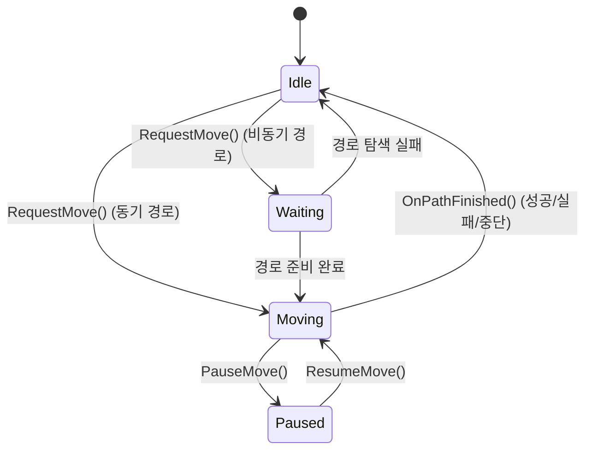

# 05. 경로 추적 — UPathFollowingComponent

> **작성일**: 2026-04-16
> **엔진 버전**: UE 5.5

## 1. 개요

`UPathFollowingComponent`는 계산된 경로(웨이포인트 목록)를 따라 AI 폰을 프레임 단위로 이동시키는 컴포넌트입니다.
경로를 수락하고, 웨이포인트를 순서대로 추적하며, NavLink 통과 및 도착 판정을 처리합니다.

> **소스 확인 위치**
> - 헤더: `Engine/Source/Runtime/AIModule/Public/Navigation/PathFollowingComponent.h`
> - 구현: `Engine/Source/Runtime/AIModule/Private/Navigation/PathFollowingComponent.cpp`

---

## 2. 상태 머신



| 상태 | 설명 |
|------|------|
| `Idle` | 이동 없음 |
| `Waiting` | 비동기 경로가 아직 준비되지 않음 (타이머로 대기) |
| `Moving` | 웨이포인트를 따라 이동 중 |
| `Paused` | 일시 정지 (ResumeMove로 재개) |

---

## 3. 경로 수락: RequestMove()

```cpp
// PathFollowingComponent.cpp:351
FAIRequestID UPathFollowingComponent::RequestMove(
    const FAIMoveRequest& RequestData,
    FNavPathSharedPtr InPath)
```

주요 동작:

```
RequestMove()
├── 1. 검증: 경로 유효성, 수락 반경 확인
├── 2. 기존 이동 요청이 있으면 중단 (AbortMove)
├── 3. 경로 참조 저장
├── 4. 경로 옵저버 등록 → OnPathEvent()로 무효화 통지 수신
├── 5. 상태 설정:
│      ├── 경로 준비 완료 → Moving + SetMoveSegment(0)
│      └── 경로 미완료 (비동기) → Waiting + 타이머 설정
└── 6. FAIRequestID 반환
```

**경로 옵저버 등록**: 경로가 무효화(NavMesh 변경, 골 액터 이동 등)되면 `OnPathEvent()`를 통해 통지받습니다.

> **소스 확인 위치**
> - `RequestMove()`: `PathFollowingComponent.cpp:351-467`

---

## 4. 프레임별 이동: FollowPathSegment()

```cpp
// PathFollowingComponent.cpp:1116
void UPathFollowingComponent::FollowPathSegment(float DeltaTime)
```

매 프레임 호출되어 현재 세그먼트(웨이포인트 간 구간)를 따라 이동합니다.

```
FollowPathSegment(DeltaTime)
│
├── 현재 위치와 목표 웨이포인트 가져오기
│
├── 커스텀 NavLink 통과 중인지 확인
│
├── 가속 기반 이동 (CharacterMovementComponent 사용 시):
│   ├── 이동 입력 방향 계산
│   ├── 감속 필요 여부 판정 (목표 근접 시)
│   └── RequestPathMove(CurrentMoveInput)
│
└── 직접 속도 기반 이동:
    └── RequestDirectMove(Velocity, bNotLastSegment)
```

### 4.1 이동 입력 vs 직접 이동

| 방식 | 함수 | 사용 조건 |
|------|------|----------|
| 가속 기반 | `RequestPathMove()` | `UCharacterMovementComponent` 사용 시 |
| 속도 직접 설정 | `RequestDirectMove()` | 일반 `UNavMovementComponent` 사용 시 |

> **소스 확인 위치**
> - `FollowPathSegment()`: `PathFollowingComponent.cpp:1116-1161`

---

## 5. 웨이포인트 도달 판정 및 세그먼트 전환

### 5.1 도달 판정

매 프레임 현재 위치가 목표 웨이포인트의 **수락 반경** 안에 들어왔는지 확인합니다.

도달 판정에 영향을 주는 요소:
- `AcceptanceRadius`: MoveRequest에서 설정한 수락 반경
- `bStopOnOverlap`: 액터 충돌 영역 겹침 시 도달로 판정
- NavLink의 경우 별도의 `NavLinkAcceptanceRadius` 사용

### 5.2 세그먼트 전환

웨이포인트에 도달하면:

```
도달 판정 성공
├── 현재가 마지막 웨이포인트 → OnPathFinished(Success)
├── 현재가 NavLink 진입점 → StartUsingCustomLink()
└── 아니면 → SetMoveSegment(다음 인덱스)
    └── 다음 웨이포인트를 향해 계속 이동
```

---

## 6. NavLink(커스텀 링크) 통과

NavLink는 점프대, 문, 사다리 등 특수한 이동을 처리하는 커스텀 연결입니다.

### 6.1 감지

```cpp
// PathFollowingComponent.cpp:930 부근
// 현재 웨이포인트에 CustomNavLinkId가 있는지 확인
if (PathPoint.CustomNavLinkId != 0)
{
    // NavigationSystem에서 INavLinkCustomInterface 가져오기
    INavLinkCustomInterface* CustomNavLink = ...;
}
```

### 6.2 통과 시작

```cpp
// PathFollowingComponent.cpp:1454 부근
void UPathFollowingComponent::StartUsingCustomLink(
    INavLinkCustomInterface* CustomNavLink,
    const FVector& DestPoint)
{
    // 이전 링크가 있으면 종료
    FinishUsingCustomLink(CurrentCustomLinkOb);
    
    // 새 링크 통과 시작
    CurrentCustomLinkOb = CustomNavLink;
    CustomNavLink->OnLinkMoveStarted(this, DestPoint);
    // → NavLink 구현이 점프, 텔레포트, 애니메이션 등 커스텀 이동 처리
}
```

### 6.3 통과 완료

```cpp
// PathFollowingComponent.cpp:585 부근
void UPathFollowingComponent::FinishUsingCustomLink(
    INavLinkCustomInterface* CustomNavLink)
{
    CustomNavLink->OnLinkMoveFinished(this);
    // → 정상 경로 추적 재개
}
```

```mermaid
sequenceDiagram
    participant PFC as PathFollowingComponent
    participant Link as INavLinkCustomInterface
    participant AI as AI Pawn
    
    PFC->>PFC: NavLink 웨이포인트 도달
    PFC->>Link: StartUsingCustomLink()
    Link->>Link: OnLinkMoveStarted()
    Link->>AI: 커스텀 이동 (점프, 애니메이션 등)
    AI-->>PFC: 목적지 도달
    PFC->>Link: FinishUsingCustomLink()
    Link->>Link: OnLinkMoveFinished()
    PFC->>PFC: 다음 세그먼트로 이동 재개
```

> **소스 확인 위치**
> - NavLink 감지: `PathFollowingComponent.cpp:930` 부근
> - `StartUsingCustomLink()`: `PathFollowingComponent.cpp:1454` 부근
> - `FinishUsingCustomLink()`: `PathFollowingComponent.cpp:585` 부근

---

## 7. 부분 경로(Partial Path) 처리

목표에 도달할 수 없을 때 Detour는 `DT_PARTIAL_RESULT` 플래그와 함께 가장 가까운 지점까지의 경로를 반환합니다.

```
FNavMeshPath.bIsPartial = true
```

`UPathFollowingComponent`의 부분 경로 처리:

1. `bAllowPartialPaths`가 true면 부분 경로라도 추적 시작
2. 골 액터로의 이동인 경우 골 위치 관찰(observation) 유지
3. 골 액터가 도달 가능한 위치로 이동하면 자동으로 재탐색

---

## 8. 이동 완료/중단

### 8.1 OnPathFinished()

이동이 끝나면 (성공, 실패, 중단 불문) `OnPathFinished()`가 호출됩니다:

```
OnPathFinished(Result)
├── 경로 옵저버 해제
├── 상태를 Idle로 전환
├── MovementComponent에 정지 요청
└── AAIController::OnMoveCompleted() 브로드캐스트
```

### 8.2 결과 코드

| `EPathFollowingResult` | 의미 |
|------------------------|------|
| `Success` | 목표 지점 도달 |
| `Blocked` | 이동 중 막힘 |
| `OffPath` | 경로에서 이탈 |
| `Aborted` | 외부에서 중단됨 (새 이동 요청, 경로 무효화 등) |
