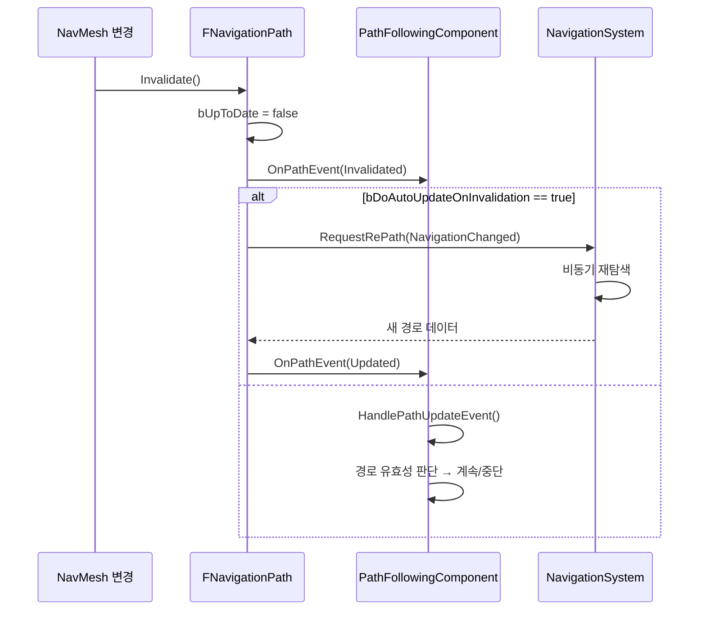

# 06. 경로 무효화 및 재탐색 메커니즘

> **작성일**: 2026-04-16
> **엔진 버전**: UE 5.5

## 1. 개요

NavMesh가 런타임에 변경되거나 골 액터가 이동하면, 기존 경로가 더 이상 유효하지 않을 수 있습니다.
UE는 **옵저버 패턴**을 통해 경로 무효화를 감지하고, 자동으로 재탐색을 수행합니다.

---

## 2. 경로 무효화 흐름



---

## 3. FNavigationPath::Invalidate()

```cpp
// NavigationPath.cpp:172
void FNavigationPath::Invalidate()
{
    bUpToDate = false;
    
    // 옵저버들에게 무효화 통지
    PathObserverDelegate.Broadcast(this, ENavPathEvent::Invalidated);
    
    if (bDoAutoUpdateOnInvalidation)
    {
        // 자동 재탐색 요청
        NavigationData->RequestRePath(SharedThis(this), ENavPathUpdateType::NavigationChanged);
    }
}
```

### 3.1 무효화 트리거

| 트리거 | 설명 |
|--------|------|
| NavMesh 타일 변경 | 동적 장애물 추가/제거, NavModifier 변경 등으로 타일이 리빌드됨 |
| Nav Bounds 변경 | 네비게이션 볼륨이 추가/제거/이동됨 |
| 골 액터 이동 | MoveToActor 시 대상 액터가 이동함 |

> **소스 확인 위치**
> - `Invalidate()`: `Engine/Source/Runtime/NavigationSystem/Private/NavigationPath.cpp:172`

---

## 4. 골 액터 이동 감지: TickPathObservation()

`MoveToActor()`로 이동 중일 때, 매 틱마다 골 액터의 위치 변화를 관찰합니다.

```
TickPathObservation()
├── 골 액터의 현재 위치 가져오기
├── 마지막으로 기록한 위치와 비교
├── 이동 거리 > Tether Distance?
│   ├── Yes → Invalidate() + RequestRePath()
│   └── No → 아무 것도 안 함
└── 현재 위치를 기록
```

Tether Distance는 "골 액터가 이 이상 움직이면 경로를 다시 찾겠다"는 임계값입니다.

> **소스 확인 위치**
> - `TickPathObservation()`: `NavigationPath.cpp` — `GoalActorLocationTolerance` 비교

---

## 5. UPathFollowingComponent::OnPathEvent()

경로 옵저버가 무효화/갱신 이벤트를 수신합니다:

```cpp
// PathFollowingComponent.cpp:263
void UPathFollowingComponent::OnPathEvent(
    FNavigationPath* InPath,
    ENavPathEvent::Type Event)
```

| 이벤트 | 처리 |
|--------|------|
| `Invalidated` | 자동 재탐색이 활성화되어 있으면 대기, 아니면 `OnPathFinished(Aborted)` |
| `UpdatedDueToGoalMoved` | 새 경로로 갱신 후 이동 계속 |
| `UpdatedDueToNavigationChanged` | 새 경로로 갱신 후 이동 계속 |
| `RePathFailed` | 재탐색 실패 → `OnPathFinished(Aborted)` |

### 5.1 HandlePathUpdateEvent()

경로가 갱신되면 현재 이동을 새 경로에 맞춰 조정합니다:

```cpp
// PathFollowingComponent.cpp:296
bool UPathFollowingComponent::HandlePathUpdateEvent()
{
    // 1. 새 경로가 유효한지 검증
    // 2. 감속 데이터 갱신
    // 3. Moving 상태로 설정
    // 4. 적절한 세그먼트에서 이동 재개
    // → true: 이동 계속, false: 중단
}
```

> **소스 확인 위치**
> - `OnPathEvent()`: `PathFollowingComponent.cpp:263-294`
> - `HandlePathUpdateEvent()`: `PathFollowingComponent.cpp:296-339`

---

## 6. 자동 재탐색 (Auto Repath)

### 6.1 설정

```cpp
// FNavigationPath 멤버
bool bDoAutoUpdateOnInvalidation;  // true이면 무효화 시 자동 재탐색
```

`AAIController::FindPathForMoveRequest()`에서 경로 생성 시 이 플래그를 활성화합니다:

```cpp
// AIController.cpp:897 부근
Path->EnableRecalculationOnInvalidation(true);
```

### 6.2 재탐색 흐름

```
경로 무효화
│
├── bDoAutoUpdateOnInvalidation == true
│   └── NavigationData->RequestRePath()
│       └── 비동기 큐에 재탐색 요청 추가
│           └── 백그라운드에서 FindPath() 재실행
│               └── 성공 시: FNavigationPath 내부 데이터 교체
│                   └── OnPathEvent(Updated) 브로드캐스트
│                       └── PathFollowingComponent가 새 경로로 이동 계속
│
└── bDoAutoUpdateOnInvalidation == false
    └── PathFollowingComponent::OnPathEvent(Invalidated)
        └── OnPathFinished(Aborted)
            └── 이동 중단, AAIController에 통지
```

---

## 7. 경로 유효성과 스레드 안전성

### 7.1 FNavPathSharedPtr

```cpp
// NavigationSystemTypes.h:34
typedef TSharedPtr<FNavigationPath, ESPMode::ThreadSafe> FNavPathSharedPtr;
```

`ESPMode::ThreadSafe`로 선언되어 있어, 게임 스레드와 비동기 경로 탐색 스레드 간에
참조 카운트를 안전하게 공유합니다.

### 7.2 bUpToDate 플래그

```cpp
// FNavigationPath 멤버
bool bUpToDate;   // true: 경로가 현재 NavMesh와 일치
bool bIsReady;    // true: 경로 계산 완료
bool bIsPartial;  // true: 부분 경로
```

`bUpToDate`가 false인 경로를 따라가면 잘못된 위치로 이동할 수 있으므로,
`PathFollowingComponent`는 이동 전에 항상 이 플래그를 확인합니다.

---

## 8. 요약: 무효화 시나리오별 동작

| 시나리오 | 트리거 | 재탐색 | AI 동작 |
|----------|--------|--------|---------|
| NavMesh 타일 리빌드 | `Invalidate()` | 자동 (AutoRepath) | 새 경로로 계속 이동 |
| 동적 장애물 추가 | `Invalidate()` | 자동 (AutoRepath) | 장애물을 우회하는 새 경로 |
| 골 액터 이동 | `TickPathObservation()` | 자동 (Tether) | 새 위치로 경로 갱신 |
| 수동 AbortMove 호출 | `AbortMove()` | 없음 | 즉시 정지 |
| FindPath 실패 | - | - | OnMoveCompleted(Failed) |
