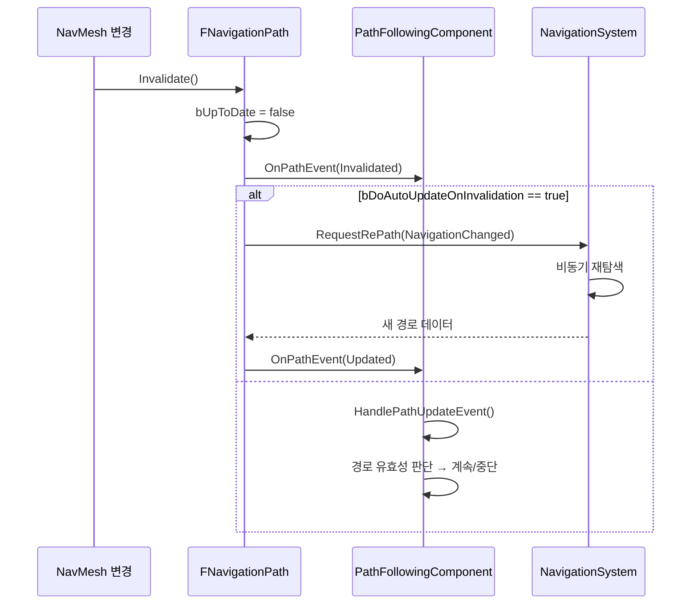

# 06. 경로 무효화 및 재탐색 메커니즘

> **작성일**: 2026-04-16
> **엔진 버전**: UE 5.5

## 1. 개요

NavMesh가 런타임에 변경되거나 골 액터가 이동하면, 기존 경로가 더 이상 유효하지 않을 수 있습니다.
UE는 **옵저버 패턴**을 통해 경로 무효화를 감지하고, 자동으로 재탐색을 수행합니다.

---

## 2. 경로 무효화 흐름



### 2.1 재탐색 "텀" 동안 캐릭터가 멈추지 않는 이유

경로가 무효화되고 새 경로가 도착하기까지 1~N 프레임의 지연이 있지만, **캐릭터는 그 동안 기존 경로를 따라 계속 이동**합니다. 부자연스러운 정지가 없도록 다음 3가지 장치가 동작합니다.

#### 장치 1: `OnPathEvent(Invalidated)`는 아무 것도 하지 않는다

`UPathFollowingComponent::OnPathEvent()` 내부를 보면 `Invalidated` 케이스는 **switch 분기에 없습니다** (`PathFollowingComponent.cpp:263-294`):

```cpp
switch (Event)
{
case ENavPathEvent::UpdatedDueToGoalMoved:       // 새 경로 도착 시만 처리
case ENavPathEvent::UpdatedDueToNavigationChanged:
case ENavPathEvent::MetaPathUpdate:
    HandlePathUpdateEvent();
    break;
default:
    break;  // ← Invalidated는 여기로 빠짐 (no-op)
}
```

즉 `bUpToDate = false`가 되고 재탐색이 **큐에 추가만 된** 상태. PFC 상태는 여전히 `Moving`이고, 웨이포인트 배열도 메모리에 그대로 있어 `FollowPathSegment()`가 **계속 기존 경로를 따라 velocity를 발행**합니다.

#### 장치 2: 재탐색은 백그라운드 스레드에서 진행

`RequestRePath()`는 `AsyncPathFindingQueries` 큐에 쿼리를 넣을 뿐이며, 실제 A* 탐색은 다음 Navigation Tick에 **별도 워커 스레드**에서 수행됩니다 ([04-ue-pathfinding-pipeline.md §3](04-ue-pathfinding-pipeline.md)). 게임 스레드의 프레임 타임에는 영향이 없으므로 **이동이 끊기지 않음**.

#### 장치 3: 새 경로 도착 시 "현재 위치에서 가장 가까운 세그먼트"부터 이어감

새 경로가 도착해 `Updated` 이벤트가 발생하면 `HandlePathUpdateEvent()`가 돌면서 **`DetermineStartingPathPoint(Path.Get())`**이 새 경로의 웨이포인트 중 **AI의 현재 위치와 가장 잘 맞는 세그먼트**를 찾아 그 지점부터 이동을 재개합니다 (`PathFollowingComponent.cpp:334-335`).

```cpp
// PathFollowingComponent.cpp:334-335
const int32 CurrentSegment = DetermineStartingPathPoint(Path.Get());
SetMoveSegment(CurrentSegment);
```

결과적으로:
```
이동 중 AI 위치: ● (새 경로의 세그먼트 3 근처)

기존 경로: Start ──*──*──*──*──── End
                   1  2  3  4
                          ●

새 경로:   Start ──*──*──*──*──*── End(변경됨)
                   1  2  3  4  5
                          ●  ← 여기서 이어서 이동 (세그먼트 3→4)
```

처음부터 다시 따라가는 게 아니라, **현재 위치 가까운 점을 찾아 그 구간부터 이어감** → 시각적으로 연속적인 이동.

### 2.2 정지가 나타날 수 있는 예외 상황

위 3가지 장치에도 불구하고 캐릭터가 잠깐 멈추거나 어색해 보이는 케이스:

| 상황 | 원인 | 완화 |
|------|------|------|
| 이동 방향이 크게 바뀜 | 새 경로가 반대 방향 → `CharacterMovementComponent`의 감속·회전 한계 | `RotationRate` 높이기, 회전/감속 파라미터 튜닝 |
| 현재 위치가 새 경로에서 너무 멀어 `DetermineStartingPathPoint` 매칭 실패 | 재탐색 실패 → `HandlePathUpdateEvent`가 `false` 반환 → `OnPathFinished(Aborted)` | NavMesh 폭 확장, `bReachTestIncludesAgentRadius` 조정 |
| 재탐색이 오래 걸림 (대형 맵, 복잡한 경로) | 백그라운드 탐색이 수십 ms | 목표 거리 기반 사전 preload, 부분 경로 허용 |
| 애니메이션이 이동 속도에 따라 전환되는데 velocity가 순간 0에 가깝게 됨 | 회전 중 속도 손실 | `Use Controller Desired Rotation` + 애니메이션 블렌드 활용 |

---

## 3. FNavigationPath::Invalidate()

```cpp
// NavigationPath.cpp:172
void FNavigationPath::Invalidate()
{
    bUpToDate = false;
    
    // 옵저버들에게 무효화 통지
    PathObserverDelegate.Broadcast(this, ENavPathEvent::Invalidated);
    
    if (bDoAutoUpdateOnInvalidation)
    {
        // 자동 재탐색 요청
        NavigationData->RequestRePath(SharedThis(this), ENavPathUpdateType::NavigationChanged);
    }
}
```

### 3.1 무효화 트리거

| 트리거 | 설명 |
|--------|------|
| NavMesh 타일 변경 | 동적 장애물 추가/제거, NavModifier 변경 등으로 타일이 리빌드됨 |
| Nav Bounds 변경 | 네비게이션 볼륨이 추가/제거/이동됨 |
| 골 액터 이동 | MoveToActor 시 대상 액터가 이동함 |

> **소스 확인 위치**
> - `Invalidate()`: `Engine/Source/Runtime/NavigationSystem/Private/NavigationPath.cpp:172`

---

## 4. 골 액터 이동 감지: TickPathObservation()

`MoveToActor()`로 이동 중일 때, 매 틱마다 골 액터의 위치 변화를 관찰합니다.

```
TickPathObservation()
├── 골 액터의 현재 위치 가져오기
├── 마지막으로 기록한 위치와 비교
├── 이동 거리 > Tether Distance?
│   ├── Yes → Invalidate() + RequestRePath()
│   └── No → 아무 것도 안 함
└── 현재 위치를 기록
```

Tether Distance는 "골 액터가 이 이상 움직이면 경로를 다시 찾겠다"는 임계값입니다.

> **소스 확인 위치**
> - `TickPathObservation()`: `NavigationPath.cpp` — `GoalActorLocationTolerance` 비교

---

## 5. UPathFollowingComponent::OnPathEvent()

경로 옵저버가 무효화/갱신 이벤트를 수신합니다:

```cpp
// PathFollowingComponent.cpp:263
void UPathFollowingComponent::OnPathEvent(
    FNavigationPath* InPath,
    ENavPathEvent::Type Event)
```

| 이벤트 | 처리 |
|--------|------|
| `Invalidated` | 자동 재탐색이 활성화되어 있으면 대기, 아니면 `OnPathFinished(Aborted)` |
| `UpdatedDueToGoalMoved` | 새 경로로 갱신 후 이동 계속 |
| `UpdatedDueToNavigationChanged` | 새 경로로 갱신 후 이동 계속 |
| `RePathFailed` | 재탐색 실패 → `OnPathFinished(Aborted)` |

### 5.1 HandlePathUpdateEvent()

경로가 갱신되면 현재 이동을 새 경로에 맞춰 조정합니다:

```cpp
// PathFollowingComponent.cpp:296
bool UPathFollowingComponent::HandlePathUpdateEvent()
{
    // 1. 새 경로가 유효한지 검증
    // 2. 감속 데이터 갱신
    // 3. Moving 상태로 설정
    // 4. 적절한 세그먼트에서 이동 재개
    // → true: 이동 계속, false: 중단
}
```

> **소스 확인 위치**
> - `OnPathEvent()`: `PathFollowingComponent.cpp:263-294`
> - `HandlePathUpdateEvent()`: `PathFollowingComponent.cpp:296-339`

---

## 6. 자동 재탐색 (Auto Repath)

### 6.1 설정

```cpp
// FNavigationPath 멤버
bool bDoAutoUpdateOnInvalidation;  // true이면 무효화 시 자동 재탐색
```

`AAIController::FindPathForMoveRequest()`에서 경로 생성 시 이 플래그를 활성화합니다:

```cpp
// AIController.cpp:897 부근
Path->EnableRecalculationOnInvalidation(true);
```

### 6.2 재탐색 흐름

```
경로 무효화
│
├── bDoAutoUpdateOnInvalidation == true
│   └── NavigationData->RequestRePath()
│       └── 비동기 큐에 재탐색 요청 추가
│           └── 백그라운드에서 FindPath() 재실행
│               └── 성공 시: FNavigationPath 내부 데이터 교체
│                   └── OnPathEvent(Updated) 브로드캐스트
│                       └── PathFollowingComponent가 새 경로로 이동 계속
│
└── bDoAutoUpdateOnInvalidation == false
    └── PathFollowingComponent::OnPathEvent(Invalidated)
        └── OnPathFinished(Aborted)
            └── 이동 중단, AAIController에 통지
```

### 6.3 비동기 쿼리 ID 관리 — NavigationSystem이 전부 보관

"비동기 큐에 추가"라고 표현했는데, 구체적으로 **`UNavigationSystemV1`이 모든 진행 중인 비동기 쿼리를 쿼리 ID와 함께 자체 배열에 보관**하고 관리합니다.

#### 자료구조

```cpp
// NavigationSystem.h:1257-1260
class UNavigationSystemV1 {
    // ...
    TArray<FAsyncPathFindingQuery> AsyncPathFindingQueries;            // 진행 중인 쿼리들
    TArray<FAsyncPathFindingQuery> AsyncPathFindingCompletedQueries;   // 완료되어 디스패치 대기중인 쿼리들
};
```

각 `FAsyncPathFindingQuery`는 `FPathFindingQuery`를 상속하며 고유 ID를 가집니다:

```cpp
// NavigationData.h:1142-1163
struct FAsyncPathFindingQuery : public FPathFindingQuery {
    uint32 QueryID;
    FNavPathQueryDelegate OnDoneDelegate;
    
    static uint32 GetUniqueID() { return ++LastPathFindingUniqueID; }
private:
    static uint32 LastPathFindingUniqueID;  // 전역 증가 카운터
};

// NavigationData.cpp:118
uint32 FAsyncPathFindingQuery::LastPathFindingUniqueID = INVALID_NAVQUERYID;
```

#### ID 생성과 흐름

```
FindPathAsync 호출
   │
   ├─ GetUniqueID() → ++LastPathFindingUniqueID (static, 게임 세션 내내 증가)
   │
   ├─ FAsyncPathFindingQuery 생성 (QueryID 포함)
   │
   ├─ AddAsyncQuery(Query) → AsyncPathFindingQueries.Add(Query)
   │
   ├─ 호출자에게 QueryID 반환
   │
   └─ Navigation Tick
       ├─ TriggerAsyncQueries(AsyncPathFindingQueries)
       │   └─ 별도 스레드에서 PerformAsyncQueries 실행
       │       └─ NavData->FindPath() 수행
       │
       ├─ 완료된 쿼리 → AsyncPathFindingCompletedQueries로 이동
       │
       └─ DispatchAsyncQueriesResults (게임 스레드)
           └─ 각 쿼리의 OnDoneDelegate 실행
```

#### 쿼리 ID의 용도

1. **취소**: 호출자가 더 이상 결과가 필요 없을 때
   ```cpp
   // NavigationSystem.h:657
   void AbortAsyncFindPathRequest(uint32 AsynPathQueryID);
   ```
   → 큐에서 해당 QueryID 쿼리를 찾아 제거

2. **추적**: 호출자가 "내가 요청한 쿼리 결과가 아직 안 왔는지" 확인 (ID 비교)

3. **디버깅**: VLog에 QueryID가 찍혀 특정 쿼리의 lifecycle 추적 가능

#### 주의사항

- `LastPathFindingUniqueID`는 **static 전역 카운터**로, 게임 세션 동안 계속 증가만 함 (리셋 안 됨). 32비트이므로 ~42억 요청 후 overflow하지만 실무상 문제되지 않음.
- `INVALID_NAVQUERYID = 0`는 "유효하지 않은 ID" 표시용 sentinel.
- 비동기 쿼리가 완료되기 전에 요청자(UObject)가 GC되면 콜백 호출 시점에 `FNavPathQueryDelegate::ExecuteIfBound()`가 안전하게 무시.

> **소스 확인 위치**
> - `AsyncPathFindingQueries`: `Engine/Source/Runtime/NavigationSystem/Public/NavigationSystem.h:1257`
> - `FAsyncPathFindingQuery`: `NavigationData.h:1142-1163`
> - `GetUniqueID()`: `NavigationData.h:1160`
> - `AbortAsyncFindPathRequest()`: `NavigationSystem.h:657`

---

## 7. 경로 유효성과 스레드 안전성

### 7.1 FNavPathSharedPtr

```cpp
// NavigationSystemTypes.h:34
typedef TSharedPtr<FNavigationPath, ESPMode::ThreadSafe> FNavPathSharedPtr;
```

`ESPMode::ThreadSafe`로 선언되어 있어, 게임 스레드와 비동기 경로 탐색 스레드 간에
참조 카운트를 안전하게 공유합니다.

### 7.2 bUpToDate 플래그

```cpp
// FNavigationPath 멤버
bool bUpToDate;   // true: 경로가 현재 NavMesh와 일치
bool bIsReady;    // true: 경로 계산 완료
bool bIsPartial;  // true: 부분 경로
```

`bUpToDate`가 false인 경로를 따라가면 잘못된 위치로 이동할 수 있으므로,
`PathFollowingComponent`는 이동 전에 항상 이 플래그를 확인합니다.

---

## 8. 요약: 무효화 시나리오별 동작

| 시나리오 | 트리거 | 재탐색 | AI 동작 |
|----------|--------|--------|---------|
| NavMesh 타일 리빌드 | `Invalidate()` | 자동 (AutoRepath) | 새 경로로 계속 이동 |
| 동적 장애물 추가 | `Invalidate()` | 자동 (AutoRepath) | 장애물을 우회하는 새 경로 |
| 골 액터 이동 | `TickPathObservation()` | 자동 (Tether) | 새 위치로 경로 갱신 |
| 수동 AbortMove 호출 | `AbortMove()` | 없음 | 즉시 정지 |
| FindPath 실패 | - | - | OnMoveCompleted(Failed) |
