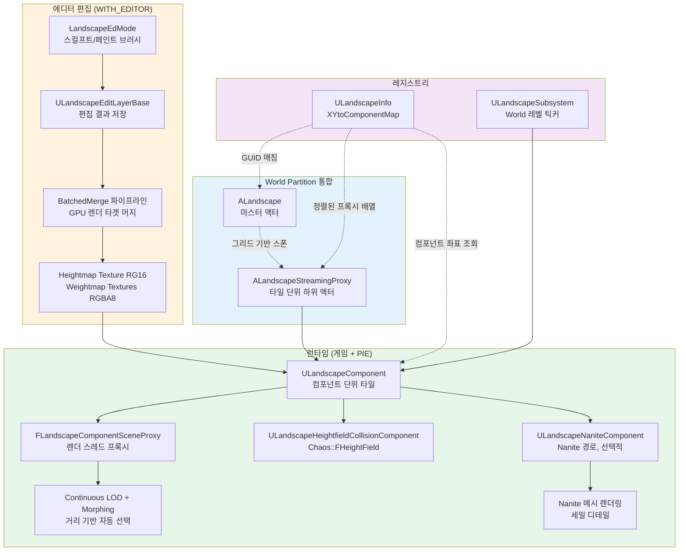

# 01. Landscape 시스템 개요

> **작성일**: 2026-04-21
> **엔진 버전**: UE 5.7

## 1. Landscape는 왜 별도 시스템인가

언리얼 엔진의 지형은 이론적으로 **큰 StaticMesh 하나**로도 표현할 수 있습니다. 그럼에도 Landscape가 별도 시스템으로 존재하는 이유는 **StaticMesh 기반 해법이 다음 요구사항을 동시에 만족하지 못하기 때문**입니다.

| 요구사항 | StaticMesh의 한계 | Landscape의 접근 |
|----------|------------------|-----------------|
| **km² 규모의 넓은 지형** | 한 메시에 수억 버텍스 → 메모리·디스크 폭증 | 고정 크기 **컴포넌트 타일**로 쪼개서 필요한 것만 로드 |
| **거리별 자연스러운 LOD** | 정적 LOD 슬롯 몇 단계, 경계에서 tessellation seam 발생 | **Continuous LOD + Morphing**으로 거리별 부드러운 전환 |
| **에디터에서의 실시간 편집** | 메시 전체를 재임포트해야 함 | **텍스처(Heightmap/Weightmap) 편집** → GPU 머지로 즉시 반영 |
| **레이어 기반 페인팅** | 재질 하나로 모두 표현해야 → 텍스처 타일링 한계 | **Weightmap 레이어** + 각 레이어별 재질 블렌딩 |
| **물리/내비 자동 연동** | 수동으로 Collision / NavMesh 빌드 | Heightmap에서 **Heightfield Collision** 자동 생성 |
| **스트리밍과 궁합** | 메시 LOD와 World Partition 조율 복잡 | `ALandscapeStreamingProxy`가 **World Partition 그리드에 최적화** |

핵심 통찰은 "**지형은 본질적으로 텍스처 기반 높이맵**이라는 데이터 특성"을 활용하는 것입니다. 정점 데이터가 아니라 Heightmap 텍스처에서 GPU가 직접 위치를 읽어 그리는 구조라, 메모리 효율·LOD 생성·에디터 편집이 모두 단순해집니다.

### 1.1 표에 나온 용어 풀이

위 비교표에 압축되어 있는 용어 몇 가지를 미리 풀어둡니다.

#### Tessellation seam (LOD 이음새)

두 개의 지형 타일이 인접해 있고 **서로 다른 해상도(LOD)**로 그려질 때, 공유 경계의 정점 수가 맞지 않으면 **삼각형이 맞물리지 않는 틈**이 생깁니다. 시각적으로는 "V자 모양의 균열"이나 겹침으로 나타납니다.

```
 LOD 0 타일 (세밀)                  LOD 2 타일 (성긴)
  ─┬─┬─┬─┬─┬─┬─┬─┬─            ─────┬─────────┬──
   │ │ │ │ │ │ │ │                  │         │
   │ │ │ │ │ │ │ │                  │         │
   │ │ │ │ │ │ │ │                  │         │
   │ │ │ │ │ │ │ │                  │         │
   경계: 정점 8개                      경계: 정점 2개
                   ↓ 맞물리지 않음 ↑
                       (V자 틈 발생)
```

StaticMesh에서는 이 문제를 해결하려면 **Stitching mesh**(경계 전용 패치 메시)를 별도로 만들거나, 모든 LOD 경계에 skirt을 내려 틈을 가려야 해서 복잡합니다.

#### Continuous LOD + Morphing

Landscape는 LOD를 **정수 단계가 아니라 실수값**으로 가집니다. "LOD 2.3"처럼 중간값이 있을 수 있고, 셰이더가 **LOD 2 정점 위치와 LOD 3 정점 위치를 선형 보간**해 그 중간 지점에 정점을 놓습니다 (이것이 **Morphing**).

```
  카메라 거리 증가 →
   |LOD 0| ... |LOD 1| ... |LOD 2| ... |LOD 3|
      ↑          ↑           ↑
    boundary  boundary   boundary
    (매끄럽게 보간되는 구간 = "LOD blend range")
```

거리가 LOD 경계를 지날 때 **정점 수가 갑자기 변하지 않고** 정점이 서서히 녹아들어 옆 정점과 합쳐집니다. 사용자 눈에는 "LOD가 바뀌었다"는 pop이 보이지 않습니다. 상세 구현은 [06-rendering-pipeline.md §2.4](06-rendering-pipeline.md) 참고.

#### LOD blend range 튜닝 — 수정 가능한 값과 경험적 조정

`LOD blend range`는 **수정 가능한 프로퍼티**이며, 최적값은 콘텐츠·플랫폼에 따라 달라져 **경험적으로 조정**합니다.

- **노출**: `ALandscapeProxy::LODBlendRange` 프로퍼티 (Details 패널, 또는 마스터에서 설정 후 프록시로 전파)
- **셰이더 측**: `InvLODBlendRange = 1.0f / LODBlendRange`로 변환되어 `FLandscapeUniformShaderParameters`에 들어감
- **단위**: 픽셀 또는 화면 비율 단위 (LOD 전환이 일어나는 화면 크기 변화 폭)

**값에 따른 효과**:

| LODBlendRange | 효과 |
|---|---|
| **작음** (예: 0.05) | 전환 구간 짧음 → 모핑이 거의 없이 LOD가 빨리 바뀜 → **LOD pop이 보일 수 있음** |
| **중간** (기본값 ~0.2~0.3) | 적당히 부드러운 전환, 대부분 콘텐츠에 무난 |
| **큼** (예: 0.5+) | 전환 구간 김 → 매우 부드러움 → **모핑하는 정점 수 증가로 셰이더 비용↑** |

**최적값을 결정짓는 요소들**:
- **텍스처 디테일**: 고주파 디테일이 많으면 LOD 차이가 잘 보여 더 큰 BlendRange 필요
- **카메라 이동 속도**: 빠른 카메라일수록 작은 BlendRange도 OK (관찰자가 변화를 쫓아갈 시간이 짧음)
- **목표 플랫폼**: 모바일/저사양은 작게 (셰이더 비용 절약), 데스크톱은 크게도 가능
- **개별 컴포넌트 크기**: 큰 컴포넌트일수록 BlendRange가 더 영향 큼

**조정 방법**: 처음엔 기본값으로 두고, 게임플레이 중 카메라가 빠르게 움직이는 시나리오를 녹화 → LOD pop이 보이면 조금씩 증가. 셰이더 프로파일링과 함께 트레이드오프 결정. **"수치 하나로 정해진 정답이 아니라 콘텐츠·플랫폼별 튜닝 값"**입니다.

이 두 기법이 결합되어 Landscape는 **정적 LOD 슬롯 5~8단계로 끊어지는 StaticMesh**와 달리 부드러운 거리 기반 세밀도 조절이 가능합니다.

### 1.2 StaticMesh로 같은 지형을 만들면 구체적으로 얼마나 힘든가

표의 각 행을 실제 시나리오로 풀어보면:

#### km² 규모의 넓은 지형

| 측정 | StaticMesh 1개 | Landscape |
|------|--------------|-----------|
| 1km × 1km, 1m 간격 정점 | 1,000,000 정점 × 32바이트 = **32MB 정점 데이터** (+ 인덱스, 노멀, UV) | 컴포넌트 15×15 = 225개, 각 256×256 Heightmap (RG16 기준 128KB) = **약 28MB** (로드 여부와 무관, 전체 타일 합) |
| 10km × 10km | **3.2GB** 단일 메시 (실용 불가) | 225 × 100 = 22,500 컴포넌트, 필요한 영역만 스트리밍 → **상시 메모리 수십 MB** |

StaticMesh로 km² 지형을 하려면 **메시를 수동으로 여러 조각으로 쪼개고 각자 스트리밍 볼륨을 달아야** 합니다. 그런데 쪼갠 메시 경계에서 §1.1의 tessellation seam이 또 문제가 됩니다.

#### 실시간 편집

**StaticMesh 워크플로우**: DCC(Blender/Maya)에서 편집 → export → FBX 임포트 → 머티리얼 재할당 → 콜리전 재빌드 → 라이팅 재빌드. **한 번의 수정에 수 분~수십 분**. 지형 모양이 머리 속에 확정된 경우에만 실용적.

**Landscape 워크플로우**: 에디터 내 브러시 → 실시간 미리보기 → 만족할 때까지 계속. **즉시 반영**. 탐색적 작업에 적합.

#### 레이어 기반 페인팅 (예: 풀/바위/흙 혼합)

**StaticMesh**: 머티리얼 하나가 3개 텍스처를 블렌딩하려면
- 각 픽셀에서 레이어 비율을 결정할 **마스크 텍스처**(보통 UV 공간에 수동으로 그려야 함)가 필요
- 머티리얼 그래프가 복잡해지고 **각 레이어의 Normal/Roughness/Color/AO까지 모두 블렌딩** 로직을 수동으로
- 타일링 한계: UV가 한 번만 깔리니 같은 패턴이 반복 → 멀리서 보면 격자무늬

**Landscape**: Weightmap 텍스처가 자동으로 레이어 비율 저장, 머티리얼은 `Layer Blend` 노드 하나로 해결, 레이어별 UV 타일링 스케일을 자유롭게 (가까이: 세밀, 멀리: 큰 스케일) 설정.

#### 물리/NavMesh 자동 연동

**StaticMesh**: 메시를 수정할 때마다 **Simple Collision 수동 편집** + **Complex Collision 재쿠킹** + **NavMesh 재빌드**. 수정 → 플레이 테스트 루프가 한 번에 수 분.

**Landscape**: 높이맵이 바뀌면 다음 틱에 `RecreateCollision`이 자동 호출, NavMesh도 변경 영역만 증분 재빌드. 브러시 드래그하면서 AI가 새 경로로 움직이는 것을 실시간 확인.

요컨대 **개별 기능은 StaticMesh로도 억지로 흉내낼 수 있지만, 모두 합쳐서 "한 사람의 지형 아티스트"가 감당 가능한 작업량이 되느냐**가 관건이고, Landscape는 이 균형을 잡기 위해 Heightmap 중심 데이터 구조를 선택했습니다.

## 2. StaticMesh vs Landscape — 같은 지형을 표현할 때 차이

```
[같은 1km × 1km 지형, 1m 간격 격자]

StaticMesh 접근:                        Landscape 접근:
────────────────                        ─────────────────
 메시 파일 1개                           컴포넌트 태일 ~15×15 개
  ├ 버텍스 ~1,000,000개                   각 타일:
  ├ 노멀 ~1,000,000개                     ├ Heightmap 텍스처 하나 (RG16)
  ├ UV ~1,000,000개                       ├ Weightmap 텍스처 N개 (RGBA8)
  └ 모든 LOD를 정적으로 저장              └ 공유 버텍스 버퍼 재사용
                                        
 메모리: 수백 MB                         메모리: 수 MB × 로드된 타일 수
 LOD: 5~8단계 미리 빌드                  LOD: 거리별로 GPU에서 동적 선택
 편집: 재임포트                          편집: 브러시 → GPU 머지 → 즉시 반영
```

실제 크기를 가늠해보면 **Landscape 컴포넌트 1개 = 보통 63×63 또는 127×127 quads**입니다. 이 컴포넌트 하나가 **하나의 `FPrimitiveSceneProxy`**, **하나의 Heightmap 텍스처(256×256 or 512×512)**, **여러 개의 Weightmap 텍스처**를 가집니다.

### 2.1 Landscape는 정점이 없는가? — 오해 없이 이해하기

위 ASCII 비교를 보면 Landscape 쪽에 "공유 버텍스 버퍼 재사용"만 적혀 있어서 "**정점이 없다**"로 읽힐 수 있습니다. 정확한 서술은 다음과 같습니다.

**Landscape도 정점은 있습니다**. 다만 StaticMesh와는 다르게 쓰입니다:

| 요소 | StaticMesh | Landscape |
|------|----------|-----------|
| 정점 XY 위치 | 메시 파일마다 고유 (아티스트 지정) | **모든 컴포넌트가 동일한 정규 격자** (예: 127×127 규칙적 격자) |
| 정점 Z 위치 | 메시 파일에 상수로 박힘 | **Heightmap 텍스처에서 VS가 런타임 샘플링** |
| 정점 버퍼 저장소 | 메시마다 별도 | **같은 크기 구성 컴포넌트들 간 공유** (`FLandscapeSharedBuffers`) |
| 정점 수 | 모델마다 다름 | 컴포넌트당 고정 (예: 128² = 16384개) |

즉 Landscape의 정점 버퍼는 **"정점이 어떤 규칙적 2D 그리드 위치에 있다"만 담은 토폴로지 스켈레톤**이고, **실제 3D 형상은 Heightmap 텍스처가 정한다**는 구조입니다.

#### 정점 밀집도 조절 — 가능한가, 무엇이 영향받는가

**가능합니다.** 다만 두 가지 다른 시점에서 두 가지 다른 방식으로 조절됩니다.

**(1) Landscape 생성 시점 — 베이스 밀집도 결정 (영구적)**:
- `ComponentSizeQuads`, `SubsectionSizeQuads`, `NumSubsections` 조합
- 컴포넌트당 정점 수 = `(ComponentSizeQuads + 1)²`로 고정
- 예: 127×127 quads 컴포넌트 → 컴포넌트당 16,384개 정점
- **에디터에서 Landscape를 만들 때 결정**되고 이후 변경 불가 (변경하려면 재생성)
- 영향:
  - **표현 가능 디테일 한계**: 격자가 촘촘하면 더 세밀한 지형 형태 표현 가능
  - **메모리 사용량**: 컴포넌트당 정점 버퍼는 작지만, 셰이더 호출 수는 많아짐
  - **편집 반응성**: 격자가 촘촘하면 BatchedMerge 비용 증가
  - **콜리전 정밀도**: 콜리전도 같은 격자 기반(저해상 밉)이라 영향받음

**(2) 런타임 LOD — 실효 정점 수 동적 감소**:
- LOD가 N단 올라갈 때마다 **인덱스 버퍼가 1/4 정점 사용**(한 축당 1/2)
- 예: LOD 0에서 16,384개 사용 → LOD 1에서 4,096개 → LOD 2에서 1,024개...
- 정점 버퍼 자체는 그대로 (LOD 0의 풀 정점), **인덱스 버퍼만 바꿔서 일부만 그림**
- 즉 LOD = "이미 있는 정점들 중 어느 부분집합을 그릴지" 선택 → 실효 정점 수 조절

**"LOD가 정점 수를 조절한다"의 정확한 의미**:
- LOD가 정점 버퍼의 정점 수를 줄이는 게 **아니라**, **인덱스 버퍼로 그릴 정점만 골라 줄이는** 것
- 정점 버퍼는 LOD 0 기준 풀 사이즈 그대로 유지 (`FLandscapeSharedBuffers`로 공유)
- LOD별로 인덱스 버퍼만 사전 빌드해 두고 거리에 따라 선택
- **결과**: GPU 처리량(VS 호출 수, 픽셀 처리 수)은 줄어들지만 정점 버퍼 메모리는 그대로

요약:
| 조절 시점 | 무엇을 바꾸나 | 효과 |
|----------|----|------|
| **생성 시** | `ComponentSizeQuads`, `SubsectionSizeQuads`, `NumSubsections` | 베이스 밀집도 영구 결정 (메모리·디테일 한계) |
| **런타임** | LOD (인덱스 버퍼 선택) | 거리별 실효 정점 수 동적 조절 (성능) |

런타임 LOD는 정점을 "더 만들" 수는 없고 "덜 그릴" 수만 있습니다. 더 세밀한 디테일이 필요하면 처음부터 더 촘촘한 베이스 격자로 만들어야 합니다.

정점 셰이더에서:

```hlsl
// 단순화된 개념 코드
float2 GridPos = VertexInput.GridXY;              // 정점 버퍼의 규칙적 격자 위치
float Height = HeightmapTexture.SampleLevel(Sampler, GridPos * UVScale + UVBias, LOD).r;
float3 WorldPos = float3(GridPos, Height);        // Z만 텍스처에서 결정
```

이 모델 덕분에:
- 정점 버퍼 한 벌만 만들어두면 모든 컴포넌트에서 재사용 가능
- 지형 높이 수정 = 텍스처 수정 (정점 버퍼는 그대로)
- LOD는 **Heightmap의 밉맵을 샘플링**하는 방식으로 자연스럽게 구현

#### "정점 셰이더에서 3D 형상이 만들어지고, 이후엔 StaticMesh와 똑같이 동작하나?"

**대체로 그렇습니다.** VS가 정점 Z를 결정해 3D 위치를 만들고 나면, 이후 GPU 파이프라인(러스터화 → PS → 블렌딩 → 뎁스 테스트 → 출력)은 일반 메시와 거의 같습니다. 다만 Landscape에 특화된 일부 동작이 PS 측까지 영향을 줍니다:

| 단계 | Landscape의 차이 (있다면) |
|---|---|
| **Vertex Shader** | Heightmap 샘플 + LOD 모핑(연속 LOD 보간) → Z 결정. 일반 SM과 가장 다른 단계. |
| **러스터화** | 동일. VS 결과의 삼각형이 그대로 픽셀로 변환. |
| **Pixel Shader** | 머티리얼은 일반 PBR과 동일하지만, **레이어 블렌딩 로직(`Landscape Layer Blend` 함수)**이 자주 사용. UV 계산도 Landscape 특수 노드 사용. |
| **Depth/Stencil** | 동일. |
| **블렌딩·출력** | 동일. |

즉 **VS 이후의 파이프라인은 90% StaticMesh와 같고**, 특수성은 주로 **VS의 Heightmap 샘플링**과 **PS의 레이어 블렌딩 머티리얼 함수**에 모여 있습니다. GPU 입장에선 "조금 특이한 정점 팩토리 + 특수 머티리얼 노드를 쓰는 메시"로 인식됩니다.

#### "정점을 매 틱 GPU에 로드하지 않아도 된다는 게 제일 큰 이점인가?"

**가장 큰 단일 이점이라 할 수 있습니다.** 이로 인해 파생되는 효과들:

1. **편집 ↔ 렌더 디커플링**: 지형 편집은 텍스처 수정으로 끝. 정점 버퍼는 안 건드려서 GPU 리소스 재업로드 무관.
2. **공유 정점 버퍼**: 같은 크기 컴포넌트 N개가 정점 버퍼 한 벌 공유 → 메모리 N분의 1.
3. **밉맵 기반 LOD가 자연스러움**: Heightmap의 밉을 샘플링하면 그게 곧 저해상도 지형 → 정수가 아닌 실수 LOD에서도 부드러운 전환 가능 (StaticMesh는 LOD마다 별도 정점 버퍼).
4. **편집 응답성**: BatchedMerge가 텍스처에 결과 쓰면 다음 프레임 렌더에 바로 반영 — 정점 재업로드 대기 없음.
5. **메모리 피크 안정성**: 정점 버퍼 크기는 컴포넌트 크기로 고정. 디테일이 늘어도 정점 메모리 일정.

다른 이점들도 있지만 (콜리전 자동 생성, 레이어 페인팅 단순화 등), **"정점 GPU 업로드를 거의 하지 않는다"**는 점이 Landscape를 다른 메시 시스템과 본질적으로 구분 짓는 핵심 설계 결정입니다.

### 2.2 Heightmap 텍스처와 재질 텍스처만 있으면 Landscape인가?

**기하(geometry) 관점**에서는 거의 그렇습니다:

- **Heightmap 텍스처 하나** + **정규 격자 정점 수(Component/Subsection 크기)** → 최종 3D 메시 결정
- **Weightmap 텍스처들** → 각 지점에 어떤 페인트 레이어가 얼마만큼 섞여 있는지
- **Normalmap** → 실제로는 같은 Heightmap 텍스처의 BA 채널에 X,Y가 들어 있음 ([04-heightmap-weightmap.md §3.3](04-heightmap-weightmap.md) 참고)

다만 **최종 화면 결과**를 얻으려면 그 위에 재질(Material)이 필요하고, 재질이 다음을 결합합니다:
- 페인트 레이어별 Albedo/Normal/Roughness/AO 텍스처들 (레이어당 4~5장, 레이어 수 × 4~5장)
- Weightmap으로 레이어별 블렌딩
- (선택) Runtime Virtual Texture 기여, 데칼, 그래스 분포 마스크 등

그래서:
- **"표현(geometry)"만 놓고 보면**: Heightmap + 컴포넌트 크기 설정 + (구멍을 위한) Visibility 마스크 이면 충분
- **"렌더링까지"를 놓고 보면**: 위 + Weightmap들 + 레이어별 재질 텍스처들 + 재질 그래프

StaticMesh와의 결정적 차이는 **기하 정보가 `.uasset` 메시 파일이 아니라 텍스처에 있다**는 점입니다. 같은 Heightmap 텍스처에 다른 재질을 입히면 같은 지형 모양이 다른 외관으로 렌더됩니다.

> **소스 확인 위치**
> - `Engine/Source/Runtime/Landscape/Classes/LandscapeComponent.h:427-435` — `ComponentSizeQuads`, `SubsectionSizeQuads`, `NumSubsections` 선언
> - `Engine/Source/Runtime/Landscape/Classes/LandscapeComponent.h:552` — `HeightmapTexture`
> - `Engine/Source/Runtime/Landscape/Classes/LandscapeComponent.h:556` — `WeightmapTextures[]`
> - `Engine/Source/Runtime/Landscape/Public/LandscapeRender.h:116-140` — `FLandscapeUniformShaderParameters`에서 Heightmap을 VS로 바인딩하는 지점
> - `Engine/Source/Runtime/Landscape/Public/LandscapeRender.h:358-412` — `FLandscapeSharedBuffers` (공유 정점 버퍼)

## 3. 전체 데이터 플로우

사용자가 "Landscape를 만들어 에디터에서 편집하고, 런타임에 렌더링·충돌"까지의 흐름을 한 장으로 요약하면:



핵심은 다음 3개의 분리된 책임 축입니다:

1. **편집 레이어(`ULandscapeEditLayerBase`)**가 "어떤 변경을 쌓고 있는가"를 담당
2. **BatchedMerge**가 여러 레이어 + 브러시 + 스플라인 영향을 **GPU에서 한꺼번에 합성**하여 최종 Heightmap/Weightmap 텍스처 생성
3. **컴포넌트(`ULandscapeComponent`)**가 그 텍스처를 들고 렌더/물리로 공급

## 4. 핵심 하위 시스템 지도

이 문서 시리즈가 다루는 영역을 한눈에 보면:

```
                     ┌───────────────────────────────────────┐
                     │           ULandscapeSubsystem         │
                     │  (World 레벨 틱커, 그래스/스트리밍 매니저) │
                     └───────────────────────────────────────┘
                                       │
              ┌────────────────────────┼────────────────────────┐
              ▼                        ▼                        ▼
    ┌──────────────────┐    ┌──────────────────┐    ┌──────────────────┐
    │    ALandscape    │    │ ALandscapeStream │    │  ULandscapeInfo  │
    │  (마스터 액터)    │───▶│    ingProxy      │───▶│  (월드 레지스트리)│
    │                  │    │  (타일 하위 액터) │    │                  │
    └────────┬─────────┘    └────────┬─────────┘    └────────┬─────────┘
             │                       │                        │
             │ EditLayers 소유       │ WP에 의해 스트리밍      │ GUID로 매칭
             │                       │                        │
             ▼                       ▼                        ▼
    ┌──────────────────────────────────────────────────────────────┐
    │                      ULandscapeComponent                     │
    │  HeightmapTexture / WeightmapTextures / MaterialInstances    │
    └────────┬─────────────────────────┬──────────────────────────┘
             │                         │
             ▼                         ▼
  ┌───────────────────┐    ┌──────────────────────────┐
  │ FLandscapeComponent│    │ ULandscapeHeightfield    │
  │    SceneProxy      │    │  CollisionComponent      │
  │  (렌더 스레드)       │    │   (Chaos::FHeightField)   │
  └───────────────────┘    └──────────────────────────┘
```

각 축의 책임:

- **ALandscape / ALandscapeProxy** — 액터 레벨에서 설정·편집 세션을 소유. 마스터와 스트리밍 프록시로 나뉨
- **ULandscapeInfo** — 월드 내 하나의 논리적 Landscape에 속한 모든 프록시·컴포넌트의 **좌표 기반 레지스트리**
- **ULandscapeSubsystem** — 월드 레벨 서비스 (그래스 빌드, 텍스처 스트리밍, 전역 틱)
- **ULandscapeComponent** — 실제 타일 하나의 **데이터·렌더·물리 컴포넌트 컨테이너**
- **BatchedMerge 파이프라인** — 에디터 변경을 Heightmap/Weightmap 텍스처로 **GPU 합성**
- **렌더 프록시 / 콜리전 컴포넌트** — 런타임 런더링과 물리의 실제 구현자

이 구조에서 가장 많은 복잡도가 몰려 있는 곳은 **BatchedMerge 파이프라인**(5번 문서)과 **World Partition 통합**(7번 문서)입니다. 나머지 축은 한 번 감을 잡으면 추가 학습량이 적습니다.

## 5. 이후 문서 안내

| 궁금한 것 | 문서 |
|-----------|------|
| 액터 3종이 왜 나뉘어 있고 어떻게 연결되는가 | [02-architecture.md](02-architecture.md) |
| 주요 클래스·구조체의 역할을 표로 훑기 | [03-core-classes.md](03-core-classes.md) |
| 고도와 레이어 가중치가 텍스처에 어떻게 패킹되는가 | [04-heightmap-weightmap.md](04-heightmap-weightmap.md) |
| 편집 레이어가 합쳐지는 GPU 머지 파이프라인 | [05-edit-layers.md](05-edit-layers.md) |
| LOD 선택과 Nanite 경로의 분기 | [06-rendering-pipeline.md](06-rendering-pipeline.md) |
| World Partition 환경에서의 스트리밍 | [07-streaming-wp.md](07-streaming-wp.md) |
| Heightfield Collision과 물리 재질 | [08-collision-physics.md](08-collision-physics.md) |

> **소스 확인 위치** (이 문서에서 언급된 주요 진입점)
> - `Engine/Source/Runtime/Landscape/Classes/Landscape.h:276` — `ALandscape` 클래스 정의
> - `Engine/Source/Runtime/Landscape/Classes/LandscapeProxy.h` — `ALandscapeProxy` (`APartitionActor` 상속)
> - `Engine/Source/Runtime/Landscape/Classes/LandscapeStreamingProxy.h:18` — `ALandscapeStreamingProxy`
> - `Engine/Source/Runtime/Landscape/Classes/LandscapeInfo.h:107` — `ULandscapeInfo` 클래스 정의
> - `Engine/Source/Runtime/Landscape/Classes/LandscapeComponent.h` — `ULandscapeComponent`
> - `Engine/Source/Runtime/Landscape/Public/LandscapeSubsystem.h` — `ULandscapeSubsystem`
> - `Engine/Source/Runtime/Landscape/Private/LandscapeEditLayers.cpp:4499` — `PerformLayersHeightmapsBatchedMerge` (머지 엔트리)
