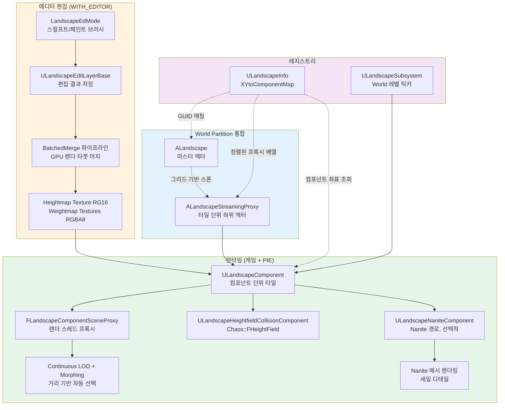

# 01. Landscape 시스템 개요

> **작성일**: 2026-04-21
> **엔진 버전**: UE 5.7

## 1. Landscape는 왜 별도 시스템인가

언리얼 엔진의 지형은 이론적으로 **큰 StaticMesh 하나**로도 표현할 수 있습니다. 그럼에도 Landscape가 별도 시스템으로 존재하는 이유는 **StaticMesh 기반 해법이 다음 요구사항을 동시에 만족하지 못하기 때문**입니다.

| 요구사항 | StaticMesh의 한계 | Landscape의 접근 |
|----------|------------------|-----------------|
| **km² 규모의 넓은 지형** | 한 메시에 수억 버텍스 → 메모리·디스크 폭증 | 고정 크기 **컴포넌트 타일**로 쪼개서 필요한 것만 로드 |
| **거리별 자연스러운 LOD** | 정적 LOD 슬롯 몇 단계, 경계에서 tessellation seam 발생 | **Continuous LOD + Morphing**으로 거리별 부드러운 전환 |
| **에디터에서의 실시간 편집** | 메시 전체를 재임포트해야 함 | **텍스처(Heightmap/Weightmap) 편집** → GPU 머지로 즉시 반영 |
| **레이어 기반 페인팅** | 재질 하나로 모두 표현해야 → 텍스처 타일링 한계 | **Weightmap 레이어** + 각 레이어별 재질 블렌딩 |
| **물리/내비 자동 연동** | 수동으로 Collision / NavMesh 빌드 | Heightmap에서 **Heightfield Collision** 자동 생성 |
| **스트리밍과 궁합** | 메시 LOD와 World Partition 조율 복잡 | `ALandscapeStreamingProxy`가 **World Partition 그리드에 최적화** |

핵심 통찰은 "**지형은 본질적으로 텍스처 기반 높이맵**이라는 데이터 특성"을 활용하는 것입니다. 정점 데이터가 아니라 Heightmap 텍스처에서 GPU가 직접 위치를 읽어 그리는 구조라, 메모리 효율·LOD 생성·에디터 편집이 모두 단순해집니다.

## 2. StaticMesh vs Landscape — 같은 지형을 표현할 때 차이

```
[같은 1km × 1km 지형, 1m 간격 격자]

StaticMesh 접근:                        Landscape 접근:
────────────────                        ─────────────────
 메시 파일 1개                           컴포넌트 태일 ~15×15 개
  ├ 버텍스 ~1,000,000개                   각 타일:
  ├ 노멀 ~1,000,000개                     ├ Heightmap 텍스처 하나 (RG16)
  ├ UV ~1,000,000개                       ├ Weightmap 텍스처 N개 (RGBA8)
  └ 모든 LOD를 정적으로 저장              └ 공유 버텍스 버퍼 재사용
                                        
 메모리: 수백 MB                         메모리: 수 MB × 로드된 타일 수
 LOD: 5~8단계 미리 빌드                  LOD: 거리별로 GPU에서 동적 선택
 편집: 재임포트                          편집: 브러시 → GPU 머지 → 즉시 반영
```

실제 크기를 가늠해보면 **Landscape 컴포넌트 1개 = 보통 63×63 또는 127×127 quads**입니다. 이 컴포넌트 하나가 **하나의 `FPrimitiveSceneProxy`**, **하나의 Heightmap 텍스처(256×256 or 512×512)**, **여러 개의 Weightmap 텍스처**를 가집니다.

> **소스 확인 위치**
> - `Engine/Source/Runtime/Landscape/Classes/LandscapeComponent.h:427-435` — `ComponentSizeQuads`, `SubsectionSizeQuads`, `NumSubsections` 선언
> - `Engine/Source/Runtime/Landscape/Classes/LandscapeComponent.h:552` — `HeightmapTexture`
> - `Engine/Source/Runtime/Landscape/Classes/LandscapeComponent.h:556` — `WeightmapTextures[]`

## 3. 전체 데이터 플로우

사용자가 "Landscape를 만들어 에디터에서 편집하고, 런타임에 렌더링·충돌"까지의 흐름을 한 장으로 요약하면:



핵심은 다음 3개의 분리된 책임 축입니다:

1. **편집 레이어(`ULandscapeEditLayerBase`)**가 "어떤 변경을 쌓고 있는가"를 담당
2. **BatchedMerge**가 여러 레이어 + 브러시 + 스플라인 영향을 **GPU에서 한꺼번에 합성**하여 최종 Heightmap/Weightmap 텍스처 생성
3. **컴포넌트(`ULandscapeComponent`)**가 그 텍스처를 들고 렌더/물리로 공급

## 4. 핵심 하위 시스템 지도

이 문서 시리즈가 다루는 영역을 한눈에 보면:

```
                     ┌───────────────────────────────────────┐
                     │           ULandscapeSubsystem         │
                     │  (World 레벨 틱커, 그래스/스트리밍 매니저) │
                     └───────────────────────────────────────┘
                                       │
              ┌────────────────────────┼────────────────────────┐
              ▼                        ▼                        ▼
    ┌──────────────────┐    ┌──────────────────┐    ┌──────────────────┐
    │    ALandscape    │    │ ALandscapeStream │    │  ULandscapeInfo  │
    │  (마스터 액터)    │───▶│    ingProxy      │───▶│  (월드 레지스트리)│
    │                  │    │  (타일 하위 액터) │    │                  │
    └────────┬─────────┘    └────────┬─────────┘    └────────┬─────────┘
             │                       │                        │
             │ EditLayers 소유       │ WP에 의해 스트리밍      │ GUID로 매칭
             │                       │                        │
             ▼                       ▼                        ▼
    ┌──────────────────────────────────────────────────────────────┐
    │                      ULandscapeComponent                     │
    │  HeightmapTexture / WeightmapTextures / MaterialInstances    │
    └────────┬─────────────────────────┬──────────────────────────┘
             │                         │
             ▼                         ▼
  ┌───────────────────┐    ┌──────────────────────────┐
  │ FLandscapeComponent│    │ ULandscapeHeightfield    │
  │    SceneProxy      │    │  CollisionComponent      │
  │  (렌더 스레드)       │    │   (Chaos::FHeightField)   │
  └───────────────────┘    └──────────────────────────┘
```

각 축의 책임:

- **ALandscape / ALandscapeProxy** — 액터 레벨에서 설정·편집 세션을 소유. 마스터와 스트리밍 프록시로 나뉨
- **ULandscapeInfo** — 월드 내 하나의 논리적 Landscape에 속한 모든 프록시·컴포넌트의 **좌표 기반 레지스트리**
- **ULandscapeSubsystem** — 월드 레벨 서비스 (그래스 빌드, 텍스처 스트리밍, 전역 틱)
- **ULandscapeComponent** — 실제 타일 하나의 **데이터·렌더·물리 컴포넌트 컨테이너**
- **BatchedMerge 파이프라인** — 에디터 변경을 Heightmap/Weightmap 텍스처로 **GPU 합성**
- **렌더 프록시 / 콜리전 컴포넌트** — 런타임 런더링과 물리의 실제 구현자

이 구조에서 가장 많은 복잡도가 몰려 있는 곳은 **BatchedMerge 파이프라인**(5번 문서)과 **World Partition 통합**(7번 문서)입니다. 나머지 축은 한 번 감을 잡으면 추가 학습량이 적습니다.

## 5. 이후 문서 안내

| 궁금한 것 | 문서 |
|-----------|------|
| 액터 3종이 왜 나뉘어 있고 어떻게 연결되는가 | [02-architecture.md](02-architecture.md) |
| 주요 클래스·구조체의 역할을 표로 훑기 | [03-core-classes.md](03-core-classes.md) |
| 고도와 레이어 가중치가 텍스처에 어떻게 패킹되는가 | [04-heightmap-weightmap.md](04-heightmap-weightmap.md) |
| 편집 레이어가 합쳐지는 GPU 머지 파이프라인 | [05-edit-layers.md](05-edit-layers.md) |
| LOD 선택과 Nanite 경로의 분기 | [06-rendering-pipeline.md](06-rendering-pipeline.md) |
| World Partition 환경에서의 스트리밍 | [07-streaming-wp.md](07-streaming-wp.md) |
| Heightfield Collision과 물리 재질 | [08-collision-physics.md](08-collision-physics.md) |

> **소스 확인 위치** (이 문서에서 언급된 주요 진입점)
> - `Engine/Source/Runtime/Landscape/Classes/Landscape.h:276` — `ALandscape` 클래스 정의
> - `Engine/Source/Runtime/Landscape/Classes/LandscapeProxy.h` — `ALandscapeProxy` (`APartitionActor` 상속)
> - `Engine/Source/Runtime/Landscape/Classes/LandscapeStreamingProxy.h:18` — `ALandscapeStreamingProxy`
> - `Engine/Source/Runtime/Landscape/Classes/LandscapeInfo.h:107` — `ULandscapeInfo` 클래스 정의
> - `Engine/Source/Runtime/Landscape/Classes/LandscapeComponent.h` — `ULandscapeComponent`
> - `Engine/Source/Runtime/Landscape/Public/LandscapeSubsystem.h` — `ULandscapeSubsystem`
> - `Engine/Source/Runtime/Landscape/Private/LandscapeEditLayers.cpp:4499` — `PerformLayersHeightmapsBatchedMerge` (머지 엔트리)
