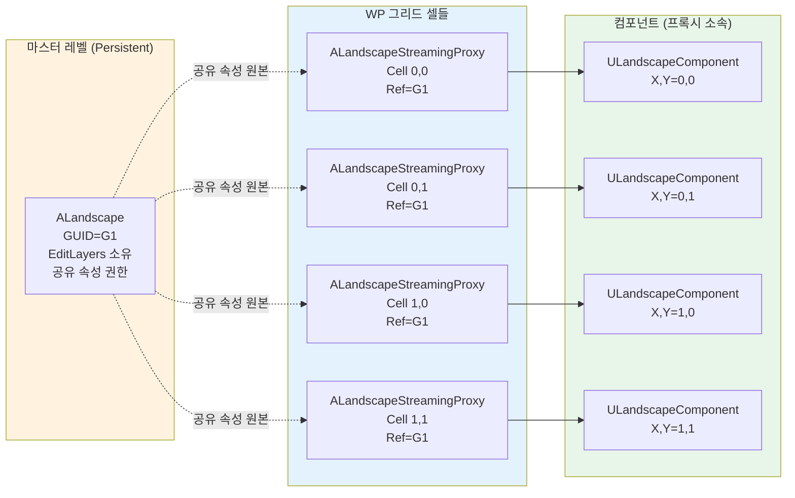
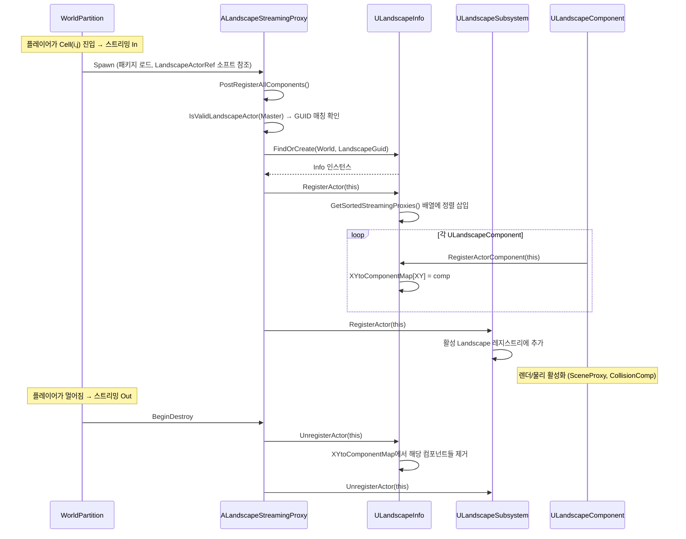

# 02. 아키텍처 — 액터 계층과 월드 레지스트리

> **작성일**: 2026-04-21
> **엔진 버전**: UE 5.7

## 1. 왜 액터가 3개로 나뉘어 있는가

Landscape를 처음 들여다보면 `ALandscape`, `ALandscapeProxy`, `ALandscapeStreamingProxy` 세 개 액터 클래스가 나옵니다. 처음엔 "지형 하나 그리는 데 왜 이렇게 많지?" 싶지만, 각각이 해결하는 문제가 분명히 다릅니다.

| 클래스 | 해결하는 문제 | 핵심 책임 |
|--------|-------------|----------|
| **`ALandscapeProxy`** | "지형 타일이라는 **공통 개념**을 하나의 타입으로 표현" | `ULandscapeComponent` 소유, 재질/물리 재질/스트리밍 설정 |
| **`ALandscape`** | "논리적으로 하나인 지형의 **편집 권한**과 **공유 속성**을 누가 들고 있는가" | Edit Layers 소유, 공유 속성 권한 (LOD 설정, 레이어 순서 등) |
| **`ALandscapeStreamingProxy`** | "World Partition 그리드에 맞춰 **타일 단위 스트리밍**" | `TSoftObjectPtr<ALandscape>` 참조, 그리드 크기 기반 명명 |

이 분리 덕분에 다음 두 시나리오가 모두 자연스럽게 동작합니다:

- **비파티션 맵** (전통적인 월드): `ALandscape` **하나**가 모든 컴포넌트를 직접 보유. 스트리밍 프록시 없음.
- **World Partition 맵**: `ALandscape` **하나**가 편집 권한만 보유하고 **실제 컴포넌트는 여러 `ALandscapeStreamingProxy`**에 분산.

## 2. 클래스 계층

```
AActor
  └── APartitionActor  (World Partition 지원)
        └── ALandscapeProxy  (공통 "지형 타일" 추상)
              ├── ALandscape  (마스터: edit layers + 공유 속성 권한)
              └── ALandscapeStreamingProxy  (WP 스트리밍 타일)
```

핵심은 `ALandscape`와 `ALandscapeStreamingProxy`가 **둘 다 `ALandscapeProxy`를 상속**한다는 점입니다. 즉 "지형의 공통 API"(`GetLandscapeActor()`, `GetLandscapeMaterial()`, 컴포넌트 보유 등)는 `ALandscapeProxy`에 있고, 마스터와 스트리밍 변종이 각자 추가 책임을 얹는 구조입니다.

> **소스 확인 위치**
> - `Engine/Source/Runtime/Landscape/Classes/Landscape.h:275-276` — `ALandscape : public ALandscapeProxy` 선언
> - `Engine/Source/Runtime/Landscape/Classes/LandscapeStreamingProxy.h:18-19` — `ALandscapeStreamingProxy : public ALandscapeProxy` 선언, `UCLASS(MinimalAPI, notplaceable)`
> - `Engine/Source/Runtime/Landscape/Classes/LandscapeProxy.h:18` — `#include "ActorPartition/PartitionActor.h"` (부모가 `APartitionActor`)

## 3. 액터별 책임 상세

### 3.1 ALandscapeProxy — 공통 기반

모든 지형 타일이 공유하는 구조를 정의합니다:

- `TArray<TObjectPtr<ULandscapeComponent>> LandscapeComponents` — 실제 타일 데이터
- `TArray<TObjectPtr<ULandscapeHeightfieldCollisionComponent>> CollisionComponents`
- 재질/물리/Nanite 설정 (`LandscapeMaterial`, `bUseNanite`, `RuntimeVirtualTextures` 등)
- 스플라인 인터페이스 `ILandscapeSplineInterface` 구현

> **소스 확인 위치**
> - `Engine/Source/Runtime/Landscape/Classes/LandscapeProxy.h` — `ALandscapeProxy` 클래스 선언부 (약 라인 500+, 매우 큰 클래스)
> - 부모 클래스: `Engine/Source/Runtime/Engine/Classes/ActorPartition/PartitionActor.h` — `APartitionActor`

### 3.2 ALandscape — 마스터 액터

`ALandscapeProxy`에 **편집 권한과 공유 속성 권한**을 추가합니다:

- **Edit Layers 소유** — `TArray<FLandscapeLayer> LandscapeEditLayers` (비공개)
- **공유 속성 권한** — 스트리밍 프록시가 참조할 기본값 (LOD 설정, Nanite 설정, 그라스 업데이트 등)
- **Edit Layer 업데이트 엔트리** — `TickLayers`, `RegenerateLayersHeightmaps`, `PerformLayersHeightmapsBatchedMerge` 등 편집 레이어 → 최종 텍스처 머지 파이프라인이 여기서 시작
- **Spatial loading 제한** — `CanChangeIsSpatiallyLoadedFlag() -> false` (마스터는 항상 로드된 상태로 월드에 존재)
- **Landscape 편집 API** — `CreateLayer`, `DeleteLayer`, `ReorderLayer`, `SetEditingLayer` 등 에디터 작업의 진입점

> **소스 확인 위치**
> - `Engine/Source/Runtime/Landscape/Classes/Landscape.h:276` — `ALandscape` 선언
> - `Landscape.h:289-291` — `GetLandscapeActor()` 오버라이드 (자신을 반환)
> - `Landscape.h:324` — `CanChangeIsSpatiallyLoadedFlag() -> false`
> - `Landscape.h:412-415` — `CreateLayer`, `CreateDefaultLayer`
> - `Landscape.h:720` — `LandscapeEditLayers` 비공개 저장소

### 3.3 ALandscapeStreamingProxy — 스트리밍 타일

World Partition 그리드에 맞춰 스폰되는 **공간 분할된 타일 프록시**입니다:

- `UCLASS(notplaceable)` — 에디터 액터 배치 메뉴에서 숨김 (사용자가 직접 놓지 않음)
- `TSoftObjectPtr<ALandscape> LandscapeActorRef` — **Soft 참조로 마스터 가리킴** (마스터가 언로드되어도 프록시 로드 자체는 가능)
- `IsValidLandscapeActor(ALandscape*)` — **GUID 매칭 검증** (엉뚱한 마스터에 붙는 걸 방지)
- `ShouldIncludeGridSizeInName(...)` — WP 액터 명명 규칙 참여 (파일명에 그리드 셀 ID 포함)
- `GetActorDescProperties(FPropertyPairsMap&)` — ActorDesc에 파티션 메타데이터 내보냄
- `OverriddenSharedProperties: TSet<FName>` — 마스터 기본값을 **개별 오버라이드**하는 속성 이름 집합

> **소스 확인 위치**
> - `Engine/Source/Runtime/Landscape/Classes/LandscapeStreamingProxy.h:18-19` — 클래스 선언
> - `LandscapeStreamingProxy.h:32-33` — `LandscapeActorRef` (Soft 참조)
> - `LandscapeStreamingProxy.h:49` — `ShouldIncludeGridSizeInName` 오버라이드
> - `LandscapeStreamingProxy.h:63` — `IsValidLandscapeActor(ALandscape*)` GUID 검증
> - `LandscapeStreamingProxy.h:35-36` — `OverriddenSharedProperties`

### 3.4 마스터/프록시 관계 다이어그램



- 편집 권한은 **항상 마스터(G1)**에게 있음
- 런타임에 플레이어가 Cell(0,0) 근처에 있으면 `P1`만 로드됨 → `C1`만 메모리에 상주
- 스트리밍된 프록시는 GUID 매칭으로 자기가 속한 마스터를 찾아 Info에 등록

## 4. ULandscapeInfo — 월드 레지스트리

마스터와 스트리밍 프록시, 그리고 각 프록시의 컴포넌트들을 **좌표 기반으로 찾아주는 인덱스**가 필요합니다. 이를 `ULandscapeInfo`가 담당합니다.

### 4.1 역할

- **월드 내 "하나의 논리적 Landscape"당 하나** 존재 (GUID로 식별)
- `UCLASS(Transient)` — 저장되지 않는 런타임 전용 (매번 재구축)
- 각 월드의 `FLandscapeInfoMap`(외부 Map)에서 GUID로 조회

### 4.2 핵심 상태

```cpp
// LandscapeInfo.h:107
UCLASS(Transient)
class ULandscapeInfo : public UObject
{
    TWeakObjectPtr<ALandscape> LandscapeActor;   // 이 Info가 속한 마스터
    FGuid LandscapeGuid;                         // 식별자
    
    int32 ComponentSizeQuads;                    // 공유 속성 (마스터가 전파)
    int32 SubsectionSizeQuads;
    int32 ComponentNumSubsections;

    // 좌표 → 컴포넌트 (에디터 전용)
    TMap<FIntPoint, ULandscapeComponent*> XYtoComponentMap;
    
    // 좌표 → 콜리전 컴포넌트 (런타임 포함 — 서버가 ULandscapeComponent 없이 쓰기 위해)
    TMap<FIntPoint, ULandscapeHeightfieldCollisionComponent*> XYtoCollisionComponentMap;
    
    // 스트리밍 프록시 정렬 배열 (private, GetSortedStreamingProxies로만 접근)
    TArray<TWeakObjectPtr<ALandscapeStreamingProxy>> StreamingProxies;
    // ...
};
```

### 4.3 주요 API

| API | 용도 | 시점 |
|-----|------|------|
| `Find(World, Guid)` | 기존 Info 찾기 | 모든 조회 진입점 |
| `FindOrCreate(World, Guid)` | 없으면 생성 | 마스터/프록시가 처음 등록될 때 |
| `RegisterActor(ALandscapeProxy*, ...)` | 프록시 등록 | 프록시 `PostRegisterAllComponents` |
| `UnregisterActor(ALandscapeProxy*)` | 프록시 해제 | 프록시 Destroy/Unload |
| `RegisterActorComponent(ULandscapeComponent*)` | 컴포넌트 등록 | 컴포넌트 생성/로드 |
| `RegisterCollisionComponent(...)` | 콜리전 등록 (서버 전용) | 콜리전 컴포넌트 생성 |
| `GetSortedStreamingProxies()` | 정렬된 프록시 목록 | 반복 순회 시 |
| `ForEachLandscapeProxy(Fn)` | 마스터 + 스트리밍 모두 순회 | 전역 작업 |
| `GetOverlappedComponents(...)` | AABB 겹치는 컴포넌트 조회 | 편집 도구, AI 쿼리 |

### 4.4 왜 private + GetSortedStreamingProxies인가

`StreamingProxies` 배열은 **정렬 상태**가 필요합니다 (ID 순서, 결정론적 순회). 외부에서 임의로 `Add/Remove` 하면 정렬이 깨지므로:

```cpp
UE_DEPRECATED(5.7, "StreamingProxies rely on a sorted state and should not be modified outside of ULandscapeInfo. Use GetSortedStreamingProxies instead.")
UPROPERTY()
TArray<TWeakObjectPtr<ALandscapeStreamingProxy>> StreamingProxies_DEPRECATED;

// LandscapeInfo.h:388 — 권장 접근자
const TArray<TWeakObjectPtr<ALandscapeStreamingProxy>>& GetSortedStreamingProxies() const;
```

이전 public `StreamingProxies`는 DEPRECATED 처리되고, 내부에서만 수정 가능한 정렬된 버전만 노출됩니다.

> **소스 확인 위치**
> - `Engine/Source/Runtime/Landscape/Classes/LandscapeInfo.h:107-179` — `ULandscapeInfo` 선언
> - `LandscapeInfo.h:145-148` — `XYtoComponentMap`, `XYtoCollisionComponentMap`
> - `LandscapeInfo.h:156-158` — `StreamingProxies_DEPRECATED`
> - `LandscapeInfo.h:380-382` — `Find` / `FindOrCreate` / `RemoveLandscapeInfo`
> - `LandscapeInfo.h:388` — `GetSortedStreamingProxies`
> - `LandscapeInfo.h:398` — `ForEachLandscapeProxy`
> - `LandscapeInfo.h:406` — `RegisterActor`

## 5. 등록 흐름 — 프록시 로드에서 렌더까지

프록시가 언제 Info에 붙고 언제 떨어지는지의 시퀀스를 한 번 추적해봅니다.



핵심 지점:

1. **GUID 매칭**이 먼저 — 잘못된 마스터를 가리키는 프록시는 등록 실패
2. **프록시 등록 → 컴포넌트 등록** 순서 (프록시가 먼저 Info에 자리를 잡은 뒤 소속 컴포넌트들이 좌표 맵에 들어감)
3. **Subsystem 등록**은 별도 — 프록시 수명주기(틱/그래스/스트리밍) 관리용
4. **언로드도 대칭** — 컴포넌트 먼저 해제, 그다음 액터 해제

> **소스 확인 위치**
> - `LandscapeStreamingProxy.h:44` — `PostRegisterAllComponents` 오버라이드 (에디터 한정)
> - `LandscapeInfo.h:406, 409` — `RegisterActor` / `UnregisterActor`
> - `LandscapeInfo.h:418, 421` — `RegisterActorComponent` / `UnregisterActorComponent`
> - `Engine/Source/Runtime/Landscape/Public/LandscapeSubsystem.h:110-111` — `ULandscapeSubsystem::RegisterActor` / `UnregisterActor`

## 6. World Partition와의 연결점

`ALandscapeProxy`가 `APartitionActor`를 상속하는 것 자체가 World Partition 통합의 뿌리입니다. 구체적으로 다음 지점에서 WP와 맞물립니다:

| 지점 | 역할 |
|------|------|
| **`APartitionActor` 상속** | WP가 액터를 그리드 기반으로 관리할 수 있게 되는 기본 자격 |
| **`ShouldIncludeGridSizeInName`** | 같은 Landscape가 그리드 크기가 다르면 이름 충돌 방지 위해 그리드 셀 ID가 파일명에 포함됨 |
| **`GetActorDescProperties`** | ActorDesc(월드 파티션 메타데이터)에 레이어 정보 등 추가 속성 내보냄 |
| **`bAreNewLandscapeActorsSpatiallyLoaded`** (`ALandscape`) | 새로 생성되는 StreamingProxy/SplineActor가 **Spatial Load 대상**이 될지 결정 |
| **`GetGridSize`** (`ULandscapeInfo`) | 현재 Info의 그리드 셀당 컴포넌트 수에 기반한 그리드 크기 계산 |

> **소스 확인 위치**
> - `Engine/Source/Runtime/Landscape/Classes/Landscape.h:646-648` — `bAreNewLandscapeActorsSpatiallyLoaded` (ALandscape가 스트리밍 기본값 권한)
> - `LandscapeStreamingProxy.h:49-50` — `ShouldIncludeGridSizeInName` + `GetActorDescProperties`
> - `LandscapeInfo.h:375` — `GetGridSize(uint32 InGridSizeInComponents)`

구체적인 스트리밍 프록시 생성 시점/그리드 크기 규칙은 [07-streaming-wp.md](07-streaming-wp.md)에서 더 깊이 다룹니다.

## 7. 요약: "지형 하나"를 바라보는 3가지 시점

이 문서 전체를 한 장으로 요약하면:

| 시점 | 누구의 관점 | 주된 관심사 |
|------|-----------|----------|
| **게임플레이** | `ALandscape` / `ALandscapeProxy` | "이 공간에 이런 지형이 있고 이런 재질로 그려진다" |
| **편집** | `ALandscape` | "지금 편집 중인 레이어에 변경을 쌓는다" |
| **스트리밍** | `ALandscapeStreamingProxy` + `ULandscapeInfo` | "어느 셀이 지금 로드되어야 하는가, 누가 어디 속해 있는가" |

세 시점이 서로 다른 데이터 구조를 보기 때문에 클래스가 분리되어 있고, 공통 연결자가 **GUID + `ULandscapeInfo` 레지스트리**입니다. 이 틀을 잡고 나면 이후 문서에서 다룰 편집 파이프라인/스트리밍/렌더링이 "어느 시점을 다루는지" 명확해집니다.
