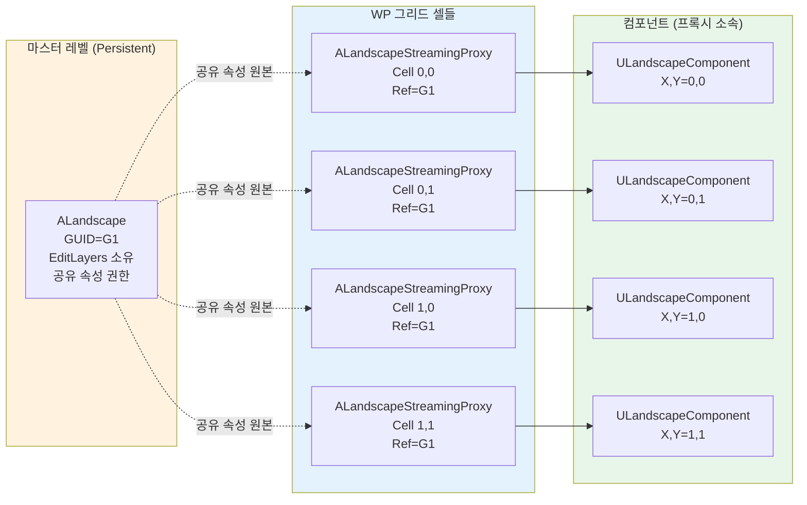
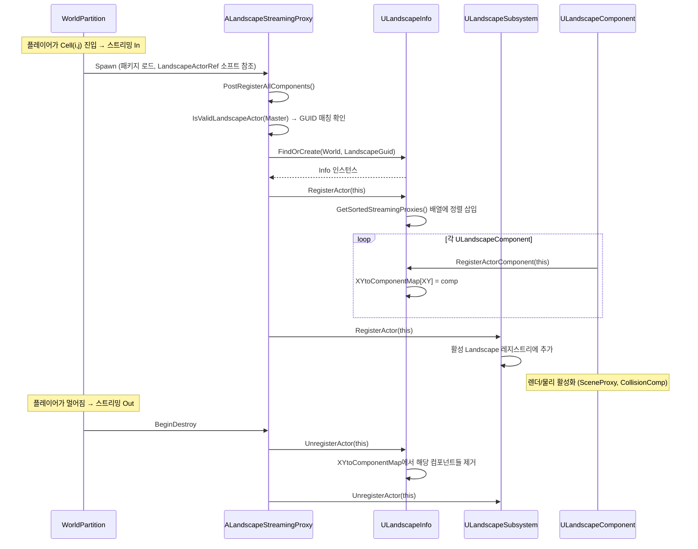

# 02. 아키텍처 — 액터 계층과 월드 레지스트리

> **작성일**: 2026-04-21
> **엔진 버전**: UE 5.7

## 1. 왜 액터가 3개로 나뉘어 있는가

Landscape를 처음 들여다보면 `ALandscape`, `ALandscapeProxy`, `ALandscapeStreamingProxy` 세 개 액터 클래스가 나옵니다. 처음엔 "지형 하나 그리는 데 왜 이렇게 많지?" 싶지만, 각각이 해결하는 문제가 분명히 다릅니다.

| 클래스 | 해결하는 문제 | 핵심 책임 |
|--------|-------------|----------|
| **`ALandscapeProxy`** | "지형 타일이라는 **공통 개념**을 하나의 타입으로 표현" | `ULandscapeComponent` 소유, 재질/물리 재질/스트리밍 설정 |
| **`ALandscape`** | "논리적으로 하나인 지형의 **편집 권한**과 **공유 속성**을 누가 들고 있는가" | Edit Layers 소유, 공유 속성 권한 (LOD 설정, 레이어 순서 등) |
| **`ALandscapeStreamingProxy`** | "World Partition 그리드에 맞춰 **타일 단위 스트리밍**" | `TSoftObjectPtr<ALandscape>` 참조, 그리드 크기 기반 명명 |

이 분리 덕분에 다음 두 시나리오가 모두 자연스럽게 동작합니다:

- **비파티션 맵** (전통적인 월드): `ALandscape` **하나**가 모든 컴포넌트를 직접 보유. 스트리밍 프록시 없음.
- **World Partition 맵**: `ALandscape` **하나**가 편집 권한만 보유하고 **실제 컴포넌트는 여러 `ALandscapeStreamingProxy`**에 분산.

### 1.1 먼저 짚고 갈 용어

위 표에 등장하는 "**컴포넌트**"와 "**WP 맵에서의 마스터/프록시 관계**"를 명확히 해두면 이후 내용이 훨씬 잘 읽힙니다.

#### "컴포넌트" = `ULandscapeComponent`

이 문서에서 말하는 "컴포넌트"는 단일 `ULandscapeComponent` 인스턴스를 뜻하며, **지형 타일 하나**의 데이터를 담는 Unreal 액터 컴포넌트입니다. 구체적으로:

- 보통 63×63 또는 127×127 quads 크기의 정사각 영역
- **`HeightmapTexture` 한 장** + **`WeightmapTextures` 여러 장** 보유
- 렌더링용 `FLandscapeComponentSceneProxy`를 생성
- 대응되는 `ULandscapeHeightfieldCollisionComponent`(물리)와 쌍으로 존재

자세한 내부 구조는 [03-core-classes.md §4](03-core-classes.md) / [04-heightmap-weightmap.md](04-heightmap-weightmap.md) 참고.

#### WP 맵에서 `ALandscape`와 `ALandscapeStreamingProxy`는 "상하"가 아니라 "형제"

직관적으로 "`ALandscape`가 상위, `ALandscapeStreamingProxy`가 하위"라고 생각하기 쉽지만, **언리얼 월드 액터 트리에는 둘 다 별도의 `AActor`로 나란히 존재**합니다. 부모-자식 관계가 아닙니다:

```
World Outliner:
  PersistentLevel
  ├── ALandscape (마스터, GUID=G1)         ← 항상 로드됨, 편집 권한·공유 속성 보유
  └── (WP 그리드 셀들이 로드되면 추가로)
      ├── ALandscapeStreamingProxy [Cell 0,0]  (Soft ref → G1)
      ├── ALandscapeStreamingProxy [Cell 0,1]  (Soft ref → G1)
      ├── ALandscapeStreamingProxy [Cell 1,0]  (Soft ref → G1)
      └── ...
```

관계의 성격:
- **참조**: 각 StreamingProxy가 `TSoftObjectPtr<ALandscape>`로 마스터를 가리킴 (Soft 참조라 마스터가 언로드돼도 프록시 로드 자체는 가능)
- **GUID 매칭**: 같은 논리적 Landscape에 속한다는 증빙은 `LandscapeGuid`
- **권한 분담**: 마스터 = "편집 및 공유 속성의 권위자", 프록시 = "실제 지형 타일 데이터"
- **논리적 집합의 표현**: 둘 다 `ULandscapeInfo` 레지스트리에 등록되어 함께 관리됨 (§4)

즉 WP 맵에서 "하나의 Landscape"는 **마스터 1 + 스트리밍 프록시 N**이 **GUID로 묶인 형제 액터 집합**으로 존재합니다.

## 2. 클래스 계층

```
AActor
  └── APartitionActor  (World Partition 지원)
        └── ALandscapeProxy  (공통 "지형 타일" 추상)
              ├── ALandscape  (마스터: edit layers + 공유 속성 권한)
              └── ALandscapeStreamingProxy  (WP 스트리밍 타일)
```

핵심은 `ALandscape`와 `ALandscapeStreamingProxy`가 **둘 다 `ALandscapeProxy`를 상속**한다는 점입니다. 즉 "지형의 공통 API"(`GetLandscapeActor()`, `GetLandscapeMaterial()`, 컴포넌트 보유 등)는 `ALandscapeProxy`에 있고, 마스터와 스트리밍 변종이 각자 추가 책임을 얹는 구조입니다.

> **소스 확인 위치**
> - `Engine/Source/Runtime/Landscape/Classes/Landscape.h:275-276` — `ALandscape : public ALandscapeProxy` 선언
> - `Engine/Source/Runtime/Landscape/Classes/LandscapeStreamingProxy.h:18-19` — `ALandscapeStreamingProxy : public ALandscapeProxy` 선언, `UCLASS(MinimalAPI, notplaceable)`
> - `Engine/Source/Runtime/Landscape/Classes/LandscapeProxy.h:18` — `#include "ActorPartition/PartitionActor.h"` (부모가 `APartitionActor`)

## 3. 액터별 책임 상세

### 3.1 ALandscapeProxy — 공통 기반

모든 지형 타일이 공유하는 구조를 정의합니다:

- `TArray<TObjectPtr<ULandscapeComponent>> LandscapeComponents` — 실제 타일 데이터
- `TArray<TObjectPtr<ULandscapeHeightfieldCollisionComponent>> CollisionComponents`
- 재질/물리/Nanite 설정 (`LandscapeMaterial`, `bUseNanite`, `RuntimeVirtualTextures` 등)
- 스플라인 인터페이스 `ILandscapeSplineInterface` 구현

> **소스 확인 위치**
> - `Engine/Source/Runtime/Landscape/Classes/LandscapeProxy.h` — `ALandscapeProxy` 클래스 선언부 (약 라인 500+, 매우 큰 클래스)
> - 부모 클래스: `Engine/Source/Runtime/Engine/Classes/ActorPartition/PartitionActor.h` — `APartitionActor`

### 3.2 ALandscape — 마스터 액터

`ALandscapeProxy`에 **편집 권한과 공유 속성 권한**을 추가합니다. 두 권한이 각각 구체적으로 무엇을 뜻하는지:

#### "편집 권한"이 가리키는 것

여기서 "편집"은 **Edit Layers 기반의 스컬프트/페인트 작업**입니다. 상세는 [05-edit-layers.md](05-edit-layers.md)에서 다루지만 요약하면:

- **스컬프트(Sculpt)** — 브러시로 Heightmap 높이를 올리고 내림
- **페인트(Paint)** — 브러시로 Weightmap 레이어 가중치를 칠함
- **편집 레이어 관리** — 여러 편집 레이어를 스택처럼 쌓고 순서 바꾸고 켜고 끄기
- **스플라인 편집** — Landscape 위에 경로를 긋고 주변 지형을 변형

이 모든 편집의 **"지금 어떤 레이어에 쓰고 있는가"**, **"어떤 브러시가 어느 레이어에 속하는가"** 같은 상태는 **마스터 `ALandscape` 하나만**이 보유합니다. 스트리밍 프록시는 편집 대상 영역에 해당하는 컴포넌트를 제공할 뿐, 편집 세션 상태를 따로 가지지 않습니다.

관련 구성:
- `TArray<FLandscapeLayer> LandscapeEditLayers` (Landscape.h:720, private) — 편집 레이어 스택
- `FGuid EditingLayer` — 현재 편집 중인 레이어
- `CreateLayer`, `DeleteLayer`, `ReorderLayer`, `SetEditingLayer`, `ForceLayersFullUpdate` 등 API

#### "공유 속성"이 가리키는 것

WP 맵에서 모든 스트리밍 프록시가 공유해야 할 **"Landscape 전체 설정"**입니다. 대표 예시:

| 공유 속성 예시 | 왜 공유되어야 하나 |
|---|---|
| `LandscapeMaterial` | 인접 프록시 간 재질 차이 → 경계에서 시각적 불연속 |
| LOD 파라미터 (`LODDistributionSetting`, `LOD0DistributionSetting`) | 같은 거리에서 프록시마다 LOD가 다르면 티 남 |
| Nanite 설정 (`bEnableNanite`, Nanite Position Precision, Skirt) | 부분적으로만 Nanite면 렌더 일관성 깨짐 |
| `CastShadow`, `bCastStaticShadow` | 그림자 경계 불연속 방지 |
| `CollisionMipLevel`, `SimpleCollisionMipLevel` | 콜리전 정밀도 일관성 |

이들은 마스터의 값이 "Landscape 전체 기본값"으로 쓰이고, 스트리밍 프록시는 자동으로 이 값을 따릅니다.

#### 마스터와 프록시 속성이 다르면 어떻게 동작하나

흔한 오해: "프록시가 ALandscapeProxy를 상속하니 같은 속성을 독립적으로 갖는데, 값이 서로 다르면 충돌하지 않나?"

실제 메커니즘은 **"기본 = 마스터 값 사용, 예외 = 명시적 오버라이드"**입니다:

1. 프록시 로드 시 `PostRegisterAllComponents` 내에서 `FixupOverriddenSharedProperties()`가 호출됨
2. 이 함수는 **마스터의 공유 속성 값을 프록시의 로컬 사본에 복사**
3. 단 프록시의 `OverriddenSharedProperties: TSet<FName>`에 등록된 속성 이름은 **복사에서 제외** → 프록시가 들고 있는 로컬 값이 우선
4. 사용자가 프록시 디테일 창에서 속성을 **명시적으로 변경**하면 그 속성 이름이 자동으로 `OverriddenSharedProperties`에 추가됨

즉:
- **기본 상태**: 프록시의 모든 공유 속성 ← 마스터 값 (사용자 눈에는 "상속됨"으로 표시)
- **수동 오버라이드**: 특정 프록시만 "이 재질 다르게"라고 지정 → 해당 속성만 프록시 로컬 값 사용, 다른 속성은 계속 마스터 값 추종
- **마스터 값 변경**: 이전에 오버라이드되지 않은 모든 프록시에 자동 전파

이 메커니즘의 장점:
- 기본은 깔끔한 일관성 (값이 한 곳, 여러 곳에 자동 반영)
- 필요할 때만 국소 예외 (특정 프록시만 디버그 재질 등)
- "어떤 프록시가 표준에서 벗어났는지"가 `OverriddenSharedProperties` 집합으로 명시적 추적됨

자세한 오버라이드 API와 델리게이트는 [07-streaming-wp.md §3](07-streaming-wp.md) 참고.

#### 나머지 핵심 책임

- **Edit Layer 업데이트 엔트리** — `TickLayers`, `RegenerateLayersHeightmaps`, `PerformLayersHeightmapsBatchedMerge` 등 편집 레이어 → 최종 텍스처 머지 파이프라인이 여기서 시작
- **Spatial loading 제한** — `CanChangeIsSpatiallyLoadedFlag() -> false` (마스터는 항상 로드된 상태로 월드에 존재해야 편집 권위자 역할 가능)
- **런타임 블루프린트 API** — `RenderHeightmap`, `RenderWeightmap` 등 블루프린트에서 최종 합성 텍스처를 외부 RT로 덤프하는 엔트리

> **소스 확인 위치**
> - `Engine/Source/Runtime/Landscape/Classes/Landscape.h:276` — `ALandscape` 선언
> - `Landscape.h:289-291` — `GetLandscapeActor()` 오버라이드 (자신을 반환)
> - `Landscape.h:324` — `CanChangeIsSpatiallyLoadedFlag() -> false`
> - `Landscape.h:412-415` — `CreateLayer`, `CreateDefaultLayer`
> - `Landscape.h:508` — `SetEditingLayer(FGuid)` — 현재 편집 레이어 설정
> - `Landscape.h:720` — `LandscapeEditLayers` 비공개 저장소
> - `Engine/Source/Runtime/Landscape/Classes/LandscapeStreamingProxy.h:35-36` — `OverriddenSharedProperties`
> - `LandscapeStreamingProxy.h:67-72` — 오버라이드 판정/설정/fixup API

### 3.3 ALandscapeStreamingProxy — 스트리밍 타일

World Partition 그리드에 맞춰 스폰되는 **공간 분할된 타일 프록시**입니다:

- `UCLASS(notplaceable)` — 에디터 액터 배치 메뉴에서 숨김 (사용자가 직접 놓지 않음)
- `TSoftObjectPtr<ALandscape> LandscapeActorRef` — **Soft 참조로 마스터 가리킴** (마스터가 언로드되어도 프록시 로드 자체는 가능)
- `IsValidLandscapeActor(ALandscape*)` — **GUID 매칭 검증** (엉뚱한 마스터에 붙는 걸 방지)
- `ShouldIncludeGridSizeInName(...)` — WP 액터 명명 규칙 참여 (파일명에 그리드 셀 ID 포함)
- `GetActorDescProperties(FPropertyPairsMap&)` — ActorDesc에 파티션 메타데이터 내보냄
- `OverriddenSharedProperties: TSet<FName>` — 마스터 기본값을 **개별 오버라이드**하는 속성 이름 집합

> **소스 확인 위치**
> - `Engine/Source/Runtime/Landscape/Classes/LandscapeStreamingProxy.h:18-19` — 클래스 선언
> - `LandscapeStreamingProxy.h:32-33` — `LandscapeActorRef` (Soft 참조)
> - `LandscapeStreamingProxy.h:49` — `ShouldIncludeGridSizeInName` 오버라이드
> - `LandscapeStreamingProxy.h:63` — `IsValidLandscapeActor(ALandscape*)` GUID 검증
> - `LandscapeStreamingProxy.h:35-36` — `OverriddenSharedProperties`

### 3.4 마스터/프록시 관계 다이어그램



- 편집 권한은 **항상 마스터(G1)**에게 있음
- 런타임에 플레이어가 Cell(0,0) 근처에 있으면 `P1`만 로드됨 → `C1`만 메모리에 상주
- 스트리밍된 프록시는 GUID 매칭으로 자기가 속한 마스터를 찾아 Info에 등록

## 4. ULandscapeInfo — 월드 레지스트리

마스터와 스트리밍 프록시, 그리고 각 프록시의 컴포넌트들을 **좌표 기반으로 찾아주는 인덱스**가 필요합니다. 이를 `ULandscapeInfo`가 담당합니다.

### 4.1 역할

- **월드 내 "하나의 논리적 Landscape"당 하나** 존재 (GUID로 식별)
- `UCLASS(Transient)` — 저장되지 않는 런타임 전용 (매번 재구축)
- 각 월드의 `FLandscapeInfoMap`(외부 Map)에서 GUID로 조회

### 4.2 핵심 상태

```cpp
// LandscapeInfo.h:107
UCLASS(Transient)
class ULandscapeInfo : public UObject
{
    TWeakObjectPtr<ALandscape> LandscapeActor;   // 이 Info가 속한 마스터
    FGuid LandscapeGuid;                         // 식별자
    
    int32 ComponentSizeQuads;                    // 공유 속성 (마스터가 전파)
    int32 SubsectionSizeQuads;
    int32 ComponentNumSubsections;

    // 좌표 → 컴포넌트 (에디터 전용)
    TMap<FIntPoint, ULandscapeComponent*> XYtoComponentMap;
    
    // 좌표 → 콜리전 컴포넌트 (런타임 포함 — 서버가 ULandscapeComponent 없이 쓰기 위해)
    TMap<FIntPoint, ULandscapeHeightfieldCollisionComponent*> XYtoCollisionComponentMap;
    
    // 스트리밍 프록시 정렬 배열 (private, GetSortedStreamingProxies로만 접근)
    TArray<TWeakObjectPtr<ALandscapeStreamingProxy>> StreamingProxies;
    // ...
};
```

### 4.3 주요 API

| API | 용도 | 시점 |
|-----|------|------|
| `Find(World, Guid)` | 기존 Info 찾기 | 모든 조회 진입점 |
| `FindOrCreate(World, Guid)` | 없으면 생성 | 마스터/프록시가 처음 등록될 때 |
| `RegisterActor(ALandscapeProxy*, ...)` | 프록시 등록 | 프록시 `PostRegisterAllComponents` |
| `UnregisterActor(ALandscapeProxy*)` | 프록시 해제 | 프록시 Destroy/Unload |
| `RegisterActorComponent(ULandscapeComponent*)` | 컴포넌트 등록 | 컴포넌트 생성/로드 |
| `RegisterCollisionComponent(...)` | 콜리전 등록 (서버 전용) | 콜리전 컴포넌트 생성 |
| `GetSortedStreamingProxies()` | 정렬된 프록시 목록 | 반복 순회 시 |
| `ForEachLandscapeProxy(Fn)` | 마스터 + 스트리밍 모두 순회 | 전역 작업 |
| `GetOverlappedComponents(...)` | AABB 겹치는 컴포넌트 조회 | 편집 도구, AI 쿼리 |

### 4.4 왜 private + GetSortedStreamingProxies인가

`StreamingProxies` 배열은 **정렬 상태**가 필요합니다 (ID 순서, 결정론적 순회). 외부에서 임의로 `Add/Remove` 하면 정렬이 깨지므로:

```cpp
UE_DEPRECATED(5.7, "StreamingProxies rely on a sorted state and should not be modified outside of ULandscapeInfo. Use GetSortedStreamingProxies instead.")
UPROPERTY()
TArray<TWeakObjectPtr<ALandscapeStreamingProxy>> StreamingProxies_DEPRECATED;

// LandscapeInfo.h:388 — 권장 접근자
const TArray<TWeakObjectPtr<ALandscapeStreamingProxy>>& GetSortedStreamingProxies() const;
```

이전 public `StreamingProxies`는 DEPRECATED 처리되고, 내부에서만 수정 가능한 정렬된 버전만 노출됩니다.

> **소스 확인 위치**
> - `Engine/Source/Runtime/Landscape/Classes/LandscapeInfo.h:107-179` — `ULandscapeInfo` 선언
> - `LandscapeInfo.h:145-148` — `XYtoComponentMap`, `XYtoCollisionComponentMap`
> - `LandscapeInfo.h:156-158` — `StreamingProxies_DEPRECATED`
> - `LandscapeInfo.h:380-382` — `Find` / `FindOrCreate` / `RemoveLandscapeInfo`
> - `LandscapeInfo.h:388` — `GetSortedStreamingProxies`
> - `LandscapeInfo.h:398` — `ForEachLandscapeProxy`
> - `LandscapeInfo.h:406` — `RegisterActor`

## 5. 등록 흐름 — 프록시 로드에서 렌더까지

프록시가 언제 Info에 붙고 언제 떨어지는지의 시퀀스를 한 번 추적해봅니다.



핵심 지점:

1. **GUID 매칭**이 먼저 — 잘못된 마스터를 가리키는 프록시는 등록 실패
2. **프록시 등록 → 컴포넌트 등록** 순서 (프록시가 먼저 Info에 자리를 잡은 뒤 소속 컴포넌트들이 좌표 맵에 들어감)
3. **Subsystem 등록**은 별도 — 프록시 수명주기(틱/그래스/스트리밍) 관리용
4. **언로드도 대칭** — 컴포넌트 먼저 해제, 그다음 액터 해제

> **소스 확인 위치**
> - `LandscapeStreamingProxy.h:44` — `PostRegisterAllComponents` 오버라이드 (에디터 한정)
> - `LandscapeInfo.h:406, 409` — `RegisterActor` / `UnregisterActor`
> - `LandscapeInfo.h:418, 421` — `RegisterActorComponent` / `UnregisterActorComponent`
> - `Engine/Source/Runtime/Landscape/Public/LandscapeSubsystem.h:110-111` — `ULandscapeSubsystem::RegisterActor` / `UnregisterActor`

## 6. World Partition와의 연결점

`ALandscapeProxy`가 `APartitionActor`를 상속하는 것 자체가 World Partition 통합의 뿌리입니다. 구체적으로 다음 지점에서 WP와 맞물립니다:

| 지점 | 역할 |
|------|------|
| **`APartitionActor` 상속** | WP가 액터를 그리드 기반으로 관리할 수 있게 되는 기본 자격 |
| **`ShouldIncludeGridSizeInName`** | 같은 Landscape가 그리드 크기가 다르면 이름 충돌 방지 위해 그리드 셀 ID가 파일명에 포함됨 |
| **`GetActorDescProperties`** | ActorDesc(월드 파티션 메타데이터)에 레이어 정보 등 추가 속성 내보냄 |
| **`bAreNewLandscapeActorsSpatiallyLoaded`** (`ALandscape`) | 새로 생성되는 StreamingProxy/SplineActor가 **Spatial Load 대상**이 될지 결정 |
| **`GetGridSize`** (`ULandscapeInfo`) | 현재 Info의 그리드 셀당 컴포넌트 수에 기반한 그리드 크기 계산 |

> **소스 확인 위치**
> - `Engine/Source/Runtime/Landscape/Classes/Landscape.h:646-648` — `bAreNewLandscapeActorsSpatiallyLoaded` (ALandscape가 스트리밍 기본값 권한)
> - `LandscapeStreamingProxy.h:49-50` — `ShouldIncludeGridSizeInName` + `GetActorDescProperties`
> - `LandscapeInfo.h:375` — `GetGridSize(uint32 InGridSizeInComponents)`

구체적인 스트리밍 프록시 생성 시점/그리드 크기 규칙은 [07-streaming-wp.md](07-streaming-wp.md)에서 더 깊이 다룹니다.

## 7. 요약: "지형 하나"를 바라보는 3가지 시점

이 문서 전체를 한 장으로 요약하면:

| 시점 | 누구의 관점 | 주된 관심사 |
|------|-----------|----------|
| **게임플레이** | `ALandscape` / `ALandscapeProxy` | "이 공간에 이런 지형이 있고 이런 재질로 그려진다" |
| **편집** | `ALandscape` | "지금 편집 중인 레이어에 변경을 쌓는다" |
| **스트리밍** | `ALandscapeStreamingProxy` + `ULandscapeInfo` | "어느 셀이 지금 로드되어야 하는가, 누가 어디 속해 있는가" |

세 시점이 서로 다른 데이터 구조를 보기 때문에 클래스가 분리되어 있고, 공통 연결자가 **GUID + `ULandscapeInfo` 레지스트리**입니다. 이 틀을 잡고 나면 이후 문서에서 다룰 편집 파이프라인/스트리밍/렌더링이 "어느 시점을 다루는지" 명확해집니다.
