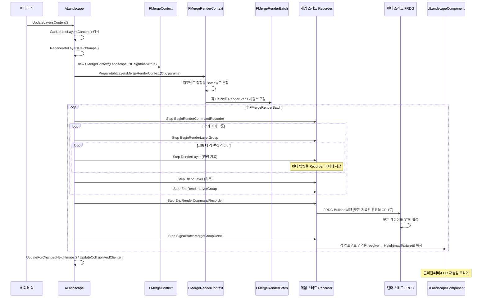

# 05. Edit Layers와 BatchedMerge 파이프라인

> **작성일**: 2026-04-21
> **엔진 버전**: UE 5.7

## 1. Edit Layers의 목적 — 왜 "레이어" 구조인가

초기 Landscape에서는 편집이 **파괴적(destructive)**이었습니다. 브러시로 높이를 올리면 Heightmap 텍스처가 바로 그 결과로 덮어쓰여서, 나중에 "이 변경만 취소"하려면 실수로 덮어쓴 히스토리까지 다 되돌려야 했습니다.

**Edit Layers 시스템**은 이 문제를 포토샵 레이어처럼 해결합니다:

- 편집은 **현재 활성 레이어**에만 기록됨 (다른 레이어는 건드리지 않음)
- 각 레이어는 **자기 기여분만 저장** — 결과 Heightmap은 모든 레이어를 병합해 만듦
- 레이어 순서를 바꾸거나, 특정 레이어만 끄거나, 제거할 수 있음
- **비파괴적 편집** — 원본 데이터는 각 레이어에 그대로 남음

5.7부터는 Edit Layers가 **기본값이자 유일한 경로**입니다 (비-edit-layer Landscape는 deprecated). 그래서 레이어 시스템 = 지금의 Landscape 시스템입니다.

## 2. 레이어 계층 구조

### 2.1 ULandscapeEditLayerBase — 추상 기반

모든 편집 레이어는 `ULandscapeEditLayerBase`(`UCLASS`)를 상속합니다. 이 베이스가 "레이어"라는 공통 개념(이름, 가시성, 알파, 블렌딩)을 정의하고, 구체 하위 클래스가 **"이 레이어가 Heightmap/Weightmap에 어떻게 기여하는가"**를 구현합니다.

| 주요 API (가상) | 역할 |
|---|---|
| `SupportsTargetType(Type)` | 이 레이어가 heightmap/weightmap/visibility 중 무엇을 다루는지 |
| `NeedsPersistentTextures()` | 디스크에 텍스처로 저장 필요한지 (일반 사용자 레이어 vs 절차적) |
| `SupportsEditingTools()` | 스컬프트/페인트 도구로 편집 가능한지 |
| `SupportsBeingCollapsedAway()` | 다른 레이어로 "병합(collapse)" 가능한지 |
| `GetEditLayerRendererStates(...)` | **GPU 머지에 참여하는 렌더러 상태 목록 반환** — 머지 파이프라인의 진입점 |

### 2.2 구체 하위 클래스 (대표 예시)

| 클래스 | 용도 |
|---|---|
| `ULandscapeEditLayerPersistent` | 일반 사용자 편집 레이어. 디스크에 텍스처로 저장. |
| `ULandscapeEditLayerSplines` | Landscape Spline이 기여하는 레이어. 스플라인 변경 시 자동 재생성. |
| `ULandscapeEditLayerProcedural` | 절차적 레이어. 블루프린트/C++ 로직으로 Heightmap/Weightmap 생성. |

각 클래스가 자기 방식대로 **GPU 렌더 타겟에 기여**하고, 이 기여분들을 `FMergeRenderContext`가 순서대로 합성합니다.

### 2.3 FLandscapeLayer — 레이어 + 브러시 묶음

`ALandscape`가 보유하는 레이어 리스트는 `ULandscapeEditLayerBase` 직접 배열이 아니라, **`FLandscapeLayer` 구조체의 배열**입니다:

```cpp
// Landscape.h:164
USTRUCT()
struct FLandscapeLayer
#if CPP && WITH_EDITOR
    : public UE::Landscape::EditLayers::IEditLayerRendererProvider
#endif
{
    GENERATED_USTRUCT_BODY()
    
    UPROPERTY()
    TArray<FLandscapeLayerBrush> Brushes;           // 이 레이어에 연결된 블루프린트 브러시들
    
    UPROPERTY(Instanced)
    TObjectPtr<ULandscapeEditLayerBase> EditLayer;  // 실제 레이어 구현
    
    // Deprecated 필드들 (Guid, Name, bVisible, HeightmapAlpha 등 → ULandscapeEditLayerBase로 이동됨)
};
```

그리고 `ALandscape`가 이걸 배열로 소유:

```cpp
// Landscape.h:720
private:
    UPROPERTY()
    TArray<FLandscapeLayer> LandscapeEditLayers;
```

**왜 직접 `ULandscapeEditLayerBase[]`가 아닌가**: 블루프린트 브러시(`ALandscapeBlueprintBrushBase`)는 레이어와 별개의 객체지만 특정 레이어에 종속됩니다. `FLandscapeLayer`가 "레이어 본체 + 그에 묶인 브러시들"을 묶는 컨테이너 역할을 합니다.

> **소스 확인 위치**
> - `Engine/Source/Runtime/Landscape/Classes/LandscapeEditLayer.h` — `ULandscapeEditLayerBase` 및 하위 클래스
> - `Engine/Source/Runtime/Landscape/Classes/Landscape.h:164-212` — `FLandscapeLayer`
> - `Landscape.h:720` — `LandscapeEditLayers` 저장소
> - `Landscape.h:412-415` — `CreateLayer`, `CreateDefaultLayer`
> - `Landscape.h:458-470` — 레이어 접근자 API (`GetEditLayers`, `GetEditLayerConst` 등)

## 3. BatchedMerge — GPU로 레이어를 합치다

### 3.1 목적

"여러 편집 레이어의 기여분을 **최종 Heightmap/Weightmap 텍스처 한 장**으로 합성"하는 것이 BatchedMerge의 목적입니다. 예:

```
[레이어 스택]
  Layer 2: 브러시로 산 추가  (+높이 0~500)
  Layer 1: 강 팩 (Spline 기반) (−높이 0~50)
  Layer 0: 베이스 Heightmap (높이 0)

    ↓ GPU에서 순서대로 합성

[최종 Heightmap 텍스처]
  각 픽셀 = Layer 0 → Layer 1 → Layer 2 순으로 적용된 결과
```

Weightmap도 같은 방식으로, 각 편집 레이어가 가중치 증감을 쌓아 최종 레이어별 Weightmap을 만듭니다.

### 3.2 왜 "Batched"인가

Landscape는 **컴포넌트 수백 개**로 구성되며, 각 컴포넌트마다 별도 Heightmap/Weightmap 텍스처가 있습니다. 순진하게 "컴포넌트 하나당 한 번씩 GPU 드로우"를 하면 드로우 콜이 폭증합니다.

BatchedMerge는 **인접 컴포넌트들을 묶어 큰 RenderTarget 하나에 한 번에 렌더**합니다:

```
 [Batch 1: RT 512×512]
  ┌──────┬──────┬──────┐
  │ Comp │ Comp │ Comp │
  │  A   │  B   │  C   │
  ├──────┼──────┼──────┤
  │ Comp │ Comp │ Comp │
  │  D   │  E   │  F   │
  ├──────┼──────┼──────┤
  │ Comp │ Comp │ Comp │
  │  G   │  H   │  I   │
  └──────┴──────┴──────┘
  
  9개 컴포넌트를 한 RT에 그린 뒤, 각 영역을 잘라서 개별 HeightmapTexture로 resolve
```

한 Batch의 범위는 **`FMergeRenderBatch::SectionRect`** (Landscape 정점 좌표의 사각형 영역)이며, 이 영역에 속하는 컴포넌트들이 `ComponentsToRender`로 모입니다.

### 3.3 진입점 — ALandscape의 Regenerate 함수들

```cpp
// Landscape.h (private 선언)
int32 RegenerateLayersHeightmaps(const FUpdateLayersContentContext& InUpdateLayersContentContext);
int32 PerformLayersHeightmapsBatchedMerge(
    const FUpdateLayersContentContext& InUpdateLayersContentContext,
    const FEditLayersHeightmapMergeParams& InMergeParams);

int32 RegenerateLayersWeightmaps(FUpdateLayersContentContext& InUpdateLayersContentContext);
int32 PerformLayersWeightmapsBatchedMerge(
    FUpdateLayersContentContext& InUpdateLayersContentContext,
    const FEditLayersWeightmapMergeParams& InMergeParams);
```

`Regenerate*` → 컨텍스트를 구성하고 `Perform*BatchedMerge`를 호출 → 실제 GPU 머지 파이프라인 구동.

**전역 엔트리**는 `ALandscape::UpdateLayersContent()` (Landscape.h:585):

```cpp
void UpdateLayersContent(bool bInWaitForStreaming, bool bInSkipMonitorLandscapeEdModeChanges, bool bFlushRender);
```

에디터 틱마다 호출되어 "변경된 레이어가 있으면 머지 실행"을 체크합니다.

> **소스 확인 위치**
> - `Engine/Source/Runtime/Landscape/Classes/Landscape.h:585-627` — 머지 진입점 private 선언
> - `Engine/Source/Runtime/Landscape/Private/LandscapeEditLayers.cpp:4499` — `PerformLayersHeightmapsBatchedMerge` 정의 (약 4500행 부근, 파일 크기가 매우 큼)

## 4. 핵심 자료구조

### 4.1 FMergeContext — 전역 머지 메타데이터

```cpp
// LandscapeEditLayerMergeContext.h:31
class FMergeContext
{
    bool bIsHeightmapMerge;                                      // 높이/가중치 구분
    bool bSkipProceduralRenderers;                              // 절차적 레이어 스킵 (디버그)
    ALandscape* Landscape;
    ULandscapeInfo* LandscapeInfo;
    
    TArray<FName> AllTargetLayerNames;                          // 대상 레이어 이름 전체 (인덱스 = 비트 위치)
    TArray<ULandscapeLayerInfoObject*> AllWeightmapLayerInfos;  // 대응 LayerInfo
    TBitArray<> ValidTargetLayerBitIndices;                     // 유효 레이어만 true
    TBitArray<> VisibilityTargetLayerMask;                      // 가시성 레이어 비트
    int32 VisibilityTargetLayerIndex;
    
    FTargetLayerGroupsPerBlendingMethod TargetLayerGroupsPerBlendingMethod;
};
```

핵심 설계: **레이어 이름 → 정수 인덱스 매핑**을 제공해서, 이후 파이프라인 전체가 "레이어 집합"을 다룰 때 `TSet<FName>` 대신 **`TBitArray<>`**를 사용합니다. 레이어가 많을 때 교집합/합집합 연산이 훨씬 빠릅니다.

주요 조회 API:

```cpp
int32 GetTargetLayerIndexForName(const FName& InName) const;
TBitArray<> ConvertTargetLayerNamesToBitIndices(TConstArrayView<FName> InTargetLayerNames) const;
bool IsValidTargetLayerName(const FName& InName) const;
void ForEachValidTargetLayer(TFunctionRef<bool(int32, const FName&, ULandscapeLayerInfoObject*)> Fn) const;
```

> **소스 확인 위치**
> - `Engine/Source/Runtime/Landscape/Public/LandscapeEditLayerMergeContext.h:31-241` — `FMergeContext` 전체

### 4.2 FMergeRenderParams — 배치별 요청

```cpp
// LandscapeEditLayerMergeRenderContext.h:52
struct FMergeRenderParams
{
    TArray<ULandscapeComponent*> ComponentsToMerge;          // 머지할 컴포넌트
    TArray<FEditLayerRendererState> EditLayerRendererStates; // 참여할 레이어 렌더러 상태
    TSet<FName> WeightmapLayerNames;                         // 요청된 웨이트맵 레이어 이름
    bool bRequestAllLayers;                                  // "모든 유효 레이어" 오버라이드
};
```

호출자가 "이 컴포넌트 집합에 이 레이어들만 머지해 줘"라고 요청하는 구조체입니다. 파이프라인 내부에서는 의존성 때문에 요청보다 더 많은(혹은 적은) 렌더러가 실제로 실행될 수 있습니다.

### 4.3 FEditLayerRendererState — 레이어의 렌더 상태

각 편집 레이어는 **"내가 무엇을 할 수 있는지"**와 **"지금 무엇을 하는지"**를 분리해 표현합니다:

```cpp
// LandscapeEditLayerRendererState.h:25 (개념적 스케치)
class FEditLayerRendererState
{
    FEditLayerTargetTypeState SupportedTargetTypeState;  // 불변: 지원 가능 (정의 시점에 고정)
    FEditLayerTargetTypeState EnabledTargetTypeState;    // 가변: 현재 활성 (실행 시점에 조작 가능)
    
    TArray<FTargetLayerGroup> TargetLayerGroups;         // 가중치 블렌딩 의존성 그룹
    
public:
    void EnableTargetType(ELandscapeToolTargetType Type);
    void DisableWeightmap(const FName& InLayerName);
    bool IsTargetActive(...) const;
    TArray<FName> GetActiveTargetWeightmaps() const;
};
```

예: `ULandscapeEditLayerSplines`는 Heightmap과 일부 Weightmap을 지원할 수 있지만(`Supported`), 특정 머지에서는 Weightmap만 활성화(`Enabled`)하여 Heightmap 기여를 건너뛸 수 있습니다.

### 4.4 FMergeRenderStep — 렌더 단계

Batch 하나는 **여러 렌더 단계(`FMergeRenderStep`)**의 시퀀스로 구성됩니다:

```cpp
// LandscapeEditLayerMergeRenderContext.h:75
struct FMergeRenderStep
{
    enum class EType
    {
        BeginRenderCommandRecorder,    // 명령 기록 시작 (게임 스레드)
        EndRenderCommandRecorder,      // 기록된 명령들을 렌더 스레드로 제출 (FRDG 생성·실행)
        
        BeginRenderLayerGroup,         // 연속 렌더 가능한 레이어 그룹 시작
        EndRenderLayerGroup,           // 그룹 끝
        
        RenderLayer,                   // 한 편집 레이어의 기여를 기록
        BlendLayer,                    // 블렌딩 단계
        
        SignalBatchMergeGroupDone,     // 배치 완료 알림 — 결과 텍스처 resolve
    };
    
    EType Type;
    ERenderFlags RenderFlags;
    FEditLayerRendererState RendererState;
    TBitArray<> TargetLayerGroupBitIndices;     // 이 단계가 다루는 레이어
    TArray<ULandscapeComponent*> ComponentsToRender;
};
```

**중요한 설계 포인트**: 모든 단계는 "게임 스레드에서 실행"되지만, `BeginRenderCommandRecorder`와 `EndRenderCommandRecorder` 사이의 `RenderLayer`/`BlendLayer` 호출은 **명령만 기록**합니다. 실제 GPU 명령은 `EndRenderCommandRecorder` 시점에 **FRDG Builder로 렌더 스레드에 제출**되어 일괄 실행됩니다.

이 구조 덕분에 수많은 레이어·컴포넌트가 포함된 머지도 **한 번의 렌더 스레드 페이스**로 처리되어 오버헤드가 낮습니다.

> **소스 확인 위치**
> - `Engine/Source/Runtime/Landscape/Public/LandscapeEditLayerMergeRenderContext.h:52-67` — `FMergeRenderParams`
> - `LandscapeEditLayerMergeRenderContext.h:75-137` — `FMergeRenderStep`
> - `LandscapeEditLayerMergeRenderContext.h:146-200+` — `FMergeRenderBatch`
> - `Engine/Source/Runtime/Landscape/Public/LandscapeEditLayerRendererState.h:25` — `FEditLayerRendererState`

### 4.5 FMergeRenderBatch — 배치 하나

```cpp
// LandscapeEditLayerMergeRenderContext.h:146
struct FMergeRenderBatch
{
    ALandscape* Landscape;
    FIntRect LandscapeExtent;                                    // 전체 랜드스케이프 영역
    FIntRect SectionRect;                                        // 이 배치 영역
    FIntPoint Resolution;                                        // RT 해상도 (중복 경계 포함)
    
    FIntPoint MinComponentKey, MaxComponentKey;
    
    TArray<FMergeRenderStep> RenderSteps;                        // 순차 실행할 단계들
    TSet<ULandscapeComponent*> ComponentsToRender;
    
    TBitArray<> TargetLayerBitIndices;                           // 이 배치의 모든 대상 레이어 (bitwise OR)
    TMap<ULandscapeComponent*, TBitArray<>> ComponentToTargetLayerBitIndices;
    TArray<TSet<ULandscapeComponent*>> TargetLayersToComponents;  // 역참조
    
    // 서브섹션 단위 영역 계산 API
    int32 ComputeSubsectionRects(ULandscapeComponent* InComponent, ...) const;
};
```

Batch는 "RT 한 장 + 그 안에 구워야 할 모든 단계"의 패키지입니다. 여러 Batch가 순차 실행되며 Landscape 전체 영역을 커버합니다.

## 5. 머지 실행 흐름

전체 흐름을 시퀀스로:



이 흐름에서 가장 중요한 두 지점:

1. **`EndRenderCommandRecorder`** — 게임 스레드가 기록한 렌더 명령을 렌더 스레드로 **한 번에** 제출. FRDG(Frame Resource DAG) Builder가 여기서 만들어져 최적화된 실행 플랜 생성.
2. **`SignalBatchMergeGroupDone`** — RT에 합성된 결과를 **컴포넌트별 HeightmapTexture로 copy-back**. 이 시점에서 최종 텍스처가 만들어짐.

## 6. 노멀 계산 — 3×3 이웃이 필요한 이유

Heightmap 머지의 마지막에 반드시 실행되는 특수 렌더러가 `ULandscapeHeightmapNormalsEditLayerRenderer`입니다. 이는 각 픽셀의 **노멀 XY**를 주변 높이로부터 계산합니다:

```
픽셀 (x, y)의 노멀 계산 (중앙 차분):
  dX = h(x+1, y) − h(x−1, y)
  dY = h(x, y+1) − h(x, y−1)
  Normal = normalize( (−dX, −dY, 1) )  (여기서 Z는 양의 값)
```

문제: 컴포넌트 **경계 픽셀**의 노멀을 계산하려면 **이웃 컴포넌트의 높이값**이 필요합니다. 컴포넌트 A의 오른쪽 경계 픽셀의 `h(x+1, y)`는 컴포넌트 B의 왼쪽 경계 픽셀이니까요.

그래서 BatchedMerge는 **노멀을 계산하려는 컴포넌트의 3×3 이웃**(자기 자신 + 8방향 이웃)을 모두 같은 배치에 포함시켜 RT에 같이 그립니다. 이웃이 없는(경계선에 있는) 컴포넌트는 노멀 계산이 **지연**되고, 이후 이웃이 로드될 때 다시 갱신됩니다.

이 제약이 배치 구성 알고리즘의 복잡성을 대부분 결정합니다: **"서로 이웃인 컴포넌트들을 같은 배치에 묶어라, 그런 이웃 조합이 한 배치의 RT 해상도 한계 내에 들어가도록 분할하라."**

> **소스 확인 위치**
> - `Engine/Source/Runtime/Landscape/Private/LandscapeEditLayers.cpp:4513-4514` — `ULandscapeHeightmapNormalsEditLayerRenderer` 스택 상단 추가
> - `LandscapeEditLayers.cpp:4562-4563` 근처 — 3×3 이웃 요구 체크
> - `Engine/Source/Runtime/Landscape/Public/LandscapeEdgeFixup.h` — 경계 고정 유틸

## 7. Weightmap 머지의 추가 복잡성

Heightmap은 "한 채널 텍스처"지만 Weightmap은 **N개 레이어가 RGBA 채널들에 패킹**되어 있어 다음 차이가 있습니다:

### 7.1 블렌딩 방식이 레이어별로 다름

각 `ULandscapeLayerInfoObject`는 **블렌딩 방식**을 지정합니다:
- **Weight Blend** — 전체 합이 1이 되도록 비례 정규화
- **No Weight Blend** — 단순 가산 (독립 레이어)

블렌딩 방식이 같은 레이어끼리 **`FTargetLayerGroup`**으로 묶여야 합니다 (서로 영향). `FMergeContext::TargetLayerGroupsPerBlendingMethod`가 이 그룹을 보관합니다.

### 7.2 레이어 할당 재조정 (ReallocateLayersWeightmaps)

머지 결과 어떤 레이어의 가중치가 **모든 픽셀에서 0**이 되면 해당 레이어를 weightmap에서 제거할 수 있고, 반대로 새 레이어가 등장하면 남는 채널을 찾아 할당해야 합니다.

이를 수행하는 게 `ALandscape::ReallocateLayersWeightmaps` (Landscape.h:625 근처):

```cpp
void ReallocateLayersWeightmaps(
    FUpdateLayersContentContext& InUpdateLayersContentContext,
    const TArray<ULandscapeLayerInfoObject*>& InBrushRequiredAllocations,
    const TMap<ULandscapeComponent*, TArray<ULandscapeLayerInfoObject*>>* InPerComponentAllocations,
    TSet<ULandscapeComponent*>* InRestrictTextureSharingToComponents);
```

이 단계가 있기 때문에 Weightmap 머지는 "텍스처 레이아웃이 중간에 바뀔 수 있는" 동적인 프로세스입니다.

### 7.3 Visibility 레이어의 특수성

Visibility 레이어는 다른 Weightmap과 **같은 RGBA8 텍스처의 한 채널**을 공유합니다. 그래서 "Weightmap만 머지" vs "Visibility만 머지"가 사실상 같은 텍스처의 다른 채널을 건드리는 것이라 **항상 4채널 단위로 해결**해야 합니다. 이 때문에 `FMergeContext`의 주석에도 명시됨:

```cpp
// LandscapeEditLayerMergeContext.h:204-206
// purposefully don't use ELandscapeToolTargetType here as ELandscapeToolTargetType::Weightmap 
// and ELandscapeToolTargetType::Visibility have to be processed together (because of weightmap 
// packing, which means a visibility weightmap could be another channel of a texture which 
// contains weightmap up to 3 other weightmaps, so we have to resolve the 4 channels altogether).
```

## 8. Readback — GPU 결과를 CPU로 가져오기

머지 결과는 GPU 텍스처에 있지만, 에디터는 CPU 측에서도 값에 접근해야 합니다 (실행 취소 히스토리, 콜리전 생성, 에셋 저장 등). `FLandscapeEditLayerReadback`이 이 역할을 합니다:

```cpp
// Landscape.h:609 (private 함수)
bool ResolveLayersTexture(
    FTextureToComponentHelper const& MapHelper,
    FLandscapeEditLayerReadback* InCPUReadBack,
    UTexture2D* InOutputTexture,
    TArray<FLandscapeEditLayerComponentReadbackResult>& InOutComponentReadbackResults,
    bool bIsWeightmap);
```

흐름:
1. GPU RT에서 출력 텍스처(UTexture2D)로 copy
2. `FLandscapeEditLayerReadback`이 비동기적으로 CPU로 readback 요청
3. 몇 프레임 후 CPU에 도착하면 `FLandscapeEditLayerComponentReadbackResult[]`에 채워짐
4. 이 결과로 콜리전 갱신(`UpdateCollisionAndClients`), 더티 영역 표시, 블루프린트 브러시 알림 등

이 readback 지연 때문에 **편집 → 결과 반영**이 "즉시"가 아니라 **수 프레임 뒤**입니다. 대부분 상황에서 체감되지 않지만, 브러시를 빠르게 드래그하면 미세한 지연이 관찰됩니다.

> **소스 확인 위치**
> - `Engine/Source/Runtime/Landscape/Classes/Landscape.h:609-610` — `ResolveLayersTexture`
> - `Landscape.h:613-616` — `UpdateForChangedHeightmaps` / `UpdateForChangedWeightmaps` / `UpdateCollisionAndClients`

## 9. 중간 정리 — 머지 파이프라인의 설계 의도

| 설계 선택 | 의도 |
|----------|------|
| **레이어 스택 구조** | 비파괴적 편집, 순서 재조정, 선택적 활성화 |
| **BitArray 기반 레이어 집합** | 많은 레이어 환경에서 집합 연산 O(n/64) |
| **배치 단위 RT 렌더링** | 수백 컴포넌트 × 수십 레이어 = 수천 드로우콜을 수십 번의 대규모 RT 렌더로 압축 |
| **Supported vs Enabled 분리** | 같은 레이어를 여러 머지 모드에서 다른 역할로 쓰기 |
| **Record → FRDG 제출 2단계** | 게임 스레드 기록 / 렌더 스레드 실행으로 병렬화 |
| **3×3 이웃 요구** | 컴포넌트 경계에서의 노멀·블렌딩 연속성 보장 |
| **Async Readback** | CPU 블로킹 없이 GPU 결과를 에디터 로직으로 가져옴 |

## 10. 호출자 관점의 진입 요약

외부에서 이 파이프라인을 건드리는 진입점들 (에디터 코드, 블루프린트 브러시 등):

| 함수 | 언제 호출되는가 |
|------|-------------|
| `ALandscape::ForceLayersFullUpdate()` (Blueprint 가능) | 전체 재머지 강제 |
| `ALandscape::ForceUpdateLayersContent()` | 다음 틱에 머지 실행 요청 |
| `ALandscape::RequestLayersContentUpdate(Mode)` | 특정 업데이트 모드만 큐에 등록 |
| `ALandscape::RequestSplineLayerUpdate()` | 스플라인 레이어만 갱신 요청 |
| `ALandscape::SelectiveRenderEditLayersHeightmaps(Params)` | 사용자 정의 부분 영역만 RT에 렌더 |
| `ALandscape::RenderHeightmap(Transform, Extents, OutRT)` | 블루프린트에서 최종 Heightmap을 외부 RT로 덤프 (런타임 사용 가능) |

이 중 에디터에서 가장 흔히 쓰이는 것은 `RequestLayersContentUpdate` — 브러시 조작이나 스플라인 편집 시 내부적으로 호출되어 다음 틱에 머지 파이프라인이 돌도록 예약합니다.

> **소스 확인 위치**
> - `Engine/Source/Runtime/Landscape/Classes/Landscape.h:399-401` — `RequestLayers*Update` 함수들
> - `Landscape.h:548-549` — `SelectiveRenderEditLayersHeightmaps/Weightmaps`
> - `Landscape.h:347-374` — `RenderHeightmap`, `RenderWeightmap`, `RenderWeightmaps` (블루프린트 API)
