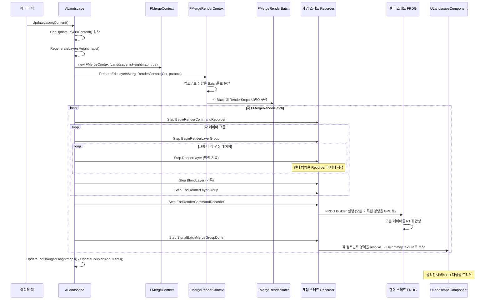

# 05. Edit Layers와 BatchedMerge 파이프라인

> **작성일**: 2026-04-21
> **엔진 버전**: UE 5.7

## 1. Edit Layers의 목적 — 왜 "레이어" 구조인가

초기 Landscape에서는 편집이 **파괴적(destructive)**이었습니다. 브러시로 높이를 올리면 Heightmap 텍스처가 바로 그 결과로 덮어쓰여서, 나중에 "이 변경만 취소"하려면 실수로 덮어쓴 히스토리까지 다 되돌려야 했습니다.

**Edit Layers 시스템**은 이 문제를 포토샵 레이어처럼 해결합니다:

- 편집은 **현재 활성 레이어**에만 기록됨 (다른 레이어는 건드리지 않음)
- 각 레이어는 **자기 기여분만 저장** — 결과 Heightmap은 모든 레이어를 병합해 만듦
- 레이어 순서를 바꾸거나, 특정 레이어만 끄거나, 제거할 수 있음
- **비파괴적 편집** — 원본 데이터는 각 레이어에 그대로 남음

5.7부터는 Edit Layers가 **기본값이자 유일한 경로**입니다 (비-edit-layer Landscape는 deprecated). 그래서 레이어 시스템 = 지금의 Landscape 시스템입니다.

### 1.0 레이어가 많아지면 비용이 어떻게 증가하는가

질문은 **두 종류의 "레이어"**에 따라 답이 다릅니다 (§4.1 참고). 각각의 비용 구조:

#### Edit Layer (편집 레이어 스택)가 많아질 때

| 비용 항목 | 영향 | 시점 |
|---------|------|------|
| **저장소** | `LayersData` 맵 항목 증가 — 컴포넌트마다 레이어별 텍스처/데이터 추가 | 에디터 전용 (cooked 빌드에는 없음) |
| **BatchedMerge 비용** | 머지 패스가 레이어마다 실행 → 머지 시간이 레이어 수에 비례 증가 | 편집 시점만 |
| **에디터 메모리** | LayersData의 텍스처들이 GPU/CPU에 로드 | 에디터 작업 시 |
| **런타임 렌더링** | **영향 없음** — 머지 결과인 단일 `HeightmapTexture`/`WeightmapTextures[]`만 쓰므로 | — |

즉 **Edit Layer가 늘어도 게임 빌드 런타임 비용은 그대로**. 에디터 편집 시 머지 시간만 늘어남.

#### Target Layer (= 페인트 레이어, Weightmap)가 많아질 때

| 비용 항목 | 영향 | 시점 |
|---------|------|------|
| **Weightmap 텍스처 수** | 4개 초과마다 `WeightmapTextures[]`에 텍스처 추가 (한 장당 4채널) | 영구 |
| **셰이더 텍스처 샘플 수** | PS가 레이어마다 샘플링 → **샘플 수가 레이어 수에 비례** | **런타임 매 프레임** |
| **머티리얼 블렌딩 연산** | 각 픽셀에서 N개 레이어 가중 평균 → 연산량 증가 | **런타임 매 프레임** |
| **콜리전 데이터** | `ComponentLayerInfos[]` 배열, 각 quad의 dominant 인덱스 (8비트라 최대 64개) | 영구 |

즉 **Target Layer는 늘어나면 런타임 셰이더 비용 직접 증가**. 그래서 컴포넌트당 4~8개 이내 권장 (§7.2 참고).

#### 정리

| 레이어 종류 | 늘릴 때 런타임 영향 | 비고 |
|------|-----|-----|
| **Edit Layer** | **없음** | 에디터 머지 비용만 |
| **Target Layer (Weightmap)** | **있음 — 셰이더 비용 ↑** | 컴포넌트당 4~8개 권장 |

요컨대 "Edit Layer 많이 쌓아도 런타임 손해 없음, Paint Layer 많이 칠하면 셰이더 비용 증가"입니다.

### 1.1 "자기 기여분"의 실체 — 그냥 Weightmap을 말하는 건가?

**아닙니다.** "기여분"은 이 레이어가 **Heightmap과 Weightmap에 각각 쌓은 변화량 전체**를 말합니다.

| 타겟 | 레이어가 기여하는 내용 |
|------|-------------------|
| **Heightmap** | 이 레이어에서 올리고 내린 높이 변화값 (Δ높이) |
| **Weightmap** | 이 레이어에서 칠한 페인트 레이어들의 가중치 변화 (Δ가중치) |
| **Visibility** | 구멍 뚫기 마스크 기여 |

#### "Δ가중치(가중치 변화)"의 정확한 의미 — 무엇으로부터의 변화인가

핵심: 변화의 기준점은 **"이전 레이어들까지 합성된 결과"**입니다. 절대 값이 아니라 **차분(delta)**.

```
Layer 0 (베이스):     Grass=0.7, Rock=0.2, Dirt=0.1
                      ↓ Layer 0의 결과 그대로 통과
Layer 1 결과 (베이스만):   Grass=0.7, Rock=0.2, Dirt=0.1
                      ↓ Layer 1이 "Δ가중치" 적용
                         예: Layer 1이 "이 영역에 Rock +0.4, Grass -0.3"
Layer 1 적용 후:          Grass=0.4, Rock=0.6, Dirt=0.1
                      ↓ Layer 2가 다시 Δ를 적용
Layer 2 적용 후:          Grass=0.4, Rock=0.5, Snow=0.1, Dirt=0.0  ...
```

**그래서 "변화"는**:
- **이전 레이어들이 만들어 놓은 "현재 상태"가 기준점**
- 이 레이어가 그 기준점에 **얼마나 더하거나 빼는지**가 Δ
- 사용자가 브러시로 "이 영역에 Rock 0.4만큼 칠하기" → Δ = +0.4 (브러시 강도)
- 같은 곳에 "Rock 다시 0.2만 남기고 지우기" → Δ = -0.2 (지우개 강도)

**"기본적으로 같은 비율이었다가 변화"인가?**:
- 보통은 베이스가 **하나의 기본 레이어로 가득 칠해진 상태**(예: Grass=1, 나머지=0)이거나 **빈 상태**
- "같은 비율"(예: 모든 레이어 25%씩)은 일반적이지 않음 — 자연스러운 지형은 어느 한 레이어가 우세하므로
- 베이스 위에 다른 레이어를 칠할수록 그 위치에서 가중치가 재분배 (합=1 유지)

**Heightmap의 Δ도 같은 방식**:
- 이전 레이어까지의 누적 높이가 기준점
- 이 레이어가 그 위에 +/-로 변화 추가 (예: "이 산을 +500cm 추가", "이 강을 −50cm")
- 즉 Δ는 절대 값이 아니라 **누적적 차분**

이 차분 모델 덕분에 레이어 순서를 바꾸면 결과가 바뀌고(같은 ±값을 다른 베이스 위에 적용), 특정 레이어를 끄면 그 레이어의 Δ만 빠진 결과가 나옵니다 — 포토샵 레이어와 동일.

저장 형태도 레이어 종류(§2.2)에 따라 다릅니다:

- **Persistent 레이어**: 실제 `UTexture2D`로 디스크 저장 (컴포넌트별로)
- **Splines 레이어**: 별도 저장 없이, 스플라인이 변경될 때마다 **실시간 재생성**
- **Procedural 레이어**: 블루프린트/C++ 로직이 매번 계산해서 기여

그래서 "자기 기여분" = "이 레이어가 합성 결과에 추가하는 Heightmap/Weightmap 변화량" 전반이며, 그중 Weightmap 기여는 단지 한 부분입니다.

### 1.2 레이어의 범위 — 컴포넌트별인가, Landscape 전체인가?

결론: **레이어는 "ALandscape 전체에 걸친 스택"**이고, **각 컴포넌트는 모든 레이어의 자기 영역 기여분을 각자 보관**합니다.

```
[Edit Layer 스택 — ALandscape 하나에 대해 전역]

 ┌────────────────────────────────────────────────────┐
 │ Layer 2: "산 추가"  (전체 Landscape 영역을 덮는 편집 슬롯)│
 ├────────────────────────────────────────────────────┤
 │ Layer 1: "강 팩"                                    │
 ├────────────────────────────────────────────────────┤
 │ Layer 0: "베이스"                                    │
 └────────────────────────────────────────────────────┘
     ↓ 각 컴포넌트가 "자기 영역 기여분"을 각자 보관
     
[컴포넌트 (0,0)]                 [컴포넌트 (1,0)]              [컴포넌트 (1,1)]
LayersData:                    LayersData:                    LayersData:
  ├ Layer2: 이 타일 기여 텍스처   ├ Layer2: (기여 없음 → 빈 칸)   ├ Layer2: 이 타일 기여 텍스처
  ├ Layer1: 이 타일 기여 텍스처   ├ Layer1: 이 타일 기여 텍스처   ├ Layer1: (기여 없음)
  └ Layer0: 베이스               └ Layer0: 베이스               └ Layer0: 베이스
```

#### 다이어그램 풀어 읽기 — 텍스처/베이스/UV/Heightmap

위 그림에서 자주 나오는 의문 4가지를 정리합니다.

**(1) 어떤 텍스처를 활용할지는 누가 결정?**:
- **사용자가 에디터에서 결정**합니다. Landscape 에디터의 "Layer" 패널에서 새 Edit Layer 추가, 새 Paint Layer 추가, 어디에 어떻게 칠할지 모두 사용자 입력.
- 시스템이 자동으로 끼워넣는 건 아님 — 사용자의 페인팅·스컬프트·스플라인 변경 같은 의도적 행동의 결과로 LayersData에 데이터가 쌓임.
- 예외: `Procedural` 레이어는 블루프린트/C++ 로직이 자동으로 기여를 생성할 수 있음 (사용자가 그 로직을 작성한 결과).

**(2) "베이스"는 모든 컴포넌트가 같은 정보를 담는가? Fallback?**:
- **아닙니다.** 각 컴포넌트의 베이스(Layer 0)는 **그 컴포넌트의 자체 데이터**입니다.
- 컴포넌트 (0,0)의 베이스 = (0,0) 영역의 초기 높이맵·페인트
- 컴포넌트 (1,0)의 베이스 = (1,0) 영역의 초기 높이맵·페인트
- "Fallback"이라는 개념은 없음 — 베이스는 **시작점 데이터**일 뿐, 다른 레이어가 "없을 때 대신 사용되는" 백업이 아님
- 만약 어떤 레이어가 빈 칸이면 그 레이어는 그냥 "기여 없음"으로 처리됨 (베이스로 fallback하는 게 아니라 패스).

**(3) 텍스처의 어느 부분을 어디서 사용할지 — UV?**:
- **맞습니다.** 정점 셰이더가 정점의 격자 위치(`GridXY`)에서 **UV 좌표를 계산**해 텍스처 샘플링.
- 컴포넌트마다 자기 텍스처 영역을 가지므로, 정점은 자기 컴포넌트의 텍스처 안에서 자기 UV로 샘플링.
- `HeightmapScaleBias`, `WeightmapScaleBias`가 컴포넌트 단위로 다르게 설정되어 텍스처 공유 시에도 정확한 영역 매핑 (자세한 건 [04-heightmap-weightmap.md §3.4](04-heightmap-weightmap.md) 참고).

**(4) Heightmap은 LayersData에 안 들어가나?**:
- **들어갑니다.** 위 그림에는 "이 타일 기여 텍스처"라고만 쓰여 있어 헷갈릴 수 있는데, 그 안에 **Heightmap Δ + Weightmap Δ + Visibility Δ가 모두** 포함됩니다.
- 정확한 타입은 `FLandscapeLayerComponentData`라는 구조체로, 다음을 모두 보유 가능:
  - **Heightmap 기여**: 이 레이어가 이 컴포넌트에 추가한 Δ높이 텍스처
  - **Weightmap 기여**: 페인트 레이어별 Δ가중치 텍스처
  - **Visibility 기여**: 구멍 마스크 (있으면)
- 즉 LayersData = "각 Edit Layer가 이 컴포넌트에 기여한 모든 데이터(Height + Weight + Visibility)" 묶음.
- 위 다이어그램의 "Layer2: 이 타일 기여 텍스처"는 Heightmap·Weightmap 모두 포괄한 약식 표현입니다.

즉:

- **레이어 정의 자체**는 `ALandscape::LandscapeEditLayers[]`에 **단 한 벌만 존재** (이름, 가시성, 알파, 블렌딩 방식 등).
- **레이어별 실제 데이터**는 각 `ULandscapeComponent`의 `LayersData: TMap<FGuid, FLandscapeLayerComponentData>`로 **분산 저장**. 키가 레이어 GUID이고, 값이 그 레이어의 이 타일 기여분.
- 어떤 컴포넌트가 특정 레이어에 기여가 없으면 그 레이어 엔트리는 **빈 상태**(또는 없음)이라 저장 낭비 없음.

#### "컴포넌트는 키와 비율만 알고, 마스터의 레이어 정의를 참조하나?"

부분적으로 맞고, 좀 더 정확히 정리하면:

**컴포넌트가 보유하는 것** (`LayersData` 한 항목):
- **키** = `FGuid` (레이어 식별자) ✅
- **값** = `FLandscapeLayerComponentData` — 단순 비율이 아니라 **이 컴포넌트에 그 레이어가 기여한 실제 데이터** (Heightmap Δ 텍스처 + Weightmap Δ 텍스처 + Visibility 등)

**마스터가 보유하는 것** (`LandscapeEditLayers[]` 한 항목):
- **`FLandscapeLayer`** 구조체로, 다음을 가짐:
  - `EditLayer: ULandscapeEditLayerBase*` — 레이어의 메타데이터 (이름, 가시성, 알파, 블렌딩 방식, 클래스 종류)
  - `Brushes: TArray<FLandscapeLayerBrush>` — 이 레이어에 묶인 블루프린트 브러시들
  - 동일 GUID로 식별

**역할 분담**:
| 정보 | 위치 | 예 |
|------|------|---|
| 레이어 이름·순서·알파·블렌딩 방식 | **마스터** (`LandscapeEditLayers[]`) | "산 추가" 레이어가 알파 0.8로 활성 |
| 브러시 목록 | **마스터** | 그 레이어에 묶인 노이즈 브러시 |
| 이 레이어가 이 컴포넌트에 기여한 데이터 | **컴포넌트** (`LayersData[guid]`) | (0,0) 타일에서의 Δ높이·Δ가중치 텍스처 |

**머지 시 흐름**:
1. 머지 파이프라인이 마스터의 `LandscapeEditLayers[]`를 순회 → 각 레이어의 메타데이터(알파·블렌드)를 가져옴
2. 동시에 영향받는 컴포넌트들의 `LayersData[그 레이어 GUID]`를 조회 → 실제 기여 데이터 획득
3. 둘을 결합해 GPU에 그 레이어 기여를 RT에 합성

따라서 사용자 추측은 **"키만"보다는 "키 + 실제 기여 데이터" 보유**이고, **마스터에는 메타·정책·브러시 정보**가 있어 둘이 상호 보완적으로 동작합니다. 비율(알파)은 마스터 쪽에 있고, 컴포넌트는 그 레이어가 자기 영역에 어떻게 기여했는지의 raw 데이터만 보유.

그래서 "레이어가 컴포넌트마다 있다"와 "레이어가 Landscape 전체에 하나씩 있다"의 두 진술을 함께 맞춰 보면:
- **정의 스케일 = Landscape 전체**
- **데이터 스케일 = 컴포넌트별 분산**

이 이원 구조 덕분에 **레이어 하나가 Landscape 전체를 논리적으로 덮으면서도, 실제 저장·머지는 컴포넌트 타일 단위**로 국소적으로 처리됩니다.

> **소스 확인 위치**
> - `Engine/Source/Runtime/Landscape/Classes/Landscape.h:720` — `LandscapeEditLayers` (레이어 정의 배열, Landscape 전역)
> - `Engine/Source/Runtime/Landscape/Classes/LandscapeComponent.h:520-521` — `LayersData: TMap<FGuid, FLandscapeLayerComponentData>` (타일별 기여분)

## 2. 레이어 계층 구조

### 2.1 ULandscapeEditLayerBase — 추상 기반

모든 편집 레이어는 `ULandscapeEditLayerBase`(`UCLASS`)를 상속합니다. 이 베이스가 "레이어"라는 공통 개념(이름, 가시성, 알파, 블렌딩)을 정의하고, 구체 하위 클래스가 **"이 레이어가 Heightmap/Weightmap에 어떻게 기여하는가"**를 구현합니다.

| 주요 API (가상) | 역할 |
|---|---|
| `SupportsTargetType(Type)` | 이 레이어가 heightmap/weightmap/visibility 중 무엇을 다루는지 |
| `NeedsPersistentTextures()` | 디스크에 텍스처로 저장 필요한지 (일반 사용자 레이어 vs 절차적) |
| `SupportsEditingTools()` | 스컬프트/페인트 도구로 편집 가능한지 |
| `SupportsBeingCollapsedAway()` | 다른 레이어로 "병합(collapse)" 가능한지 |
| `GetEditLayerRendererStates(...)` | **GPU 머지에 참여하는 렌더러 상태 목록 반환** — 머지 파이프라인의 진입점 |

### 2.2 구체 하위 클래스 (대표 예시)

| 클래스 | 용도 |
|---|---|
| `ULandscapeEditLayerPersistent` | 일반 사용자 편집 레이어. 디스크에 텍스처로 저장. |
| `ULandscapeEditLayerSplines` | Landscape Spline이 기여하는 레이어. 스플라인 변경 시 자동 재생성. |
| `ULandscapeEditLayerProcedural` | 절차적 레이어. 블루프린트/C++ 로직으로 Heightmap/Weightmap 생성. |

각 클래스가 자기 방식대로 **GPU 렌더 타겟에 기여**하고, 이 기여분들을 `FMergeRenderContext`가 순서대로 합성합니다.

### 2.3 FLandscapeLayer — 레이어 + 브러시 묶음

`ALandscape`가 보유하는 레이어 리스트는 `ULandscapeEditLayerBase` 직접 배열이 아니라, **`FLandscapeLayer` 구조체의 배열**입니다:

```cpp
// Landscape.h:164
USTRUCT()
struct FLandscapeLayer
#if CPP && WITH_EDITOR
    : public UE::Landscape::EditLayers::IEditLayerRendererProvider
#endif
{
    GENERATED_USTRUCT_BODY()
    
    UPROPERTY()
    TArray<FLandscapeLayerBrush> Brushes;           // 이 레이어에 연결된 블루프린트 브러시들
    
    UPROPERTY(Instanced)
    TObjectPtr<ULandscapeEditLayerBase> EditLayer;  // 실제 레이어 구현
    
    // Deprecated 필드들 (Guid, Name, bVisible, HeightmapAlpha 등 → ULandscapeEditLayerBase로 이동됨)
};
```

그리고 `ALandscape`가 이걸 배열로 소유:

```cpp
// Landscape.h:720
private:
    UPROPERTY()
    TArray<FLandscapeLayer> LandscapeEditLayers;
```

**왜 직접 `ULandscapeEditLayerBase[]`가 아닌가**: 블루프린트 브러시(`ALandscapeBlueprintBrushBase`)는 레이어와 별개의 객체지만 특정 레이어에 종속됩니다. `FLandscapeLayer`가 "레이어 본체 + 그에 묶인 브러시들"을 묶는 컨테이너 역할을 합니다.

#### "연결된 브러시들"이 왜 필요한가

브러시(`ALandscapeBlueprintBrushBase`)는 **블루프린트로 확장 가능한 커스텀 머지 연산**입니다. 기본 edit layer가 "사용자가 그린 텍스처" 또는 "스플라인 기반 자동 기여"를 제공한다면, 브러시는 **"이 레이어의 기여 위에 추가로 GPU 패스 하나를 더 실행"** 하는 블루프린트/C++ 훅입니다.

실제 사용 예:
- **노이즈 텍스처로 침식 효과 추가**: 특정 레이어가 그린 "원본 산" 위에 블루프린트 브러시가 강·절벽·침식을 GPU 셰이더로 적용
- **특정 지역에만 동적 변형**: 예를 들어 "플레이어가 서 있는 곳 주변에 분화구 생성"을 브러시로 구현 (런타임에도 가능)
- **높이맵 후처리**: smoothing, sharpening 같은 범용 연산을 브러시 하나로 적용
- **다른 텍스처 데이터 주입**: 별도 Heightmap 에셋의 내용을 특정 영역에 덮어쓰기

"왜 레이어에 **종속되게** 묶는가" — 타이밍 때문입니다. 머지 파이프라인에서 "어느 레이어까지 합성된 뒤 브러시가 실행되는지"가 결과를 바꿉니다. 예:

- **Layer 0 (베이스)** → Brush A (레이어 0 결과 위에 노이즈 추가) → **Layer 1 (강 팩)** → Brush B (강 표면 스무딩) → **Layer 2 (절벽 추가)**

브러시가 "어느 레이어 소속"인지 지정해야 위의 머지 순서에서 자기 자리를 찾을 수 있습니다. 이 때문에 `FLandscapeLayer`가 "레이어 본체 + 이 레이어에 묶인 브러시 배열"을 하나로 묶는 구조가 된 것입니다.

브러시 편집 API: `ALandscape::AddBrushToLayer`, `RemoveBrushFromLayer`, `ReorderLayerBrush` 등 (Landscape.h:527-534).

> **소스 확인 위치**
> - `Engine/Source/Runtime/Landscape/Classes/LandscapeEditLayer.h` — `ULandscapeEditLayerBase` 및 하위 클래스
> - `Engine/Source/Runtime/Landscape/Classes/Landscape.h:164-212` — `FLandscapeLayer`
> - `Landscape.h:720` — `LandscapeEditLayers` 저장소
> - `Landscape.h:412-415` — `CreateLayer`, `CreateDefaultLayer`
> - `Landscape.h:458-470` — 레이어 접근자 API (`GetEditLayers`, `GetEditLayerConst` 등)

## 3. BatchedMerge — GPU로 레이어를 합치다

### 3.1 목적

"여러 편집 레이어의 기여분을 **최종 Heightmap/Weightmap 텍스처 한 장**으로 합성"하는 것이 BatchedMerge의 목적입니다. 예:

```
[레이어 스택]
  Layer 2: 브러시로 산 추가  (+높이 0~500)
  Layer 1: 강 팩 (Spline 기반) (−높이 0~50)
  Layer 0: 베이스 Heightmap (높이 0)

    ↓ GPU에서 순서대로 합성

[최종 Heightmap 텍스처]
  각 픽셀 = Layer 0 → Layer 1 → Layer 2 순으로 적용된 결과
```

Weightmap도 같은 방식으로, 각 편집 레이어가 가중치 증감을 쌓아 최종 레이어별 Weightmap을 만듭니다.

### 3.2 왜 "Batched"인가

Landscape는 **컴포넌트 수백 개**로 구성되며, 각 컴포넌트마다 별도 Heightmap/Weightmap 텍스처가 있습니다. 순진하게 "컴포넌트 하나당 한 번씩 GPU 드로우"를 하면 드로우 콜이 폭증합니다.

BatchedMerge는 **인접 컴포넌트들을 묶어 큰 RenderTarget 하나에 한 번에 렌더**합니다:

```
 [Batch 1: RT 512×512]
  ┌──────┬──────┬──────┐
  │ Comp │ Comp │ Comp │
  │  A   │  B   │  C   │
  ├──────┼──────┼──────┤
  │ Comp │ Comp │ Comp │
  │  D   │  E   │  F   │
  ├──────┼──────┼──────┤
  │ Comp │ Comp │ Comp │
  │  G   │  H   │  I   │
  └──────┴──────┴──────┘
  
  9개 컴포넌트를 한 RT에 그린 뒤, 각 영역을 잘라서 개별 HeightmapTexture로 resolve
```

한 Batch의 범위는 **`FMergeRenderBatch::SectionRect`** (Landscape 정점 좌표의 사각형 영역)이며, 이 영역에 속하는 컴포넌트들이 `ComponentsToRender`로 모입니다.

#### 묶는 기준과 "하나의 큰 배치로 다 합치지 않는 이유"

**묶는 기준** (3가지):

1. **공간 근접성**: 이웃한 컴포넌트들을 같은 배치에 (노멀 계산이 이웃 필요하므로 §6 참고)
2. **레이어 그룹 일치**: 같은 블렌딩 방식(`FTargetLayerGroup`)의 weightmap들은 서로 영향 주므로 같은 배치에 모음
3. **RT 해상도 한계**: 한 배치의 렌더 타겟이 GPU 메모리 제약을 넘지 않게

**왜 하나의 큰 배치로 다 합치지 않는가** (4가지 이유):

1. **GPU 메모리 한계**: Landscape 전체가 수백 컴포넌트일 때 단일 RT가 **수 GB**가 됨. 현실적 GPU에 안 올라감.
2. **머지 1회 비용 폭증**: 사용자가 브러시 한 번 움직일 때마다 Landscape 전체 머지가 돌면 에디터 응답이 무거워짐. 변경 없는 영역까지 매번 다시 그리는 낭비.
3. **부분 업데이트 필요**: 실제 편집은 **국소적** — 사용자가 산 하나를 깎을 때 건드리는 컴포넌트는 5~10개 정도. 배치로 나누면 **영향받은 배치만** 재실행 가능.
4. **FRDG 최적화 효율**: 배치가 너무 크면 FRDG 의존성 그래프가 복잡해져 컴파일/스케줄링 부담. 적정 크기가 병렬화 이점이 큼.

**적정 배치 크기** = (RT 최대 해상도 제약) ∧ (메모리 안정성) ∧ (편집 반응성) 의 스위트 스팟으로 결정되며, 엔진 내부 휴리스틱과 CVar(`landscape.*`)로 조정 가능합니다.

#### 개발자가 직접 조절 가능한 값들

엔진 휴리스틱 외에 **개발자가 명시적으로 조정할 수 있는 부분**:

| 조절 수단 | 영향 |
|---------|------|
| **`landscape.BatchedMerge.*` CVar 군** | 배치 RT 최대 해상도, 한 배치당 최대 컴포넌트 수, 머지 디버그 모드 등 |
| **`r.RHI.MaxRenderTargetSize`** | RHI 측 RT 최대 크기 제한 (배치 RT가 이걸 넘을 수 없음 — 자연스럽게 배치 분할 강제) |
| **`landscape.EditLayers.*` CVar** | 머지 파이프라인 동작 모드, 디버그 출력 등 |
| **프로젝트 설정 — Landscape 섹션** | 일부 설정은 Project Settings GUI로 노출 (정확한 항목은 버전별로 변동) |
| **Landscape 생성 시 컴포넌트 크기** | 작은 컴포넌트로 만들면 한 배치에 더 많은 컴포넌트 들어감 (하지만 컴포넌트 수 폭증) |

**튜닝 우선순위**:
1. 보통은 기본값으로 충분 — 대부분의 프로젝트에서 손댈 일 없음
2. 머지 시간이 너무 길어 편집이 느리면 `landscape.BatchedMerge.*` CVar로 작은 배치 크기 시도 (작은 배치 = 빠른 응답이지만 더 많은 패스)
3. 머지 중 GPU 메모리 부족(드물지만 거대 Landscape) → RT 최대 해상도 줄이기
4. 디버그·진단용 CVar(`landscape.RenderCaptureNextMergeDraws` 등)는 RenderDoc 분석에 유용

**확인 방법**: 콘솔에서 `Help landscape.` 또는 `DumpConsoleCommands landscape.`로 가용 CVar 목록 확인. 버전별로 항목이 추가·변경되므로 정확한 이름은 엔진 소스 grep 권장.

대부분의 경우 **기본값을 신뢰하고, 프로파일링으로 문제가 확인된 경우에만 조정**하는 것이 권장됩니다.

**결과**: Landscape 전체 = **여러 배치로 나뉘어** 순차/병렬 실행. 변경된 컴포넌트를 포함한 배치들만 실제 머지가 실행되고, 나머지는 이전 결과를 그대로 둠.

### 3.3 진입점 — ALandscape의 Regenerate 함수들

```cpp
// Landscape.h (private 선언)
int32 RegenerateLayersHeightmaps(const FUpdateLayersContentContext& InUpdateLayersContentContext);
int32 PerformLayersHeightmapsBatchedMerge(
    const FUpdateLayersContentContext& InUpdateLayersContentContext,
    const FEditLayersHeightmapMergeParams& InMergeParams);

int32 RegenerateLayersWeightmaps(FUpdateLayersContentContext& InUpdateLayersContentContext);
int32 PerformLayersWeightmapsBatchedMerge(
    FUpdateLayersContentContext& InUpdateLayersContentContext,
    const FEditLayersWeightmapMergeParams& InMergeParams);
```

`Regenerate*` → 컨텍스트를 구성하고 `Perform*BatchedMerge`를 호출 → 실제 GPU 머지 파이프라인 구동.

한 번의 `Regenerate*Heightmaps` 호출이 처리하는 **컴포넌트 수**는:

- 보통 **변경된 컴포넌트 + 그 이웃들**(노멀 계산용)의 집합
- 이 집합이 다시 배치 여러 개로 쪼개짐 (위 §3.2 이유)
- 즉 "컴포넌트 하나 편집 → 5~10개 컴포넌트가 한 배치에 묶여 머지 → 그 배치만 실행" 같은 동작
- "전체 재머지"가 필요한 경우(`ForceLayersFullUpdate`)에만 모든 컴포넌트가 다 스캔됨

**전역 엔트리**는 `ALandscape::UpdateLayersContent()` (Landscape.h:585):

```cpp
void UpdateLayersContent(bool bInWaitForStreaming, bool bInSkipMonitorLandscapeEdModeChanges, bool bFlushRender);
```

에디터 틱마다 호출되어 "변경된 레이어가 있으면 머지 실행"을 체크합니다.

> **소스 확인 위치**
> - `Engine/Source/Runtime/Landscape/Classes/Landscape.h:585-627` — 머지 진입점 private 선언
> - `Engine/Source/Runtime/Landscape/Private/LandscapeEditLayers.cpp:4499` — `PerformLayersHeightmapsBatchedMerge` 정의 (약 4500행 부근, 파일 크기가 매우 큼)

## 4. 핵심 자료구조

### 4.1 FMergeContext — 전역 머지 메타데이터

```cpp
// LandscapeEditLayerMergeContext.h:31
class FMergeContext
{
    bool bIsHeightmapMerge;                                      // 높이/가중치 구분
    bool bSkipProceduralRenderers;                              // 절차적 레이어 스킵 (디버그)
    ALandscape* Landscape;
    ULandscapeInfo* LandscapeInfo;
    
    TArray<FName> AllTargetLayerNames;                          // 대상 레이어 이름 전체 (인덱스 = 비트 위치)
    TArray<ULandscapeLayerInfoObject*> AllWeightmapLayerInfos;  // 대응 LayerInfo
    TBitArray<> ValidTargetLayerBitIndices;                     // 유효 레이어만 true
    TBitArray<> VisibilityTargetLayerMask;                      // 가시성 레이어 비트
    int32 VisibilityTargetLayerIndex;
    
    FTargetLayerGroupsPerBlendingMethod TargetLayerGroupsPerBlendingMethod;
};
```

핵심 설계: **레이어 이름 → 정수 인덱스 매핑**을 제공해서, 이후 파이프라인 전체가 "레이어 집합"을 다룰 때 `TSet<FName>` 대신 **`TBitArray<>`**를 사용합니다. 레이어가 많을 때 교집합/합집합 연산이 훨씬 빠릅니다.

#### "전역"의 범위 — Landscape 전체인가, 이번 머지 세션인가

"전역 머지 메타데이터"의 "전역"은 **"이번 머지 세션 전체에서 공유되는 데이터"**라는 의미입니다. 즉 "진짜 Landscape 전부를 반드시 포함"이 아니라:

- `ALandscape`와 `ULandscapeInfo` 참조는 확실히 **Landscape 전체 수준** (마스터 액터, 모든 프록시·컴포넌트 조회 가능)
- `AllTargetLayerNames`(대상 레이어 이름 목록)도 Landscape 전체 수준 — 특정 배치에서만 일부만 쓰이더라도 이름 매핑 테이블은 통일되어야 함
- 하지만 **실제 이번 머지에서 처리하는 컴포넌트 집합**은 별도 (`FMergeRenderParams::ComponentsToMerge`에서 지정)

즉 `FMergeContext` = "이 머지가 속한 Landscape의 식별 정보 + 이 머지에서 쓸 수 있는 레이어 이름 공간(name space)"이고, "이번에 실제 바꿀 컴포넌트가 무엇인지"는 더 좁은 단위(`FMergeRenderParams`)가 따로 들고 있습니다.

#### 왜 레이어 집합 연산이 계속 등장하는가 — Edit Layer vs Target Layer 구분

문서 여기저기 "레이어"가 나오는데 **두 가지 개념이 겹쳐 있어 헷갈립니다**. 정리:

| 용어 | 의미 | 전형 개수 |
|------|------|----------|
| **Edit Layer** | 스택에 쌓는 편집 단위 (Persistent, Splines, Procedural, ...) | Landscape당 수 개 (1~20) |
| **Target Layer** = Weightmap 레이어 | 페인트 레이어 (Grass, Rock, Dirt, Snow, ...) — 재질 블렌딩에 사용 | Landscape당 수 개~수십 개 |

`FMergeContext::AllTargetLayerNames`는 **Target Layer** 이름 집합입니다 (Weightmap 머지의 대상). 즉 "Grass, Rock, Dirt, Snow, Sand, Moss" 같은 이름들.

"레이어 집합 연산"이 많은 이유: 각 머지 단계가 **"이번 단계에서 어느 Target Layer들을 렌더할지"**를 비트마스크로 다루고, 이것들을 **합집합/교집합**으로 조합해 최종 대상을 결정하기 때문. 예: "Edit Layer 3가 기여하는 Target Layer ∩ 이번 배치가 다루는 Target Layer = 실제 렌더할 것".

**관계도**로 보면:

```
[Edit Layer 스택]                       [Target Layer 집합 (Weightmap 레이어)]
─────────────────                       ──────────────────────────────────
Layer 2: Cliff Pack                     ┌────────┬────────┬────────┬────────┐
  ↓ 기여하는 Target Layers:              │ Grass  │ Rock   │ Dirt   │ Snow   │
Layer 1: River Spline   → {Grass, Dirt} │        │        │        │        │
  ↓                                     │        │        │        │        │
Layer 0: Base Paint     → {Grass, Dirt, └────────┴────────┴────────┴────────┘
                          Rock, Snow}             ↑
                                                  │ 각 픽셀의 가중치가 여기 저장됨
                                                  │ (RGBA 4채널 × N텍스처)
각 Edit Layer가 ↓                                 │
어느 Target Layer에 기여하는지                    │
머지에 참여하는 방식이 다름:                      │
                                                  │
[컴포넌트별 LayersData]                           │
  ├ Edit Layer 2 기여 텍스처                      │
  ├ Edit Layer 1 기여 텍스처  ─── 병합 → ─────→──┘ 
  └ Edit Layer 0 기여 텍스처

                        ↓ BatchedMerge 결과
                        
                 [ULandscapeComponent::WeightmapTextures[]]
                  (Target Layer 가중치가 RGBA 채널에 패킹된 최종 텍스처)
```

즉:
- **Edit Layer 하나**는 Landscape 전체를 커버하는 "편집 스택 슬롯" (여러 컴포넌트에 걸쳐 기여)
- **Target Layer 하나**는 "페인트 레이어 = 최종 Weightmap 채널에 저장되는 개별 가중치 맵"
- 한 **Edit Layer**는 여러 **Target Layer**에 기여할 수 있음 (예: "River Spline" Edit Layer가 Grass를 지우고 Dirt를 칠한다면 두 Target Layer 모두에 기여)
- 반대로 한 **Target Layer**는 여러 **Edit Layer**에 의해 변경됨 (Grass가 여러 편집 스택에서 추가되고 덮어써짐)

이 N:M 관계를 효율적으로 표현·연산하려고 `TBitArray<>` 집합 연산을 씁니다.

> **소스 확인 위치**
> - `Engine/Source/Runtime/Landscape/Public/LandscapeEditLayerMergeContext.h:52-184` — `AllTargetLayerNames`, `GetTargetLayerIndexForName`, 비트 연산 API들
> - `Engine/Source/Runtime/Landscape/Classes/LandscapeEditLayer.h` — Edit Layer 클래스 계층
> - `Engine/Source/Runtime/Landscape/Classes/LandscapeLayerInfoObject.h` — Target Layer(Weightmap) 정보

주요 조회 API:

```cpp
int32 GetTargetLayerIndexForName(const FName& InName) const;
TBitArray<> ConvertTargetLayerNamesToBitIndices(TConstArrayView<FName> InTargetLayerNames) const;
bool IsValidTargetLayerName(const FName& InName) const;
void ForEachValidTargetLayer(TFunctionRef<bool(int32, const FName&, ULandscapeLayerInfoObject*)> Fn) const;
```

> **소스 확인 위치**
> - `Engine/Source/Runtime/Landscape/Public/LandscapeEditLayerMergeContext.h:31-241` — `FMergeContext` 전체

### 4.2 FMergeRenderParams — 배치별 요청

```cpp
// LandscapeEditLayerMergeRenderContext.h:52
struct FMergeRenderParams
{
    TArray<ULandscapeComponent*> ComponentsToMerge;          // 머지할 컴포넌트
    TArray<FEditLayerRendererState> EditLayerRendererStates; // 참여할 레이어 렌더러 상태
    TSet<FName> WeightmapLayerNames;                         // 요청된 웨이트맵 레이어 이름
    bool bRequestAllLayers;                                  // "모든 유효 레이어" 오버라이드
};
```

호출자가 "이 컴포넌트 집합에 이 레이어들만 머지해 줘"라고 요청하는 구조체입니다. 파이프라인 내부에서는 의존성 때문에 요청보다 더 많은(혹은 적은) 렌더러가 실제로 실행될 수 있습니다.

**한 `FMergeRenderParams` 안의 컴포넌트들은 "같은 편집 레이어 상태"를 공유합니다**. 즉 `ComponentsToMerge` 배열의 모든 컴포넌트가 `EditLayerRendererStates`에 담긴 "어떤 Edit Layer가 활성이고, 각 Edit Layer의 Heightmap/Weightmap 타겟이 어떻게 설정되어 있는지"를 **일괄** 적용받습니다.

다른 편집 레이어 설정이 필요하면 **다른 `FMergeRenderParams` 호출**로 분리됩니다. 예:
- "전체 Landscape에 Edit Layer 0, 1, 2 모두 활성화 상태로 머지" = Params A
- "특정 컴포넌트만 Edit Layer 1 비활성화 상태로 미리보기" = Params B
- 두 요청이 별도로 들어가면 두 번 실행됨.

이 덕분에 "편집 레이어 상태가 동일한 컴포넌트들을 한 배치로 묶기"가 간단해집니다 — 묶는 조건에 "edit layer 상태 일치"가 들어가 있음.

### 4.3 FEditLayerRendererState — 레이어의 렌더 상태

각 편집 레이어는 **"내가 무엇을 할 수 있는지"**와 **"지금 무엇을 하는지"**를 분리해 표현합니다:

```cpp
// LandscapeEditLayerRendererState.h:25 (개념적 스케치)
class FEditLayerRendererState
{
    FEditLayerTargetTypeState SupportedTargetTypeState;  // 불변: 지원 가능 (정의 시점에 고정)
    FEditLayerTargetTypeState EnabledTargetTypeState;    // 가변: 현재 활성 (실행 시점에 조작 가능)
    
    TArray<FTargetLayerGroup> TargetLayerGroups;         // 가중치 블렌딩 의존성 그룹
    
public:
    void EnableTargetType(ELandscapeToolTargetType Type);
    void DisableWeightmap(const FName& InLayerName);
    bool IsTargetActive(...) const;
    TArray<FName> GetActiveTargetWeightmaps() const;
};
```

예: `ULandscapeEditLayerSplines`는 Heightmap과 일부 Weightmap을 지원할 수 있지만(`Supported`), 특정 머지에서는 Weightmap만 활성화(`Enabled`)하여 Heightmap 기여를 건너뛸 수 있습니다.

### 4.4 FMergeRenderStep — 렌더 단계

Batch 하나는 **여러 렌더 단계(`FMergeRenderStep`)**의 시퀀스로 구성됩니다:

```cpp
// LandscapeEditLayerMergeRenderContext.h:75
struct FMergeRenderStep
{
    enum class EType
    {
        BeginRenderCommandRecorder,    // 명령 기록 시작 (게임 스레드)
        EndRenderCommandRecorder,      // 기록된 명령들을 렌더 스레드로 제출 (FRDG 생성·실행)
        
        BeginRenderLayerGroup,         // 연속 렌더 가능한 레이어 그룹 시작
        EndRenderLayerGroup,           // 그룹 끝
        
        RenderLayer,                   // 한 편집 레이어의 기여를 기록
        BlendLayer,                    // 블렌딩 단계
        
        SignalBatchMergeGroupDone,     // 배치 완료 알림 — 결과 텍스처 resolve
    };
    
    EType Type;
    ERenderFlags RenderFlags;
    FEditLayerRendererState RendererState;
    TBitArray<> TargetLayerGroupBitIndices;     // 이 단계가 다루는 레이어
    TArray<ULandscapeComponent*> ComponentsToRender;
};
```

**중요한 설계 포인트**: 모든 단계는 "게임 스레드에서 실행"되지만, `BeginRenderCommandRecorder`와 `EndRenderCommandRecorder` 사이의 `RenderLayer`/`BlendLayer` 호출은 **명령만 기록**합니다. 실제 GPU 명령은 `EndRenderCommandRecorder` 시점에 **FRDG Builder로 렌더 스레드에 제출**되어 일괄 실행됩니다.

이 구조 덕분에 수많은 레이어·컴포넌트가 포함된 머지도 **한 번의 렌더 스레드 페이스**로 처리되어 오버헤드가 낮습니다.

#### 렌더 단계의 실행 단위와 결과 활용 단위

- **실행 단위**: 한 `FMergeRenderStep`은 **배치 1개 × 레이어 (또는 레이어 그룹) 1개** 수준의 작업을 기록합니다. 예: "이 배치의 RT에 Edit Layer 0을 그려라", "이 배치의 RT에 Edit Layer 1의 기여를 블렌딩하라".
- **기록 단위**: 여러 단계가 하나의 **Command Recorder**에 쌓이고, `EndRenderCommandRecorder`에서 한 번에 렌더 스레드로 넘어감. 이 묶음이 FRDG Builder의 패스가 되어 의존성 최적화.
- **결과 활용 단위**:
  1. **RT → 컴포넌트별 텍스처로 resolve**: `SignalBatchMergeGroupDone` 단계에서 배치 RT의 영역을 각 `ULandscapeComponent::HeightmapTexture` / `WeightmapTextures[]`로 **copy-back**.
  2. **컴포넌트 더티 플래그**: 텍스처가 갱신되었으니 Scene Proxy 재생성/파라미터 업데이트 트리거.
  3. **콜리전/내비 갱신**: `UpdateCollisionAndClients`가 컴포넌트에 `RecreateCollision` 호출 → 물리 하이트필드 재빌드.
  4. **Async Readback**: 에디터가 CPU 데이터를 필요로 하면 `FLandscapeEditLayerReadback`이 비동기로 GPU→CPU 복사.

즉 **"단계 = GPU 명령 기록 단위"**, **"배치 = RT 한 장 단위"**, **"컴포넌트 = 결과가 최종 저장되고 다운스트림(렌더/물리/내비)이 소비하는 단위"**로 3단계 스케일을 가집니다.

> **소스 확인 위치**
> - `Engine/Source/Runtime/Landscape/Public/LandscapeEditLayerMergeRenderContext.h:52-67` — `FMergeRenderParams`
> - `LandscapeEditLayerMergeRenderContext.h:75-137` — `FMergeRenderStep`
> - `LandscapeEditLayerMergeRenderContext.h:146-200+` — `FMergeRenderBatch`
> - `Engine/Source/Runtime/Landscape/Public/LandscapeEditLayerRendererState.h:25` — `FEditLayerRendererState`

### 4.5 FMergeRenderBatch — 배치 하나

```cpp
// LandscapeEditLayerMergeRenderContext.h:146
struct FMergeRenderBatch
{
    ALandscape* Landscape;
    FIntRect LandscapeExtent;                                    // 전체 랜드스케이프 영역
    FIntRect SectionRect;                                        // 이 배치 영역
    FIntPoint Resolution;                                        // RT 해상도 (중복 경계 포함)
    
    FIntPoint MinComponentKey, MaxComponentKey;
    
    TArray<FMergeRenderStep> RenderSteps;                        // 순차 실행할 단계들
    TSet<ULandscapeComponent*> ComponentsToRender;
    
    TBitArray<> TargetLayerBitIndices;                           // 이 배치의 모든 대상 레이어 (bitwise OR)
    TMap<ULandscapeComponent*, TBitArray<>> ComponentToTargetLayerBitIndices;
    TArray<TSet<ULandscapeComponent*>> TargetLayersToComponents;  // 역참조
    
    // 서브섹션 단위 영역 계산 API
    int32 ComputeSubsectionRects(ULandscapeComponent* InComponent, ...) const;
};
```

Batch는 "RT 한 장 + 그 안에 구워야 할 모든 단계"의 패키지입니다. 여러 Batch가 순차 실행되며 Landscape 전체 영역을 커버합니다.

**Landscape 하나당 배치 수**: Landscape 하나에 배치는 **여러 개** 존재합니다. 계산 흐름:

```
Landscape 전체 (컴포넌트 100~500개)
    ↓ 변경/노멀 계산이 필요한 컴포넌트 집합 추출 (예: 20개)
이번 머지의 컴포넌트 집합
    ↓ §3.2 기준으로 분할 (공간 근접성 + 레이어 그룹 + RT 해상도)
여러 FMergeRenderBatch (예: 3~5개)
    ↓ 각자 RT 하나 + RenderSteps 시퀀스
순차/병렬 실행
```

전형적 편집 시나리오:
- **브러시 한 번 클릭**: 영향 컴포넌트 5~10개 → 배치 1~2개
- **대규모 페인트 드래그**: 영향 컴포넌트 30~50개 → 배치 5~10개
- **`ForceLayersFullUpdate`**: Landscape 전체 → 배치 수십 개 이상

한 프레임에 여러 배치가 실행되면 각 배치가 각자의 `FMergeRenderBatch` 구조를 갖고, 공통 메타데이터는 `FMergeContext`에서 공유됩니다.

## 5. 머지 실행 흐름

전체 흐름을 시퀀스로:



이 흐름에서 가장 중요한 두 지점:

1. **`EndRenderCommandRecorder`** — 게임 스레드가 기록한 렌더 명령을 렌더 스레드로 **한 번에** 제출. FRDG(Frame Resource DAG) Builder가 여기서 만들어져 최적화된 실행 플랜 생성.
2. **`SignalBatchMergeGroupDone`** — RT에 합성된 결과를 **컴포넌트별 HeightmapTexture로 copy-back**. 이 시점에서 최종 텍스처가 만들어짐.

#### "일괄 제출이 빠른" 이유

네, 맞습니다. 한 번에 대량으로 보내는 것이 수시로 여러 번 보내는 것보다 훨씬 효율적입니다. 3가지 이유:

1. **스레드 전환 비용 절감**: 게임 스레드 → 렌더 스레드 명령 큐잉은 내부적으로 뮤텍스/페이스 동기화가 걸립니다. 자잘한 명령을 50번 넘기는 것보다 묶어서 1번 넘기는 게 오버헤드가 훨씬 작음.
2. **FRDG 최적화**: **Frame Resource DAG** Builder는 받은 명령들을 "이 RT는 이미 다음 패스에서 쓰니 중간 저장 생략", "이 리소스는 병렬 가능", "이 패스는 합쳐서 GPU 바인딩 줄이기" 같은 최적화를 수행합니다. 명령이 많을수록 최적화 여지가 큼.
3. **GPU 파이프라인 stall 감소**: GPU는 명령을 pipeline으로 처리하는데 자잘한 명령을 많이 보내면 중간에 CPU 대기 구간이 생김. 큰 배치로 보내면 GPU가 쭉 일함.

정리: **"수시 제출"의 자잘한 오버헤드 × N회** vs **"일괄 제출 1회 + 최적화" 합계** 비교에서 일괄 제출이 명확히 유리. 이 패턴이 Landscape만의 것이 아니고, 요즘 UE의 RDG 기반 렌더 코드 대부분의 공통 방식입니다.

## 6. 노멀 계산 — 3×3 이웃이 필요한 이유

Heightmap 머지의 마지막에 반드시 실행되는 특수 렌더러가 `ULandscapeHeightmapNormalsEditLayerRenderer`입니다. 이는 각 픽셀의 **노멀 XY**를 주변 높이로부터 계산합니다:

```
픽셀 (x, y)의 노멀 계산 (중앙 차분):
  dX = h(x+1, y) − h(x−1, y)
  dY = h(x, y+1) − h(x, y−1)
  Normal = normalize( (−dX, −dY, 1) )  (여기서 Z는 양의 값)
```

문제: 컴포넌트 **경계 픽셀**의 노멀을 계산하려면 **이웃 컴포넌트의 높이값**이 필요합니다. 컴포넌트 A의 오른쪽 경계 픽셀의 `h(x+1, y)`는 컴포넌트 B의 왼쪽 경계 픽셀이니까요.

그래서 BatchedMerge는 **노멀을 계산하려는 컴포넌트의 3×3 이웃**(자기 자신 + 8방향 이웃)을 모두 같은 배치에 포함시켜 RT에 같이 그립니다. 이웃이 없는(경계선에 있는) 컴포넌트는 노멀 계산이 **지연**되고, 이후 이웃이 로드될 때 다시 갱신됩니다.

이 제약이 배치 구성 알고리즘의 복잡성을 대부분 결정합니다: **"서로 이웃인 컴포넌트들을 같은 배치에 묶어라, 그런 이웃 조합이 한 배치의 RT 해상도 한계 내에 들어가도록 분할하라."**

#### "이웃의 이웃은 어떻게? 중복 드로우 아닌가" — 배치 간 역할 분리

핵심 개념: 한 배치는 **두 종류의 컴포넌트**를 포함합니다.

| 역할 | 의미 | 이 배치에서 |
|------|------|----------|
| **메인(primary) 컴포넌트** | 이 배치에서 노멀을 **새로 계산·저장**할 대상 | Heightmap 쓰기 ✅, 노멀 쓰기 ✅ |
| **이웃(border) 컴포넌트** | 메인 노멀 계산에 필요한 주변 높이값만 **읽기 전용**으로 제공 | Heightmap 읽기만 ✅, 노멀 쓰기 ❌ |

그리고 **이웃 컴포넌트의 노멀은 그 컴포넌트가 메인인 다른 배치에서** 업데이트됩니다. 즉:

```
[배치 A]: 메인 = {C1, C2}, 이웃 = {C0, C3, C4, C5}
         → C1, C2의 노멀만 계산·저장, C0/C3/C4/C5는 높이만 참고

[배치 B]: 메인 = {C3, C4, C5}, 이웃 = {C1, C2, C6, C7, C8}
         → C3, C4, C5의 노멀만 계산·저장, C1/C2/C6/C7/C8은 높이만 참고
```

**"중복 그리기"는 일부 있습니다** — `C1`의 Heightmap이 배치 A의 RT에도 그려지고, 배치 B에서도 그려집니다. 하지만:
- **노멀 쓰기는 단 한 번** (C1은 배치 A에서만 노멀 확정)
- **높이 쓰기도 단 한 번** (메인일 때만 edit layer 기여가 반영됨; 이웃일 때는 이미 저장된 값을 RT에 "복사만")
- 따라서 쓰기 충돌이나 일관성 깨짐이 없음

**중복 비용의 실체와 대응**:
- 이웃 컴포넌트의 Heightmap을 RT에 복사하는 비용 = 텍스처 copy (작은 비용)
- 노멀 계산 자체(GPU 셰이더)는 하지 않으니 무거운 연산은 중복 안 됨
- 배치 크기를 너무 작게 나누면 "이웃 복사" 비율이 늘어 비효율 → 적정 크기 유지가 중요

**경계선 컴포넌트(이웃이 없는 경우)**:
- 이웃이 아직 로드 안 됨 → 자기 노멀 계산에 필요한 높이값이 없음
- 이 경우 **노멀 업데이트를 지연** 상태로 표시하고, 나중에 이웃이 로드되면 다시 머지 요청
- WP 맵에서 새 셀이 스트리밍 인될 때마다 경계 컴포넌트들의 노멀이 갱신되는 이유가 여기 있음

> **왜 3×3인가**: 중앙 차분 (`h(x+1)-h(x-1)`)은 한 픽셀 바깥까지만 읽으면 되지만, **컴포넌트 한 장당 한 픽셀만 바깥 이웃이 필요**합니다. 즉 모든 경계 픽셀에서 바깥 이웃이 필요하므로 **가장자리 열·행 전체**가 이웃 컴포넌트에서 와야 하고, 결과적으로 자기 + 8방향 = 3×3 집합이 전부 필요합니다.

#### 메인/이웃 역할은 고정인가, 매번 바뀌는가

**역할은 배치마다 동적으로 결정**됩니다 — 컴포넌트에 영구 부착된 라벨이 아닙니다.

| 측면 | 답 |
|------|-----|
| **컴포넌트 자체 속성에 "메인/이웃" 플래그 있나?** | 없음. 컴포넌트는 늘 같은 상태로 존재. |
| **역할은 어디서 결정되나?** | **각 배치(`FMergeRenderBatch`) 구성 시점**에 그 배치 내에서 결정. `ComponentsToRender`(메인 집합)과 그 외 이웃이 분리됨. |
| **같은 컴포넌트가 다른 배치에서 다른 역할?** | **네**. 한 머지 세션 내에서도 배치 A에서는 메인, 배치 B에서는 이웃이 될 수 있음. |
| **편집할 때마다 바뀌나?** | 네. 어떤 컴포넌트가 변경되었느냐에 따라 새로 배치 구성됨 → 매 편집마다 메인 집합이 다름. |

**구체 예**:

```
[편집 1]: 사용자가 컴포넌트 C5를 페인트
  → 영향 = {C5} + 노멀용 이웃 {C1, C2, C3, C4, C6, C7, C8, C9}
  → 배치 구성: 메인 = {C5}, 이웃 = {나머지}
  
[편집 2 (직후)]: 사용자가 컴포넌트 C2를 페인트
  → 영향 = {C2} + 이웃 {C1, C3, C4, C5}
  → 배치 구성: 메인 = {C2}, 이웃 = 나머지
  → C5는 이번엔 "이웃" 역할 (편집 1에서는 메인이었음)

[같은 머지 세션 내 여러 배치 (사용자가 큰 영역을 한 번에 페인트)]:
  배치 A: 메인 = {C5, C6}, 이웃 = {C2, C4, C8, ...}
  배치 B: 메인 = {C2, C3}, 이웃 = {C5, C6, C1, ...}  
  → C5는 배치 A에서는 메인, 배치 B에서는 이웃 (한 머지 안에서도 두 역할 모두)
```

**왜 이렇게 동적인가**:
- 영구적 역할 분담(예: "체스판처럼 격자에 미리 색칠")으로는 임의의 편집 패턴을 효율적으로 커버할 수 없음
- 편집 위치와 영향 영역에 따라 매번 최적 배치를 새로 구성하는 것이 자연스러움
- 다만 같은 머지 세션 내에서는 "한 컴포넌트의 노멀은 한 배치에서만 쓰기" 규칙이 있어 충돌 방지 (위 본문에서 설명한 대로)

**저장된 부분과 동적인 부분 정리**:
- **컴포넌트 자체** (`ULandscapeComponent`): 위치, 크기, 텍스처 등 영구 — 메인/이웃 정보 없음
- **`FMergeRenderBatch`**: 매 머지마다 새로 만들어지는 임시 구조 — 여기에 "이 배치의 메인 집합 = 이런 컴포넌트들" 기록
- **머지 끝나면 `FMergeRenderBatch` 자체가 폐기**됨. 다음 머지 시 새로 구성.

> **소스 확인 위치**
> - `Engine/Source/Runtime/Landscape/Private/LandscapeEditLayers.cpp:4513-4514` — `ULandscapeHeightmapNormalsEditLayerRenderer` 스택 상단 추가
> - `LandscapeEditLayers.cpp:4562-4563` 근처 — 3×3 이웃 요구 체크
> - `Engine/Source/Runtime/Landscape/Public/LandscapeEdgeFixup.h` — 경계 고정 유틸

## 7. Weightmap 머지의 추가 복잡성

Heightmap은 "한 채널 텍스처"지만 Weightmap은 **N개 레이어가 RGBA 채널들에 패킹**되어 있어 다음 차이가 있습니다:

### 7.1 블렌딩 방식이 레이어별로 다름

각 `ULandscapeLayerInfoObject`는 **블렌딩 방식**을 지정합니다:
- **Weight Blend** — 전체 합이 1이 되도록 비례 정규화
- **No Weight Blend** — 단순 가산 (독립 레이어)

블렌딩 방식이 같은 레이어끼리 **`FTargetLayerGroup`**으로 묶여야 합니다 (서로 영향). `FMergeContext::TargetLayerGroupsPerBlendingMethod`가 이 그룹을 보관합니다.

### 7.2 레이어 할당 재조정 (ReallocateLayersWeightmaps)

머지 결과 어떤 레이어의 가중치가 **모든 픽셀에서 0**이 되면 해당 레이어를 weightmap에서 제거할 수 있고, 반대로 새 레이어가 등장하면 남는 채널을 찾아 할당해야 합니다.

이를 수행하는 게 `ALandscape::ReallocateLayersWeightmaps` (Landscape.h:625 근처):

```cpp
void ReallocateLayersWeightmaps(
    FUpdateLayersContentContext& InUpdateLayersContentContext,
    const TArray<ULandscapeLayerInfoObject*>& InBrushRequiredAllocations,
    const TMap<ULandscapeComponent*, TArray<ULandscapeLayerInfoObject*>>* InPerComponentAllocations,
    TSet<ULandscapeComponent*>* InRestrictTextureSharingToComponents);
```

이 단계가 있기 때문에 Weightmap 머지는 "텍스처 레이아웃이 중간에 바뀔 수 있는" 동적인 프로세스입니다.

#### 남는 채널이 없으면 어떻게 되나

한 Weightmap 텍스처는 RGBA8이라 **최대 4개 레이어**만 담을 수 있습니다. 컴포넌트 하나에 5개 이상의 레이어가 필요하면:

1. **새 `UTexture2D` 한 장을 추가**로 생성해서 `ULandscapeComponent::WeightmapTextures[]`에 push
2. 새 레이어를 **새 텍스처의 R 채널**에 할당 (`WeightmapTextureIndex = N, WeightmapTextureChannel = 0`)

```
[레이어 5개 페인트된 컴포넌트]
  WeightmapTextures = [tex0, tex1]
  WeightmapLayerAllocations = [
    {Grass, 0, 0},  // tex0 R
    {Rock,  0, 1},  // tex0 G
    {Dirt,  0, 2},  // tex0 B
    {Sand,  0, 3},  // tex0 A
    {Snow,  1, 0},  // tex1 R  ← 채널 고갈 → 새 텍스처 1 추가
  ]
```

**비용**: 텍스처 한 장 추가 = 렌더 시 **텍스처 샘플러 바인딩 증가** + **메모리 증가**. 샘플링 비용이 레이어 수에 비례해 증가. 많이 쌓이면 GPU 부하가 커지므로:

- **제한 설정**: `ALandscapeProxy::MaxPaintedLayersPerComponent` — 컴포넌트당 최대 페인트 레이어 수. 초과 시도하면 새 레이어를 페인트 시 기존 레이어가 무효화되도록 제약 가능 (`ELandscapeLayerPaintingRestriction::UseMaxLayers`).
- **허용 리스트**: `ELandscapeLayerPaintingRestriction::UseComponentAllowList` — 컴포넌트별로 허용 레이어를 미리 지정.
- **실용 권장**: 한 컴포넌트에 4~8개 레이어 이내로 관리. 필요 이상의 레이어 증가는 셰이더 비용 폭발로 이어짐.

`ReallocateLayersWeightmaps`가 호출될 때 텍스처 수 증가·감소가 자동으로 일어나며, 모든 레이어가 0 가중치가 되면 해당 채널(그리고 그 텍스처까지)이 회수됩니다.

### 7.3 Visibility 레이어의 특수성

Visibility 레이어는 다른 Weightmap과 **같은 RGBA8 텍스처의 한 채널**을 공유합니다. 그래서 "Weightmap만 머지" vs "Visibility만 머지"가 사실상 같은 텍스처의 다른 채널을 건드리는 것이라 **항상 4채널 단위로 해결**해야 합니다. 이 때문에 `FMergeContext`의 주석에도 명시됨:

```cpp
// LandscapeEditLayerMergeContext.h:204-206
// purposefully don't use ELandscapeToolTargetType here as ELandscapeToolTargetType::Weightmap 
// and ELandscapeToolTargetType::Visibility have to be processed together (because of weightmap 
// packing, which means a visibility weightmap could be another channel of a texture which 
// contains weightmap up to 3 other weightmaps, so we have to resolve the 4 channels altogether).
```

## 8. Readback — GPU 결과를 CPU로 가져오기

머지 결과는 GPU 텍스처에 있지만, 에디터는 CPU 측에서도 값에 접근해야 합니다 (실행 취소 히스토리, 콜리전 생성, 에셋 저장 등). `FLandscapeEditLayerReadback`이 이 역할을 합니다:

```cpp
// Landscape.h:609 (private 함수)
bool ResolveLayersTexture(
    FTextureToComponentHelper const& MapHelper,
    FLandscapeEditLayerReadback* InCPUReadBack,
    UTexture2D* InOutputTexture,
    TArray<FLandscapeEditLayerComponentReadbackResult>& InOutComponentReadbackResults,
    bool bIsWeightmap);
```

흐름:
1. GPU RT에서 출력 텍스처(UTexture2D)로 copy
2. `FLandscapeEditLayerReadback`이 비동기적으로 CPU로 readback 요청
3. 몇 프레임 후 CPU에 도착하면 `FLandscapeEditLayerComponentReadbackResult[]`에 채워짐
4. 이 결과로 콜리전 갱신(`UpdateCollisionAndClients`), 더티 영역 표시, 블루프린트 브러시 알림 등

이 readback 지연 때문에 **편집 → 결과 반영**이 "즉시"가 아니라 **수 프레임 뒤**입니다. 대부분 상황에서 체감되지 않지만, 브러시를 빠르게 드래그하면 미세한 지연이 관찰됩니다.

#### "머지 자체는 GPU 전담 작업인가" — 그렇다 + 단서

네, **컴포넌트 머지 자체(Heightmap/Weightmap 합성 계산)**는 **온전히 GPU에서** 이루어집니다. 정확히 구분하면:

| 작업 | 위치 | 설명 |
|------|------|------|
| **명령 기록** | 게임 스레드 | `FMergeRenderStep`의 `RenderLayer`, `BlendLayer` 호출 (실제 GPU 실행 아님) |
| **FRDG 빌드** | 렌더 스레드 | `EndRenderCommandRecorder`에서 기록된 명령들로 DAG 구성 |
| **실제 레이어 합성** | **GPU** | FRDG가 큐잉한 셰이더 패스들로 각 Edit Layer 기여를 RT에 누적 렌더 |
| **노멀 계산** | **GPU** | `ULandscapeHeightmapNormalsEditLayerRenderer`가 중앙 차분 셰이더로 노멀 XY 계산 |
| **RT → HeightmapTexture copy** | GPU | `SignalBatchMergeGroupDone`에서 RT의 각 영역을 컴포넌트별 텍스처로 GPU-side copy |
| **CPU Readback** | GPU → CPU (DMA) | 필요할 때만 (편집 히스토리, 콜리전 재빌드, 디스크 저장) |

즉 **렌더링만 필요하면 Readback 없이도 완결**됩니다 — GPU에 합성된 Heightmap 텍스처를 바로 렌더 프록시가 샘플링.

**언제 CPU Readback이 필요한가**:
- **에디터 undo/redo**: 이전/이후 상태를 CPU에 보관해야 함
- **콜리전 생성**: `ULandscapeHeightfieldCollisionComponent`가 Chaos `FHeightField`를 만들려면 CPU 높이 배열 필요
- **디스크 저장**: `UPackage` 저장 시 텍스처 원본이 CPU에 있어야 함
- **블루프린트 쿼리**: `GetHeight(X, Y)` 같은 게임플레이 API는 CPU 값에서 가져옴
- **절차적 레이어 계산**: 입력으로 이전 머지 결과가 필요한 경우

**런타임(게임 빌드)**에서는 대부분 readback 없이 동작합니다. Heightmap은 이미 `.uasset`으로 디스크에 저장된 상태로 로드되고, 편집이 발생하지 않으면 머지 자체가 재실행되지 않음.

> **소스 확인 위치**
> - `Engine/Source/Runtime/Landscape/Classes/Landscape.h:609-610` — `ResolveLayersTexture` (readback 트리거)
> - `FLandscapeEditLayerReadback` — 비동기 readback 요청 래퍼 (LandscapeEditLayers.cpp 내부)

> **소스 확인 위치**
> - `Engine/Source/Runtime/Landscape/Classes/Landscape.h:609-610` — `ResolveLayersTexture`
> - `Landscape.h:613-616` — `UpdateForChangedHeightmaps` / `UpdateForChangedWeightmaps` / `UpdateCollisionAndClients`

## 9. 중간 정리 — 머지 파이프라인의 설계 의도

| 설계 선택 | 의도 |
|----------|------|
| **레이어 스택 구조** | 비파괴적 편집, 순서 재조정, 선택적 활성화 |
| **BitArray 기반 레이어 집합** | 많은 레이어 환경에서 집합 연산 O(n/64) |
| **배치 단위 RT 렌더링** | 수백 컴포넌트 × 수십 레이어 = 수천 드로우콜을 수십 번의 대규모 RT 렌더로 압축 |
| **Supported vs Enabled 분리** | 같은 레이어를 여러 머지 모드에서 다른 역할로 쓰기 |
| **Record → FRDG 제출 2단계** | 게임 스레드 기록 / 렌더 스레드 실행으로 병렬화 |
| **3×3 이웃 요구** | 컴포넌트 경계에서의 노멀·블렌딩 연속성 보장 |
| **Async Readback** | CPU 블로킹 없이 GPU 결과를 에디터 로직으로 가져옴 |

## 10. 호출자 관점의 진입 요약

외부에서 이 파이프라인을 건드리는 진입점들 (에디터 코드, 블루프린트 브러시 등):

| 함수 | 언제 호출되는가 |
|------|-------------|
| `ALandscape::ForceLayersFullUpdate()` (Blueprint 가능) | 전체 재머지 강제 |
| `ALandscape::ForceUpdateLayersContent()` | 다음 틱에 머지 실행 요청 |
| `ALandscape::RequestLayersContentUpdate(Mode)` | 특정 업데이트 모드만 큐에 등록 |
| `ALandscape::RequestSplineLayerUpdate()` | 스플라인 레이어만 갱신 요청 |
| `ALandscape::SelectiveRenderEditLayersHeightmaps(Params)` | 사용자 정의 부분 영역만 RT에 렌더 |
| `ALandscape::RenderHeightmap(Transform, Extents, OutRT)` | 블루프린트에서 최종 Heightmap을 외부 RT로 덤프 (런타임 사용 가능) |

이 중 에디터에서 가장 흔히 쓰이는 것은 `RequestLayersContentUpdate` — 브러시 조작이나 스플라인 편집 시 내부적으로 호출되어 다음 틱에 머지 파이프라인이 돌도록 예약합니다.

> **소스 확인 위치**
> - `Engine/Source/Runtime/Landscape/Classes/Landscape.h:399-401` — `RequestLayers*Update` 함수들
> - `Landscape.h:548-549` — `SelectiveRenderEditLayersHeightmaps/Weightmaps`
> - `Landscape.h:347-374` — `RenderHeightmap`, `RenderWeightmap`, `RenderWeightmaps` (블루프린트 API)
