# 06. 렌더링 파이프라인 — Scene Proxy, LOD, Nanite

> **작성일**: 2026-04-21
> **엔진 버전**: UE 5.7

## 1. 런타임 렌더의 두 갈래

Landscape의 런타임 렌더링은 **두 개의 서로 다른 경로**로 갈라집니다:

| 경로 | 진입점 컴포넌트 | 쓰는 곳 |
|------|-------------|--------|
| **Classic (연속 LOD)** | `FLandscapeComponentSceneProxy` (각 `ULandscapeComponent`마다 생성) | 모든 플랫폼, Nanite 미지원 환경 |
| **Nanite** | `ULandscapeNaniteComponent`의 `UStaticMeshComponent` 경로 | Nanite 지원 플랫폼, 프로젝트에서 Nanite 활성화 시 |

두 경로는 **동시에 존재하며 플랫폼·옵션에 따라 런타임에 선택**됩니다. Classic 경로는 **텍스처에서 직접 높이를 읽어 GPU에서 지형을 생성**하는 고유 방식이고, Nanite 경로는 Landscape를 **Static Mesh로 한 번 "구운 뒤"** 범용 Nanite 렌더러를 태우는 방식입니다. 이 문서는 두 경로가 어떻게 분기되고 각자 어떻게 동작하는지 다룹니다.

## 2. Classic 경로 — FLandscapeComponentSceneProxy

### 2.1 컴포넌트 하나 = 프록시 하나

각 `ULandscapeComponent`는 렌더 스레드에 대응하는 `FLandscapeComponentSceneProxy`를 하나 생성합니다. 이 프록시가 "이 섹션의 지형을 그린다"를 책임집니다.

```cpp
// LandscapeRender.h:701
class FLandscapeComponentSceneProxy : public FPrimitiveSceneProxy, public FLandscapeSectionInfo
{
    friend class FLandscapeSharedBuffers;

public:
    static const int8 MAX_SUBSECTION_COUNT = 2*2;
    
    // 같은 섹션 크기의 프록시들이 공유하는 버퍼 맵 (키: 컴포넌트 크기 + 서브섹션 수)
    static LANDSCAPE_API TMap<uint32, FLandscapeSharedBuffers*> SharedBuffersMap;

protected:
    int8 MaxLOD;
    uint8 VirtualTexturePerPixelHeight;
    
    TArray<float> LODScreenRatioSquared;   // 거리 기반 LOD 선택 테이블
    int32 FirstLOD;
    int32 LastLOD;
    
    float ComponentMaxExtend;
    float InvLODBlendRange;                // LOD 전환 부드러움 조절
    
    FLandscapeRenderSystem::LODSettingsComponent LODSettings;
    
    int32 NumSubsections;                  // 1 또는 2
    int32 SubsectionSizeQuads;             // 서브섹션 quad 수
    int32 SubsectionSizeVerts;             // = SubsectionSizeQuads + 1
    int32 ComponentSizeQuads;
    int32 ComponentSizeVerts;
    
    int32 NumRayTracingSections;           // RT 지원 시 세분화 수
    // ...
};
```

> **소스 확인 위치**
> - `Engine/Source/Runtime/Landscape/Public/LandscapeRender.h:701-800+` — 프록시 클래스 본체
> - `LandscapeRender.h:35` — `LANDSCAPE_LOD_LEVELS = 8` (최대 LOD 단계)
> - `LandscapeRender.h:36` — `LANDSCAPE_MAX_SUBSECTION_NUM = 2`

### 2.2 FLandscapeUniformShaderParameters — 셰이더가 받는 데이터

프록시는 드로우 호출마다 다음 유니폼 버퍼를 셰이더에 넘깁니다:

```cpp
// LandscapeRender.h:116-140
BEGIN_GLOBAL_SHADER_PARAMETER_STRUCT(FLandscapeUniformShaderParameters, LANDSCAPE_API)
    SHADER_PARAMETER(int32, ComponentBaseX)               // 컴포넌트 좌표
    SHADER_PARAMETER(int32, ComponentBaseY)
    SHADER_PARAMETER(int32, SubsectionSizeVerts)
    SHADER_PARAMETER(int32, NumSubsections)
    SHADER_PARAMETER(int32, LastLOD)
    SHADER_PARAMETER(uint32, VirtualTexturePerPixelHeight)
    SHADER_PARAMETER(float, InvLODBlendRange)             // 연속 LOD 모핑 파라미터
    SHADER_PARAMETER(FVector4f, HeightmapTextureSize)
    SHADER_PARAMETER(FVector4f, HeightmapUVScaleBias)     // 공유 텍스처 내 UV 영역
    SHADER_PARAMETER(FVector4f, WeightmapUVScaleBias)
    SHADER_PARAMETER(FVector4f, SubsectionSizeVertsLayerUVPan)
    SHADER_PARAMETER(FVector4f, SubsectionOffsetParams)
    SHADER_PARAMETER(FMatrix44f, LocalToWorldNoScaling)
    SHADER_PARAMETER_TEXTURE(Texture2D, HeightmapTexture)
    SHADER_PARAMETER_SAMPLER(SamplerState, HeightmapTextureSampler)
    SHADER_PARAMETER_TEXTURE(Texture2D, NormalmapTexture)
    SHADER_PARAMETER_SAMPLER(SamplerState, NormalmapTextureSampler)
END_GLOBAL_SHADER_PARAMETER_STRUCT()
```

핵심은 **`HeightmapTexture`를 셰이더 파라미터로 바인딩**한다는 점입니다. 즉 **정점 셰이더가 Heightmap을 직접 `Texture2DSample`**해서 정점의 Z를 계산합니다. 이는 StaticMesh와 가장 본질적으로 다른 지점으로, Landscape가 "정점 데이터를 텍스처에 담는 아키텍처"라는 것이 여기서 드러납니다.

`NormalmapTexture`는 별도로 보이지만 실제로는 **같은 Heightmap 텍스처의 BA 채널**을 가리키며, 같은 텍스처 리소스의 별도 SRV로 바인딩됩니다.

> **소스 확인 위치**
> - `LandscapeRender.h:116-140` — 유니폼 파라미터 전체

### 2.3 FLandscapeSharedBuffers — 정점/인덱스 버퍼 공유

Landscape 하나에는 **수백 개의 컴포넌트**가 있고, 그 중 **같은 크기 설정(`ComponentSizeQuads`, `NumSubsections`)을 공유하는 컴포넌트들은 정점/인덱스 버퍼가 동일**합니다. 실제로 기하적 차이는 높이 텍스처에만 있고 토폴로지는 똑같습니다.

그래서 `FLandscapeSharedBuffers`가 같은 구성의 컴포넌트들 사이에서 **정점 버퍼·인덱스 버퍼·정점 팩토리를 공유**합니다:

```cpp
// LandscapeRender.h:358
class FLandscapeSharedBuffers : public FRefCountedObject
{
public:
    int32 NumVertices;
    int32 SharedBuffersKey;              // (ComponentSize, NumSubsections)로부터 해시
    int32 NumIndexBuffers;               // 보통 LANDSCAPE_LOD_LEVELS=8
    int32 SubsectionSizeVerts;
    int32 NumSubsections;
    
    FLandscapeVertexFactory* VertexFactory;
    FLandscapeVertexFactory* FixedGridVertexFactory;    // FixedGrid (VSM, 그래스맵용)
    FLandscapeVertexBuffer* VertexBuffer;
    
    FIndexBuffer** IndexBuffers;         // LOD별 인덱스 버퍼 배열
    FLandscapeIndexRanges* IndexRanges;  // LOD별 서브섹션별 인덱스 범위
    
    bool bUse32BitIndices;
    FIndexBuffer* GrassIndexBuffer;
};

// LandscapeRender.h:755
static LANDSCAPE_API TMap<uint32, FLandscapeSharedBuffers*> SharedBuffersMap;
```

**메모리 절약 효과**: 전형적인 127×127 Landscape 컴포넌트의 정점 버퍼 (LOD0) 크기가 수백 KB인데, 컴포넌트 400개가 같은 구성이면 **공유 없이는 수백 MB 낭비**입니다. SharedBuffers로 단 한 벌만 유지됩니다.

> **소스 확인 위치**
> - `LandscapeRender.h:358-412` — `FLandscapeSharedBuffers`
> - `LandscapeRender.h:755` — `SharedBuffersMap` 싱글톤

### 2.4 LOD 선택 — Continuous LOD + Morphing

Landscape LOD의 특징은 **정수가 아닌 연속 실수 LOD**를 쓴다는 점입니다. 각 컴포넌트의 LOD는 "LOD 2.3" 같이 중간값을 가질 수 있고, 셰이더에서 **LOD 2의 정점과 LOD 3의 정점을 보간**해 이음새 없는 전환을 만듭니다 (morphing).

#### 2.4.1 LODScreenRatioSquared 테이블

```cpp
// LandscapeRender.h:765
// Table of valid screen size -> LOD index
TArray<float> LODScreenRatioSquared;
```

각 LOD 레벨이 **화면 차지 비율의 제곱** 임계값을 가지며, 현재 프록시의 화면 크기에 따라 해당 LOD가 선택됩니다. 제곱을 쓰는 이유는 제곱근 계산을 피하기 위한 최적화.

#### 2.4.2 InvLODBlendRange — 전환 구간 폭

```cpp
// LandscapeRender.h:775
// 1.0 / LODBlendRange
float InvLODBlendRange;
```

LOD `n`과 `n+1` 사이에서 **몇 픽셀 범위에 걸쳐 모핑**할지 결정. 작으면 딱 떨어지는 LOD pop, 크면 부드러운 전환 (성능 대 품질 트레이드오프).

#### 2.4.3 FLandscapeRenderSystem::LODSettingsComponent

프록시는 `FLandscapeRenderSystem`이 관리하는 **LOD 설정 구조**를 들고 다닙니다:

```cpp
// LandscapeRender.h:777
FLandscapeRenderSystem::LODSettingsComponent LODSettings;
```

`FLandscapeRenderSystem`은 **동일한 Landscape GUID의 프록시들을 모아 LOD 결정을 조율**하는 전역 시스템입니다. 왜 필요한가: 인접 컴포넌트 A와 B의 LOD가 크게 차이나면 경계에서 이음새 발생 → 전역 시점에서 **이웃 LOD 차이 제한**이 필요.

### 2.5 서브섹션과 LOD

2×2 서브섹션 구성에서는 각 서브섹션이 **독립된 배치 요소**로 그려지며, 서로 다른 LOD를 가질 수 있습니다:

```
컴포넌트 하나 (2×2 subsection):

  ┌──────────┬──────────┐
  │ Sub(0,0) │ Sub(1,0) │   ← 예: LOD 2
  │   LOD 2  │   LOD 2  │
  ├──────────┼──────────┤
  │ Sub(0,1) │ Sub(1,1) │
  │   LOD 3  │   LOD 3  │   ← 더 멀리 있으면 LOD 3
  └──────────┴──────────┘
```

이로써 **카메라에서 가까운 쪽은 고해상도, 먼 쪽은 저해상도**로 한 컴포넌트 안에서도 세밀한 LOD 조정이 가능합니다.

> **소스 확인 위치**
> - `LandscapeRender.h:763-777` — LOD 관련 멤버들
> - `LandscapeRender.h:782-795` — 서브섹션 설명 주석

### 2.6 RayTracing 경로

Landscape가 RT 프로덕션에 참여하려면 **더 세분화된 BLAS**가 필요합니다:

```cpp
// LandscapeRender.h:796
/** Number of ray tracing sections in a landscape section for better culling and optimized BLAS builds */
int32 NumRayTracingSections;

#if RHI_RAYTRACING
TPimplPtr<FLandscapeRayTracingImpl> RayTracingImpl;
#endif
```

컴포넌트를 더 작은 RT 섹션으로 나눠 BLAS를 만들어 둡니다. LOD bias도 별도 관리되어, 보통 RT 경로는 한 단계 낮은 LOD로 BVH를 빌드해 성능을 맞춥니다.

## 3. Nanite 경로 — ULandscapeNaniteComponent

### 3.1 기본 발상

Landscape의 Classic 경로는 **"거리에 따라 실시간 LOD 선택"**을 목표로 정교하지만, Nanite는 이미 **세밀도 자동 제어**를 내장한 범용 시스템입니다. 그래서 "Landscape를 StaticMesh로 구워서 Nanite에 넘기면" 같은 품질을 다른 엔지니어링 없이 얻을 수 있습니다.

`ULandscapeNaniteComponent`가 이 역할을 합니다:

```cpp
// LandscapeNaniteComponent.h:82
UCLASS(hidecategories=(...), showcategories=("Rendering|Material"), Within=LandscapeProxy)
class ULandscapeNaniteComponent : public UStaticMeshComponent
{
    // LandscapeProxy가 소유, 내부적으로 UStaticMesh 보유
    
    UPROPERTY()
    FGuid ProxyContentId;                        // Landscape 내용 해시 (변경 감지)
    
    UPROPERTY(Transient)
    bool bEnabled;
    
    UPROPERTY()
    TArray<TObjectPtr<ULandscapeComponent>> SourceLandscapeComponents;  // 이걸로 빌드됨
    
public:
    // 에디터 빌드 엔트리 (동기/비동기)
    bool InitializeForLandscape(ALandscapeProxy*, const FGuid& NewProxyContentId,
                                 const TArray<ULandscapeComponent*>&, int32 NaniteComponentIndex);
    FGraphEventRef InitializeForLandscapeAsync(...);
    
    virtual FPrimitiveSceneProxy* CreateSceneProxy() override;  // Nanite SceneProxy 생성
};
```

### 3.2 빌드 — FAsyncBuildData

Nanite 빌드는 **무겁고** (Landscape 전체를 StaticMesh로 exporting → Nanite 인코딩), **비동기**로 수행됩니다:

```cpp
// LandscapeNaniteComponent.h:35-78
namespace UE::Landscape::Nanite
{
    struct FAsyncBuildData
    {
        using ComponentDataMap = TMap<ULandscapeComponent*, FAsyncComponentData>;
        ComponentDataMap ComponentData;                  // 소스 컴포넌트 데이터
        
        TStrongObjectPtr<UStaticMesh> NaniteStaticMesh;
        FMeshDescription* NaniteMeshDescription;         // 변환된 메시
        
        TArray<UMaterialInterface*, TInlineAllocator<4>> InputMaterials;
        TArray<FName, TInlineAllocator<4>> InputMaterialSlotNames;
        
        FGraphEventRef BuildCompleteEvent;
        int32 LOD = 0;
        
        std::atomic<bool> bExportResult = false;
        std::atomic<bool> bIsComplete = false;
        std::atomic<bool> bCancelled = false;
        
        // 타임스탬프들 (성능 분석용)
        double TimeStamp_Requested = -1.0;
        double TimeStamp_ExportMeshStart = -1.0;
        double TimeStamp_ExportMeshEnd = -1.0;
        double TimeStamp_StaticMeshBuildStart = -1.0;
        // ... 등등
    };
}
```

빌드 단계:

1. **Export Mesh**: `FLandscapeComponentDataInterfaceBase`로 각 컴포넌트의 높이·웨이트·노멀을 읽어 `FMeshDescription`에 쌓음
2. **StaticMesh Build**: `UStaticMesh::BatchBuild`로 Nanite 인코딩
3. **PostMeshBuild 콜백**: 완료되면 델리게이트가 호출되어 `CompleteStaticMesh`
4. **LandscapeUpdate**: 빌드된 StaticMesh를 `ULandscapeNaniteComponent`에 할당

각 단계 타임스탬프를 기록해 **어느 단계에서 스톨하는지** 진단 가능 (`CheckForStallAndWarn()`).

### 3.3 ProxyContentId — 언제 재빌드하는가

Nanite 빌드는 고비용이므로 **Landscape 내용이 바뀌지 않으면 재빌드하지 않아야** 합니다. `ProxyContentId`가 이를 담당:

```cpp
// LandscapeNaniteComponent.h:130
UPROPERTY()
FGuid ProxyContentId;  // 빌드 당시 Landscape 상태의 해시
```

편집 후 현재 상태 해시가 `ProxyContentId`와 다르면 재빌드 트리거. 같으면 캐시된 Nanite 메시를 계속 사용.

### 3.4 Classic vs Nanite 선택

`ALandscapeProxy`에 `bUseNanite`/`bEnableNanite` 플래그가 있고, 런타임에 **플랫폼 + 피처 레벨 + 프로젝트 설정**에 따라:

- Nanite가 **활성**이고 빌드된 메시가 있으면 → **Nanite 경로만 사용** (Classic 프록시는 비활성)
- 그 외 → **Classic 경로**

선택은 `ULandscapeComponent::bNaniteActive` 상태 플래그로 표현됩니다:

```cpp
// LandscapeComponent.h:511-512
UPROPERTY(Transient)
bool bNaniteActive;
```

두 경로가 **동시에 활성화되는 경우는 없음** — Nanite가 켜지면 Classic은 꺼집니다.

> **소스 확인 위치**
> - `Engine/Source/Runtime/Landscape/Classes/LandscapeNaniteComponent.h:82-172` — 전체 클래스
> - `LandscapeNaniteComponent.h:35-78` — `FAsyncBuildData`
> - `LandscapeNaniteComponent.h:149-151` — `InitializeForLandscape` / `InitializeForLandscapeAsync`
> - `LandscapeNaniteComponent.h:169` — `CreateSceneProxy` (Nanite 프록시 생성)
> - `LandscapeComponent.h:511-512` — `bNaniteActive` 플래그

## 4. Material Instance Constant — ULandscapeMaterialInstanceConstant

Landscape 재질은 평범한 `UMaterialInstanceConstant`가 아니라 **랜드스케이프 전용 파생 클래스**입니다:

```cpp
// LandscapeMaterialInstanceConstant.h
UCLASS(MinimalAPI)
class ULandscapeMaterialInstanceConstant : public UMaterialInstanceConstant
{
    // 텍스처별 스트리밍 우선순위 정보
    UPROPERTY()
    TArray<FLandscapeTextureStreamingInfo> TextureStreamingInfo;
};
```

왜 파생인가: 일반 MIC의 텍스처 스트리밍 로직은 **컴포넌트 단위로 가시 거리/면적을 계산**하는데, Landscape는 "거대한 평면이라 언제나 어느 정도 보인다"는 특성 때문에 **별도 우선순위 규칙**이 필요합니다. 이걸 `TextureStreamingInfo`로 커스터마이즈합니다.

### 4.1 LOD별 재질

```cpp
// LandscapeComponent.h:455-463
UPROPERTY(TextExportTransient)
TArray<TObjectPtr<UMaterialInstanceConstant>> MaterialInstances;

UPROPERTY(Transient, TextExportTransient)
TArray<TObjectPtr<UMaterialInstanceDynamic>> MaterialInstancesDynamic;

/** Mapping between LOD and Material Index*/
UPROPERTY(TextExportTransient)
TArray<int8> LODIndexToMaterialIndex;
```

LOD별로 서로 다른 재질 인스턴스를 가질 수 있습니다 (**저 LOD에서는 간단한 재질**로 치환). `LODIndexToMaterialIndex`가 "LOD N → `MaterialInstances[K]`" 매핑을 제공합니다.

## 5. 가시성 계층과 컬링

### 5.1 컴포넌트 단위 프러스텀 컬링

각 프록시는 자신의 `LocalBounds`를 보유하며, 카메라 프러스텀 바깥의 컴포넌트는 드로우 자체를 스킵:

```cpp
// LandscapeComponent.h:482-483
/** Cached local-space bounding box, created at heightmap update time */
UPROPERTY()
FBox CachedLocalBox;
```

`CachedLocalBox`는 Heightmap 머지가 끝난 뒤 **실제 최고/최저 높이로 계산**되어 설정됩니다. 편집으로 지형 높이가 변하면 바운드 재계산.

### 5.2 NegativeZBoundsExtension / PositiveZBoundsExtension

World Position Offset으로 지형을 왜곡할 때 바운드가 과소평가되면 화면 밖 클립이 생기므로, **수동 바운드 확장**을 지원합니다:

```cpp
// LandscapeComponent.h:607-611
/** Allows overriding the landscape bounds. This is useful if you distort the landscape with world-position-offset */
UPROPERTY(EditAnywhere, Category=LandscapeComponent)
float NegativeZBoundsExtension;

UPROPERTY(EditAnywhere, Category=LandscapeComponent)
float PositiveZBoundsExtension;
```

## 6. Draw Call 구성

### 6.1 서브섹션 × LOD 단위

한 `FLandscapeComponentSceneProxy`는 **서브섹션 수 × (최대 LOD+1)개의 batch element**를 미리 준비해 둡니다. 예: 2×2 subsection, LOD 0~4라면 4 × 5 = 20개 batch element.

렌더 시점에 프록시의 현재 LOD 값(실수)을 기반으로 해당하는 batch element를 선택·제출. GPU는 **이미 준비된 인덱스 버퍼 범위**(`FLandscapeIndexRanges`)만 읽어 드로우.

### 6.2 GPU Scene 제약

현재 5.7 기준 **Classic Landscape는 모바일에서 GPU Scene을 쓰지 않습니다**. 일부 기능(프리컴퓨트 조명)은 이에 따라 우회 경로를 거칩니다:

```cpp
// LandscapeRender.h:726-730
if (FeatureLevel >= ERHIFeatureLevel::SM5 && !bVFRequiresPrimitiveUniformBuffer)
{
    // Landscape does not support GPUScene on mobile
    // TODO: enable this when GPUScene support is implemented
    bCanUsePrecomputedLightingParametersFromGPUScene = true;
}
```

## 7. 에디터 전용 시각화 모드

```cpp
// LandscapeRender.h:52-67
namespace ELandscapeViewMode
{
    enum Type
    {
        Invalid = -1,
        Normal = 0,          // 일반 렌더
        EditLayer,           // 편집 레이어 시각화
        DebugLayer,          // 레이어 디버그 색상
        LayerDensity,        // 레이어 밀도 
        LayerUsage,          // 레이어 사용 여부
        LOD,                 // 현재 LOD 색상 매핑
        WireframeOnTop,      // 와이어프레임
        LayerContribution    // 레이어별 기여도
    };
}

extern LANDSCAPE_API int32 GLandscapeViewMode;
```

에디터에서 `Landscape Mode → View Mode` 메뉴로 전환. 프록시가 `GLandscapeViewMode` 전역을 참조해 셰이더/재질을 디버그 버전으로 교체합니다.

## 8. 전체 흐름 요약

```mermaid
graph TB
    subgraph Edit["편집 시점"]
        A[BatchedMerge 완료] --> B[HeightmapTexture 갱신]
        B --> C[CachedLocalBox 재계산]
        C --> D[MarkRenderStateDirty]
        D --> E[다음 프레임: 프록시 재생성 또는 파라미터 업데이트]
    end
    
    subgraph Frame["매 프레임 렌더"]
        F[프록시 가시성 체크<br/>CachedLocalBox vs Frustum] --> G{bNaniteActive?}
        G -->|No| H[Classic Path]
        G -->|Yes| I[Nanite Path]
        
        H --> J[FLandscapeRenderSystem<br/>인접 프록시와 LOD 조정]
        J --> K[LODScreenRatioSquared에서<br/>연속 LOD 값 계산]
        K --> L[서브섹션별 batch element 선택]
        L --> M[FLandscapeSharedBuffers로부터<br/>정점/인덱스 버퍼 바인딩]
        M --> N[FLandscapeUniformShaderParameters<br/>+ HeightmapTexture 바인딩]
        N --> O[GPU: VS가 Heightmap 샘플링 → 정점 생성<br/>PS는 Weightmap으로 블렌딩]
        
        I --> P[ULandscapeNaniteComponent의 UStaticMesh]
        P --> Q[Nanite SceneProxy가<br/>표준 Nanite 렌더에 편승]
    end
    
    style Edit fill:#fff3e0
    style Frame fill:#e8f5e9
```



## 9. 어디에 뭐가 있나 — 요약 표

| 기능 | 파일 |
|------|------|
| Scene Proxy 본체 | `LandscapeRender.h:701` (선언), `LandscapeRender.cpp` (구현) |
| 공유 버퍼 | `LandscapeRender.h:358` |
| 셰이더 파라미터 | `LandscapeRender.h:116-140` |
| LOD 시스템 | `FLandscapeRenderSystem` (별도 클래스, LandscapeRender.h/cpp) |
| Nanite 컴포넌트 | `LandscapeNaniteComponent.h:82` |
| Nanite 빌드 | `LandscapeNaniteComponent.h:35-78` (`FAsyncBuildData`) |
| 재질 인스턴스 | `LandscapeMaterialInstanceConstant.h` |
| 에디터 뷰 모드 | `LandscapeRender.h:52-67`, 전역 `GLandscapeViewMode` |

다음 문서는 이 컴포넌트들이 **월드 파티션에서 어떻게 스트리밍 인/아웃**되는지를 다룹니다 → [07-streaming-wp.md](07-streaming-wp.md).
