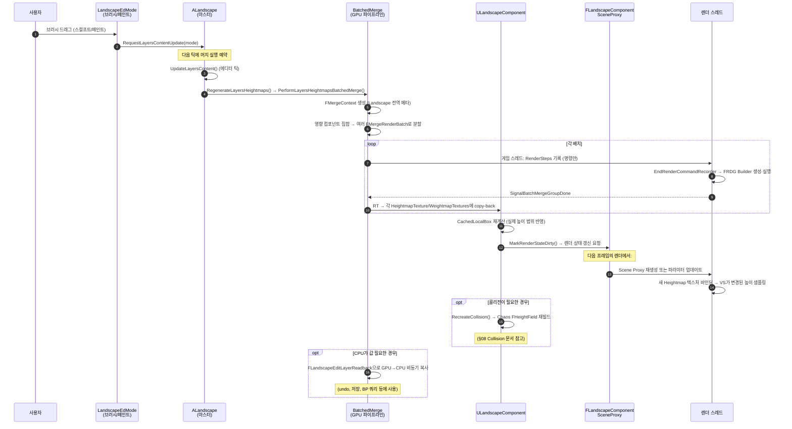

# 06. 렌더링 파이프라인 — Scene Proxy, LOD, Nanite

> **작성일**: 2026-04-21
> **엔진 버전**: UE 5.7

## 1. 런타임 렌더의 두 갈래

Landscape의 런타임 렌더링은 **두 개의 서로 다른 경로**로 갈라집니다:

| 경로 | 진입점 컴포넌트 | 쓰는 곳 |
|------|-------------|--------|
| **Classic (연속 LOD)** | `FLandscapeComponentSceneProxy` (각 `ULandscapeComponent`마다 생성) | 모든 플랫폼, Nanite 미지원 환경 |
| **Nanite** | `ULandscapeNaniteComponent`의 `UStaticMeshComponent` 경로 | Nanite 지원 플랫폼, 프로젝트에서 Nanite 활성화 시 |

두 경로는 **동시에 존재하며 플랫폼·옵션에 따라 런타임에 선택**됩니다. Classic 경로는 **텍스처에서 직접 높이를 읽어 GPU에서 지형을 생성**하는 고유 방식이고, Nanite 경로는 Landscape를 **Static Mesh로 한 번 "구운 뒤"** 범용 Nanite 렌더러를 태우는 방식입니다. 이 문서는 두 경로가 어떻게 분기되고 각자 어떻게 동작하는지 다룹니다.

## 2. Classic 경로 — FLandscapeComponentSceneProxy

### 2.1 컴포넌트 하나 = 프록시 하나

각 `ULandscapeComponent`는 렌더 스레드에 대응하는 `FLandscapeComponentSceneProxy`를 하나 생성합니다. 이 프록시가 "이 섹션의 지형을 그린다"를 책임집니다.

#### "왜 런타임 렌더는 배치로 묶이지 않는가" — BatchedMerge와는 다른 축

혼동하지 말 것: [05-edit-layers.md](05-edit-layers.md)의 **BatchedMerge는 "편집 시점"**에 여러 edit layer를 합성해 최종 Heightmap 텍스처를 만드는 GPU 파이프라인입니다. 이 단계는 **텍스처 생성 전용**이고, 만들어진 텍스처는 각 `ULandscapeComponent::HeightmapTexture`에 저장됩니다.

**BatchedMerge가 동작하는 시점**:

| 빌드 종류 | BatchedMerge 동작? |
|---------|---------|
| **에디터** (편집 모드, 브러시·페인트 등) | ✅ 편집 트리거마다 |
| **PIE (Play in Editor)** | 보통 ✗ (편집 안 일어남); 단 절차적 레이어가 있으면 가능 |
| **게임 빌드 (Standalone, Cooked)** | ✗ — 코드 자체가 `#if WITH_EDITOR` 가드로 컴파일에서 제외 |

게임 빌드에서는 **저장 시점에 이미 머지된 결과가 `HeightmapTexture`에 들어 있고**, 런타임은 그 텍스처를 그대로 읽기만 함. 즉 **BatchedMerge ≈ 에디터 전용**, 게임 모드에서는 단일 텍스처로 표현되어 활용만 됨.

**런타임 렌더**는 그 저장된 텍스처를 읽어 실제 화면에 그리는 완전히 다른 단계이고, 여기서는 **컴포넌트 단위 Scene Proxy** 구조가 쓰입니다. 이 선택의 이유:

- **공간 컬링이 Proxy 단위로 이루어짐** — 한 컴포넌트가 화면 밖이면 그 Proxy 드로우 전체 스킵. 배치로 묶으면 이 컬링 입자가 거칠어짐.
- **LOD가 컴포넌트·서브섹션 단위로 다를 수 있음** — 거리 기반 LOD를 정밀히 적용하려면 Proxy가 개별적으로 LOD를 선택해야 함.
- **셰이더 상수/텍스처 바인딩이 컴포넌트마다 다름** — `HeightmapTexture`, `WeightmapTextures[]`, `MaterialInstances[]`가 각 컴포넌트 고유 자산이라 한 드로우에 여러 컴포넌트를 합치기 어려움.
- **드로우 콜 비용 자체는 감당 가능** — `FLandscapeSharedBuffers` 덕에 정점/인덱스 버퍼 바인딩은 공유되어 드로우 콜 오버헤드가 작음. 400~1600개 정도는 현대 GPU에서 무리 없음. 정말 많이 몰리는 상황에는 Nanite 경로가 대안.

요약: **"배치"라는 단어가 같지만 레벨이 다름**. BatchedMerge = 편집 시점 GPU 머지 작업의 묶음 단위, Scene Proxy = 런타임 렌더 드로우 단위. 두 축이 독립적으로 작동합니다.

```cpp
// LandscapeRender.h:701
class FLandscapeComponentSceneProxy : public FPrimitiveSceneProxy, public FLandscapeSectionInfo
{
    friend class FLandscapeSharedBuffers;

public:
    static const int8 MAX_SUBSECTION_COUNT = 2*2;
    
    // 같은 섹션 크기의 프록시들이 공유하는 버퍼 맵 (키: 컴포넌트 크기 + 서브섹션 수)
    static LANDSCAPE_API TMap<uint32, FLandscapeSharedBuffers*> SharedBuffersMap;

protected:
    int8 MaxLOD;
    uint8 VirtualTexturePerPixelHeight;
    
    TArray<float> LODScreenRatioSquared;   // 거리 기반 LOD 선택 테이블
    int32 FirstLOD;
    int32 LastLOD;
    
    float ComponentMaxExtend;
    float InvLODBlendRange;                // LOD 전환 부드러움 조절
    
    FLandscapeRenderSystem::LODSettingsComponent LODSettings;
    
    int32 NumSubsections;                  // 1 또는 2
    int32 SubsectionSizeQuads;             // 서브섹션 quad 수
    int32 SubsectionSizeVerts;             // = SubsectionSizeQuads + 1
    int32 ComponentSizeQuads;
    int32 ComponentSizeVerts;
    
    int32 NumRayTracingSections;           // RT 지원 시 세분화 수
    // ...
};
```

> **소스 확인 위치**
> - `Engine/Source/Runtime/Landscape/Public/LandscapeRender.h:701-800+` — 프록시 클래스 본체
> - `LandscapeRender.h:35` — `LANDSCAPE_LOD_LEVELS = 8` (최대 LOD 단계)
> - `LandscapeRender.h:36` — `LANDSCAPE_MAX_SUBSECTION_NUM = 2`

### 2.2 FLandscapeUniformShaderParameters — 셰이더가 받는 데이터

프록시는 드로우 호출마다 다음 유니폼 버퍼를 셰이더에 넘깁니다:

```cpp
// LandscapeRender.h:116-140
BEGIN_GLOBAL_SHADER_PARAMETER_STRUCT(FLandscapeUniformShaderParameters, LANDSCAPE_API)
    SHADER_PARAMETER(int32, ComponentBaseX)               // 컴포넌트 좌표
    SHADER_PARAMETER(int32, ComponentBaseY)
    SHADER_PARAMETER(int32, SubsectionSizeVerts)
    SHADER_PARAMETER(int32, NumSubsections)
    SHADER_PARAMETER(int32, LastLOD)
    SHADER_PARAMETER(uint32, VirtualTexturePerPixelHeight)
    SHADER_PARAMETER(float, InvLODBlendRange)             // 연속 LOD 모핑 파라미터
    SHADER_PARAMETER(FVector4f, HeightmapTextureSize)
    SHADER_PARAMETER(FVector4f, HeightmapUVScaleBias)     // 공유 텍스처 내 UV 영역
    SHADER_PARAMETER(FVector4f, WeightmapUVScaleBias)
    SHADER_PARAMETER(FVector4f, SubsectionSizeVertsLayerUVPan)
    SHADER_PARAMETER(FVector4f, SubsectionOffsetParams)
    SHADER_PARAMETER(FMatrix44f, LocalToWorldNoScaling)
    SHADER_PARAMETER_TEXTURE(Texture2D, HeightmapTexture)
    SHADER_PARAMETER_SAMPLER(SamplerState, HeightmapTextureSampler)
    SHADER_PARAMETER_TEXTURE(Texture2D, NormalmapTexture)
    SHADER_PARAMETER_SAMPLER(SamplerState, NormalmapTextureSampler)
END_GLOBAL_SHADER_PARAMETER_STRUCT()
```

핵심은 **`HeightmapTexture`를 셰이더 파라미터로 바인딩**한다는 점입니다. 즉 **정점 셰이더가 Heightmap을 직접 `Texture2DSample`**해서 정점의 Z를 계산합니다. 이는 StaticMesh와 가장 본질적으로 다른 지점으로, Landscape가 "정점 데이터를 텍스처에 담는 아키텍처"라는 것이 여기서 드러납니다.

`NormalmapTexture`는 별도로 보이지만 실제로는 **같은 Heightmap 텍스처의 BA 채널**을 가리키며, 같은 텍스처 리소스의 별도 SRV로 바인딩됩니다.

#### 정점 정보를 어디까지 텍스처가 대체하는가

일반 StaticMesh가 정점당 보통 갖는 정보와 Landscape가 그걸 어디에 두는지 비교:

| 정점 정보 | StaticMesh | Landscape |
|----------|-----------|-----------|
| **위치 X, Y** | 정점 버퍼 (각자 다름) | 정점 버퍼 — 단 **정규 격자 인덱스**만 저장 (예: `(i, j)` 정수쌍). 컴포넌트 내 모든 프록시가 같은 버퍼 공유. |
| **위치 Z** | 정점 버퍼 | **Heightmap 텍스처의 RG 채널** — VS가 `(i, j)`로 UV 계산 후 샘플링 |
| **노멀** | 정점 버퍼 | **Heightmap 텍스처의 BA 채널** — X, Y만 저장, Z는 VS에서 역산 |
| **UV(텍스처 좌표)** | 정점 버퍼 | **계산식** — VS가 `(i, j)`와 컴포넌트 시작 좌표로부터 런타임 유도 (`WeightmapUVScaleBias`, `HeightmapUVScaleBias` 적용) |

#### Landscape 위치 → 텍스처 좌표 변환 공식

StaticMesh는 정점마다 UV가 미리 박혀 있지만, Landscape는 **격자 인덱스 + 컴포넌트 상수로부터 런타임에 UV를 유도**합니다.

**개념적 변환** (단순화):
```hlsl
// 정점 셰이더 입력
int2 GridXY = VertexInput.GridXY;  // (i, j) 격자 인덱스, 0..ComponentSizeVerts-1

// 1. Heightmap UV 계산
float2 LocalUV = GridXY * (1.0 / ComponentSizeVerts);  // 0..1로 정규화 (해당 컴포넌트 내부)
float2 HeightmapUV = LocalUV * HeightmapUVScaleBias.xy + HeightmapUVScaleBias.zw;
//                   ^ 텍스처 공유 시 자기 영역 잘라내기   ^ 자기 영역 시작점

// 2. Weightmap UV (보통 같은 식이지만 별도 ScaleBias)
float2 WeightmapUV = LocalUV * WeightmapUVScaleBias.xy + WeightmapUVScaleBias.zw;

// 3. 월드 좌표 (Heightmap 샘플 후)
float Height = HeightmapTexture.SampleLevel(Sampler, HeightmapUV, LOD).r;
float3 LocalPos = float3(GridXY, Height);
float3 WorldPos = mul(float4(LocalPos, 1), LocalToWorld).xyz;
```

**핵심 매핑**:
| Landscape 측 | 텍스처 측 |
|---|---|
| 격자 인덱스 `(i, j)` | `(i, j) × Scale + Bias`로 UV 계산 |
| 컴포넌트 시작 좌표 (`ComponentBaseX/Y`) | `HeightmapUVScaleBias.zw`(Bias)로 반영 |
| 텍스처 공유 영역 | `HeightmapUVScaleBias.xy`(Scale)로 영역 축소 |

**왜 이 방식이 가능한가**:
- Landscape의 **정점이 정규 격자**라는 강한 가정 — `(i, j)`만으로 위치 결정 가능
- 컴포넌트 상수 `HeightmapUVScaleBias`(`FVector4`)에 영역 정보가 들어 있어 정점마다 UV 저장 불필요
- StaticMesh의 임의 모양 메시(불규칙한 정점·UV)는 이런 공식 유도가 불가능 → 정점마다 UV 직접 저장 필요

**여러 텍스처에 같은 식 적용** — Heightmap, Weightmap, NormalMap(같은 텍스처의 BA 채널), Lightmap 모두 같은 격자 기반 UV 공식 사용. 다만 각자 `*UVScaleBias` 상수가 달라 자기 영역으로 분기.

이 공식 덕분에 정점 버퍼는 `(i, j)` 정수 쌍만 들어 있어 매우 가벼우며, 모든 컴포넌트가 같은 정점 버퍼를 재사용할 수 있습니다 (`FLandscapeSharedBuffers`).
| **탄젠트** | 정점 버퍼 | VS에서 노멀로부터 유도 (대부분의 라이팅 경로는 노멀만 필요) |
| **버텍스 컬러** | 정점 버퍼 | 사용 안 함 (Weightmap이 레이어 가중치 역할) |

즉 정점 버퍼에는 **"이 정점이 격자의 어느 자리(i, j)인가"만 들어 있고**, 위치·노멀·UV 등은 전부 **VS가 텍스처/상수로부터 런타임 계산**합니다. 컴포넌트마다 다른 점은 텍스처 리소스와 몇 개의 셰이더 상수(`ComponentBaseX/Y`, UV ScaleBias 등)뿐.

결과적으로:
- **정점 버퍼는 컴포넌트 간 공유 가능** (같은 크기 구성이면) → `FLandscapeSharedBuffers`가 이를 구현
- **모든 변동 정보는 텍스처·유니폼에만** → 편집 시 정점 버퍼 재업로드 불필요
- **StaticMesh보다 정점 버퍼가 극도로 가벼움** (정수 2개 × 정점 수)

이 설계가 Landscape의 메모리 효율성과 편집 속도의 핵심입니다.

> **소스 확인 위치**
> - `LandscapeRender.h:116-140` — 유니폼 파라미터 전체

### 2.3 FLandscapeSharedBuffers — 정점/인덱스 버퍼 공유

Landscape 하나에는 **수백 개의 컴포넌트**가 있고, 그 중 **같은 크기 설정(`ComponentSizeQuads`, `NumSubsections`)을 공유하는 컴포넌트들은 정점/인덱스 버퍼가 동일**합니다. 실제로 기하적 차이는 높이 텍스처에만 있고 토폴로지는 똑같습니다.

그래서 `FLandscapeSharedBuffers`가 같은 구성의 컴포넌트들 사이에서 **정점 버퍼·인덱스 버퍼·정점 팩토리를 공유**합니다:

```cpp
// LandscapeRender.h:358
class FLandscapeSharedBuffers : public FRefCountedObject
{
public:
    int32 NumVertices;
    int32 SharedBuffersKey;              // (ComponentSize, NumSubsections)로부터 해시
    int32 NumIndexBuffers;               // 보통 LANDSCAPE_LOD_LEVELS=8
    int32 SubsectionSizeVerts;
    int32 NumSubsections;
    
    FLandscapeVertexFactory* VertexFactory;
    FLandscapeVertexFactory* FixedGridVertexFactory;    // FixedGrid (VSM, 그래스맵용)
    FLandscapeVertexBuffer* VertexBuffer;
    
    FIndexBuffer** IndexBuffers;         // LOD별 인덱스 버퍼 배열
    FLandscapeIndexRanges* IndexRanges;  // LOD별 서브섹션별 인덱스 범위
    
    bool bUse32BitIndices;
    FIndexBuffer* GrassIndexBuffer;
};

// LandscapeRender.h:755
static LANDSCAPE_API TMap<uint32, FLandscapeSharedBuffers*> SharedBuffersMap;
```

**메모리 절약 효과**: 전형적인 127×127 Landscape 컴포넌트의 정점 버퍼 (LOD0) 크기가 수백 KB인데, 컴포넌트 400개가 같은 구성이면 **공유 없이는 수백 MB 낭비**입니다. SharedBuffers로 단 한 벌만 유지됩니다.

#### 드로우 콜 시점의 실제 동작 — "정점·인덱스 버퍼 한 번 바인딩 + 텍스처만 교체"

`FLandscapeSharedBuffers` 덕분에 **같은 크기 구성 컴포넌트들의 드로우는 정점·인덱스 버퍼는 처음 한 번만 바인딩하고, 컴포넌트마다는 텍스처와 상수만 교체**하는 방식으로 진행됩니다:

```
[GPU 드로우 시퀀스 — 같은 크기 구성의 컴포넌트 N개]

1. 공유 리소스 한 번만 바인딩:
   - SetVertexBuffer(SharedBuffers.VertexBuffer)   ← 한 번 올리고
   - SetVertexFactory(SharedBuffers.VertexFactory)
   
2. 컴포넌트마다 반복:
   for each component i:
     SetTexture(HeightmapTexture[i])                ← 이 컴포넌트의 Heightmap으로 교체
     SetTexture(WeightmapTextures[i])
     SetUniform(ComponentBaseX, ComponentBaseY)    ← 위치 상수
     SetUniform(HeightmapUVScaleBias[i])           ← UV 변환 상수
     SetIndexBuffer(SharedBuffers.IndexBuffers[LOD_i])  ← 이 LOD의 인덱스
     DrawIndexed(...)                               ← 실제 드로우
```

**바인딩 변경 최소화**:
- 정점 버퍼/팩토리: **처음 한 번만** 바인딩, 이후 컴포넌트들은 재활용
- 인덱스 버퍼: LOD가 바뀔 때만 바인딩 변경
- 텍스처·유니폼: 컴포넌트마다 교체 (이건 불가피 — 각자 데이터가 다름)

이 패턴이 드로우 콜 setup 비용을 크게 낮춰주므로, 수백 개 컴포넌트의 드로우도 감당 가능한 수준이 됩니다. StaticMesh처럼 **"정점 버퍼를 매번 바꾸지 않는다"**가 핵심 최적화.

정점 팩토리(`FLandscapeVertexFactory`)는 정점 셰이더가 정점 버퍼 데이터를 어떻게 해석할지 알려주는 레이아웃 정의 — 이것도 공유되므로 셰이더 리링크도 없음.

> **소스 확인 위치**
> - `LandscapeRender.h:358-412` — `FLandscapeSharedBuffers`
> - `LandscapeRender.h:755` — `SharedBuffersMap` 싱글톤

### 2.4 LOD 선택 — Continuous LOD + Morphing

Landscape LOD의 특징은 **정수가 아닌 연속 실수 LOD**를 쓴다는 점입니다. 각 컴포넌트의 LOD는 "LOD 2.3" 같이 중간값을 가질 수 있고, 셰이더에서 **LOD 2의 정점과 LOD 3의 정점을 보간**해 이음새 없는 전환을 만듭니다 (morphing).

#### 개발자가 LOD를 수동 제어할 수 있는가

네, 여러 단계에서 가능합니다:

| 레벨 | 방법 | 효과 |
|------|------|------|
| **컴포넌트 단위** | `ULandscapeComponent::ForcedLOD` 프로퍼티 | 특정 컴포넌트의 LOD를 강제 고정 (−1 = 자동) |
| **프록시 단위** | `ALandscapeProxy::LODGroupKey` | 같은 키의 프록시들을 LOD 그룹으로 묶음 |
| **프록시 단위** | `ALandscapeProxy::MaxLODLevel`, `LODDistanceFactor` | 최대 LOD 상한, 거리 스케일 |
| **프록시 단위** | `ALandscapeProxy::ComponentScreenSizeToUseSubSections` | 서브섹션 단위 LOD 활성화 임계 |
| **프로젝트 단위** | `landscape.*` CVar (예: `landscape.LODBias`) | 전역 LOD 조정 |
| **블루프린트 API** | `ALandscape::SetLODGroupKey`, `GetLODGroupKey` | 런타임에 그룹 키 변경 |

가장 흔한 사용 패턴은:
- **Scene 보존용 고정**: 시네마틱 장면에서 중요한 지역을 강제로 LOD 0 (`ForcedLOD = 0`)
- **성능 최적화**: 먼 지형을 항상 낮은 LOD로 (`MaxLODLevel`이나 `LODDistanceFactor`)
- **지형 유형별 구분**: 메인 월드는 그룹 A, 배경은 그룹 B로 LOD 튜닝 분리

즉 자동 LOD가 기본이고, 특정 지역의 튜닝이 필요할 때만 수동 개입.

#### 2.4.1 LODScreenRatioSquared 테이블

```cpp
// LandscapeRender.h:765
// Table of valid screen size -> LOD index
TArray<float> LODScreenRatioSquared;
```

각 LOD 레벨이 **화면 차지 비율의 제곱** 임계값을 가지며, 현재 프록시의 화면 크기에 따라 해당 LOD가 선택됩니다. 제곱을 쓰는 이유는 제곱근 계산을 피하기 위한 최적화.

#### 2.4.2 InvLODBlendRange — 전환 구간 폭

```cpp
// LandscapeRender.h:775
// 1.0 / LODBlendRange
float InvLODBlendRange;
```

LOD `n`과 `n+1` 사이에서 **몇 픽셀 범위에 걸쳐 모핑**할지 결정. 작으면 딱 떨어지는 LOD pop, 크면 부드러운 전환 (성능 대 품질 트레이드오프).

#### 2.4.3 FLandscapeRenderSystem::LODSettingsComponent

프록시는 `FLandscapeRenderSystem`이 관리하는 **LOD 설정 구조**를 들고 다닙니다:

```cpp
// LandscapeRender.h:777
FLandscapeRenderSystem::LODSettingsComponent LODSettings;
```

`FLandscapeRenderSystem`은 **동일한 Landscape GUID의 프록시들을 모아 LOD 결정을 조율**하는 전역 시스템입니다. 왜 필요한가: 인접 컴포넌트 A와 B의 LOD가 크게 차이나면 경계에서 이음새 발생 → 전역 시점에서 **이웃 LOD 차이 제한**이 필요.

#### LOD 전환이 실제 GPU에서 어떻게 작동하는가

단계별로:

**1. CPU측 LOD 값 계산 (게임 스레드 / `FLandscapeRenderSystem`)**:
```
FLOD = log2(MaxComponentScreenRadius / CurrentScreenRadius)
```
즉 "컴포넌트가 화면에서 차지하는 픽셀 반경"을 보고, 각 LOD의 임계(`LODScreenRatioSquared[i]`)와 비교해 **실수 LOD 값** 도출. 예: LOD 2.3.

**2. 인덱스 버퍼 선택**:
실수 LOD 2.3 → **`floor(2.3) = 2`**번 인덱스 버퍼를 바인딩 (LOD 2의 토폴로지). 즉 "주 LOD는 2, 모핑으로 3 방향으로 이동"한다는 의미.

**3. 정점 셰이더에서 모핑 (셰이더 코드 — 개념)**:
```hlsl
// Vertex Shader
float2 GridPos = VertexInput.GridXY;                  // 정점 버퍼의 격자 위치
float2 UV = ComputeUV(GridPos, UVScaleBias);

// 현재 LOD와 다음 LOD의 높이 샘플
float HeightLOD_N   = HeightmapTexture.SampleLevel(Sampler, UV, LOD_N).r;
float HeightLOD_Nplus1 = HeightmapTexture.SampleLevel(Sampler, UV, LOD_N + 1).r;

// 모핑 비율 (실수 LOD의 소수부) = 0..1
float MorphAlpha = FractionalPart(FLOD) * InvLODBlendRange;
MorphAlpha = saturate(MorphAlpha);                    // 클램프

// 두 LOD 샘플 보간
float FinalHeight = lerp(HeightLOD_N, HeightLOD_Nplus1, MorphAlpha);
```

밉맵 기반 `SampleLevel(uv, mipLevel)`이 각 LOD에 해당하는 **이미 축소된 저해상도 Heightmap**을 읽어오므로 정점 자체는 "같은 격자 위치"여도 읽어온 높이가 저해상도가 됩니다. `MorphAlpha`로 두 밉의 값을 섞으면 **정점 Z가 부드럽게 변하는 효과**. 이웃 정점들이 모두 같은 방식으로 보간되면서 **정점이 서서히 옆 정점으로 녹아드는** 결과.

**4. 정점 "collapse" (실질적 효과)**:
LOD가 올라가면 격자 해상도가 줄어드는데, 모핑 중간 단계에서는:
- LOD 2에서는 존재하지만 LOD 3에서는 사라지는 **"홀수 번째" 정점**의 샘플 높이가
- 모핑 진행에 따라 이웃 정점(LOD 3에서 남는 것)과 같은 높이로 수렴
- 시각적으로는 "정점이 위치를 바꿔서 이웃과 합쳐지는" 모습 → 이게 "morphing"의 본질

**5. 인덱스 버퍼 쪽**:
실수 LOD가 `N.x`일 때는 `floor(N)`의 인덱스 버퍼를 쓰고, 완전히 `N+1`로 넘어가면 `floor(N+1)`의 인덱스 버퍼로 전환. 전환은 모핑이 끝난 뒤에 일어나 이음새 없음.

**InvLODBlendRange의 역할**: 모핑이 **얼마나 긴 거리에 걸쳐** 일어나느냐를 조절 (LOD 경계 주변 몇 픽셀 범위). 작으면 딱 떨어지는 LOD pop, 크면 부드러운 전환 (성능 vs 품질).

### 2.5 서브섹션과 LOD

2×2 서브섹션 구성에서는 각 서브섹션이 **독립된 배치 요소**로 그려지며, 서로 다른 LOD를 가질 수 있습니다:

```
컴포넌트 하나 (2×2 subsection):

  ┌──────────┬──────────┐
  │ Sub(0,0) │ Sub(1,0) │   ← 예: LOD 2
  │   LOD 2  │   LOD 2  │
  ├──────────┼──────────┤
  │ Sub(0,1) │ Sub(1,1) │
  │   LOD 3  │   LOD 3  │   ← 더 멀리 있으면 LOD 3
  └──────────┴──────────┘
```

이로써 **카메라에서 가까운 쪽은 고해상도, 먼 쪽은 저해상도**로 한 컴포넌트 안에서도 세밀한 LOD 조정이 가능합니다.

> **소스 확인 위치**
> - `LandscapeRender.h:763-777` — LOD 관련 멤버들
> - `LandscapeRender.h:782-795` — 서브섹션 설명 주석

### 2.6 RayTracing 경로

**용어 정리**:
- **RT** = Ray Tracing (광선 추적). 실시간 렌더링 기법 중 하나로, 빛의 경로를 추적해 반사·그림자·전역 조명 등을 계산. UE의 RT는 HW 가속(NVIDIA RTX, AMD RDNA2+) 기반.
- **BLAS** = **Bottom Level Acceleration Structure**. GPU 레이트레이싱에서 메시의 삼각형 집합을 빠르게 레이-교차 질의할 수 있도록 **공간 자료구조(BVH 트리)**로 전처리한 것. 메시 하나당 BLAS 하나 정도. 반대 개념인 **TLAS**(Top Level AS)는 씬에 있는 여러 BLAS 인스턴스들을 모은 상위 트리.
- **BVH** = Bounding Volume Hierarchy. BLAS의 내부 표현(계층적 AABB 트리).

Landscape가 RT 프로덕션에 참여하려면 **더 세분화된 BLAS**가 필요합니다:

```cpp
// LandscapeRender.h:796
/** Number of ray tracing sections in a landscape section for better culling and optimized BLAS builds */
int32 NumRayTracingSections;

#if RHI_RAYTRACING
TPimplPtr<FLandscapeRayTracingImpl> RayTracingImpl;
#endif
```

컴포넌트를 더 작은 RT 섹션으로 나눠 BLAS를 만들어 둡니다. LOD bias도 별도 관리되어, 보통 RT 경로는 한 단계 낮은 LOD로 BVH를 빌드해 성능을 맞춥니다.

## 3. Nanite 경로 — ULandscapeNaniteComponent

### 3.1 기본 발상

Landscape의 Classic 경로는 **"거리에 따라 실시간 LOD 선택"**을 목표로 정교하지만, Nanite는 이미 **세밀도 자동 제어**를 내장한 범용 시스템입니다. 그래서 "Landscape를 StaticMesh로 구워서 Nanite에 넘기면" 같은 품질을 다른 엔지니어링 없이 얻을 수 있습니다.

`ULandscapeNaniteComponent`가 이 역할을 합니다:

#### Nanite가 Classic 프록시를 "대체"하는가 — 클래스 구조 관점

**아닙니다, 둘 다 존재합니다.** 클래스 구조상 `ULandscapeNaniteComponent`는 `ULandscapeComponent`를 대체하는 게 아니라 **추가로** 생성되는 보조 컴포넌트입니다:

```
ALandscapeProxy (또는 ALandscape)
  │
  ├─ LandscapeComponents[]: ULandscapeComponent (항상 존재, 편집·소유 단위)
  │     ├─ HeightmapTexture
  │     ├─ WeightmapTextures[]
  │     └─ CollisionComponent (짝)
  │     ↓
  │     CreateSceneProxy() → FLandscapeComponentSceneProxy (Classic 경로)
  │     ※ 런타임에 bNaniteActive == true면 SceneProxy 비활성
  │
  └─ LandscapeNaniteComponent: ULandscapeNaniteComponent (Nanite 빌드 시 존재)
         └─ StaticMesh (Nanite 인코딩된 메시)
         ↓
         CreateSceneProxy() → Nanite SceneProxy (Nanite 경로)
         ※ 활성 상태면 이것만 그려짐
```

즉:
- **`ULandscapeComponent`는 항상 존재** — 편집·저장·물리·Heightmap/Weightmap 텍스처 관리의 책임자. Nanite가 있어도 이 클래스는 사라지지 않음.
- **`ULandscapeNaniteComponent`는 Nanite가 켜져 있고 빌드된 경우에만 존재** — `ULandscapeComponent`들의 소스 데이터로부터 구워진 Nanite 메시 하나를 들고 있음.
- **런타임에는 둘 중 하나의 Scene Proxy만 활성**:
  - Nanite 활성 + 빌드 완료 → Nanite Scene Proxy만 그림, Classic Proxy는 비활성 (`bNaniteActive = true`)
  - 그 외 → Classic Scene Proxy가 그림

따라서 두 경로는 "런타임에 상호 배타"지만 **클래스 구조상은 공존**합니다. Nanite 빌드 결과가 무효화되거나 Nanite가 꺼지면 자동으로 Classic 경로로 fallback.

```cpp
// LandscapeNaniteComponent.h:82
UCLASS(hidecategories=(...), showcategories=("Rendering|Material"), Within=LandscapeProxy)
class ULandscapeNaniteComponent : public UStaticMeshComponent
{
    // LandscapeProxy가 소유, 내부적으로 UStaticMesh 보유
    
    UPROPERTY()
    FGuid ProxyContentId;                        // Landscape 내용 해시 (변경 감지)
    
    UPROPERTY(Transient)
    bool bEnabled;
    
    UPROPERTY()
    TArray<TObjectPtr<ULandscapeComponent>> SourceLandscapeComponents;  // 이걸로 빌드됨
    
public:
    // 에디터 빌드 엔트리 (동기/비동기)
    bool InitializeForLandscape(ALandscapeProxy*, const FGuid& NewProxyContentId,
                                 const TArray<ULandscapeComponent*>&, int32 NaniteComponentIndex);
    FGraphEventRef InitializeForLandscapeAsync(...);
    
    virtual FPrimitiveSceneProxy* CreateSceneProxy() override;  // Nanite SceneProxy 생성
};
```

### 3.2 빌드 — FAsyncBuildData

Nanite 빌드는 **무겁고** (Landscape 전체를 StaticMesh로 exporting → Nanite 인코딩), **비동기**로 수행됩니다. **런타임에는 이 빌드를 하지 않습니다** — 에디터에서 미리 구워 `.uasset`에 저장해두고, 런타임에는 이 데이터를 로드만 합니다:

**언제 빌드되는가**:
- **에디터에서 지형 편집 완료 시**: `ProxyContentId` 해시가 바뀌면 재빌드 트리거 (선택적 자동 모드)
- **"Build Nanite" 버튼 수동 클릭**: `ALandscapeSubsystem::BuildNanite`
- **맵 저장 시**: Nanite가 outdated면 저장 전에 빌드 수행
- **쿠킹(cook) 단계**: 패키징 전에 모든 Landscape의 Nanite가 최신 상태인지 확인하고 필요시 빌드

**런타임에는**:
- 이미 빌드된 Nanite StaticMesh가 `.uasset`에서 로드됨
- Scene Proxy 생성 시 로드된 StaticMesh를 바로 렌더 — 재빌드 없음
- **`ProxyContentId` 체크**: 저장된 Nanite 해시와 현재 Landscape 해시가 일치하면 그대로 사용, 불일치면 (예: 런타임 편집으로 바뀐 경우) 에디터 모드에서만 재빌드 실행. 게임 빌드에서는 런타임 편집이 없는 게 기본이라 이 fallback은 드묾.

즉 **"런타임 작업 없음"**이 목표이며, 편집 환경에서만 빌드 비용이 발생합니다. 덕분에 Nanite Landscape는 게임 빌드에서 일반 Nanite 메시와 동일한 수준의 런타임 오버헤드를 가집니다.

```cpp
// LandscapeNaniteComponent.h:35-78
namespace UE::Landscape::Nanite
{
    struct FAsyncBuildData
    {
        using ComponentDataMap = TMap<ULandscapeComponent*, FAsyncComponentData>;
        ComponentDataMap ComponentData;                  // 소스 컴포넌트 데이터
        
        TStrongObjectPtr<UStaticMesh> NaniteStaticMesh;
        FMeshDescription* NaniteMeshDescription;         // 변환된 메시
        
        TArray<UMaterialInterface*, TInlineAllocator<4>> InputMaterials;
        TArray<FName, TInlineAllocator<4>> InputMaterialSlotNames;
        
        FGraphEventRef BuildCompleteEvent;
        int32 LOD = 0;
        
        std::atomic<bool> bExportResult = false;
        std::atomic<bool> bIsComplete = false;
        std::atomic<bool> bCancelled = false;
        
        // 타임스탬프들 (성능 분석용)
        double TimeStamp_Requested = -1.0;
        double TimeStamp_ExportMeshStart = -1.0;
        double TimeStamp_ExportMeshEnd = -1.0;
        double TimeStamp_StaticMeshBuildStart = -1.0;
        // ... 등등
    };
}
```

빌드 단계:

1. **Export Mesh**: `FLandscapeComponentDataInterfaceBase`로 각 컴포넌트의 높이·웨이트·노멀을 읽어 `FMeshDescription`에 쌓음
2. **StaticMesh Build**: `UStaticMesh::BatchBuild`로 Nanite 인코딩
3. **PostMeshBuild 콜백**: 완료되면 델리게이트가 호출되어 `CompleteStaticMesh`
4. **LandscapeUpdate**: 빌드된 StaticMesh를 `ULandscapeNaniteComponent`에 할당

각 단계 타임스탬프를 기록해 **어느 단계에서 스톨하는지** 진단 가능 (`CheckForStallAndWarn()`).

### 3.3 ProxyContentId — 언제 재빌드하는가

Nanite 빌드는 고비용이므로 **Landscape 내용이 바뀌지 않으면 재빌드하지 않아야** 합니다. `ProxyContentId`가 이를 담당:

```cpp
// LandscapeNaniteComponent.h:130
UPROPERTY()
FGuid ProxyContentId;  // 빌드 당시 Landscape 상태의 해시
```

편집 후 현재 상태 해시가 `ProxyContentId`와 다르면 재빌드 트리거. 같으면 캐시된 Nanite 메시를 계속 사용.

### 3.4 Classic vs Nanite 선택

`ALandscapeProxy`에 `bUseNanite`/`bEnableNanite` 플래그가 있고, 런타임에 **플랫폼 + 피처 레벨 + 프로젝트 설정**에 따라:

- Nanite가 **활성**이고 빌드된 메시가 있으면 → **Nanite 경로만 사용** (Classic 프록시는 비활성)
- 그 외 → **Classic 경로**

선택은 `ULandscapeComponent::bNaniteActive` 상태 플래그로 표현됩니다:

```cpp
// LandscapeComponent.h:511-512
UPROPERTY(Transient)
bool bNaniteActive;
```

두 경로가 **동시에 활성화되는 경우는 없음** — Nanite가 켜지면 Classic은 꺼집니다.

> **소스 확인 위치**
> - `Engine/Source/Runtime/Landscape/Classes/LandscapeNaniteComponent.h:82-172` — 전체 클래스
> - `LandscapeNaniteComponent.h:35-78` — `FAsyncBuildData`
> - `LandscapeNaniteComponent.h:149-151` — `InitializeForLandscape` / `InitializeForLandscapeAsync`
> - `LandscapeNaniteComponent.h:169` — `CreateSceneProxy` (Nanite 프록시 생성)
> - `LandscapeComponent.h:511-512` — `bNaniteActive` 플래그

## 4. Material Instance Constant — ULandscapeMaterialInstanceConstant

Landscape 재질은 평범한 `UMaterialInstanceConstant`가 아니라 **랜드스케이프 전용 파생 클래스**입니다:

```cpp
// LandscapeMaterialInstanceConstant.h
UCLASS(MinimalAPI)
class ULandscapeMaterialInstanceConstant : public UMaterialInstanceConstant
{
    // 텍스처별 스트리밍 우선순위 정보
    UPROPERTY()
    TArray<FLandscapeTextureStreamingInfo> TextureStreamingInfo;
};
```

왜 파생인가: 일반 MIC의 텍스처 스트리밍 로직은 **컴포넌트 단위로 가시 거리/면적을 계산**하는데, Landscape는 "거대한 평면이라 언제나 어느 정도 보인다"는 특성 때문에 **별도 우선순위 규칙**이 필요합니다. 이걸 `TextureStreamingInfo`로 커스터마이즈합니다.

> **MIC = Material Instance Constant**. UE의 머티리얼 시스템에서 베이스 머티리얼(`UMaterial`)의 **변종(인스턴스)** 중 "값이 컴파일 타임에 고정되는" 형태. 동적 변종(`UMaterialInstanceDynamic, MID`)은 런타임에 파라미터를 바꿀 수 있는 반면, MIC는 빌드·저장 시점에 값이 박혀 셰이더 컴파일 시 최적화 가능. Landscape는 보통 컴포넌트당 LOD별로 MIC를 미리 만들어 두고 사용.

#### 좀 더 자세히 — 일반 MIC 스트리밍이 Landscape에 안 맞는 이유

**일반 UE 텍스처 스트리밍의 작동 방식**: 각 렌더 프리미티브가 "카메라에서 얼마나 멀고, 화면에 얼마나 크게 보이는지"를 계산해 **필요한 밉 레벨**을 결정합니다. 예:
- 작은 소품이 화면에 손톱만큼만 보이면 → 저해상도 밉만 필요 → 고해상도 밉은 디스크에 방치
- 캐릭터가 가까이 있으면 → 고해상도 밉 로드

이 로직이 **컴포넌트(프리미티브) 단위로 가시 거리/면적을 독립적으로 판단**한다는 게 핵심입니다.

**Landscape에서 이게 문제인 이유**:
1. **"항상 보임" 특성**: 지형은 가까운 타일도 먼 타일도 같이 한 화면에 잡힘. 각 타일의 화면 비중이 작더라도 누적하면 **화면 전체**를 덮음 → 일반 로직은 "화면 작으니 낮은 밉으로 충분"이라고 판단하지만 실제로는 그 타일이 **플레이어 바로 앞에 있을 수** 있음. *(여기서 "바로 앞"은 한 컴포넌트 타일의 월드 크기가 보통 100m 이상이라 — 카메라에서 그 타일 한 부분에 가까이 있어도 타일 전체의 화면 비중은 작게 평가될 수 있다는 뜻. 즉 타일이 크기 때문에 "전체로 보면 작아 보여도 일부는 가까울" 수 있음.)*\n2. **텍스처가 재질뿐 아니라 지오메트리**: Landscape의 Heightmap 텍스처는 단순 재질이 아니라 **정점 Z를 결정**하는 지오메트리 텍스처. 저밉으로 로드되면 **지형 형태 자체가 뭉개짐** → 캐릭터 이동에 영향. 일반 스트리밍처럼 "적당한 밉" 취급하면 안 됨.\n3. **밉 간 품질 격차 민감**: 일반 재질 텍스처는 저밉으로 가도 texel 블러 정도지만, Heightmap은 **1/2 해상도만 되어도 지형 엣지가 눈에 띄게 각짐**.

#### "그러면 Heightmap은 처음부터 저밉을 안 쓰는 게 좋지 않나?"

**가까운 영역에서는 그렇지만, 먼 영역에서는 저밉이 필수**입니다.

| 거리 | 권장 밉 | 이유 |
|------|--------|------|
| 가까운 컴포넌트 (캐릭터 근처) | **밉 0 (풀)** 강제 | 지형 형태·콜리전 정밀도, 캐릭터 이동 일관성 |
| 중간 거리 | 밉 1~2 | 시각적으로 차이 거의 없음, 메모리 절약 |
| 먼 거리 | 밉 3+ | LOD가 이미 저해상도라 밉 0 데이터를 다 들고 있어도 낭비 |

**완전히 풀 해상도만 쓰면**:
- km² 월드의 모든 컴포넌트 Heightmap을 풀 밉 유지 → 메모리 폭증 (수백 MB+)
- 멀리 있는 지형까지 고해상도 텍셀 로드 = 디스크·VRAM 낭비

**완전히 저밉만 쓰면**:
- 가까운 지형이 각져 보임 + 콜리전 정밀도 손실

**그래서 Landscape 전용 매니저의 역할**:
- 가까운 컴포넌트 → 강제로 풀 밉 유지
- 먼 컴포넌트 → 자동 저밉 허용
- "거리에 따라 다른 정책"을 컴포넌트마다 적용 → 메모리·품질 균형

즉 **밉 자체를 안 쓰는 게 아니라, "쓰되 가까운 곳은 강제로 풀 해상도를 유지"**하는 정책. 결과적으로 **밉이 지형 모양에 영향을 줄 수 있다는 인식은 정확**하지만, 그 영향을 받는 영역은 멀리 있어 시각적으로 차이가 안 나는 영역으로 한정됩니다.

**`FLandscapeTextureStreamingInfo`가 하는 일**:
- **LOD 별 텍스처 대응 정보**: 각 LOD에서 어느 밉을 최소한 로드해야 하는지 사전 명시.
- **강제 최소 밉**: Landscape 텍스처는 저밉으로 언로드되지 않도록 강제. 예: "이 heightmap은 최소 밉 3까지만 unload 가능" 식.
- **Landscape 전용 스트리밍 매니저와 연동**: `ULandscapeSubsystem::TextureStreamingManager`가 각 컴포넌트의 실질 화면 비중(= 카메라 거리 × 컴포넌트 크기)을 집계해 일반 시스템보다 **Landscape-특화 우선순위**를 계산.

결과적으로 Landscape 텍스처는 일반 텍스처처럼 "화면에 작아 보이니 저밉으로 전환" 당하지 않고, **지형 품질을 보장할 수준의 밉**을 유지합니다. 대신 그 만큼 메모리를 확보해야 하므로, 프로젝트 설정에서 Landscape 텍스처 전용 스트리밍 풀 크기를 분리해 관리하는 것이 권장됩니다.

### 4.1 LOD별 재질

```cpp
// LandscapeComponent.h:455-463
UPROPERTY(TextExportTransient)
TArray<TObjectPtr<UMaterialInstanceConstant>> MaterialInstances;

UPROPERTY(Transient, TextExportTransient)
TArray<TObjectPtr<UMaterialInstanceDynamic>> MaterialInstancesDynamic;

/** Mapping between LOD and Material Index*/
UPROPERTY(TextExportTransient)
TArray<int8> LODIndexToMaterialIndex;
```

LOD별로 서로 다른 재질 인스턴스를 가질 수 있습니다 (**저 LOD에서는 간단한 재질**로 치환). `LODIndexToMaterialIndex`가 "LOD N → `MaterialInstances[K]`" 매핑을 제공합니다.

## 5. 가시성 계층과 컬링

### 5.1 컴포넌트 단위 프러스텀 컬링

각 프록시는 자신의 `LocalBounds`를 보유하며, 카메라 프러스텀 바깥의 컴포넌트는 드로우 자체를 스킵:

```cpp
// LandscapeComponent.h:482-483
/** Cached local-space bounding box, created at heightmap update time */
UPROPERTY()
FBox CachedLocalBox;
```

`CachedLocalBox`는 Heightmap 머지가 끝난 뒤 **실제 최고/최저 높이로 계산**되어 설정됩니다. 편집으로 지형 높이가 변하면 바운드 재계산.

### 5.2 NegativeZBoundsExtension / PositiveZBoundsExtension

#### "World Position Offset으로 지형을 왜곡" 문장 풀어 설명

**World Position Offset (WPO)**: UE 머티리얼 그래프에서 정점 셰이더가 각 정점의 위치를 **런타임에 변형**할 수 있게 하는 노드. 예:

- 물결 애니메이션: 강 지역의 지형 정점을 sin파로 흔들어 파도 표현
- 바람에 흔들리는 풀: 정점을 시간에 따라 좌우로 밀어냄
- 동적 변형: 게임플레이 이벤트에 따라 땅이 솟아오르거나 가라앉는 효과
- 폭발 충격파: 정점을 중심 바깥으로 순간적으로 밀어냄

즉 **Heightmap에 저장된 "정적 Z"에 더해, 머티리얼이 런타임에 "추가 Δ위치"를 정점에 더하는** 기능입니다.

#### 바운드가 과소평가되는 이유

프러스텀 컬링은 "이 프리미티브가 카메라에 보이는가"를 **바운딩 박스(AABB)로 빠르게 판정**하는 과정입니다. Landscape의 경우:

- **Heightmap이 머지 완료되면** `CachedLocalBox`가 **실제 정점 Z 최대·최소**로 계산되어 저장됨
- 이 바운드가 프러스텀 테스트에 사용됨
- 프러스텀 바깥에 있으면 드로우 콜 자체 스킵

**문제**: WPO가 런타임에 정점을 **바운드 바깥으로 밀어낼 수** 있습니다. 예:
- Heightmap 기준 최고 Z = +100cm
- WPO로 "파도치는 강"이 +300cm까지 올라감
- 하지만 `CachedLocalBox`는 여전히 Z=+100cm 기준
- 결과: **카메라가 지형 위로 올라가 내려다볼 때**, 실제로는 파도가 화면에 보여야 하는데 프러스텀 컬링이 "바운드 밖이니 안 보임"으로 오판 → **클리핑(짤림) 발생**

#### NegativeZBoundsExtension / PositiveZBoundsExtension가 하는 일

```cpp
// LandscapeComponent.h:607-611
float NegativeZBoundsExtension;  // 아래쪽 바운드 추가 확장량
float PositiveZBoundsExtension;  // 위쪽 바운드 추가 확장량
```

사용자가 "WPO가 최대 얼마나 정점을 밀어낼지"를 알고 있다면, 그 만큼 **수동으로 바운드를 미리 확장**해줍니다. 예: 위 파도 예시에서 `PositiveZBoundsExtension = 200`을 설정하면 `CachedLocalBox`의 상단이 300cm까지 커져 프러스텀 컬링이 올바르게 동작.

즉 이 두 프로퍼티는 **"머티리얼이 정점을 얼마나 늘릴 수 있는지에 대한 힌트"**이며, 수동 설정이 필요한 이유는 엔진이 WPO 결과를 컴파일 타임에 정확히 예측하기 어렵기 때문입니다. WPO를 쓰지 않으면 0으로 두면 됩니다.

기본 `CachedLocalBox`와 WPO 확장의 관계:

```cpp
// LandscapeComponent.h:607-611
/** Allows overriding the landscape bounds. This is useful if you distort the landscape with world-position-offset */
UPROPERTY(EditAnywhere, Category=LandscapeComponent)
float NegativeZBoundsExtension;

UPROPERTY(EditAnywhere, Category=LandscapeComponent)
float PositiveZBoundsExtension;
```

## 6. Draw Call 구성

### 6.1 서브섹션 × LOD 단위

한 `FLandscapeComponentSceneProxy`는 **서브섹션 수 × (최대 LOD+1)개의 batch element**를 미리 준비해 둡니다. 예: 2×2 subsection, LOD 0~4라면 4 × 5 = 20개 batch element.

렌더 시점에 프록시의 현재 LOD 값(실수)을 기반으로 해당하는 batch element를 선택·제출. GPU는 **이미 준비된 인덱스 버퍼 범위**(`FLandscapeIndexRanges`)만 읽어 드로우.

#### "서브섹션이 뭐고 누가 나누는지" — BatchedMerge와 무관함을 명확히

먼저 중요한 분리: **서브섹션은 BatchedMerge(편집 시점)와 관계가 없습니다.** BatchedMerge 결과가 서브섹션이 되는 게 아닙니다. 두 개념은 완전히 다른 축입니다.

| 개념 | 언제 | 나누는 주체 | 목적 |
|------|------|----------|------|
| **BatchedMerge의 Batch** | 편집 시점 | 머지 파이프라인 내부 (영향받은 컴포넌트 집합을 공간 근접성 + RT 크기로 분할) | 여러 Edit Layer를 GPU에서 합성할 때 RT 한 장에 묶을 컴포넌트 단위 |
| **서브섹션(Subsection)** | 런타임 렌더 | 컴포넌트 **정의 시 고정된 속성** (`NumSubsections = 1 or 2`) | 컴포넌트 내부를 더 세분화한 렌더 배치 요소 |

**서브섹션의 의미**:
- `ULandscapeComponent::NumSubsections`가 `1`이면 컴포넌트 전체가 1개 서브섹션 = 1개 배치 요소
- `2`면 컴포넌트가 2×2로 나뉘어 **4개 서브섹션 = 4개 배치 요소**
- 이 값은 Landscape 생성 시 결정되고 (에디터 New Landscape 대화상자) **이후 바뀌지 않음** — 컴포넌트 저장 구조의 일부

**왜 나누는가** (재확인):
1. **서브섹션마다 독립 LOD** — 같은 컴포넌트에서 가까운 서브섹션은 고해상도, 먼 서브섹션은 저해상도
2. **LOD 모핑 구간 축소** — 컴포넌트 전체를 한 LOD로 묶는 것보다 전환이 더 국소적
3. **더 세밀한 프러스텀 컬링** — 일부가 화면 밖이면 그 서브섹션만 스킵

**누가 나누는가** — 컴포넌트 자체가 **스스로의 속성**으로 들고 있음:
- `ULandscapeComponent::NumSubsections` 값이 그 컴포넌트의 "서브섹션 분할 수"
- 런타임에 `FLandscapeComponentSceneProxy`가 이 값을 보고 batch element 수를 결정
- GPU에는 같은 정점 버퍼를 공유하되, 각 서브섹션마다 **다른 인덱스 범위 + 다른 UV 오프셋**으로 드로우

**BatchedMerge와 서브섹션이 교차하는 지점** (혼동 방지):
- BatchedMerge는 편집 시점 **"RT에 어느 컴포넌트의 어느 서브섹션 영역을 그릴지"**를 결정할 때 컴포넌트 내 서브섹션 단위까지 내려감 (`FMergeRenderBatch::ComputeSubsectionRects`).
- 즉 BatchedMerge가 **"서브섹션 구조를 참조"하긴** 하지만, BatchedMerge 결과가 서브섹션을 "만드는" 게 아니고, **이미 정해진 서브섹션 구조에 맞춰 RT 영역을 할당**하는 것입니다.

쉽게 말해: **서브섹션은 컴포넌트가 태어날 때 결정되는 고정 분할**이고, BatchedMerge·렌더링은 그 분할을 **참조**해 자기 작업 단위를 정할 뿐입니다.

### 6.2 GPU Scene 제약

#### GPU Scene이 뭐고, 모바일이 뭐고, 안 쓰면 뭐가 문제인가

**모바일(Mobile)** — UE 맥락에서 "모바일 플랫폼"은 iOS/Android/스위치 같은 **SM5 이하 피처 레벨** 환경을 뜻합니다. 데스크톱 PC/콘솔(SM5, SM6)과 별개 렌더 경로를 가지는 축소판 파이프라인.

**GPU Scene**: UE5에서 도입된 **프리미티브 데이터 구조의 GPU-side 대량 표현**입니다. 요약:
- 기존: 각 프리미티브(메시 등)의 트랜스폼·머티리얼 상수를 드로우 때마다 CPU → GPU로 업로드
- GPU Scene: 모든 프리미티브의 메타데이터(트랜스폼, 바운드, 머티리얼 인덱스 등)를 **GPU 버퍼 하나**에 통째로 보관하고, 드로우는 "이 버퍼의 N번째 엔트리를 써라"라고 인덱스만 넘김
- 효과: **CPU → GPU 대역폭 대폭 감소**, 드로우 콜당 오버헤드 작아짐, GPU가 직접 프리미티브 컬링/instancing 가능

**Nanite, VSM(Virtual Shadow Maps), 그 외 UE5 신기능들의 대부분이 GPU Scene을 전제로 설계**되었습니다. 즉 "이 프리미티브는 GPU Scene에 등록되어 있다"가 기본 전제.

**Landscape의 Classic 경로가 모바일 GPU Scene을 쓰지 않는 현재 상태**:
```cpp
// LandscapeRender.h:726-730 (발췌)
if (FeatureLevel >= ERHIFeatureLevel::SM5 && !bVFRequiresPrimitiveUniformBuffer)
{
    // Landscape does not support GPUScene on mobile
    bCanUsePrecomputedLightingParametersFromGPUScene = true;
}
```

즉 **Desktop/Console(SM5+)**에서는 GPU Scene을 활용 가능하고, **Mobile**에서는 Landscape Classic 경로가 GPU Scene을 쓰지 못하는 상태 — 모바일 Landscape는 전통적인 "프리미티브 UB(Uniform Buffer)를 드로우마다 바인딩" 경로로 동작.

**안 쓰면 불이익**:
- **CPU-GPU 전송 비용** — 컴포넌트마다 프리미티브 UB를 CPU에서 업로드해야 함 (모바일에서 렌더 스레드 부담)
- **Precomputed Lighting 경로 차선책** — 프리컴퓨트 조명 파라미터가 GPU Scene을 타지 못해 우회 버퍼 구조로 대체
- **최신 최적화 못 받음** — Nanite(모바일 지원 추가 중), VSM, GPU-driven culling 같은 기능들과의 통합이 복잡해짐
- **Instancing/Indirect Draw 제약** — GPU-side instancing을 Landscape 컴포넌트에 적용하기 어려움

**TODO 주석에 "enable when GPUScene is implemented on mobile"**이라고 있어, **향후 버전에서 모바일 GPU Scene 지원이 추가되면 Landscape Classic 경로도 이 최적화를 받을 예정**입니다. 당장은 모바일 대형 지형 프로젝트에서 Landscape 성능 분석 시 이 제약을 염두에 둘 것.

**Desktop/Console에서는**: 이 제약이 없으므로 이 섹션은 모바일에 한정된 논의입니다.

```cpp
// LandscapeRender.h:726-730
if (FeatureLevel >= ERHIFeatureLevel::SM5 && !bVFRequiresPrimitiveUniformBuffer)
{
    // Landscape does not support GPUScene on mobile
    // TODO: enable this when GPUScene support is implemented
    bCanUsePrecomputedLightingParametersFromGPUScene = true;
}
```

## 7. 에디터 전용 시각화 모드

```cpp
// LandscapeRender.h:52-67
namespace ELandscapeViewMode
{
    enum Type
    {
        Invalid = -1,
        Normal = 0,          // 일반 렌더
        EditLayer,           // 편집 레이어 시각화
        DebugLayer,          // 레이어 디버그 색상
        LayerDensity,        // 레이어 밀도 
        LayerUsage,          // 레이어 사용 여부
        LOD,                 // 현재 LOD 색상 매핑
        WireframeOnTop,      // 와이어프레임
        LayerContribution    // 레이어별 기여도
    };
}

extern LANDSCAPE_API int32 GLandscapeViewMode;
```

에디터에서 `Landscape Mode → View Mode` 메뉴로 전환. 프록시가 `GLandscapeViewMode` 전역을 참조해 셰이더/재질을 디버그 버전으로 교체합니다.

## 7.5 편집 시점 상세 흐름 (렌더 관점)

아래 §8의 요약 다이어그램에서 **"편집 시점"** 블록이 작아 잘 안 보이니, 렌더 파이프라인과 연결되는 흐름만 떼어내어 상세 다이어그램으로 재표현합니다.



**핵심 지점**:
1. **사용자 → EdMode → ALandscape → BatchedMerge → Components** 순의 호출 체인
2. **BatchedMerge 내부**에서 게임 스레드는 **명령만 기록**, 실제 GPU 실행은 렌더 스레드에서 일괄
3. 머지 결과가 **컴포넌트별 HeightmapTexture에 resolve**되면 렌더 상태 더티 플래그 → 다음 프레임 렌더에 반영
4. **렌더링은 텍스처 읽기 기반**이므로 텍스처만 갱신되면 Scene Proxy 재생성 없이도 다음 드로우에 새 높이가 반영될 수 있음 (단순 파라미터 변경 시)
5. 콜리전·Readback은 별도 트리거 (항상 도는 게 아니라 필요할 때)

이 흐름에서 "편집"이 결국 **Heightmap 텍스처 내용 변경**으로 요약되고, 런타임 렌더는 **단순히 변경된 텍스처를 읽을 뿐**이라는 점이 Landscape의 편집-렌더 분리 설계의 핵심입니다.

## 8. 전체 흐름 요약

```mermaid
graph TB
    subgraph Edit["편집 시점"]
        A[BatchedMerge 완료] --> B[HeightmapTexture 갱신]
        B --> C[CachedLocalBox 재계산]
        C --> D[MarkRenderStateDirty]
        D --> E[다음 프레임: 프록시 재생성 또는 파라미터 업데이트]
    end
    
    subgraph Frame["매 프레임 렌더"]
        F[프록시 가시성 체크<br/>CachedLocalBox vs Frustum] --> G{bNaniteActive?}
        G -->|No| H[Classic Path]
        G -->|Yes| I[Nanite Path]
        
        H --> J[FLandscapeRenderSystem<br/>인접 프록시와 LOD 조정]
        J --> K[LODScreenRatioSquared에서<br/>연속 LOD 값 계산]
        K --> L[서브섹션별 batch element 선택]
        L --> M[FLandscapeSharedBuffers로부터<br/>정점/인덱스 버퍼 바인딩]
        M --> N[FLandscapeUniformShaderParameters<br/>+ HeightmapTexture 바인딩]
        N --> O[GPU: VS가 Heightmap 샘플링 → 정점 생성<br/>PS는 Weightmap으로 블렌딩]
        
        I --> P[ULandscapeNaniteComponent의 UStaticMesh]
        P --> Q[Nanite SceneProxy가<br/>표준 Nanite 렌더에 편승]
    end
    
    style Edit fill:#fff3e0
    style Frame fill:#e8f5e9
```



## 9. 어디에 뭐가 있나 — 요약 표

| 기능 | 파일 |
|------|------|
| Scene Proxy 본체 | `LandscapeRender.h:701` (선언), `LandscapeRender.cpp` (구현) |
| 공유 버퍼 | `LandscapeRender.h:358` |
| 셰이더 파라미터 | `LandscapeRender.h:116-140` |
| LOD 시스템 | `FLandscapeRenderSystem` (별도 클래스, LandscapeRender.h/cpp) |
| Nanite 컴포넌트 | `LandscapeNaniteComponent.h:82` |
| Nanite 빌드 | `LandscapeNaniteComponent.h:35-78` (`FAsyncBuildData`) |
| 재질 인스턴스 | `LandscapeMaterialInstanceConstant.h` |
| 에디터 뷰 모드 | `LandscapeRender.h:52-67`, 전역 `GLandscapeViewMode` |

다음 문서는 이 컴포넌트들이 **월드 파티션에서 어떻게 스트리밍 인/아웃**되는지를 다룹니다 → [07-streaming-wp.md](07-streaming-wp.md).
