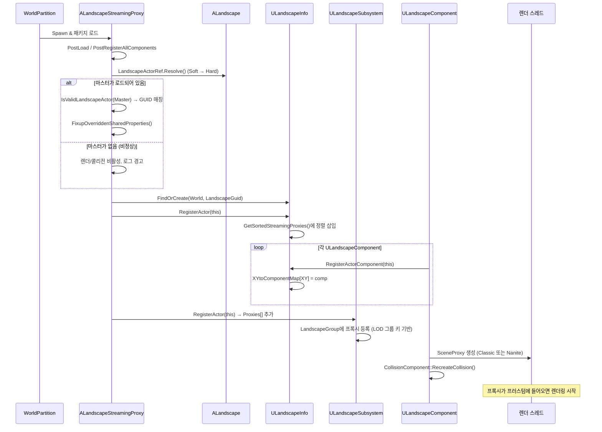

# 07. World Partition 스트리밍

> **작성일**: 2026-04-21
> **엔진 버전**: UE 5.7

## 1. 두 가지 월드 구성

Landscape가 월드에서 "어떻게 존재하는가"는 크게 둘로 갈립니다:

| 구성 | 설명 | 프록시 수 |
|------|------|----------|
| **비파티션(Non-partitioned)** | 전통적인 퍼시스턴트 레벨 또는 월드 컴포지션 | `ALandscape` 1개가 모든 컴포넌트 직접 보유 |
| **월드 파티션(World Partition, Grid-based)** | WP가 활성화된 월드 | `ALandscape` 1개 + `ALandscapeStreamingProxy` N개 (그리드 셀당 1개) |

이 문서는 주로 **후자(WP)**를 다룹니다. 전자는 "모든 지형이 항상 로드됨"이라 스트리밍 이슈가 없습니다.

`ULandscapeSubsystem::IsGridBased()`가 현재 월드가 파티션 모드인지 알려줍니다:

```cpp
// LandscapeSubsystem.h:171
LANDSCAPE_API bool IsGridBased() const;
```

> **소스 확인 위치**
> - `Engine/Source/Runtime/Landscape/Public/LandscapeSubsystem.h:171-173` — `IsGridBased`, `ChangeGridSize`, `FindOrAddLandscapeProxy`

## 2. 그리드 크기 — 몇 개 컴포넌트씩 프록시로 묶을 것인가

WP는 월드를 **정사각 그리드 셀**로 나누고, 각 셀에 포함된 액터를 한 패키지로 관리합니다. Landscape도 그리드 셀 단위로 `ALandscapeStreamingProxy`를 만들지만, **그리드 셀의 크기(월드 단위 cm)는 사용자 설정**이며, 이를 **"몇 컴포넌트씩 한 프록시에 넣을지"**와 연결하는 것이 `GetGridSize`입니다.

### 2.0 WP 그리드가 BatchedMerge 분할 기준에 영향을 주는가

**간접적으로 영향을 줍니다 — 단, 직접 결정하지는 않습니다.**

두 분할의 관계:

| 분할 | 적용 시점 | 결정 주체 | 단위 |
|------|---------|---------|------|
| **WP 그리드** | 에디터 저장 + 런타임 스트리밍 | 사용자 설정 (`GridSizeInComponents`) | 공간 영역(월드 cm) + 컴포넌트 집합 |
| **BatchedMerge 배치** | 편집 시점 머지 | 머지 파이프라인 내부 휴리스틱 | 영향받은 컴포넌트 집합 + RT 해상도 제약 |

**영향 관계**:
- **공유**: 두 분할 모두 "공간 근접성"을 기반으로 컴포넌트를 묶는다는 점은 동일
- **간접 영향**: BatchedMerge는 **현재 로드된 컴포넌트 집합**에서만 동작 가능. WP가 셀을 로드·언로드하므로 머지 대상 집합의 경계가 그리드 셀 경계와 자연스럽게 일치하는 경향
- **독립**: 다만 BatchedMerge의 실제 배치 경계는 RT 해상도 한계와 3×3 이웃 요구로 추가 분할될 수 있어, 항상 그리드 셀과 1:1 대응하지는 않음. 한 셀 내부에서도 여러 배치로 쪼개질 수 있고, 경계 이웃이 필요하면 다음 셀의 컴포넌트까지 참조 가능 (단 로드되어 있어야)

**예시 비교**:

```
 WP 그리드:  ┌─────────┬─────────┐   (2×2 컴포넌트씩 한 셀)
             │ Cell A  │ Cell B  │
             │ 4 comps │ 4 comps │
             ├─────────┼─────────┤
             │ Cell C  │ Cell D  │
             │ 4 comps │ 4 comps │
             └─────────┴─────────┘
 
 편집 후 BatchedMerge:
 사용자가 Cell A 가운데 두 컴포넌트를 편집 →
 영향 컴포넌트 = A의 그 2개 + 노멀 계산용 이웃 8개 (= 3×3 전체)
 → 배치 구성에는 Cell A, B, C의 일부 컴포넌트가 포함될 수 있음
   (B, D가 로드되어 있지 않으면 그 방향의 노멀 계산은 지연)
```

즉 **그리드 크기는 BatchedMerge에 대한 "가능한 컴포넌트 집합"을 결정하는 상한**이지만, 배치 경계 자체는 머지 내부 로직이 다시 정합니다. 따라서 WP 그리드 조정이 머지 성능·응답성에 영향을 미칠 수 있지만, BatchedMerge의 분할 알고리즘 자체를 바꾸는 것은 아닙니다.

### 2.1 GridSizeInComponents

```cpp
// LandscapeInfo.h:375
LANDSCAPE_API uint32 GetGridSize(uint32 InGridSizeInComponents) const;
```

**`GridSizeInComponents`**: 그리드 셀 하나에 들어갈 컴포넌트 수 (한 축당). 예를 들어 이 값이 `2`면 2×2 = 4개 컴포넌트가 한 프록시에 들어갑니다.

`GetGridSize(InGridSizeInComponents)`는 이 값을 월드 단위(cm)로 변환 — 컴포넌트 하나의 월드 크기 × `InGridSizeInComponents`.

예시:

```
ComponentSizeQuads = 63, 컴포넌트당 월드 크기 = 63 × 100cm = 6300cm (기본 Scale)

GridSizeInComponents = 2 → GetGridSize(2) = 12600cm = 126m
→ 한 StreamingProxy가 126×126m 영역을 담당
→ 4개 컴포넌트 포함
```

`GridSizeInComponents`를 크게 하면:
- **프록시 수↓** (메모리·오버헤드 감소)
- **한 번에 스트리밍되는 영역↑** (메모리 피크 증가, 언로드 지연)

작게 하면 그 반대. 프로젝트 스케일에 따라 튜닝하는 값입니다.

### 2.2 ChangeGridSize — 에디터에서의 재구성 (런타임 작업 아님)

```cpp
// LandscapeSubsystem.h:172
LANDSCAPE_API void ChangeGridSize(ULandscapeInfo* LandscapeInfo, uint32 NewGridSizeInComponents);
```

**중요 명확화**: 이 함수는 **에디터 전용**이며, **게임 런타임에는 호출되지 않습니다**. 이름이나 맥락 때문에 "런타임에 동적으로 그리드가 바뀌는 작업"으로 오해하기 쉬우나, 실제로는:

- **에디터에서 사용자가 Landscape 설정을 변경**할 때 (Details 패널에서 `GridSizeInComponents` 값 조정 → Apply)
- 함수가 **모든 기존 스트리밍 프록시 액터를 Destroy**하고, **새 그리드 크기에 맞게 다시 스폰**, **디스크의 `.umap`/`.uasset` 패키지를 재작성**
- 이미 저장된 프록시 패키지 수십~수백 개를 다시 쓰는 매우 **무거운 "원타임 리팩토링 작업"**
- 게임 빌드에는 이 코드가 컴파일되지 않거나, 컴파일되어도 호출되지 않음

즉 **"미리 구워둬야 한다"는 말이 정확히 맞습니다**. 그리드 크기는 프로젝트 초기에 결정하고, `ChangeGridSize`는 정말 필요한 경우에만 에디터에서 수동으로 호출하는 비상 수단입니다.

**권장 워크플로우**:
1. 프로젝트 시작 시 Landscape 스케일·컴포넌트 크기·예상 지형 범위를 고려해 `GridSizeInComponents` 결정 (보통 1, 2, 4 중 하나)
2. 이후 편집 세션에서는 이 값을 건드리지 않음
3. 정말 불가피하게 변경해야 하면 `ChangeGridSize` 호출 → 빌드·저장 → VCS 커밋 (디스크 변화량 큼)
4. 게임 빌드·쿠킹 시에는 이미 확정된 그리드 구조로 패키징

**에디터 API의 맥락**:
- `IsGridBased()`도 에디터 모드 구분 용도 (WP 맵 여부)
- `FindOrAddLandscapeProxy(Info, SectionBase)`도 에디터에서 "컴포넌트를 적절한 프록시에 추가"할 때 쓰임
- 이 모든 API가 `#if WITH_EDITOR` 가드 하에 있습니다

따라서 "런타임"이라는 표현은 이 서브섹션 제목에서 제거하는 게 더 정확했습니다. 실질적 의미는 **"Landscape가 로드된 상태에서 에디터 세션 중 실행되는 재구성"**입니다.

### 2.3 ShouldIncludeGridSizeInName

서로 다른 그리드 크기로 저장된 프록시가 섞이면 이름 충돌이 납니다. 그래서:

```cpp
// LandscapeStreamingProxy.h:49
virtual bool ShouldIncludeGridSizeInName(UWorld* InWorld, const FActorPartitionIdentifier& InIdentifier) const override;
```

이 함수가 true를 반환하면 프록시 이름에 **그리드 크기 ID가 포함**됩니다. 예: `LandscapeStreamingProxy_G2_0_0` 같은 형태.

> **소스 확인 위치**
> - `Engine/Source/Runtime/Landscape/Classes/LandscapeInfo.h:375` — `GetGridSize`
> - `Engine/Source/Runtime/Landscape/Public/LandscapeSubsystem.h:172` — `ChangeGridSize`
> - `Engine/Source/Runtime/Landscape/Classes/LandscapeStreamingProxy.h:49` — `ShouldIncludeGridSizeInName`

## 3. 공유 속성 — 마스터가 권위를 가진다

`ALandscape`는 "이 Landscape 전체의 기본 설정"을 소유하고, `ALandscapeStreamingProxy`는 그걸 **상속**해서 씁니다. 예:

| 공유 속성 (마스터가 정함) | 예시 |
|------|------|
| `LandscapeMaterial` | 기본 지형 재질 |
| LOD 설정 (LODDistributionSetting, LOD0DistributionSetting 등) | 연속 LOD 튜닝 |
| Nanite 설정 (`bEnableNanite`, 포지션 정밀도, 스커트) | 전체적으로 Nanite 쓸지 |
| `CastShadow`, `bCastStaticShadow` 등 그림자 플래그 | 전체 그림자 동작 |

스트리밍 프록시는 이들 속성의 **로컬 사본**을 가지지만 기본적으로는 마스터값을 그대로 받습니다.

### 3.1 OverriddenSharedProperties — 개별 오버라이드

특정 프록시가 다른 값을 쓰고 싶을 때:

```cpp
// LandscapeStreamingProxy.h:35-36
UPROPERTY()
TSet<FName> OverriddenSharedProperties;

// LandscapeStreamingProxy.h:67-68
virtual bool IsSharedPropertyOverridden(const FName& InPropertyName) const override;
virtual void SetSharedPropertyOverride(const FName& InPropertyName, const bool bIsOverridden) override;
```

프로퍼티 이름이 이 집합에 있으면 "마스터 값 무시, 로컬 값 사용"이고, 없으면 마스터 값을 따릅니다. 이 메커니즘으로 **특정 셀만 다른 재질/설정을 적용**할 수 있지만, 과도하게 쓰면 공유의 이점이 무너지므로 예외적 사용 권장.

#### 실제로 어떻게 사용하는가 — 코드 편집 vs 에디터 UI

두 가지 경로 모두 지원되며, 메커니즘은 동일합니다:

**(A) 에디터 UI 경로 (일반 사용자 흐름)**:

1. Outliner/Details에서 특정 `ALandscapeStreamingProxy` 선택
2. Details 패널에 공유 속성(예: `LandscapeMaterial`)이 **마스터 값이 회색으로 표시**되어 나옴 (상속 상태)
3. 값 옆의 **작은 화살표/재설정 버튼** 또는 속성 우클릭 → "Override"로 오버라이드 토글
4. 토글 시 내부적으로 `SetSharedPropertyOverride(FName, true)`가 호출되어 `OverriddenSharedProperties.Add("LandscapeMaterial")` 발생
5. 이제 이 프록시의 `LandscapeMaterial` 값은 독립적으로 편집 가능 (활성화됨)
6. 사용자가 새 값을 입력 → 이 프록시 로컬에 저장

즉 UI에서의 "Override" 체크 = `OverriddenSharedProperties` 집합에 프로퍼티 이름 추가 = 이후 로컬 값 사용.

**(B) 코드 경로 (프로그래매틱)**:

```cpp
// 블루프린트 가능 API나 C++로
StreamingProxy->SetSharedPropertyOverride(TEXT("LandscapeMaterial"), true);
StreamingProxy->LandscapeMaterial = MyCustomMaterial;
StreamingProxy->PostEditChangeProperty(...);  // 에디터 갱신 알림
```

도구·자동화 스크립트가 여러 프록시의 오버라이드를 일괄 적용할 때 사용. 내부 로직은 UI 경로와 동일 (`SetSharedPropertyOverride` → 집합 갱신 → 값 적용).

**두 경로의 공통점**:
- 실제로는 **두 단계**: (1) 오버라이드 플래그 활성화 + (2) 로컬 값 설정
- 오버라이드 플래그만 활성화되고 값은 그대로면, 로컬 사본이 마스터 현재 값으로 "고정" 상태 (이후 마스터가 바뀌어도 반영 안 됨)
- 오버라이드를 끄면(`Remove`) 다시 마스터 값 상속으로 복귀

즉 `OverriddenSharedProperties`는 **"어떤 속성을 로컬화할지"를 기록하는 메타데이터**이며, 그 자체가 값을 바꾸지는 않습니다. 실제 값은 여전히 프록시의 일반 프로퍼티 필드에 저장되며, 이 집합은 "이 필드를 참조할 때 마스터 대신 로컬 값을 쓰라"는 플래그 역할을 합니다.

### 3.2 OnProxyFixupSharedData 델리게이트

마스터가 바뀌면 스트리밍 프록시들이 알아야 합니다:

```cpp
// LandscapeProxy.h:83
DECLARE_MULTICAST_DELEGATE_TwoParams(FOnLandscapeProxyFixupSharedDataDelegate,
    ALandscapeProxy* /*InProxy*/, const FOnLandscapeProxyFixupSharedDataParams& /*InParams*/);
```

프록시가 로드될 때 `FixupOverriddenSharedProperties()`를 통해 마스터 기본값을 다시 흡수하며, 이미 업그레이드된 경우 `bUpgradePropertiesPerformed` 플래그로 중복을 방지.

#### "마스터가 바뀔 일"이 구체적으로 언제인가

거의 다 **에디터 작업** 상황입니다:

| 시점 | 상황 | 예 |
|------|------|---|
| **에디터에서 마스터 속성 편집** | 사용자가 Details 패널에서 `LandscapeMaterial` 등 변경 | 지형 전체 재질을 가을 버전으로 교체 |
| **에디터 Undo/Redo** | 마스터 속성 변경을 되돌리거나 다시 하기 | Ctrl+Z로 재질 교체 취소 |
| **블루프린트 툴/자동화 스크립트** | 에디터 유틸리티가 여러 속성 일괄 변경 | "모든 Landscape의 LOD 설정 표준화" 툴 |
| **C++ 에디터 커맨드렛** | 데이터 마이그레이션 시 프로그래매틱 수정 | 5.7 마이그레이션 시 deprecated 속성 값 새 속성으로 이전 |
| **프록시가 처음 로드되는 순간** | 마스터 값이 프록시에 처음 복사되어야 함 | 월드 열기, WP 셀 스트리밍 인 (주: "마스터 자체는 안 바뀌어도 프록시 로드 시점에 fixup 필요") |
| **런타임 (드묾)** | 게임 런타임에 `ALandscape` 속성을 블루프린트/C++로 변경 | 게임 내 이벤트로 재질 런타임 스왑 (매우 예외적) |

**전형적 흐름** — 에디터에서 마스터의 `LandscapeMaterial`을 바꿨을 때:
1. `ALandscape::PostEditChangeProperty` 호출
2. 이 액터의 `OnLandscapeProxyFixupSharedData` 델리게이트 broadcast
3. 각 `ALandscapeStreamingProxy`가 자기 `FixupOverriddenSharedProperties()`로 반응 — `OverriddenSharedProperties`에 등록되지 않은 속성들만 마스터 값으로 갱신
4. 렌더/콜리전 자동 갱신

즉 "마스터가 바뀜"의 실질은 **에디터 편집 이벤트**이고, 게임 런타임에서는 특별한 스크립팅이 있는 경우가 아니면 발생하지 않습니다. 델리게이트는 **"값 변경 사실을 프록시들에게 알리는 브로드캐스트 채널"**이지 "런타임 동적 시스템"이 아닙니다.

## 4. 스트리밍 인/아웃 플로우

### 4.1 로드 시점

플레이어/카메라가 그리드 셀로 진입 → WP가 패키지를 로드 → `ALandscapeStreamingProxy` 스폰. 이후 시퀀스:



### 4.2 언로드 시점

플레이어가 셀에서 멀어지면 역순:

1. `ULandscapeSubsystem::UnregisterActor(Proxy)` — Proxies 배열에서 제거
2. 각 컴포넌트가 `ULandscapeInfo::UnregisterActorComponent` 호출
3. `ULandscapeInfo::UnregisterActor(Proxy)` — 정렬 배열에서 제거
4. 프록시 액터가 Destroy → SceneProxy 해제, CollisionComponent 해제
5. WP가 패키지 언로드

**주의**: 언로드된 프록시의 컴포넌트가 다른 프록시의 **3×3 이웃**에 있으면, 남은 프록시의 노멀 계산이 완료되지 못하고 경계 부분이 미완성 상태로 남을 수 있습니다. 이는 [05-edit-layers.md](05-edit-layers.md) §6에서 언급한 "이웃 없는 컴포넌트는 노멀 갱신 지연" 이슈로 이어집니다.

### 4.3 로드 상태 vs 언로드 상태 비교

로드 시점에 여러 작업이 일어나는 걸 보면 "언로드 중에는 뭘 하고 있나?" 궁금해질 수 있는데, **답은 "거의 아무것도 안 한다(정확히는 존재하지 않는다)"**입니다. 두 상태를 나란히 비교:

| 측면 | 로드 상태 | 언로드 상태 |
|------|---------|----------|
| **프록시 액터 존재** | ✅ 월드에 AActor 인스턴스 살아 있음 | ❌ AActor Destroy됨, GC 대상 → 메모리에서 사라짐 |
| **메모리 점유** | 컴포넌트 + 텍스처 + 콜리전 포함 수~수십 MB | 0 (패키지도 언로드 → `.uasset`이 RAM에 없음) |
| **Scene Proxy (렌더)** | ✅ 생성됨, 매 프레임 프러스텀 체크 | ❌ 해제됨 |
| **Heightmap/Weightmap 텍스처** | ✅ GPU에 업로드된 상태 (밉 스트리밍 가동) | ❌ GPU·CPU 양쪽 모두 언로드 |
| **Collision 컴포넌트** | ✅ 활성, Chaos Heightfield 존재 | ❌ 해제됨 (카메라/플레이어가 그 영역에 못 감) |
| **Tick/Update** | 텍스처 스트리밍 우선순위 힌트 갱신 등 | 틱 자체 없음 (액터가 없으므로) |
| **ULandscapeInfo 레지스트리** | ✅ XYtoComponentMap에 등록됨 | ❌ 등록 해제됨 (좌표 쿼리 실패) |
| **Subsystem Proxies[]** | ✅ 포함됨 | ❌ 제거됨 |
| **패키지 파일** | 메모리에 로드 | 디스크에 남아 있을 뿐 |

즉 **"언로드 = 존재하지 않음"**이고 "다른 모드로 동작"하는 게 아닙니다. 로드 시 일어나는 작업들(GUID 검증, Info 등록, Scene Proxy 생성, 콜리전 재빌드 등)은 모두 **"없던 것을 만드는" 초기화 과정**이고, 언로드는 **그 정반대의 해체**입니다.

**한 가지 예외 — ALandscape (마스터)**:
- 마스터 `ALandscape`는 **항상 로드된 상태 유지** (§1에서 `CanChangeIsSpatiallyLoadedFlag() -> false`로 설명)
- 즉 "언로드"는 `ALandscapeStreamingProxy`에만 해당
- 마스터는 편집 권한자라 언제나 메모리에 있어야 에디터가 동작

**부분 언로드는 없는가** — 없습니다. 프록시 단위의 all-or-nothing:
- 같은 프록시의 "이 컴포넌트만 언로드"는 안 됨 (프록시의 UPROPERTY 하드 참조이므로 프록시가 살아 있으면 모든 컴포넌트도 살아 있음)
- 텍스처 밉 수준의 스트리밍은 별도 시스템이 관리 (§6)

**로드 대기 중 보이는 현상**:
- 플레이어가 새 영역에 빠르게 진입 → 해당 프록시가 아직 스폰 안 됨 → **지형이 공백 상태**로 몇 프레임 보일 수 있음
- 저장된 프리로드 힌트나 "Preload Volume" 설정으로 완화
- Landscape 전용의 특별한 fallback은 없음 (일반 WP 스트리밍과 동일 제약)

> **소스 확인 위치**
> - `LandscapeInfo.h:406, 409` — `RegisterActor` / `UnregisterActor`
> - `LandscapeSubsystem.h:110-111` — Subsystem의 `RegisterActor` / `UnregisterActor`
> - `LandscapeSubsystem.h:141-142` — `RegisterComponent` / `UnregisterComponent`

## 5. LandscapeGroup — LOD 그룹핑

`ULandscapeSubsystem`은 프록시들을 **LODGroupKey 기반으로 그룹화**해 `FLandscapeGroup`에 담습니다:

```cpp
// LandscapeSubsystem.h:293
// LODGroupKey --> Landscape Group
TMap<uint32, FLandscapeGroup*> Groups;

// LandscapeSubsystem.h:296-297
// list of streaming proxies that need to re-register with their group because they moved, or changed their LODGroupKey
UPROPERTY(Transient, DuplicateTransient, NonTransactional)
TSet<TObjectPtr<ALandscapeStreamingProxy>> StreamingProxiesNeedingReregister;
```

**목적**: LOD 계산 시 "같은 그룹에 속한 이웃 프록시들"을 참조해 LOD 차이를 제한. 같은 `ALandscape` 밑의 프록시들은 기본적으로 같은 그룹에 있고, `SetLODGroupKey`로 다른 그룹에 붙일 수 있습니다 (고급 사용 케이스).

#### LOD 조율 외에 LandscapeGroup이 하는 일

**주된 용도는 LOD 조율**이 맞지만, 그룹 구조가 주는 부차적 이점도 있습니다:

| 용도 | 설명 |
|------|------|
| **LOD 이웃 조율 (주 용도)** | 같은 그룹 내 이웃 프록시들의 LOD가 너무 차이 나면 경계 이음새 발생 → 그룹 단위로 LOD 차이 상한 적용 |
| **공유 LOD 파라미터 액세스** | LOD 계산에 필요한 마스터 속성(`LODDistributionSetting` 등)을 그룹 단위로 한 번만 조회 — 개별 프록시마다 반복 조회 안 해도 됨 |
| **멀티 Landscape 구분** | 한 월드에 여러 `ALandscape`가 있을 때 (예: 메인 월드 + 배경 월드 + 미니맵 Landscape) 서로의 LOD 정책이 섞이지 않게 격리 |
| **프록시 위치 변경 추적** | `StreamingProxiesNeedingReregister` 집합으로 이동·그룹키 변경된 프록시를 모아 다음 틱에 그룹 재등록 |
| **Edge Fixup 조정** | 컴포넌트 경계 정점 공유 유틸(`TickEdgeFixup`)이 그룹 단위로 실행 |

**핵심은 여전히 LOD 조율**입니다 — 다른 용도들은 이 메인 기능의 부산물로 "같은 그룹은 유사 설정을 공유하니 함께 처리하는 게 자연스럽다" 수준입니다.

**"다른 그룹 키"의 실제 활용 사례**:
- 메인 월드 Landscape + 하늘에 떠 있는 섬 Landscape를 별도 그룹으로 → 둘의 LOD가 서로 영향 안 받음
- 게임 내 미니 월드 Landscape(예: 인스턴스 던전 안쪽 지형) — 메인 월드와 분리해 LOD 튜닝

대부분의 프로젝트는 **하나의 그룹키만 쓰면 충분**하고, `SetLODGroupKey` 커스터마이징은 드문 고급 사용입니다.

프록시가 이동하거나 그룹 키가 바뀌면 `StreamingProxiesNeedingReregister`에 쌓이고 다음 틱에 그룹 재등록.

> **소스 확인 위치**
> - `Engine/Source/Runtime/Landscape/Classes/Landscape.h:336-337` — `SetLODGroupKey` / `GetLODGroupKey`
> - `LandscapeSubsystem.h:293, 297` — Groups 맵, 재등록 대기 집합
> - `LandscapeSubsystem.h:265-266` — `GetLandscapeGroupForProxy` / `GetLandscapeGroupForComponent`

## 6. Heightmap 텍스처 스트리밍

프록시가 로드되었다고 해서 **Heightmap 텍스처가 즉시 풀 해상도로 로드되는 건 아닙니다.** 텍스처는 일반 스트리밍 시스템을 따라 **저해상도 밉부터 로드**되며, 카메라 거리에 따라 고해상도 밉이 스트리밍됩니다.

### 6.1 FLandscapeTextureStreamingManager

```cpp
// LandscapeSubsystem.h:127
FLandscapeTextureStreamingManager* GetTextureStreamingManager() { return TextureStreamingManager; }
```

Landscape 전용 스트리밍 매니저가 "이 컴포넌트는 지금 화면에 얼마나 보이는가"를 계산해 텍스처 스트리밍 시스템에 **우선순위 힌트**를 제공합니다. 일반 MIC보다 정교한 이유는 Landscape 컴포넌트의 실제 화면 기여가 LOD + 모핑 + 서브섹션 단위로 변하기 때문.

#### "프록시별로 거리가 다른데 밉도 프록시별로 관리하나?" — 프록시 × 컴포넌트 × 텍스처 3단계 관리

정확히는 **프록시별이 아니라 컴포넌트별(= 텍스처별)로 독립 관리**됩니다. 단위 구조:

```
ALandscapeStreamingProxy [Cell 1,2]
  ├── ULandscapeComponent (X=4, Y=5)
  │     ├── HeightmapTexture (이 컴포넌트 전용)   ← 이 텍스처가 자체 밉 체인 보유, 독립 스트리밍
  │     └── WeightmapTextures[3]                   ← 각자 밉 체인, 독립 스트리밍
  │
  ├── ULandscapeComponent (X=4, Y=6)
  │     ├── HeightmapTexture                       ← 별도 텍스처, 별도 밉 관리
  │     └── WeightmapTextures[4]
  │
  └── ... (셀 내 다른 컴포넌트들)
```

**관리 축**:

1. **텍스처 단위 (가장 세밀)**:
   - 각 `UTexture2D`(Heightmap 1장, Weightmap N장)는 자체 밉 체인과 스트리밍 상태 보유
   - UE 엔진의 **텍스처 스트리밍 시스템**이 기본적으로 관리 (일반 MIC와 같은 기반 시스템)

2. **컴포넌트 단위 (Landscape 전용 힌트)**:
   - `FLandscapeTextureStreamingManager`가 **각 컴포넌트의 현재 화면 기여도**(카메라 거리·각도·LOD)를 계산
   - 그 컴포넌트가 "현재 LOD 2로 보임 → Heightmap 밉 2까지는 확실히 필요"를 힌트로 제공
   - 텍스처 스트리밍 시스템이 이 힌트를 반영해 밉 로드 우선순위 결정
   - 즉 **같은 프록시 안에서도 컴포넌트마다 다른 밉이 로드될 수 있음** (카메라 가까운 컴포넌트 vs 먼 컴포넌트)

3. **프록시 단위 (그룹핑 수준)**:
   - 프록시가 통째로 언로드되면 소속 컴포넌트·텍스처 전부 해제 (§4.3)
   - 프록시 단위 "통합 스트리밍 우선순위" 같은 건 없음 — 개별 컴포넌트·텍스처가 각자 계산됨

**예시 — 카메라가 Cell(1,2) 중앙에 있을 때**:
- Cell(1,2) 안 컴포넌트 (4,5), (4,6) 둘 다 로드된 프록시에 속함
- 카메라 거리:
  - (4,5) = 10m → Heightmap 밉 0 (고해상도) 필요
  - (4,6) = 50m → Heightmap 밉 3 (저해상도)만 필요
- 결과: 같은 프록시 내에서도 **(4,5)의 Heightmap은 풀 해상도**, **(4,6)의 Heightmap은 낮은 해상도만** 메모리에 올라감
- Weightmap 3장도 각자 독립 관리 (모두 같은 컴포넌트에 속하므로 보통 비슷한 밉 선택되지만 필요 시 다를 수 있음)

**결론**: 밉 관리는 **"프록시별"이 아니라 "텍스처별(컴포넌트별)"**로 이루어지고, Landscape 전용 매니저가 **컴포넌트 단위 화면 기여도**를 계산해 세밀한 우선순위 힌트를 제공합니다.

### 6.2 OnHeightmapStreamed — 스트리밍 완료 알림

```cpp
// LandscapeSubsystem.h:68-98
struct FOnHeightmapStreamedContext
{
    const ALandscape* Landscape;
    const FBox2D& UpdateRegion;
    const TSet<class ULandscapeComponent*>& LandscapeComponentsInvolved;
};

DECLARE_MULTICAST_DELEGATE_OneParam(FOnHeightmapStreamedDelegate, const FOnHeightmapStreamedContext&);

// LandscapeSubsystem.h:198
FOnHeightmapStreamedDelegate::RegistrationType& OnHeightmapStreamed();
```

Heightmap 고해상도 밉이 스트리밍 인되면 이 델리게이트가 호출됩니다. **에디터 전용**이고, 블루프린트 브러시 등이 "지금 이 영역의 데이터가 완전히 로드되었으니 내 로직을 다시 실행해라"처럼 사용.

### 6.3 런타임 프리스트림 — PrepareTextureResources

```cpp
// Landscape.h:564
LANDSCAPE_API bool PrepareTextureResources(bool bInWaitForStreaming);
```

"이 시점에 필요한 텍스처가 다 로드될 때까지 기다릴지" 결정하는 API. 주로 블루프린트 `RenderHeightmap`처럼 **CPU가 텍스처 데이터를 필요로 하는 시점**에 호출됩니다.

## 7. 비파티션 월드에서의 대안

WP가 아닌 **월드 컴포지션(Legacy)**을 쓰는 프로젝트도 여전히 `ALandscapeStreamingProxy`를 사용할 수 있습니다. 차이는 "그리드 배치가 WP가 아니라 월드 컴포지션 타일"로 결정된다는 점뿐. 내부 동작(공유 속성, 프록시 등록, LOD 그룹)은 동일합니다.

완전히 비스트리밍 환경(작은 월드)에서는 **스트리밍 프록시 없이** `ALandscape` 하나만 두는 것이 가장 간단합니다.

## 8. 에디터 측 프록시 생성 API

```cpp
// LandscapeSubsystem.h:173
LANDSCAPE_API ALandscapeProxy* FindOrAddLandscapeProxy(ULandscapeInfo* LandscapeInfo, const FIntPoint& SectionBase);
```

주어진 `SectionBase`(그리드 좌표)에 해당하는 프록시가 있으면 반환, 없으면 **새로 생성**합니다. 에디터에서 "이 영역에 지형을 늘려라" 같은 작업 시 호출됩니다.

### 8.1 MoveComponentsToLevel / MoveComponentsToProxy

```cpp
// LandscapeInfo.h:348-351
LANDSCAPE_API ALandscapeProxy* MoveComponentsToLevel(
    const TArray<ULandscapeComponent*>& InComponents, ULevel* TargetLevel, FName NewProxyName = NAME_None);

LANDSCAPE_API ALandscapeProxy* MoveComponentsToProxy(
    const TArray<ULandscapeComponent*>& InComponents, ALandscapeProxy* LandscapeProxy,
    bool bSetPositionAndOffset = false, ULevel* TargetLevel = nullptr);
```

컴포넌트를 다른 레벨이나 프록시로 **이적**시키는 API. 그리드 재구성이나 에디터 도구에서 사용. 단 스트리밍 프록시 간 이적은 그리드 경계를 깨뜨릴 수 있어 신중히 써야 합니다.

## 9. 공간 로딩 플래그

```cpp
// Landscape.h:646-648
/** Landscape actor has authority on default streaming behavior for new actors : LandscapeStreamingProxies & LandscapeSplineActors */
UPROPERTY(EditAnywhere, Category = WorldPartition)
bool bAreNewLandscapeActorsSpatiallyLoaded = true;
```

**새로 생성되는 스트리밍 프록시와 스플라인 액터가 기본적으로 공간 로딩 대상이 되는지**를 마스터가 결정. 이 플래그를 끄면 새 프록시들이 모두 "항상 로드" 상태가 되어 WP 이점이 사라집니다 — 디버그나 특수 시나리오에서만 사용.

`ALandscape` 자신은 이 플래그와 무관하게 **항상 공간 로딩 불가**:

```cpp
// Landscape.h:324
virtual bool CanChangeIsSpatiallyLoadedFlag() const override { return false; }
```

## 10. 요약

| 질문 | 답 |
|------|---|
| 누가 그리드 셀당 Landscape 프록시를 만드나? | WP가 사용자 설정 `GridSizeInComponents`에 맞춰 생성 |
| 프록시와 마스터는 어떻게 연결되나? | `LandscapeActorRef` (Soft) + GUID 매칭 (`IsValidLandscapeActor`) |
| 프록시가 독립적 설정을 가지려면? | `OverriddenSharedProperties`에 프로퍼티 이름 추가 |
| 로드되면 어디에 등록되나? | `ULandscapeInfo` (좌표 매핑) + `ULandscapeSubsystem`의 `Proxies`와 `Groups` |
| LOD는 전역적으로 어떻게 조율되나? | `FLandscapeGroup`이 같은 LODGroupKey의 프록시들을 묶어 차이 제한 |
| 텍스처 로딩은? | 일반 스트리밍 + `FLandscapeTextureStreamingManager`의 힌트 |
| 스트리밍 완료를 언제 알 수 있나? | `OnHeightmapStreamed` 델리게이트 (에디터) |

다음 문서에서는 프록시에 붙어 있는 **충돌 컴포넌트와 물리 재질**을 다룹니다 → [08-collision-physics.md](08-collision-physics.md).
