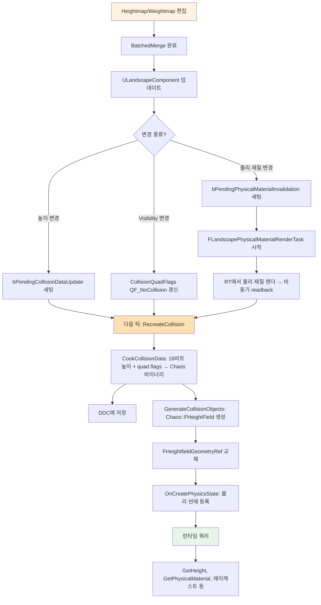

# 08. 충돌과 물리 재질

> **작성일**: 2026-04-21
> **엔진 버전**: UE 5.7

## 1. 개요 — 렌더 메시와 분리된 충돌

Landscape의 **렌더링**과 **물리 충돌**은 **서로 다른 데이터 구조**로 표현됩니다:

| 측면 | 렌더링 | 물리 충돌 |
|------|-------|---------|
| 컴포넌트 | `ULandscapeComponent` | `ULandscapeHeightfieldCollisionComponent` |
| 해상도 | `ComponentSizeQuads` (예: 127) | `CollisionSizeQuads` (예: 63, 더 낮음) |
| 표현 | GPU Heightmap 텍스처 | Chaos `FHeightField` 객체 |
| 레이어 | Weightmap 블렌딩 | 지배 레이어 → 물리 재질 |

분리된 이유:
- 충돌은 **대부분 수직 레이캐스트**라 고해상도가 필요 없음 (캐릭터 걸음걸이에 cm 수준 세밀도 불필요)
- 저해상도 Heightfield는 **메모리·쿼리 비용 모두 유리**
- 콜리전 데이터는 **런타임 쿠킹** 가능 — DDC 캐싱으로 로드 부하 관리

이 문서는 이 물리 표현의 구체 구조와 생성·교체 트리거를 다룹니다.

## 2. ULandscapeHeightfieldCollisionComponent

### 2.0 1:1 짝 관계 — ULandscapeComponent당 콜리전 컴포넌트 하나

**네, 각 `ULandscapeComponent`마다 하나의 `ULandscapeHeightfieldCollisionComponent`가 짝으로 붙습니다.** 1:1 매핑:

```
ALandscapeProxy
  ├── LandscapeComponents[]         (렌더용, N개)
  │     ├── Comp0 (XY=0,0)          ←─┐
  │     ├── Comp1 (XY=1,0)          ←──┼─ 각각 1:1로
  │     └── ...                         │
  │                                     │
  └── CollisionComponents[]         (물리용, 같은 N개)
        ├── CollComp0 (XY=0,0)      ←─┘  매칭되는 콜리전 컴포넌트
        ├── CollComp1 (XY=1,0)
        └── ...
```

**관계 유지 방법**:
- `ULandscapeComponent::CollisionComponentRef` → 짝 콜리전 컴포넌트 하드 참조
- `ULandscapeHeightfieldCollisionComponent::RenderComponentRef` → 반대 방향 하드 참조
- **동일한 `SectionBaseX/Y` 격자 좌표**로 매칭
- 둘 다 `ULandscapeInfo`의 별도 맵에 등록:
  - `XYtoComponentMap` (렌더 컴포넌트)
  - `XYtoCollisionComponentMap` (콜리전 컴포넌트) — **서버에서도 유효**, 서버는 렌더 컴포넌트 없이 이것만 로드

**예외 — 서버 전용 콜리전**: 데디케이티드 서버는 렌더가 필요 없으므로 `ULandscapeComponent`(렌더용)는 로드하지 않고 `ULandscapeHeightfieldCollisionComponent`만 로드합니다. 이 때문에 서버에서는 `XYtoComponentMap`이 비어 있거나 일부만 채워져 있을 수 있고, 대신 `XYtoCollisionComponentMap`이 물리·내비 쿼리의 주 진입점 역할을 합니다.

### 2.1 선언 및 핵심 멤버

```cpp
// LandscapeHeightfieldCollisionComponent.h:40
UCLASS(MinimalAPI, Within=LandscapeProxy)
class ULandscapeHeightfieldCollisionComponent : public UPrimitiveComponent
{
    // 섹션 좌표 (렌더 컴포넌트와 동일한 XY 격자 좌표)
    UPROPERTY() int32 SectionBaseX;
    UPROPERTY() int32 SectionBaseY;
    
    // 콜리전 해상도
    UPROPERTY() int32 CollisionSizeQuads;
    UPROPERTY() float CollisionScale;                    // = ComponentSizeQuads / CollisionSizeQuads
    UPROPERTY() int32 SimpleCollisionSizeQuads;          // Simple 콜리전용 별도 해상도
    
    // 페인트 레이어 목록 (렌더 WeightmapLayerAllocations와 매칭)
    UPROPERTY()
    TArray<TObjectPtr<ULandscapeLayerInfoObject>> ComponentLayerInfos;
    
    // 각 collision quad의 플래그 (하위 6비트 = 물리 재질 인덱스)
    UPROPERTY()
    TArray<uint8> CollisionQuadFlags;
    
    // 쿠킹된 물리 엔진 데이터
    TArray<uint8> CookedCollisionData;
    UPROPERTY() TArray<TObjectPtr<UPhysicalMaterial>> CookedPhysicalMaterials;
    
    // 캐시된 경계 (쿼리 가속)
    UPROPERTY() FBox CachedLocalBox;
    
    // 런타임 Chaos 핸들 (ref-counted)
    TRefCountPtr<FHeightfieldGeometryRef> HeightfieldRef;
};
```

#### 해상도에 따른 성능 차이 — 실제 얼마나 차이 나는가

쿼리 종류와 지형 크기에 따라 차이가 큰데, 체감·벤치 기준으로:

| 항목 | 풀 해상도 (`CollisionSizeQuads = 127`) | 1/2 해상도 (63) | 1/4 해상도 (31) |
|------|-----|-----|-----|
| **Heightfield 빌드 시간** | 기준 | ~1/4 | ~1/16 |
| **메모리 (컴포넌트당)** | ~512 KB | ~128 KB | ~32 KB |
| **레이캐스트 쿼리 비용** | 기준 | ~1/2 | ~1/4 |
| **캐릭터 이동 정밀도** | cm 단위 | 수~수십 cm | 수십~수백 cm |
| **경사면 표현** | 매끄러움 | 약간 각짐 | 명확히 각짐 |

**주의**: 위 수치는 대략적 감각이며, **GPU가 아니라 CPU 쿼리 기준**입니다 (Heightfield는 CPU에서 쿼리되는 물리 구조).

**왜 차이가 나는가**:
- Chaos Heightfield는 **2D 격자 위의 높이 값 배열 + 이진 서브분할 트리**(BVH 유사)로 저장. 격자 크기가 N이면 트리 노드 수가 O(N²), 깊이 O(log N).
- 레이캐스트는 이 트리를 타고 내려가며 격자 셀 단위로 높이 비교 → **격자 해상도가 쿼리 시간에 직결**.
- 메모리도 격자 크기 제곱에 비례.

**실용 권장**:

| 용도 | 권장 해상도 |
|------|---------|
| **캐릭터 이동 (Simple Collision)** | 렌더의 **1/4~1/8** (`CollisionMipLevel=2~3`) — 빠른 쿼리, 적당한 정밀도 |
| **정밀 레이캐스트 (프로젝타일 적중 등)** | 렌더의 **1/2** 정도 (`CollisionMipLevel=1`) — 정확도 필요한 경우 |
| **모바일** | 렌더의 **1/8** 이상 — CPU 여유 확보 |
| **정밀 메카닉 (퍼즐 지형 등)** | 렌더 해상도와 **동등** (`CollisionMipLevel=0`) — 비싸지만 필요할 때만 |

기본값은 보통 `CollisionMipLevel=1`(절반) + `SimpleCollisionMipLevel=2`(1/4) 조합으로 충분합니다. 프로파일링으로 물리 쿼리 비용이 문제가 될 때 한 단계 더 낮추는 것이 일반적 튜닝입니다.

#### "CookedCollisionData"가 뭐고, 있으면 런타임에 계산 안 하는가

**쿠킹(cooking)** = 지형의 **원시 16비트 높이 데이터**를 **물리 엔진(Chaos)이 레이캐스트에 쓸 수 있는 실제 바이너리 자료구조**로 변환하는 과정. 즉 "데이터 포맷 변환 + 사전 계산".

```
원시 Heightfield 높이 데이터 (uint16 배열)
     ↓ 쿠킹 (CookCollisionData)
Chaos::FHeightField 바이너리 (공간 분할 트리 + 삼각 인덱스 + 물리재질 매핑)
     ↓ 저장
CookedCollisionData: TArray<uint8>
     ↓ 런타임 로드
Chaos::FHeightField 인스턴스 (레이캐스트 즉시 가능)
```

**쿠킹 결과가 저장되어 있으면 런타임에 하는 일**:
- **안 하는 것**: 16비트 높이 → Chaos 자료구조로의 변환 (BVH 빌드, 삼각분할, 재질 인덱싱)
- **하는 것**: CookedCollisionData 바이트 배열을 파싱해 `Chaos::FHeightField` 객체로 복원 (비교적 빠른 역직렬화)
- **효과**: 맵 로드 시 힛치 대폭 감소. 수백 컴포넌트의 콜리전을 초기화해도 부담이 덜함.

**없으면** (런타임 쿠킹 경로):
- 프록시 로드 시 **즉석에서 쿠킹 수행** → 수십~수백 ms 힛치 발생 가능
- 그래서 엔진은 **DDC(Derived Data Cache)에 쿠킹 결과를 캐시**하여 재사용:
  - `SpeculativelyLoadAsyncDDCCollsionData`가 컴포넌트 등록 전에 DDC 비동기 로드 시작
  - 도착했으면 바로 사용, 없으면 쿠킹 후 저장

즉 **CookedCollisionData는 "미리 구운 결과를 디스크에 저장"**으로, **있으면 런타임은 디시리얼라이즈만**, 없으면 쿠킹이 발생합니다. 게임 빌드에서는 쿠킹 과정에서 모든 Landscape 콜리전이 사전에 쿠킹되므로 런타임 쿠킹은 드문 fallback입니다.

### 2.2 FHeightfieldGeometryRef — Chaos 지오메트리 래퍼

#### "Chaos 지오메트리"가 뭔가

**Chaos**는 UE5의 **기본 물리 엔진** 이름입니다. UE4 시대의 PhysX(NVIDIA)를 대체해 UE5부터 표준으로 쓰이며, Epic이 직접 개발한 물리 엔진. 이름은 혼돈 이론(chaotic systems)이 아니라 Epic의 내부 작명.

**Chaos 지오메트리(Chaos Geometry)** = Chaos 엔진이 레이캐스트·겹침 검사·관성 계산 등에 사용하는 **"형태를 표현하는 자료구조"**들의 통칭. 형태마다 전용 클래스가 있음:

| Chaos 지오메트리 타입 | 형태 | 사용처 |
|------|------|------|
| `Chaos::FSphere` | 구 | 캐릭터 간단 충돌, 파티클 |
| `Chaos::FBox` | 박스 | 상자, AABB 근사 |
| `Chaos::FCapsule` | 캡슐 | 캐릭터 콜리전(보통) |
| `Chaos::FConvex` | 볼록 다면체 | 복잡한 단단한 오브젝트 |
| **`Chaos::FHeightField`** | **높이 필드** (2D 격자 + Z값) | **지형 콜리전 (Landscape가 이걸 씀)** |
| `Chaos::FTriangleMesh` | 일반 삼각형 메시 | 복잡한 정적 메시 |

**`Chaos::FHeightField`의 특징**:
- **메모리 효율**: N×N 격자에서 높이값 N²개만 저장 (삼각형 인덱스 저장 안 함 — 격자라는 "규칙"에서 자동 유도)
- **빠른 레이캐스트**: 내부 공간 분할 트리(BVH 유사)로 O(log N) 복잡도의 교차 테스트
- **각 quad별 재질**: `CollisionQuadFlags` 하위 6비트가 각 격자 셀의 물리 재질 인덱스. 히트 위치의 셀 플래그를 조회해 해당 물리 재질 반환
- **"Hole" 지원**: `QF_NoCollision` 플래그로 셀 단위 물리 비활성화 (Visibility 레이어 구멍)

**FHeightfieldGeometryRef의 역할**:
Landscape 콜리전 컴포넌트가 Chaos::FHeightField를 "참조 카운트로 공유 가능하게" 래핑한 구조체. 왜 래핑했는가:
- **스레드 안전성**: 물리 시뮬은 별도 스레드에서 돌아감. Landscape 편집(게임 스레드)과 물리 쿼리(물리 스레드)가 동시에 Heightfield에 접근할 때 **ref-count로 안전하게 생명주기 관리**
- **Simple + Complex 둘 다**: 한 컴포넌트가 두 개의 Heightfield를 묶어 보유 (단순 쿼리용 + 정밀 쿼리용)
- **에디터 전용 버전**: 에디터에서 Visibility 레이어 구멍이 반영된 버전을 추가로 보유 (플레이에서는 Complex + Simple만 사용)

```cpp
// LandscapeHeightfieldCollisionComponent.h:102
struct FHeightfieldGeometryRef : public FThreadSafeRefCountedObject
{
    FGuid Guid;
    TArray<Chaos::FMaterialHandle> UsedChaosMaterials;
    Chaos::FHeightFieldPtr HeightfieldGeometry;          // Complex 콜리전
    Chaos::FHeightFieldPtr HeightfieldSimpleGeometry;    // Simple 콜리전
    
#if WITH_EDITORONLY_DATA
    Chaos::FHeightFieldPtr EditorHeightfieldGeometry;    // 에디터 전용 (Visibility 반영 버전)
#endif
};
```

**하나의 컴포넌트가 세 가지 Heightfield**를 가집니다:
- **Complex**: 기본 쿼리용 (정확한 높이)
- **Simple**: 저해상도 단순 콜리전 (캐릭터 이동 등 빠른 쿼리)
- **Editor**: 에디터에서만 쓰는 변형 (Visibility 레이어 구멍을 반영한 버전)

쿼리 시 `EHeightfieldSource`로 어느 것을 쓸지 선택:

```cpp
// LandscapeHeightfieldCollisionComponent.h:31-37
enum class EHeightfieldSource
{
    None,
    Simple,
    Complex,
    Editor
};
```

#### "쿼리할 때 이 enum을 함께 보내서 어떤 변형을 쓸지 고르는가"

**네, 그런 API들에서 이 enum을 파라미터로 받아 분기**합니다. Landscape 전용 API 예:

```cpp
// LandscapeHeightfieldCollisionComponent.h:335-343
LANDSCAPE_API TOptional<float> GetHeight(float X, float Y, EHeightfieldSource HeightFieldSource);
LANDSCAPE_API UPhysicalMaterial* GetPhysicalMaterial(float X, float Y, EHeightfieldSource HeightFieldSource);

LANDSCAPE_API bool FillHeightTile(TArrayView<float> Heights, int32 Offset, int32 Stride) const;
LANDSCAPE_API bool FillMaterialIndexTile(TArrayView<uint8> Materials, int32 Offset, int32 Stride) const;
```

호출 예:
```cpp
// 정밀 레이캐스트: Complex
float H = CollisionComp->GetHeight(X, Y, EHeightfieldSource::Complex).GetValue();

// 캐릭터 이동: Simple
UPhysicalMaterial* Mat = CollisionComp->GetPhysicalMaterial(X, Y, EHeightfieldSource::Simple);

// 에디터 도구가 Visibility 구멍을 반영하려면: Editor
float EditorH = CollisionComp->GetHeight(X, Y, EHeightfieldSource::Editor).GetValue();
```

내부적으로:
```cpp
switch (Source)
{
    case EHeightfieldSource::Simple:  return HeightfieldRef->HeightfieldSimpleGeometry;
    case EHeightfieldSource::Complex: return HeightfieldRef->HeightfieldGeometry;
    case EHeightfieldSource::Editor:  return HeightfieldRef->EditorHeightfieldGeometry;
}
```

**일반 UE 물리 쿼리 API**(`UWorld::LineTraceSingle` 등)는 이 enum을 직접 받지 않고, 대신 **쿼리 파라미터의 `TraceComplex` 플래그** + 프로젝트 설정의 "Use Complex as Simple"로 간접 선택됩니다:
- `TraceComplex = false` + 기본 채널 설정 → Simple Heightfield 사용
- `TraceComplex = true` → Complex Heightfield 사용
- 이때 내부적으로 위 enum과 매핑됨

즉 enum은 **Landscape 직접 API에서는 파라미터로 노출**되고, **일반 UE 물리 쿼리에서는 Trace 플래그에서 간접 매핑**되는 구조. 외부 게임플레이 코드는 보통 Trace 플래그만 쓰고, enum은 Landscape 내부 분기에만 등장합니다.

### 2.3 Simple vs Complex 콜리전

UE의 물리 쿼리 채널 설정에 따라 **Simple** 또는 **Complex** 지오메트리가 선택됩니다:

| 타입 | 해상도 | 용도 |
|------|------|------|
| Simple | `SimpleCollisionSizeQuads` (더 낮음) | 캐릭터 이동, 간단한 트레이스 |
| Complex | `CollisionSizeQuads` | 정밀 레이캐스트, 프로젝타일 |

프로젝트 설정에서 "Use Complex as Simple"을 체크하면 Simple 쿼리도 Complex를 씁니다 (일부 레거시 설정).

> **소스 확인 위치**
> - `Engine/Source/Runtime/Landscape/Classes/LandscapeHeightfieldCollisionComponent.h:40-344` — 전체 클래스
> - `LandscapeHeightfieldCollisionComponent.h:102-118` — `FHeightfieldGeometryRef`
> - `LandscapeHeightfieldCollisionComponent.h:62-70` — 해상도 필드들

## 3. CollisionQuadFlags — 비트 패킹된 쿼드 속성

> **"쿼드(quad)"란**: 2D 격자의 한 칸 = 4개 정점이 이루는 단위 정사각형. 렌더링 시에는 대각선으로 나뉘어 **삼각형 2개**로 그려집니다. `CollisionSizeQuads = 63`이면 한 컴포넌트의 콜리전 격자가 한 축당 63칸 (= 64개 정점). 콜리전 Heightfield도 이 격자 단위로 Chaos가 교차 테스트를 수행하며, **`CollisionQuadFlags`는 이 각 quad 셀의 8비트 속성**(물리 재질 인덱스 + 대각선 방향 + 구멍 플래그)을 저장합니다. 자세한 quad/subsection 정의는 [04-heightmap-weightmap.md §2.0](04-heightmap-weightmap.md) 참고.

각 collision quad는 8비트 플래그를 가집니다:

```cpp
// LandscapeHeightfieldCollisionComponent.h:180-185
enum ECollisionQuadFlags : uint8
{
    QF_PhysicalMaterialMask = 63,   // 하위 6비트: 이 쿼드의 물리 재질 인덱스 (0~63)
    QF_EdgeTurned = 64,             // 이 쿼드의 대각선이 뒤집혔는지 (triangulation 방향)
    QF_NoCollision = 128,           // 이 쿼드는 콜리전 없음 (Visibility 구멍)
};
```

해석:
- **하위 6비트 (64가지)**: `ComponentLayerInfos[idx]`의 인덱스 — 이 쿼드의 **지배(dominant) 페인트 레이어**를 가리킴. 그 레이어의 `PhysMaterial`을 쓸 것.
- **7번 비트**: 기본 Heightfield에서 quad를 두 삼각형으로 나눌 때의 방향 (0 = `/`, 1 = `\`).
- **8번 비트**: Visibility 레이어가 임계값 이상이어서 이 쿼드는 렌더·콜리전에서 제외 ("구멍").

이 플래그는 **런타임 쿠킹된 콜리전 데이터에 같이 직렬화**되며, 물리 쿼리 히트 시 "히트 위치의 quad 플래그 → 물리 재질 인덱스" 조회에 쓰입니다.

## 4. 지배 레이어 → 물리 재질 매핑

### 4.1 DominantLayerData

에디터에서 각 collision vertex마다 "가장 가중치가 큰 레이어"가 무엇인지 미리 계산합니다:

```cpp
// LandscapeHeightfieldCollisionComponent.h:129-130
/** Indices into the ComponentLayers array for the per-vertex dominant layer. Stripped from cooked content */
FByteBulkData                               DominantLayerData;
```

- 타입: `FByteBulkData` (대용량 바이너리, 디스크 직렬화 최적화)
- 각 바이트 = `ComponentLayerInfos[]` 배열의 인덱스
- 쿠킹 시 `CollisionQuadFlags`로 합성되어 포함됨 (그래서 cooked에는 없음)

### 4.2 PhysicalMaterialRenderData — GPU 기반 물리 재질 맵

5.7에서는 더 정교한 방식도 제공: **재질 그래프에서 `OutputTopologyHash` 같은 GPU 연산으로 물리 재질 인덱스를 픽셀 단위로 렌더**합니다:

```cpp
// LandscapeHeightfieldCollisionComponent.h:132-137
/** Indices for physical materials generated by the render material. Stripped from cooked content */
FByteBulkData                               PhysicalMaterialRenderData;

/** Physical materials objects referenced by the indices in PhysicalMaterialRenderData. Stripped from cooked content */
UPROPERTY()
TArray<TObjectPtr<UPhysicalMaterial>>       PhysicalMaterialRenderObjects;
```

즉 **`DominantLayer` 방식(정적, 페인트 레이어 기반)**과 **`PhysicalMaterialRender` 방식(동적, 재질 셰이더 출력 기반)** 두 가지가 병존합니다. 후자는 더 세밀하지만 빌드 시간이 추가됩니다.

빌드 태스크 `FLandscapePhysicalMaterialRenderTask`가 이를 처리합니다:

```cpp
// LandscapePhysicalMaterial.h:16
class FLandscapePhysicalMaterialRenderTask
{
public:
    bool Init(ULandscapeComponent const* LandscapeComponent, uint32 InHash);
    void Release();
    
    bool IsValid() const;
    bool IsComplete() const;
    bool IsInProgress() const;
    
    void Tick();
    void Flush();
    
    TArray<uint8> const& GetResultIds() const;
    TArray<UPhysicalMaterial*> const& GetResultMaterials() const;
    
    uint32 GetHash() const { return Hash; }
};
```

동작: 재질 셰이더를 RT에 렌더해 각 픽셀의 물리 재질 ID를 얻고, 비동기 readback으로 CPU로 가져옵니다. 결과가 Heightfield 빌드 시 `CollisionQuadFlags`에 반영됩니다.

> **소스 확인 위치**
> - `LandscapeHeightfieldCollisionComponent.h:180-185` — `ECollisionQuadFlags`
> - `LandscapeHeightfieldCollisionComponent.h:128-137` — `DominantLayerData`, `PhysicalMaterialRenderData`
> - `Engine/Source/Runtime/Landscape/Classes/LandscapePhysicalMaterial.h:16-61` — `FLandscapePhysicalMaterialRenderTask`

## 5. 콜리전 생성·교체 트리거

### 5.1 RecreateCollision

```cpp
// LandscapeHeightfieldCollisionComponent.h:318
/** Recreate heightfield and restart physics */
LANDSCAPE_API virtual bool RecreateCollision();
```

이 함수가 콜리전 갱신의 핵심 진입점입니다. 호출되면:
1. 기존 `HeightfieldRef`의 Chaos Heightfield 참조 해제 (지연 소멸)
2. 새 높이 데이터로 `CookCollisionData` 또는 `GenerateCollisionData` 호출
3. `CreateCollisionObject`로 Chaos 지오메트리 생성
4. 물리 상태 재생성 (`OnCreatePhysicsState`)

### 5.2 어떤 경우에 호출되나

- **Heightmap 편집 완료 후**: `ULandscapeComponent::bPendingCollisionDataUpdate`가 true → 다음 틱에 `RecreateCollision`
- **Weightmap 편집 완료 후** (물리 재질이 바뀔 수 있음): `bPendingPhysicalMaterialInvalidation`
- **Visibility 레이어 변경**: 구멍이 생기거나 사라짐 → `CollisionQuadFlags`의 `QF_NoCollision` 비트 갱신

### 5.3 UpdateHeightfieldRegion — 부분 갱신

전체를 재생성하지 않고 **일부만** 갱신:

```cpp
// LandscapeHeightfieldCollisionComponent.h:249
/** Modify a sub-region of the physics heightfield. Note that this does not update the physical material */
void UpdateHeightfieldRegion(int32 ComponentX1, int32 ComponentY1, int32 ComponentX2, int32 ComponentY2);
```

스컬프트 브러시 중간 업데이트(매 프레임 호출될 수 있음)에서 사용됩니다. 물리 재질은 건드리지 않아 빠름 — 물리 재질이 바뀌는 경우는 `RecreateCollision`이 따로 호출됩니다.

## 6. DDC 캐싱 — 로딩 힛치 방지

Heightfield를 런타임에 쿠킹(Chaos 지오메트리로 인코딩)하는 건 비용이 꽤 듭니다. 맵 로드 시 수백 개 컴포넌트를 모두 쿠킹하면 **힛치**가 생기므로 **DDC(Derived Data Cache)**를 활용합니다:

```cpp
// LandscapeHeightfieldCollisionComponent.h:147-153
/** 
 *  Flag to indicate that the next time we cook data, we should save it to the DDC.
 *  Used to ensure DDC is populated when loading content for the first time. 
 */
mutable bool                                bShouldSaveCookedDataToDDC[2];

/**
  * Async DCC load for cooked collision representation. We speculatively
  * load this to remove hitch when streaming 
  */
mutable TSharedPtr<FAsyncPreRegisterDDCRequest>    SpeculativeDDCRequest;

// 메서드
// LandscapeHeightfieldCollisionComponent.h:240
void SpeculativelyLoadAsyncDDCCollsionData();
```

**Speculative Load 흐름**:
1. 컴포넌트 로드 시작 전에 `SpeculativelyLoadAsyncDDCCollsionData`가 "이 콜리전 해시의 DDC 데이터가 있을 것 같다" → 비동기 로드 시작
2. 실제 등록 시점(`OnRegister`) 도달 시 이미 로드 완료되어 있으면 즉시 사용
3. 없으면 쿠킹 실행 → 이후 DDC에 저장

이로써 **에디터 재시작 시 또는 스트리밍 시** 콜리전 생성에 드는 시간이 최소화됩니다.

#### "있을 것 같다"를 어떻게 아는가 — Speculative의 실체

"투기적(speculative)" 로드가 동작하는 원리는 **콘텐츠 해시 기반 예측**입니다.

**핵심 아이디어**:
- 콜리전 컴포넌트는 로드 시점에 **자기 데이터의 해시 (`CollisionHash`)를 계산**할 수 있음 — 이 해시는 높이 데이터·물리 재질 배열·레이어 정보 등 쿠킹 입력으로부터 결정됨
- DDC는 **해시를 키로 한 key-value 캐시** → "이 해시에 해당하는 쿠킹된 바이너리가 이전에 저장되어 있으면 가져와라" 질의가 가능
- "있을 것 같다"의 의미: **해시가 계산되면, 그 해시가 과거 어느 시점에 저장되었는지 보장은 없지만, 같은 내용을 이전에도 열었던 개발자/빌드 파이프라인이라면 확률적으로 높음**

**따라서 실제 흐름**:

```cpp
// 1. 컴포넌트 로드 — 아직 Register 전 (OnRegister 호출 안 됨)
void ULandscapeHeightfieldCollisionComponent::PostLoad()
{
    // 2. 콘텐츠로부터 해시를 계산 (`CollisionHash` 채움)
    ComputeCollisionHash();
    
    // 3. DDC에 "이 해시의 쿠킹 데이터 있나?" 비동기 질의 시작
    //    → 있으면 백그라운드 스레드에서 로드가 진행됨 (OnRegister까지 걸리는 시간 동안)
    //    → 없으면 아무 일도 안 일어남 (무비용)
    SpeculativelyLoadAsyncDDCCollsionData();
}

// 4. 이후 액터 Register 시점
void ULandscapeHeightfieldCollisionComponent::OnRegister()
{
    // 5. DDC 비동기 로드 결과 체크
    if (SpeculativeDDCRequest && SpeculativeDDCRequest->Poll()) {
        // 6a. 이미 완료 — 그대로 Chaos 객체로 복원 (빠름)
        CreateCollisionObjectFromDDC(SpeculativeDDCRequest->GetData());
    } else {
        // 6b. 아직 진행 중이거나 DDC 미스 — 쿠킹 실행 또는 대기
        CookCollisionData(...);
    }
}
```

**"있을 것 같다"가 맞춰지는 확률**:

| 상황 | DDC hit 확률 |
|------|-----------|
| **같은 개발자가 같은 머신에서 두 번째 로드** | 매우 높음 (로컬 DDC에 이전 쿠킹 결과 있음) |
| **팀 공유 DDC 서버를 쓰는 프로젝트** | 높음 (다른 팀원이 이미 쿠킹한 적 있음) |
| **처음 컴포넌트를 만든 직후** | 낮음 (DDC 미스 → 쿠킹 발생 → 결과 저장) |
| **Landscape를 대규모 편집한 직후** | 해시가 바뀐 경우 낮음, 안 바뀐 부분은 높음 |
| **CI/쿠킹 빌드 과정** | 매우 높음 (빌드가 모든 해시를 미리 쿠킹·저장) |

**핵심 포인트** — "있을 것 같다"의 비용 균형:
- **DDC hit이면**: 로드 스레드에서 디스크/원격 fetching만 하면 되므로 비용 낮음. 로드 힛치 크게 감소.
- **DDC 미스면**: 비동기 질의가 "데이터 없음"을 반환. 그 동안 다른 스레드 유휴 자원만 썼을 뿐이라 **불이익 없음**.
- 즉 **Speculative = "낮은 비용으로 높은 이득을 노리는 낙관적 프리페치"**. 실패해도 손해 없고, 성공하면 힛치 제거. 근거가 "확실한 예측"이 아니라 "비동기 질의는 싸다"는 계산 위에서 동작하는 것입니다.

**DDC 자체에 대해**: Derived Data Cache = UE가 "원본 에셋으로부터 파생된 데이터(쿠킹 결과, 셰이더 컴파일 결과, Nanite 빌드 등)"를 키-값으로 저장하는 **영속 캐시**. 로컬(디스크) 또는 공유(네트워크) 형태로 존재. 키는 입력 해시, 값은 파생 바이너리. 쿠킹·셰이더 컴파일 같은 고비용 작업을 여러 빌드·개발자 간 공유해 재사용.

> **소스 확인 위치**
> - `LandscapeHeightfieldCollisionComponent.h:318` — `RecreateCollision`
> - `LandscapeHeightfieldCollisionComponent.h:249` — `UpdateHeightfieldRegion`
> - `LandscapeHeightfieldCollisionComponent.h:147-153` — DDC 필드들
> - `LandscapeHeightfieldCollisionComponent.h:240` — `SpeculativelyLoadAsyncDDCCollsionData`
> - `LandscapeHeightfieldCollisionComponent.h:245-246` — `GenerateCollisionObjects` / `CookCollisionData`

## 7. 내비메시 통합

```cpp
// LandscapeHeightfieldCollisionComponent.h:215
//~ Begin UPrimitiveComponent Interface
virtual bool DoCustomNavigableGeometryExport(FNavigableGeometryExport& GeomExport) const override;

//~ Begin INavRelevantInterface Interface
virtual bool SupportsGatheringGeometrySlices() const override { return true; }
virtual void GatherGeometrySlice(FNavigableGeometryExport& GeomExport, const FBox& SliceBox) const override;
virtual ENavDataGatheringMode GetGeometryGatheringMode() const override;
virtual void PrepareGeometryExportSync() override;

// LandscapeHeightfieldCollisionComponent.h:176-178
int32 HeightfieldRowsCount;
int32 HeightfieldColumnsCount;
FNavHeightfieldSamples CachedHeightFieldSamples;     // 내비메시 빌드용 캐시된 샘플
```

NavMesh 빌드 시 Recast가 Landscape 콜리전을 "**타일 단위로 geometry slice 가져오기**" 방식으로 씁니다 (`GatherGeometrySlice`). 이는 월드 전체 콜리전을 한꺼번에 스캔하지 않고 **필요한 영역만** 내비 빌더가 요청하는 패턴 — 대규모 월드에서 메모리·시간을 절약합니다.

`CachedHeightFieldSamples`는 실제 Heightfield 쿼리를 피하는 캐시로, 내비메시 octree가 lazy geometry export 모드일 때 활용됩니다.

## 8. 서버에서의 콜리전

Landscape의 **렌더 컴포넌트(`ULandscapeComponent`)는 서버에 로드되지 않지만, 콜리전 컴포넌트는 로드**됩니다. 서버는 지형을 그릴 필요가 없지만 쿼리/물리는 필요하기 때문.

`ULandscapeInfo`에 서버용 콜리전 컴포넌트 맵이 별도로 있는 이유도 여기서 옵니다:

```cpp
// LandscapeInfo.h:148
/** Map of the offsets (in component space) to the collision components. Should always be valid. */
TMap<FIntPoint, ULandscapeHeightfieldCollisionComponent*> XYtoCollisionComponentMap;
```

서버는 `XYtoComponentMap`(렌더) 없이도 `XYtoCollisionComponentMap`(콜리전)만 가지고 "(x, y) 지형 쿼리"를 처리할 수 있습니다.

## 9. ULandscapeMeshCollisionComponent — Deprecated (5.7)

과거에는 **XY Offset**(격자가 평면이 아닌 비틀린 지형)을 지원하기 위해 TriangleMesh 기반 콜리전 컴포넌트가 있었습니다:

```cpp
// LandscapeMeshCollisionComponent.h:24
UCLASS()
class UE_DEPRECATED(5.7, "RetopologizeTool/XYOffset deprecated with the removal of non-edit layer landscapes")
ULandscapeMeshCollisionComponent_DEPRECATED : public ULandscapeHeightfieldCollisionComponent
{
    UPROPERTY()
    FGuid MeshGuid;
    
    struct FTriMeshGeometryRef : public FRefCountedObject
    {
        FGuid Guid;
        TArray<Chaos::FMaterialHandle> UsedChaosMaterials;
        Chaos::FTriangleMeshImplicitObjectPtr TrimeshGeometry;
    };
    
    TRefCountPtr<FTriMeshGeometryRef> MeshRef;
};
```

5.7부터 비-edit-layer Landscape가 제거되면서 **XYOffset / RetopologizeTool도 deprecated**되었고, 새 프로젝트에서는 Heightfield 콜리전만 사용합니다. 구 프로젝트의 `_DEPRECATED` 접미사가 붙은 이 클래스는 마이그레이션 호환을 위해 남아 있을 뿐.

## 10. 콜리전 데이터 플로우 — 편집에서 쿼리까지



## 11. 요약

| 주제 | 답 |
|------|---|
| 콜리전 해상도는 왜 렌더보다 낮나? | 쿼리 비용·메모리 절약, 수직 레이캐스트는 저해상도로 충분 |
| 물리 재질은 어떻게 결정되나? | (1) 지배 페인트 레이어의 `PhysMaterial`, 또는 (2) 재질 셰이더의 GPU 출력 |
| Simple vs Complex 차이? | Simple=저해상도(캐릭터 이동), Complex=고해상도(정밀 쿼리) |
| 구멍은 어떻게 표현되나? | `CollisionQuadFlags`의 `QF_NoCollision` 비트 + Editor용 별도 Heightfield |
| 편집 시 언제 재생성되나? | 편집 완료 후 다음 틱, `RecreateCollision()` 호출 |
| 부분 갱신 가능? | 예, `UpdateHeightfieldRegion(x1,y1,x2,y2)` (물리 재질 제외) |
| 로딩 힛치는 어떻게 피하나? | DDC 캐시 + `SpeculativelyLoadAsyncDDCCollsionData` |
| 서버에서도 콜리전만 로드되나? | 예, 렌더 컴포넌트는 스킵, `XYtoCollisionComponentMap` 사용 |
| 내비메시는 어떻게 쿼리하나? | `GatherGeometrySlice` 기반 타일 단위 lazy export |
| MeshCollisionComponent는? | 5.7에서 deprecated, Heightfield만 사용 |

이로써 Landscape 시스템의 주요 축(아키텍처, 편집, 렌더, 스트리밍, 충돌)을 모두 훑었습니다. 소스 파일 경로 총정리와 추가 참고 자료는 [references.md](references.md)에서.
